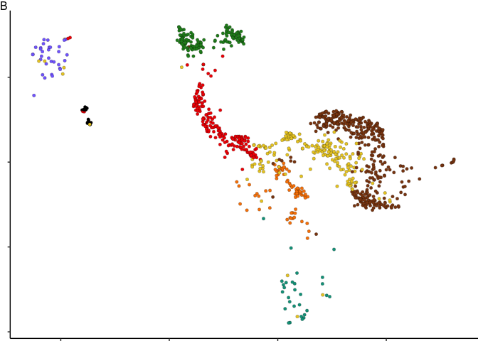

Age-associated onset of senescent transcriptional programs in human
glial progenitor cells
================
John Mariani
9/6/2021

``` r
library(readr)
library(tximport)
library(biomaRt)
library(DESeq2)
library(edgeR)
library(limma)
library(Hmisc)
library(ggfortify)
library(data.table)
library(tidyr)
library(igraph)
library(ggVennDiagram)
library(dplyr)
library(EnhancedVolcano)
library(patchwork)
library(tidyr)
library(magrittr)
library(plyr)
library(ggrepel)
library(stringr)
library(Seurat)
library(MAST)
library(UpSetR)
library(RcisTarget)
library(DT)
library(affy)
library(pd.mirna.3.0)
library(miRNAtap)
library(miRBaseConverter)

`%not in%` <- function (x, table) is.na(match(x, table, nomatch=NA_integer_))
SameElements <- function(a, b) return(identical(sort(a), sort(b))) #https://stackoverflow.com/questions/27912800/check-whether-two-vectors-contain-the-same-unordered-elements-in-r
tagSize <- 6


### Modified from the DESeq2 plotPCA function
plotPCAcustom = function(object, intgroup="condition", ntop=500, returnData=T)
{
  # calculate the variance for each gene
  rv <- rowVars(assay(object))
  
  # select the ntop genes by variance
  select <- order(rv, decreasing=TRUE)[seq_len(min(ntop, length(rv)))]
  
  # perform a PCA on the data in assay(x) for the selected genes
  pca <- prcomp(t(assay(object)[select,]))
  
  # the contribution to the total variance for each component
  percentVar <- pca$sdev^2 / sum( pca$sdev^2 )
  
  if (!all(intgroup %in% names(colData(object)))) {
    stop("the argument 'intgroup' should specify columns of colData(dds)")
  }
  
  intgroup.df <- as.data.frame(colData(object)[, intgroup, drop=FALSE])
  
  # add the intgroup factors together to create a new grouping factor
  group <- if (length(intgroup) > 1) {
    factor(apply( intgroup.df, 1, paste, collapse=":"))
  } else {
    colData(object)[[intgroup]]
  }
  
  # assemble the data for the plot
  d <- data.frame(PC1=pca$x[,1], PC2=pca$x[,2], group=group, intgroup.df, name=colnames(object))
  attr(d, "percentVar") <- percentVar[1:2]
  return(d)
}
```

## Load in Bulk Data

``` r
#Read in RSEM gene output
temp = list.files(path = "./data_for_import/genes", pattern="genes.results")
temp <- temp[c(1:3,10:29)]

names(temp) <- substr(temp,1,nchar(temp)-19)


txi.rsem <- tximport(paste0("./data_for_import/genes/",temp), type = "rsem")
```

    ## It looks like you are importing RSEM genes.results files, setting txIn=FALSE

    ## reading in files with read_tsv

    ## 1 2 3 4 5 6 7 8 9 10 11 12 13 14 15 16 17 18 19 20 21 22 23

``` r
for(i in 1:3){
  colnames(txi.rsem[[i]]) <- names(temp)
}
```

## Grab Ensembl 95 Gene annotations from biomaRt unless you’ve already done so

``` r
filename="data_for_import/ensemblGeneList.csv"
if(file.exists(filename)){
  ensemblGeneListH <- read.csv(filename)} else{
    marth <- useMart(biomart = "ENSEMBL_MART_ENSEMBL", dataset = "hsapiens_gene_ensembl", host = 'http://jan2019.archive.ensembl.org/', ensemblRedirect = T)
    ensemblGeneListH <- getBM(attributes = c("ensembl_gene_id","external_gene_name", "gene_biotype", "description"), filters = "ensembl_gene_id",values = row.names(txi.rsem$counts), mart = marth)
    write.csv(ensemblGeneListH, filename, row.names = F)
  }
```

## Read in sample information

``` r
sampleTableFull <- read.csv("data_for_import/sampleTableFull.csv")
```

## Bulk Fetal CD140+ vs P-/A+ DE

# Preprocessing

``` r
txi.rsem$length[txi.rsem$length == 0] <- 1


#Annotate the abundance dataframe
TPM <- merge(txi.rsem$abundance, ensemblGeneListH,by.x=0,by.y="ensembl_gene_id")


groupMedian <- function(df,colName, groupName, sampleTable){
  return(rowMedians(df[,colnames(df) %in% sampleTable[sampleTable[,colName] == groupName,]$sample]))
}

lowTPMfull <- data.frame(row.names = ensemblGeneListH$ensembl_gene_id)

for(i in unique(sampleTableFull$line)){
  lowTPMfull[,i] <- groupMedian(txi.rsem$abundance, "line", i, sampleTableFull)
}
lowTPMfull$external_gene_name <- ensemblGeneListH$external_gene_name

tpmCutoff <- 1
highTPM<- lowTPMfull[apply(lowTPMfull[,1:ncol(lowTPMfull)-1], 1, max)>tpmCutoff, ]

de <- function(dds, cont, pval, logFC = 0){
  temp <- data.frame(results(dds, contrast =cont))
  temp <- merge(temp[temp$padj < pval,],ensemblGeneListH,by.x=0,by.y="ensembl_gene_id")
  temp <- temp[temp$Row.names %in% row.names(highTPM),]
  temp <- temp[abs(temp$log2FoldChange) >= logFC,]
  return(temp[complete.cases(temp) ==T,])
}
```

# Differential Expression P-/A+ vs CD140+

``` r
txi.rsem.sort <- txi.rsem
for(i in 1:3){
  txi.rsem.sort[[i]] <- txi.rsem.sort[[i]][,colnames(txi.rsem.sort[[i]]) %in% sampleTableFull[sampleTableFull$rep %in% c("A", "B", "C"),]$sample]
}

sampleTableSort  <- sampleTableFull [sampleTableFull$rep %in% c("A", "B", "C"),]
sampleTableSort$label <- c(rep("CD140a+",3),rep("A2B5+",3))

sampleTableSort <- sampleTableSort[match(colnames(txi.rsem.sort$counts),sampleTableSort$sample),]

ddsSort <- DESeqDataSetFromTximport(txi.rsem.sort, sampleTableSort, ~rep+line)
```

    ## factor levels were dropped which had no samples

    ## using counts and average transcript lengths from tximport

``` r
ddsSort <- DESeq(ddsSort)
```

    ## estimating size factors

    ## using 'avgTxLength' from assays(dds), correcting for library size

    ## estimating dispersions

    ## gene-wise dispersion estimates

    ## mean-dispersion relationship

    ## final dispersion estimates

    ## fitting model and testing

``` r
resultsNames(ddsSort)
```

    ## [1] "Intercept"                               
    ## [2] "rep_B_vs_A"                              
    ## [3] "rep_C_vs_A"                              
    ## [4] "line_ctrl_cd140_fetal_vs_ctrl_a2b5_fetal"

``` r
de_Cd140_vs_A2B5 <- de(ddsSort, c(0,0,0,1), 0.01, 1)
de_Cd140_vs_A2B5_all <- de(ddsSort, c(0,0,0,1), 1, 0)

table(de_Cd140_vs_A2B5$log2FoldChange > 0)
```

    ## 
    ## FALSE  TRUE 
    ##   288   435

``` r
#write.table(de_Cd140_vs_A2B5, "output/de_Cd140_vs_A2B5.txt", quote = F, sep = "\t" ,row.names = F)

row.names(sampleTableSort) <- sampleTableSort$sample
```

## Make PCA from VST counts

``` r
cd140A2B5pca <- plotPCAcustom(vst(ddsSort), "group")
cd140A2B5pca$label <- sampleTableSort$label
cd140A2B5pca$rep <- sampleTableSort$rep

attributes(cd140A2B5pca)
```

    ## $names
    ## [1] "PC1"     "PC2"     "group"   "group.1" "name"    "label"   "rep"    
    ## 
    ## $row.names
    ## [1] "fCd140_1"    "fCd140_2"    "fCd140_3"    "fP_A_Plus_1" "fP_A_Plus_2"
    ## [6] "fP_A_Plus_3"
    ## 
    ## $percentVar
    ## [1] 0.6635097 0.1596288
    ## 
    ## $class
    ## [1] "data.frame"

``` r
cd140A2B5pcaGG <- ggplot(data=cd140A2B5pca, aes_string(x="PC1", y="PC2")) + theme_bw() + theme(legend.position = "bottom", legend.direction = "horizontal") + geom_point(shape = 21, size=5, aes(fill = label), colour = "black") + 
  xlab(paste0("PC1: ",round(attributes(cd140A2B5pca)$percentVar[1] * 100),"% variance")) +
  ylab(paste0("PC2: ",round(attributes(cd140A2B5pca)$percentVar[2] * 100),"% variance")) +
  coord_fixed() + scale_fill_manual(values = c("#18BA0F", "#2E30FF"), name = "Fetal GPC Population:")  + guides(fill = guide_legend(title.position = "top")) + 
  geom_text(aes(label = rep), vjust = 2) + xlim(c(-55,30)) + ylim(-25,25)


cd140A2B5pcaGG
```

<!-- -->

## Make Volcano Plot

``` r
selectGenes <- de_Cd140_vs_A2B5[(abs(de_Cd140_vs_A2B5$log2FoldChange) > 2 & de_Cd140_vs_A2B5$padj < .0000001) | (abs(de_Cd140_vs_A2B5$log2FoldChange) > 7.5 & de_Cd140_vs_A2B5$padj < .01),]$external_gene_name

selectGenes <- selectGenes[selectGenes != "IGF2"] 

keyvals <- ifelse(
    de_Cd140_vs_A2B5_all$log2FoldChange <= -1 & de_Cd140_vs_A2B5_all$padj < 0.01, '#18BA0F',
      ifelse(de_Cd140_vs_A2B5_all$log2FoldChange >= 1 & de_Cd140_vs_A2B5_all$padj < 0.01, '#2E30FF',
        'darkgrey'))
  #keyvals[is.na(keyvals)] <- 'black'
  names(keyvals)[keyvals == '#18BA0F'] <- 'A2B5+'
  names(keyvals)[keyvals == '#2E30FF'] <- 'CD140a+'
  names(keyvals)[keyvals == 'darkgrey'] <- 'N.S.'

cd140A2B5volcano <- EnhancedVolcano(de_Cd140_vs_A2B5_all,
                lab = as.character(de_Cd140_vs_A2B5_all$external_gene_name),
                selectLab = selectGenes,
                x = 'log2FoldChange',
                y = 'padj',
                FCcutoff = 1,
                pCutoff = 0.01,
                drawConnectors = F,
                ylim = c(0,36),
                xlim = c(-9,12),
                colCustom = keyvals,
                colAlpha = 1) + theme_bw() +  theme(legend.position = "bottom", title = element_blank(), axis.title.x = element_text(hjust = .5), axis.title.y = element_text(hjust = .5), legend.title = element_text(hjust = .5)) + labs(colour = "Differentially Enriched:") + guides(colour = guide_legend(title.position = "top"))


#ggsave("Panels/fig1_pca_volcano.eps", plot1, width = 20, height = 10, device = "eps")
```

## Build Gene Ontology Network from IPA output

``` r
files <- "data_for_import/Fetal_Cd140_vs_A2B5_IPA.txt"
compNames <- c("Fetal_Cd140_vs_A2B5")

for(i in 1:length(files)){
  canonicalIPA <- fread(files[i], skip = "Canonical",drop = c(4,6))
  names(canonicalIPA) <- c("Pathway", "pVal", "zScore", "Genes")
  canonicalIPA$type <- "Canonical"
  upstreamIPA <- fread(files[i], skip = "Upstream Regulators", drop = c(1:2,4:6,8:10,13:14))
  upstreamIPA <- upstreamIPA[,c(1,3,2,4)]
  names(upstreamIPA) <- c("Pathway", "pVal", "zScore", "Genes")
  upstreamIPA$Pathway <- paste0(upstreamIPA$Pathway, " Signaling")
  upstreamIPA$pVal <- -log10(upstreamIPA$pVal)
  upstreamIPA$type <- "Upstream"
  functionalIPA <- fread(files[i], skip = "Diseases and Bio", drop = c(1,2,5,7,8,10,11))
  names(functionalIPA) <- c("Pathway", "pVal", "zScore", "Genes")
  functionalIPA$pVal <- -log10(functionalIPA$pVal)
  functionalIPA$type <- "Functional"
  if(i == 1){
    IPA <- rbind(canonicalIPA, upstreamIPA, functionalIPA)
    IPA$comparison <- compNames[i]
  } else {
    tempIPA <- rbind(canonicalIPA, upstreamIPA, functionalIPA)
    tempIPA$comparison <- compNames[i]
    IPA <- rbind(IPA, tempIPA)
  }
}


rm(canonicalIPA)
rm(upstreamIPA)
rm(functionalIPA)

IPA[is.na(IPA$zScore)]$zScore <- 0
ogIPA <- IPA
IPA <- IPA[IPA$pVal > -log10(0.001),]


filterTerms <- c("cancer","glioma", "abdominal", "carcinoma", "endometrium", "eye", "nose", "epidermis", "head", "lymphocyte", "renal", "snout", "tooth", 
                 "connective", "tumor", "fibroblast", "rickets", "mouth", "maxilla", "cartilage", "neoplasm", "oma", "lymph", "liver", "psoriasis", "cardio",
                 "cardiac", "tongue", "disc", "tinea", "herpes", "Picornaviridae", "virus", "killer T", "muscle", "myopathy", "pancreatic", "Onychomycosis",
                 "leukocyte", "oral cavity","osteoclast", "Merkel", "macrophage", "Hydrometrocolpos", "Hand", "Gastric", "Thymocytes", "diabetes",
                 "Dupuytren", "myoblast", "ear$", "implantation", "bone", "limb", "cleft lip", "Calcinosis", "lung", "Benign lesion", 
                 "body axis", "sensory organ", "diabetic", "neutrophil", "infection of mammalia", "leukopoiesis", "neoplasia", "Sensory system development",
                 "T cell", "myeloid", "aorta", "body cavity", "esophagus", "incisor", "kidney", "oesophageal", "respiratory", "skin", "cavity", "urinary",
                 "foot", "digit", "heart", "acute biphenotypic leukemia", "Ankylosis", "Articular rigidity", "Atherosclero", "Blister", "Branching morphogenesis of epithelial tubule",
                 "Cervical spondylotic myelopathy", "epithelial", "exocrine", "gastrointestinal", "Ejection of first polar body", "Familial arrhythmia", "Familial nonsyndromic hearing impairment", 
                 "fibrosis", "mammary", "Hearing", "Morphogenesis of metanephric bud", "cochlea", "nail", "Plasma cell dyscrasia", "Secondary Leukemia", "granulocyte",
                 "Tinnitus", "metastasis", "trunk", "sperm motility", "skull", "dendritic cells", "dehydration", "digestive", "microphthalmia", "myelodysplastic",
                 "semicircular canal", " skeleton", "osteopenia", "osteoarthritis", "Refractory anemia with excess blasts", "rectum", "submandibular", "antiviral", "HIV-1",
                 "antigen present", "gonad", "keratinocyte", "phagocyte", "coronary", "intestinal", "viral replicon", "monocyte", "viral life", "wound", "leukemia", "Airway", "Size of body")
filteredIPA <- IPA[!grepl(paste(filterTerms, collapse = "|"), ignore.case = T, IPA$Pathway),]
deletedIPA <- IPA[grepl(paste(filterTerms, collapse = "|"), ignore.case = T, IPA$Pathway),]

#Save for making supplemental Table
supTable1c <- filteredIPA
```

## Curated Figure S1 GO

``` r
figS1cats <- c("Development of neurons", "Differentiation of neuroglia", "Synthesis of lipid", "Differentiation of oligodendrocytes", "Immune response of cells", "ST8SIA1 Signaling", "Phagocytosis", "CCR2 Signaling", "Cell movement", "PDGF Signaling", "NOTCH1 Signaling", "SOX2 Signaling", "cholesterol Signaling", "SMARCA4 Signaling", "L-triiodothyronine Signaling")
figS1cats[figS1cats == "cholesterol Signaling"] <- "Cholesterol Signaling"

figS1catsGO <- filteredIPA[filteredIPA$Pathway %in% figS1cats]
figS1catsGO <- figS1catsGO[order(figS1catsGO$pVal, decreasing = T),]
figS1catsGO$Pathway <- factor(figS1catsGO$Pathway, levels = rev(unique(figS1catsGO$Pathway)))


cd140A2B5go <- ggplot(figS1catsGO, aes(fill = zScore, y = pVal, x = Pathway)) + geom_bar(stat = "identity") + coord_flip() + theme_minimal() + scale_y_continuous(expand = c(0, 0), limits = c(0,50)) + theme(panel.grid.major.y = element_blank(), panel.grid.minor.y = element_blank(), panel.border = element_rect(fill  = NA), legend.position = "bottom", axis.title.y = element_blank()) + ylab("-Log10 P-Value") + scale_fill_gradientn(colours = c("#18BA0F", "grey", "#2E30FF"), values = scales::rescale(c(-.5,-.15,.5)), guide = guide_colourbar(direction = "horizontal", title = "Activation Z-Score", title.position = "top"))  + scale_x_discrete(labels = function(Pathway) str_wrap(Pathway, width = 20))

cd140A2B5go
```

<!-- -->

#### Curated Gene HM Figure S1

``` r
figS1HMgenes <- c("SOX10", "NKX2-2", "LINGO1", "UGT8", "GPR17", "OLIG2", "OLIG1", "PDGFRA", "SIRT2", "CNTN1", "DLX1", "HES1", "AQP4", "IL6", "PDGFRB", "IL1B", "TNF", "NRG1", "IGF1", "C3", "TREM2", "C2", "CD4", "CD68", "CLU", "NEUROD1", "NEUROD2", "DLX5", "GSX2", "MBP", "GAL3ST1", "GRM3", "HTR2A", "OPRK1", "FABP7", "GABRA4", "GABRB1", "GABRG1", "P2RY1", "EOMES", "NNAT", "PAX6", "STMN2", "EMX1")
figS1HMgenes <- figS1HMgenes[figS1HMgenes %in% de_Cd140_vs_A2B5$external_gene_name] 

cd140A2B5tpm <- merge(txi.rsem.sort$abundance, ensemblGeneListH, by.x = 0, by.y = "ensembl_gene_id")


cd140A2B5tpm <- cd140A2B5tpm[,1:8] %>%
  pivot_longer(-c(Row.names, external_gene_name), names_to = "Sample", values_to = "TPM")
cd140A2B5tpm$group <- mapvalues(cd140A2B5tpm$Sample,sampleTableSort$sample, sampleTableSort$label)

cd140A2B5hm <- cd140A2B5tpm[cd140A2B5tpm$external_gene_name %in% figS1HMgenes,]
cd140A2B5hm$TPM <- log2(cd140A2B5hm$TPM + .1)

cd140A2B5bar <- de_Cd140_vs_A2B5[de_Cd140_vs_A2B5$external_gene_name %in% figS1HMgenes,]
cd140A2B5bar$logFC <- as.numeric(cd140A2B5bar$log2FoldChange)
cd140A2B5bar <- cd140A2B5bar[order(cd140A2B5bar$log2FoldChange),]
cd140A2B5bar$external_gene_name <- factor(cd140A2B5bar$external_gene_name, levels = cd140A2B5bar$external_gene_name)
cd140A2B5bar$direction <- ifelse(cd140A2B5bar$log2FoldChange < 0, "A2B5", "CD140")


cd140A2B5hm$external_gene_name <- factor(cd140A2B5hm$external_gene_name, levels = cd140A2B5bar$external_gene_name)
cd140A2B5hm$group <- factor(cd140A2B5hm$group, levels = c("CD140", "A2B5"))

###
limits <- aes(ymax = cd140A2B5bar$log2FoldChange + cd140A2B5bar$lfcSE,  
  ymin =  cd140A2B5bar$log2FoldChange - cd140A2B5bar$lfcSE)

figS1HM <- ggplot(cd140A2B5hm, aes(external_gene_name, Sample)) + geom_tile(aes(fill = TPM)) + theme(axis.text.x = element_text(angle = 90, vjust = 0.5, hjust=1), panel.spacing.y = unit(.5, "lines"), panel.spacing.x = unit(0,"lines"),axis.title.x = element_blank(), strip.background = element_rect(color="black", fill= c("blue","magenta","green"), size=1.5, linetype="solid"), axis.title.y = element_blank(), axis.text.y = element_blank(), axis.ticks.y = element_blank())  + scale_fill_gradientn(colours = c("#009900","#fffcbd","#ff2020"), guide = guide_colourbar(direction = "horizontal", title = "Log2(TPM + .1)", title.position = "top")) + scale_y_discrete(expand = c(0, 0))  + theme(axis.text.x = element_blank(), axis.ticks.x = element_blank(), legend.position = "bottom", legend.direction = "horizontal") + facet_grid(rows = vars(group), scales = "free", switch = "y") 


figS1Bar <- ggplot(cd140A2B5bar, aes(x = external_gene_name, y = logFC, fill = direction)) + theme_bw() + geom_errorbar(limits, width=.5, position=position_dodge(1)) + geom_bar(colour = "black", stat = "identity", width = 1,size = 1, position = "dodge") + scale_x_discrete(expand = c(0, 0)) + scale_fill_manual(values = c("#18BA0F","#2E30FF")) + theme(axis.text.x = element_text(angle = 90, vjust = 0.5, hjust=.5), panel.spacing.x = unit(0, "lines"), axis.title.x = element_blank(), legend.position=c(.25,.8), legend.background=element_blank()) + labs(fill = "Fetal GPC Selection Enrichment") + ylab("Log2 Fold Change CD140+ vs. A2B5+ Fetal GPCs")


figS1 <- ((((cd140A2B5pcaGG | cd140A2B5volcano) + plot_layout(widths = c(1,1.25))) / (figS1Bar/figS1HM)) | cd140A2B5go) + plot_layout(widths = c(1,.35))

figS1
```

<!-- -->

``` r
#ggsave(plot = figS1, filename = "figures/figS1.pdf", device = "pdf", units = c("in"), height = 11, width = 10, useDingbats=FALSE)
```

## CD140 Enrichment

``` r
txi.rsem.enrichment <- txi.rsem
for(i in 1:3){
  txi.rsem.enrichment[[i]] <- txi.rsem.enrichment[[i]][,colnames(txi.rsem.enrichment[[i]]) %in% sampleTableFull[sampleTableFull$rep %in% c("D", "E", "F", "G", "H"),]$sample]
}

sampleTableEnrichment <- sampleTableFull[sampleTableFull$sample %in% colnames(txi.rsem.enrichment$abundance),]
sampleTableEnrichment$label <- rep(c("CD140a-","CD140a+"),5)


ddsEnrichment <- DESeqDataSetFromTximport(txi.rsem.enrichment, sampleTableEnrichment, ~rep+group)
```

    ## factor levels were dropped which had no samples

    ## using counts and average transcript lengths from tximport

``` r
ddsEnrichment <- DESeq(ddsEnrichment)
```

    ## estimating size factors

    ## using 'avgTxLength' from assays(dds), correcting for library size

    ## estimating dispersions

    ## gene-wise dispersion estimates

    ## mean-dispersion relationship

    ## final dispersion estimates

    ## fitting model and testing

``` r
resultsNames(ddsEnrichment)
```

    ## [1] "Intercept"                               
    ## [2] "rep_E_vs_D"                              
    ## [3] "rep_F_vs_D"                              
    ## [4] "rep_G_vs_D"                              
    ## [5] "rep_H_vs_D"                              
    ## [6] "group_ctrl_neg_fetal_vs_ctrl_cd140_fetal"

``` r
de_Enrichment <- de(ddsEnrichment, c(0,0,0,0,0,-1), 0.01,1)
de_Enrichment_all <- de(ddsEnrichment, c(0,0,0,0,0,-1), 1,0)


#write.table(de_Enrichment, "output/de_Cd140_Enrichment.txt", quote = F, sep = "\t" ,row.names = F)

row.names(sampleTableEnrichment) <- sampleTableEnrichment$sample
vstEnrichment <- getVarianceStabilizedData(ddsEnrichment)

cd140EnrichmentPCA <- autoplot(prcomp(t(vstEnrichment)), data = sampleTableEnrichment, size = 1) + geom_point(shape = 21, size = 5, aes(fill =  label)) + theme_bw() + xlim(-.4,.45) + ylim(-.6,.6) + theme(legend.position = "bottom", legend.direction = "horizontal") + scale_fill_manual(values = c("magenta", "#2E30FF"), name = "Fetal Population:") + geom_text(aes(label = rep), vjust = 2) + guides(fill = guide_legend(title.position = "top"))

cd140EnrichmentPCA
```

<!-- -->

## Make CD140 Enrichment PCA

``` r
cd140EnrichmentPCA <- plotPCAcustom(vst(ddsEnrichment), "group")
cd140EnrichmentPCA$label <- sampleTableEnrichment$label
cd140EnrichmentPCA$rep <- sampleTableEnrichment$rep


cd140EnrichmentPCAgg <- ggplot(data=cd140EnrichmentPCA, aes_string(x="PC1", y="PC2")) + theme_bw() + theme(legend.position = "bottom", legend.direction = "horizontal") + geom_point(shape = 21, size=5, aes(fill = label), colour = "black") + 
  xlab(paste0("PC1: ",round(attributes(cd140EnrichmentPCA)$percentVar[1] * 100),"% variance")) +
  ylab(paste0("PC2: ",round(attributes(cd140EnrichmentPCA)$percentVar[2] * 100),"% variance")) +
  coord_fixed() + scale_fill_manual(values = c("magenta", "#2E30FF"), name = "Fetal GPC Population:")  + guides(fill = guide_legend(title.position = "top")) + 
  geom_text(aes(label = rep), vjust = 2) + ylim(-25,27)

cd140EnrichmentPCAgg
```

<!-- -->
## Make Volcano Plot

``` r
selectGenes <- de_Enrichment[(de_Enrichment$padj < 10^-45) | (de_Enrichment$padj < .01 & de_Enrichment$log2FoldChange > 9) | (de_Enrichment$padj < .01 & de_Enrichment$log2FoldChange < -6),]$external_gene_name

keyvals <- ifelse(
    de_Enrichment_all$log2FoldChange <= -1 & de_Enrichment_all$padj < 0.01, 'magenta',
      ifelse(de_Enrichment_all$log2FoldChange >= 1 & de_Enrichment_all$padj < 0.01, '#2E30FF',
        'darkgrey'))
  #keyvals[is.na(keyvals)] <- 'black'
  names(keyvals)[keyvals == 'magenta'] <- 'CD140a-'
  names(keyvals)[keyvals == '#2E30FF'] <- 'CD140a+'
  names(keyvals)[keyvals == 'darkgrey'] <- 'N.S.'
  
cd140EnrichmentVolcano <- EnhancedVolcano(de_Enrichment_all,
                lab = as.character(de_Enrichment_all$external_gene_name),
                selectLab = selectGenes,
                x = 'log2FoldChange',
                y = 'padj',
                FCcutoff = 1,
                pCutoff = 0.01,
                drawConnectors = F,
                ylim = c(0,190),
                xlim = c(-8,11),
                colCustom = keyvals,
                colAlpha = 1) + theme_bw() +  theme(legend.position = "bottom", title = element_blank(), axis.title.x = element_text(hjust = .5), axis.title.y = element_text(hjust = .5), legend.title = element_text(hjust = .5)) + labs(colour = "Differentially Enriched:") + guides(colour = guide_legend(title.position = "top"))

cd140EnrichmentVolcano
```

<!-- -->

## CD140 enrichment GO

``` r
files <- "data_for_import/Fetal_CD140_Enrichment_IPA.txt"
compNames <- c("CD140_enrichment")

for(i in 1:length(files)){
  canonicalIPA <- fread(files[i], skip = "Canonical",drop = c(4,6))
  names(canonicalIPA) <- c("Pathway", "pVal", "zScore", "Genes")
  canonicalIPA$type <- "Canonical"
  upstreamIPA <- fread(files[i], skip = "Upstream Regulators", drop = c(1:2,4:6,8:10,13:14))
  upstreamIPA <- upstreamIPA[,c(1,3,2,4)]
  names(upstreamIPA) <- c("Pathway", "pVal", "zScore", "Genes")
  upstreamIPA$Pathway <- paste0(upstreamIPA$Pathway, " Signaling")
  upstreamIPA$pVal <- -log10(upstreamIPA$pVal)
  upstreamIPA$type <- "Upstream"
  functionalIPA <- fread(files[i], skip = "Diseases and Bio", drop = c(1,2,5,7,8,10,11))
  names(functionalIPA) <- c("Pathway", "pVal", "zScore", "Genes")
  functionalIPA$pVal <- -log10(functionalIPA$pVal)
  functionalIPA$type <- "Functional"
  if(i == 1){
    IPA <- rbind(canonicalIPA, upstreamIPA, functionalIPA)
    IPA$comparison <- compNames[i]
  } else {
    tempIPA <- rbind(canonicalIPA, upstreamIPA, functionalIPA)
    tempIPA$comparison <- compNames[i]
    IPA <- rbind(IPA, tempIPA)
  }
}


rm(canonicalIPA)
rm(upstreamIPA)
rm(functionalIPA)

IPA[is.na(IPA$zScore)]$zScore <- 0
ogIPA <- IPA
IPA <- IPA[IPA$pVal > -log10(0.001),]


filterTerms <- c("cancer","glioma", "abdominal", "carcinoma", "endometrium", "eye", "nose", "epidermis", "head", "lymphocyte", "renal", "snout", "tooth", 
                 "connective", "tumor", "fibroblast", "rickets", "mouth", "maxilla", "cartilage", "neoplasm", "oma", "lymph", "liver", "psoriasis", "cardio",
                 "cardiac", "tongue", "disc", "tinea", "herpes", "Picornaviridae", "virus", "killer T", "muscle", "myopathy", "pancreatic", "Onychomycosis",
                 "leukocyte", "oral cavity","osteoclast", "Merkel", "macrophage", "Hydrometrocolpos", "Hand", "Gastric", "Thymocytes", "diabetes",
                 "Dupuytren", "myoblast", "ear$", "implantation", "bone", "limb", "cleft lip", "Calcinosis", "lung", "Benign lesion", 
                 "body axis", "sensory organ", "diabetic", "neutrophil", "infection of mammalia", "leukopoiesis", "neoplasia", "Sensory system development",
                 "T cell", "myeloid", "aorta", "body cavity", "esophagus", "incisor", "kidney", "oesophageal", "respiratory", "skin", "cavity", "urinary",
                 "foot", "digit", "heart", "acute biphenotypic leukemia", "Ankylosis", "Articular rigidity", "Atherosclero", "Blister", "Branching morphogenesis of epithelial tubule",
                 "Cervical spondylotic myelopathy", "epithelial", "exocrine", "gastrointestinal", "Ejection of first polar body", "Familial arrhythmia", "Familial nonsyndromic hearing impairment", 
                 "fibrosis", "mammary", "Hearing", "Morphogenesis of metanephric bud", "cochlea", "nail", "Plasma cell dyscrasia", "Secondary Leukemia", "granulocyte",
                 "Tinnitus", "metastasis", "trunk", "sperm motility", "skull", "dendritic cells", "dehydration", "digestive", "microphthalmia", "myelodysplastic",
                 "semicircular canal", " skeleton", "osteopenia", "osteoarthritis", "Refractory anemia with excess blasts", "rectum", "submandibular", "antiviral", "HIV-1",
                 "antigen present", "gonad", "keratinocyte", "phagocyte", "coronary", "intestinal", "viral replicon", "monocyte", "viral life", "wound", "leukemia", "Airway")
filteredIPA <- IPA[!grepl(paste(filterTerms, collapse = "|"), ignore.case = T, IPA$Pathway),]
deletedIPA <- IPA[grepl(paste(filterTerms, collapse = "|"), ignore.case = T, IPA$Pathway),]

#Save for making Supplemental Table
supTable1d <- filteredIPA

#write.table(filteredIPA, "output/cd140_enrichment_GO.txt", sep = "\t", quote = F, row.names = F)
```

### Make First supplemental table

``` r
#Differentially expressed genes in fetal GPCs
supTable1a <- de_Cd140_vs_A2B5
supTable1a <- supTable1a[,c(1,3,7:10)]
names(supTable1a) <- c("Ensembl_ID", "Log2FC_CD140a_vs_A2B5", "Adj_P_Val", "External_Gene_Name", "Gene_Biotype", "Description")
supTable1a <- supTable1a[order(supTable1a$Adj_P_Val, decreasing = F),]

supTable1b <- de_Enrichment
supTable1b <- supTable1b[,c(1,3,7:10)]
names(supTable1b) <- c("Ensembl_ID", "Log2FC_CD140a+_vs_Cd140a-", "Adj_P_Val", "External_Gene_Name", "Gene_Biotype", "Description")
supTable1b <- supTable1b[order(supTable1b$Adj_P_Val, decreasing = F),]


#Significant IPA terms between fetal GPC populations

supTable1c <- supTable1c[,c(1:5)]
names(supTable1c) <- c("Pathway", "Adj_-log10_P_Val", "Z_Score", "Genes", "Type")
supTable1c <- supTable1c[order(supTable1c$`Adj_-log10_P_Val`, decreasing = T),]


supTable1d <- supTable1d[,c(1:5)]
names(supTable1d) <- c("Pathway", "Adj_-log10_P_Val", "Z_Score", "Genes", "Type")
supTable1d <- supTable1d[order(supTable1d$`Adj_-log10_P_Val`, decreasing = T),]

#write.xlsx(supTable1a, file = "output/supTables/Table S1 - Fetal Bulk RNA-seq.xlsx", sheetName = "DE genes - Fetal CD140a vs A2B5", row.names = F, append = T)

#write.xlsx(supTable1b, file = "output/supTables/Table S1 - Fetal Bulk RNA-seq.xlsx", sheetName = "DE genes - Fetal CD140a+ vs CD140a-", row.names = F, append = T)


#write.xlsx(supTable1c, file = "output/supTables/Table S1 - Fetal Bulk RNA-seq.xlsx", sheetName = "Fetal Cd140a vs A2B5 IPA Terms", row.names = F, append = T)

#write.xlsx(supTable1d, file = "output/supTables/Table S1 - Fetal Bulk RNA-seq.xlsx", sheetName = "Fetal Cd140a+ vs CD140a- IPA Terms", row.names = F, append = T)
```

### Figure S2 GO Graph

``` r
figS2cats <- c("Differentiation of neuroglia", "Quantity of neurons", "Cell movement", "SOX2 Signaling", "TCF7L2 Signaling", "NEUROG3 Signaling", "Inflammatory response", "IL1B Signaling", "SMARCA4 Signaling", "Pdgf (complex) Signaling", "ST8SIA1 Signaling", "Synthesis of lipid", "CCR2 Signaling", "cholesterol Signaling", "L-triiodothyronine Signaling")


figS2catsGO <- filteredIPA[filteredIPA$Pathway %in% figS2cats]
figS2catsGO <- figS2catsGO[order(figS2catsGO$pVal, decreasing = T),]
figS2catsGO$Pathway <- factor(figS2catsGO$Pathway, levels = rev(unique(figS2catsGO$Pathway)))

cd140Enrichmentgo <- ggplot(figS2catsGO, aes(fill = zScore, y = pVal, x = Pathway)) + geom_bar(stat = "identity") + coord_flip() + theme_minimal() + scale_y_continuous(expand = c(0, 0), limits = c(0,80)) + theme(panel.grid.major.y = element_blank(), panel.grid.minor.y = element_blank(), panel.border = element_rect(fill  = NA), legend.position = "bottom", axis.title.y = element_blank()) + ylab("-Log10 P-Value") + scale_fill_gradientn(colours = c("magenta", "grey", "#2E30FF"), values = scales::rescale(c(-.5,-.15,.5)), guide = guide_colourbar(direction = "horizontal", title = "Activation Z-Score", title.position = "top")) 

cd140Enrichmentgo
```

<!-- -->
## Curated Figure S2 HMs

``` r
figS2HMgenes <- c("SOX10", "NKX2-2", "LINGO1", "UGT8", "GPR17", "OLIG2", "OLIG1", "PDGFRA", "SIRT2", "CNTN1", "DLX1", "HES1", "AQP4", "IL6", "PDGFRB", "IL1B", "TNF", "NRG1", "IGF1", "C3", "TREM2", "C2", "CD4", "CD68", "CLU", "NEUROD1", "NEUROD2", "DLX5", "MYC", "MBP", "GAL3ST1", "GRM3", "HTR2A", "OPRK1", "FABP7", "GABRA4", "GABRB1", "GABRG1", "P2RY1", "EOMES", "NNAT", "PAX6", "STMN2", "EMX1", "CA10", "PMP2", "PLLP", "PCDH15", "RTN1", "NXPH1", "CSPG5","TCF7L2", "APOD")

figS2HMgenes <- figS2HMgenes[figS2HMgenes %in% de_Enrichment$external_gene_name] 


cd140EnrichmentTPM <- merge(txi.rsem.enrichment$abundance, ensemblGeneListH, by.x = 0, by.y = "ensembl_gene_id")


cd140EnrichmentTPM <- cd140EnrichmentTPM[,1:12] %>%
  pivot_longer(-c(Row.names, external_gene_name), names_to = "Sample", values_to = "TPM")
cd140EnrichmentTPM$group <- mapvalues(cd140EnrichmentTPM$Sample,sampleTableEnrichment$sample, sampleTableEnrichment$label)

cd140EnrichmentHM <- cd140EnrichmentTPM[cd140EnrichmentTPM$external_gene_name %in% figS2HMgenes,]
cd140EnrichmentHM$TPM <- log2(cd140EnrichmentHM$TPM + .1)

cd140EnrichementBar <- de_Enrichment[de_Enrichment$external_gene_name %in% figS2HMgenes,]
cd140EnrichementBar$logFC <- as.numeric(cd140EnrichementBar$log2FoldChange)
cd140EnrichementBar <- cd140EnrichementBar[order(cd140EnrichementBar$log2FoldChange),]
cd140EnrichementBar$external_gene_name <- factor(cd140EnrichementBar$external_gene_name, levels = cd140EnrichementBar$external_gene_name)
cd140EnrichementBar$direction <- ifelse(cd140EnrichementBar$log2FoldChange < 0, "CD140a-", "CD140a+")


cd140EnrichmentHM$external_gene_name <- factor(cd140EnrichmentHM$external_gene_name, levels = cd140EnrichementBar$external_gene_name)
cd140EnrichmentHM$group <- factor(cd140EnrichmentHM$group, levels = c("CD140a+", "CD140a-"))

###
limits <- aes(ymax = cd140EnrichementBar$log2FoldChange + cd140EnrichementBar$lfcSE,  
  ymin =  cd140EnrichementBar$log2FoldChange - cd140EnrichementBar$lfcSE)

figS2HM <- ggplot(cd140EnrichmentHM, aes(external_gene_name, Sample)) + geom_tile(aes(fill = TPM)) + theme(axis.text.x = element_text(angle = 90, vjust = 0.5, hjust=1), panel.spacing.y = unit(.5, "lines"), panel.spacing.x = unit(0,"lines"),axis.title.x = element_blank(), strip.background = element_rect(color="black", fill= c("blue","magenta","green"), size=1.5, linetype="solid"), axis.title.y = element_blank(), axis.text.y = element_blank(), axis.ticks.y = element_blank())  + scale_fill_gradientn(colours = c("#009900","#fffcbd","#ff2020"), guide = guide_colourbar(direction = "horizontal", title = "Log2(TPM + .1)", title.position = "top")) + scale_y_discrete(expand = c(0, 0))  + theme(axis.text.x = element_blank(), axis.ticks.x = element_blank(), legend.position = "bottom", legend.direction = "horizontal") + facet_grid(rows = vars(group), scales = "free", switch = "y") 

figS2HM
```

<!-- -->

``` r
figS2Bar <- ggplot(cd140EnrichementBar, aes(x = external_gene_name, y = logFC, fill = direction)) + theme_bw() + geom_errorbar(limits, width=.5, position=position_dodge(1)) + geom_bar(colour = "black", stat = "identity", width = 1,size = 1, position = "dodge") + scale_x_discrete(expand = c(0, 0)) + scale_fill_manual(values = c("magenta","#2E30FF")) + theme(axis.text.x = element_text(angle = 90, vjust = 0.5, hjust=.5), panel.spacing.x = unit(0, "lines"), axis.title.x = element_blank(), legend.position=c(.25,.8), legend.background=element_blank()) + labs(fill = "Fetal Enrichment") + ylab("Log2 Fold Change CD140a vs. CD140a-")

figS2Bar
```

    ## Warning: Use of `cd140EnrichementBar$log2FoldChange` is discouraged. Use
    ## `log2FoldChange` instead.

    ## Warning: Use of `cd140EnrichementBar$lfcSE` is discouraged. Use `lfcSE` instead.

    ## Warning: Use of `cd140EnrichementBar$log2FoldChange` is discouraged. Use
    ## `log2FoldChange` instead.

    ## Warning: Use of `cd140EnrichementBar$lfcSE` is discouraged. Use `lfcSE` instead.

<!-- -->

## Make Combined PCA for Figure 1

``` r
sampleTableFig1  <- rbind(sampleTableSort, sampleTableEnrichment)

txi.rsem.Fig1 <- txi.rsem
for(i in 1:3){
  txi.rsem.Fig1[[i]] <- txi.rsem.Fig1[[i]][,colnames(txi.rsem.Fig1[[i]]) %in% sampleTableFig1$sample]
}


sampleTableFig1 <- sampleTableFig1[match(colnames(txi.rsem.Fig1$counts),sampleTableFig1$sample),]

ddsFig1 <- DESeqDataSetFromTximport(txi.rsem.Fig1, sampleTableFig1, ~0+group+batch)
```

    ## factor levels were dropped which had no samples

    ## using counts and average transcript lengths from tximport

``` r
vsd <- vst(ddsFig1)
```

    ## using 'avgTxLength' from assays(dds), correcting for library size

``` r
assay(vsd) <- limma::removeBatchEffect(assay(vsd), vsd$batch)

fig1PCA <- plotPCAcustom(vsd, "group")
fig1PCA$label <- sampleTableFig1$label
fig1PCA$Batch <- sampleTableFig1$batch


fig1PCAgg <- ggplot(data=fig1PCA, aes_string(x="PC1", y="PC2")) + theme_bw() + theme(legend.position = "bottom", legend.direction = "horizontal") + geom_point(size=5, aes(fill = label, shape = Batch), colour = "black") + 
  xlab(paste0("PC1: ",round(attributes(fig1PCA)$percentVar[1] * 100),"% variance")) +
  ylab(paste0("PC2: ",round(attributes(fig1PCA)$percentVar[2] * 100),"% variance")) +
  coord_fixed()  + guides(fill = guide_legend(title.position = "top", override.aes = list(shape = 23), order = 1), shape = guide_legend(title.position = "top")) + scale_shape_manual(values = c(22, 24)) + scale_fill_manual(values = c("#18BA0F", "magenta", "#2E30FF"), name = "Fetal GPC Population:") 


fig1PCAgg
```

<!-- -->

## Figure 1 Venn

``` r
onlyA2B5 <- de_Cd140_vs_A2B5[de_Cd140_vs_A2B5$Row.names %not in% de_Enrichment$Row.names,]
intersectFetal <- de_Cd140_vs_A2B5[de_Cd140_vs_A2B5$Row.names %in% de_Enrichment$Row.names,]
onlyNeg <- de_Enrichment[de_Enrichment$Row.names %not in% de_Cd140_vs_A2B5$Row.names,]

VennFigure1 <- list(
                 "CD140a+ vs CD140a-" =de_Enrichment$Row.names,
                 "CD140a+ vs A2B5+" = de_Cd140_vs_A2B5$Row.names)

VennFigure1 <- list(
                 "CD140a+ Enriched vs CD140a-" = de_Enrichment[de_Enrichment$log2FoldChange>0,]$Row.names,
                 "CD140a+ Enriched vs A2B5+" = de_Cd140_vs_A2B5[de_Cd140_vs_A2B5$log2FoldChange > 0,]$Row.names,
                 "A2B5+ Enriched vs Cd140a+" =  de_Cd140_vs_A2B5[de_Cd140_vs_A2B5$log2FoldChange < 0,]$Row.names,
                 "Cd140a- Enriched vs Cd140a+" = de_Enrichment[de_Enrichment$log2FoldChange < 0,]$Row.names)

VennFigure1 <- ggVennDiagram(VennFigure1, label = "count") + theme(legend.position = "none") + labs(tag = "C")

VennFigure1
```

<!-- -->

``` r
100-((4/(1153+322+110+166+121+1029+1+3))*100)
```

    ## [1] 99.86231

## Upset Plot

``` r
upset(fromList(list("CD140a+ Enriched vs CD140a-" = de_Enrichment[de_Enrichment$log2FoldChange>0,]$Row.names,
                 "CD140a+ Enriched vs A2B5+" = de_Cd140_vs_A2B5[de_Cd140_vs_A2B5$log2FoldChange > 0,]$Row.names,
                 "A2B5+ Enriched vs CD140a+" =  de_Cd140_vs_A2B5[de_Cd140_vs_A2B5$log2FoldChange < 0,]$Row.names,
                 "CD140a- Enriched vs CD140a+" = de_Enrichment[de_Enrichment$log2FoldChange < 0,]$Row.names)), order.by = "degree")
```

<!-- -->

## Asemble Figure S1

``` r
figS1 <- ((cd140A2B5pcaGG | cd140A2B5volcano ) / (cd140EnrichmentPCAgg | cd140EnrichmentVolcano))
figS1
```

<!-- -->

``` r
#ggsave(plot = figS1, filename = "figures/figS1_050121.pdf", device = "pdf", units = c("in"), height = 11, width = 10, useDingbats=FALSE)
```

## Make HM

``` r
fig1HMgenes <- c("SOX10", "NKX2-2", "LINGO1", "UGT8", "GPR17", "OLIG2", "OLIG1", "PDGFRA", "SIRT2", "CNTN1", "DLX1", "HES1", "AQP4", "IL6", "PDGFRB", "IL1B", "TNF", "NRG1", "IGF1", "C3", "TREM2", "C2", "CD4", "CD68", "CLU", "NEUROD1", "NEUROD2", "GSX2", "MBP", "GAL3ST1", "GRM3", "HTR2A", "FABP7", "GABRA4", "GABRB1", "P2RY1", "EOMES", "NNAT", "PAX6", "STMN2", "EMX1")

fetalTPM <- merge(txi.rsem.Fig1$abundance, ensemblGeneListH, by.x = 0, by.y = "ensembl_gene_id")
fetalTPM <- fetalTPM[fetalTPM$external_gene_name %in% fig1HMgenes,]

fetalTPM <- fetalTPM[,1:18] %>%
  pivot_longer(-c(Row.names, external_gene_name), names_to = "Sample", values_to = "TPM")

fetalTPM$group <- mapvalues(fetalTPM$Sample,sampleTableFig1$sample, gsub(x = as.character(sampleTableFig1$group), pattern = "ctrl_", replacement = ""))

fetalHM <- fetalTPM[fetalTPM$external_gene_name %in% fig1HMgenes,]
fetalHM$TPM <- log2(fetalHM$TPM + .1)
fetalHM$group <- factor(fetalHM$group, levels = c("cd140_fetal", "a2b5_fetal", "neg_fetal"))

fetalBarA2B5 <- de_Cd140_vs_A2B5_all[de_Cd140_vs_A2B5_all$external_gene_name %in% fig1HMgenes,]
fetalBarEnrichment <- de_Enrichment_all[de_Enrichment_all$external_gene_name %in% fig1HMgenes,]

fetalOrder <- fetalBarEnrichment[match(fetalBarA2B5$external_gene_name, fetalBarEnrichment$external_gene_name),]

fetalOrder <- cbind(fetalBarA2B5, fetalBarEnrichment)
fetalOrder$rowMax <- rowMaxs(as.matrix(fetalOrder[,c(3,13)]))
fetalOrder <- fetalOrder[order(fetalOrder$rowMax, decreasing = F),]


fetalBarA2B5 <- de_Cd140_vs_A2B5[de_Cd140_vs_A2B5$external_gene_name %in% fig1HMgenes,]
fetalBarA2B5$de <- "A2B5"
fetalBarEnrichment <- de_Enrichment[de_Enrichment$external_gene_name %in% fig1HMgenes,]
fetalBarEnrichment$de <- "Enrichment"


fetalBar <- rbind(fetalBarA2B5,fetalBarEnrichment)
fetalBar$logFC <- as.numeric(fetalBar$log2FoldChange)
fetalBar$external_gene_name <- as.factor(fetalBar$external_gene_name)

fetalHM$external_gene_name <- factor(fetalHM$external_gene_name, levels = fetalOrder$external_gene_name)
fetalBar$external_gene_name <- factor(fetalBar$external_gene_name, levels = fetalOrder$external_gene_name)


###
limits <- aes(xmax = fetalBar$log2FoldChange + fetalBar$lfcSE,  
  xmin =  fetalBar$log2FoldChange - fetalBar$lfcSE)

m1 <- ggplot(fetalHM, aes(Sample, external_gene_name)) + 
  geom_tile(aes(fill = TPM)) + 
  theme(axis.text.x = element_text(angle = 90, vjust = 0.5, hjust=1), panel.spacing.x = unit(.5,"lines"),axis.title.x = element_blank(), strip.background = element_rect(color="black", fill= c("blue","magenta","green"), size=1.5, linetype="solid"), axis.title.y = element_blank(), axis.text.y = element_blank())  + 
  scale_fill_gradientn(colours = c("#009900","#fffcbd","#ff2020")) + 
  scale_x_discrete(expand = c(0, 0)) + 
  facet_grid(cols = vars(group),scales = "free", space = "free", switch = "x") + theme(axis.text.x = element_blank(), axis.ticks.x = element_blank(), legend.position = "bottom")

m1
```

<!-- -->

``` r
hLines <- seq(1.5,((length(unique(fetalBar$external_gene_name))-1)+.5), by = 1)

m2 <- ggplot(fetalBar, aes(y = external_gene_name, x = logFC, fill = de)) + 
  theme_bw() + 
  geom_errorbar(limits, width=.5, position=position_dodge(1)) + 
  geom_bar(stat = "identity", width = 1,size = 5, position = position_dodge2(preserve = "single")) + 
  scale_y_discrete(expand = c(0, 0), position = "right") + 
  theme(axis.text.y  = element_text(angle = 0, vjust = .5, hjust=0), axis.title.y = element_blank(), legend.position = "bottom",  panel.grid.major.y = element_blank())  + 
  scale_fill_manual(values = c("#18BA0F", "magenta")) + 
  geom_hline(yintercept=hLines,color="lightgrey") 


m2 | m1
```

<!-- -->

## Make Combined IPA graph

``` r
files <- paste0("data_for_import/", c("Fetal_Cd140_vs_A2B5_IPA.txt", "Fetal_CD140_Enrichment_IPA.txt"))
compNames <- c("CD140_vs_A2B5", "CD140_enrichment")

IPAparse <- function(files, compNames, pval = 0.001, filterTerms, ensembl, returnWhat = "Filtered"){
  pval <- -log10(pval)
  for(i in 1:length(files)){
    canonicalIPA <- fread(files[i], skip = "Canonical",drop = c(4,6))
    names(canonicalIPA) <- c("Pathway", "pVal", "zScore", "Genes")
    canonicalIPA$type <- "Canonical"
    upstreamIPA <- fread(files[i], skip = "Upstream Regulators", drop = c(1:2,4:6,8:10,13:14))
    upstreamIPA <- upstreamIPA[,c(1,3,2,4)]
    names(upstreamIPA) <- c("Pathway", "pVal", "zScore", "Genes")
    upstreamIPA$Pathway <- paste0(upstreamIPA$Pathway, " Signaling")
    upstreamIPA$pVal <- -log10(upstreamIPA$pVal)
    upstreamIPA$type <- "Upstream"
    functionalIPA <- fread(files[i], skip = "Diseases and Bio", drop = c(1,2,5,7,8,10,11))
    names(functionalIPA) <- c("Pathway", "pVal", "zScore", "Genes")
    functionalIPA$pVal <- -log10(functionalIPA$pVal)
    functionalIPA$type <- "Functional"
    moleculesIPAtemp <- fread(files[i], skip = "Analysis Ready Molecules", drop = c(3:4))
    if(i == 1){
      IPA <- rbind(canonicalIPA, upstreamIPA, functionalIPA)
      IPA$comparison <- compNames[i]
      moleculesIPA <- moleculesIPAtemp
    } else {
      tempIPA <- rbind(canonicalIPA, upstreamIPA, functionalIPA)
      tempIPA$comparison <- compNames[i]
      IPA <- rbind(IPA, tempIPA)
      moleculesIPA <- rbind(moleculesIPA, moleculesIPAtemp)
    }
  }
  
  
  IPA[is.na(IPA$zScore)]$zScore <- 0
  ogIPA <- IPA
  IPA <- IPA[IPA$pVal > pval,]
  filteredIPA <- IPA[!grepl(paste(filterTerms, collapse = "|"), ignore.case = T, IPA$Pathway),]
  if(returnWhat == "Filtered"){
    return(filteredIPA)
  } 
  if(returnWhat == "Deleted"){
    deletedIPA <- IPA[grepl(paste(filterTerms, collapse = "|"), ignore.case = T, IPA$Pathway),]
    return(deletedIPA)
  }
  if(returnWhat == "Molecules"){
    moleculesIPA <- merge(moleculesIPA, ensembl, by.x = "ID", by.y = "ensembl_gene_id")
    return(moleculesIPA)
  }
}


IPAfilters <- c("cancer","glioma", "abdominal", "carcinoma", "endometrium", "eye", "nose", "epidermis", "head", "lymphocyte", "renal", "snout", "tooth", 
                "connective", "tumor", "fibroblast", "rickets", "mouth", "maxilla", "cartilage", "neoplasm", "lymph", "liver", "psoriasis", "cardio",
                "cardiac", "tongue", "tinea", "herpes", "Picornaviridae", "virus", "killer T", "muscle", "myopathy", "pancreatic", "Onychomycosis",
                "leukocyte", "oral cavity","osteoclast", "Merkel", "macrophage", "Hydrometrocolpos", "Hand", "Gastric", "Thymocytes", "diabetes",
                "Dupuytren", "myoblast", "ear$", "implantation", "bone", "limb", "cleft lip", "Calcinosis", "lung", "Benign lesion", 
                "body axis", "sensory organ", "diabetic", "neutrophil", "infection of mammalia", "leukopoiesis", "neoplasia", "Sensory system development",
                "T cell", "myeloid", "aorta", "body cavity", "esophagus", "incisor", "kidney", "oesophageal", "respiratory", "skin", "cavity", "urinary",
                "foot", "digit", "heart", "acute biphenotypic leukemia", "Ankylosis", "Articular rigidity", "Atherosclero", "Blister", "Branching morphogenesis of epithelial tubule",
                "Cervical spondylotic myelopathy", "epithelial", "exocrine", "gastrointestinal", "Ejection of first polar body", "Familial arrhythmia", "Familial nonsyndromic hearing impairment", 
                "fibrosis", "mammary", "Hearing", "Morphogenesis of metanephric bud", "cochlea", "nail", "Plasma cell dyscrasia", "Secondary Leukemia", "granulocyte",
                "Tinnitus", "metastasis", "trunk", "sperm motility", "skull", "dendritic cells", "dehydration", "digestive", "microphthalmia", "myelodysplastic",
                "semicircular canal", " skeleton", "osteopenia", "osteoarthritis", "Refractory anemia with excess blasts", "rectum", "submandibular", "antiviral", "HIV-1",
                "antigen present", "gonad", "keratinocyte", "phagocyte", "coronary", "intestinal", "viral replicon", "monocyte", "viral life", "wound", "leukemia", "Airway", "colorectal", "Benign oral disorder", "Benign pelvic disease", "Glioblastoma", "Melanoma", "astrocytoma", "sarcoma", "leiomyoma", "sertoli", "short stature", "midline defect")

filteredFetalIPA <- IPAparse(files = files, compNames = compNames, filterTerms = IPAfilters, ensembl = ensemblGeneListH, returnWhat = "Filtered", pval = 0.05)

deletedFetalIPA <- IPAparse(files = files, compNames = compNames, filterTerms = IPAfilters, ensembl = ensemblGeneListH, returnWhat = "Deleted", pval = 0.05)

moleculesFetal <- IPAparse(files = files, compNames = compNames, filterTerms = IPAfilters, ensembl = ensemblGeneListH, returnWhat = "Molecules", pval = 0.05)

fetalGOterms <- c("SOX10 Signaling", "TCF7L2 Signaling", "Cell movement", "Inflammatory response", "Quantity of neurons", "IL1B Signaling", "SMARCA4 Signaling", "Synthesis of lipid", "SOX2 Signaling", "CCR2 Signaling", "ST8SIA1 Signaling", "PDGF Signaling", "Differentiation of neuroglia", "L-triiodothyronine Signaling", "NOTCH1 Signaling")
fetalGO <- filteredFetalIPA[filteredFetalIPA$Pathway %in% fetalGOterms,]

fetalGO <- fetalGO[,c(1:3,6)]

fetalGO$maxP <- 0

for(i in unique(fetalGO$Pathway)){
  maxP <- max(fetalGO[fetalGO$Pathway == i,]$pVal)
  fetalGO[fetalGO$Pathway == i,]$maxP <- maxP
}

fetalGO <- fetalGO[order(fetalGO$maxP, rev(fetalGO$comparison), decreasing = F),]

fetalGO$Pathway <- factor(fetalGO$Pathway, levels = fetalGO[!duplicated(fetalGO$Pathway),]$Pathway)

fig1IPAgg <- ggplot(fetalGO) +
  geom_point(aes(x = comparison, y = Pathway, size = pVal, colour = zScore)) +
  scale_colour_gradientn(colours = c("red", "grey", "#2E30FF"), values = scales::rescale(c(-.4,-.17,.4)), guide = guide_colourbar(direction = "horizontal", title = "Activation Z-Score", title.position = "left"))  +
  theme_bw() +
  theme(legend.position = "bottom", axis.title.x = element_blank(), axis.title.y = element_blank(), legend.box = "vertical") +
  labs(size="-Log10 P-Value")

fig1IPAgg
```

<!-- -->

## Assemble Figure 1

``` r
fig1 <- (((plot_spacer() | fig1PCAgg) + plot_layout(widths = c(1,.85))) / (((plot_spacer() / fig1IPAgg) + plot_layout(heights = c(1,3))) | m2 | m1)) + plot_layout(heights = c(1,3))

fig1 <- fig1 & plot_annotation(tag_levels = 'A')

fig1
```

<!-- -->

``` r
#ggsave(plot = fig1, filename = "figures/fig1_050121.pdf", device = "pdf", units = c("in"), height = 11, width = 10, useDingbats=FALSE)
```

## Adult vs Fetal

``` r
txi.rsem.adult.fetal <- txi.rsem
for(i in 1:3){
  txi.rsem.adult.fetal[[i]] <- txi.rsem.adult.fetal[[i]][,colnames(txi.rsem.adult.fetal[[i]]) %in% sampleTableFull[sampleTableFull$group %in% c("ctrl_cd140_fetal", "ctrl_a2b5_adult", "ctrl_a2b5_fetal"),]$sample]
}

sampleTableFetalAdult  <- sampleTableFull [sampleTableFull$sample %in% colnames(txi.rsem.adult.fetal$abundance),]

sampleTableFetalAdult <- sampleTableFetalAdult[match(colnames(txi.rsem.adult.fetal$abundance), sampleTableFetalAdult$sample),]
sampleTableFetalAdult$line <- droplevels(sampleTableFetalAdult$line)
sampleTableFetalAdult$line
```

    ##  [1] ctrl_a2b5_adult   ctrl_a2b5_adult   ctrl_a2b5_adult   ctrl_cd140_fetal 
    ##  [5] ctrl_cd140_fetal  ctrl_cd140_fetal  ctrl_a2b5_fetal   ctrl_a2b5_fetal  
    ##  [9] ctrl_a2b5_fetal   ctrl_cd140a_fetal ctrl_cd140a_fetal ctrl_cd140a_fetal
    ## [13] ctrl_cd140a_fetal ctrl_cd140p_fetal ctrl_cd140p_fetal ctrl_cd140p_fetal
    ## [17] ctrl_cd140p_fetal ctrl_cd140p_fetal
    ## 5 Levels: ctrl_a2b5_adult ctrl_a2b5_fetal ... ctrl_cd140p_fetal

``` r
colnames(txi.rsem.adult.fetal$abundance)
```

    ##  [1] "411"                 "412"                 "414"                
    ##  [4] "fCd140_1"            "fCd140_2"            "fCd140_3"           
    ##  [7] "fP_A_Plus_1"         "fP_A_Plus_2"         "fP_A_Plus_3"        
    ## [10] "hfCD140-1p"          "hfCD140-2p"          "hfCD140-4p"         
    ## [13] "hfCD140-5p"          "July2014_hfCD140-1p" "July2014_hfCD140-2p"
    ## [16] "July2014_hfCD140-3p" "July2014_hfCD140-4p" "July2014_hfCD140-5p"

``` r
ddsFetalAdult <- DESeqDataSetFromTximport(txi.rsem.adult.fetal, sampleTableFetalAdult, ~0+group+batch)
```

    ## factor levels were dropped which had no samples

    ## using counts and average transcript lengths from tximport

``` r
colnames(txi.rsem.adult.fetal$counts)
```

    ##  [1] "411"                 "412"                 "414"                
    ##  [4] "fCd140_1"            "fCd140_2"            "fCd140_3"           
    ##  [7] "fP_A_Plus_1"         "fP_A_Plus_2"         "fP_A_Plus_3"        
    ## [10] "hfCD140-1p"          "hfCD140-2p"          "hfCD140-4p"         
    ## [13] "hfCD140-5p"          "July2014_hfCD140-1p" "July2014_hfCD140-2p"
    ## [16] "July2014_hfCD140-3p" "July2014_hfCD140-4p" "July2014_hfCD140-5p"

``` r
row.names(sampleTableFetalAdult)
```

    ##  [1] "1"  "2"  "3"  "4"  "5"  "6"  "7"  "8"  "9"  "10" "11" "12" "13" "15" "17"
    ## [16] "19" "21" "23"

``` r
ddsFetalAdult <- DESeq(ddsFetalAdult)
```

    ## estimating size factors

    ## using 'avgTxLength' from assays(dds), correcting for library size

    ## estimating dispersions

    ## gene-wise dispersion estimates

    ## mean-dispersion relationship

    ## final dispersion estimates

    ## fitting model and testing

``` r
resultsNames(ddsFetalAdult)
```

    ## [1] "groupctrl_a2b5_adult"  "groupctrl_a2b5_fetal"  "groupctrl_cd140_fetal"
    ## [4] "batchB"                "batchC"

``` r
de_adult_vs_a2b5 <- de(ddsFetalAdult, c(1,-1,0,0,0), 0.01,1)
de_adult_vs_cd140 <- de(ddsFetalAdult, c(1,0,-1,0,0), 0.01,1)
de_intersect <- de_adult_vs_a2b5[de_adult_vs_a2b5$Row.names %in% de_adult_vs_cd140$Row.names,]
de_adult_vs_cd140_only <- de_adult_vs_cd140[de_adult_vs_cd140$Row.names %not in% de_intersect$Row.names,]
de_adult_vs_a2b5_only <- de_adult_vs_a2b5[de_adult_vs_a2b5$Row.names %not in% de_intersect$Row.names,]

### supTable 3
supTable3a <- merge(de_adult_vs_a2b5, de_adult_vs_cd140, by.x = "Row.names", by.y = "Row.names", all.x = T, all.y = T)
supTable3a <- supTable3a[,c(1,3,7,12,16,8:10)]
names(supTable3a) <- c("Ensembl_ID", "Log2FC_Adult_vs_Fetal_A2B5", "Adj_P_Val_Adult_vs_Fetal_A2B5", "Log2FC_Adult_vs_Fetal_CD140a", "Adj_P_Val_Adult_vs_Fetal_CD140a", "External_Gene_Name", "Gene_Biotype", "Description")
supTable3a <- supTable3a[order(supTable3a$Adj_P_Val_Adult_vs_Fetal_CD140a),]


#write.table(de_intersect, "output/de_Adult_vs_Fetal_Intersect.txt", sep = "\t", quote = F, row.names = F)

intersectAdult <- de_intersect[de_intersect$log2FoldChange > 0,]
intersectFetal <- de_intersect[de_intersect$log2FoldChange < 0,]

#write.table(intersectAdult , "Adult_Enriched.txt", sep = "\t", quote = F, row.names = F)
#write.table(intersectFetal , "Fetal_Enriched.txt", sep = "\t", quote = F, row.names = F)

row.names(sampleTableFetalAdult) <- sampleTableFetalAdult$sample
vstFetalAdult <- assay(varianceStabilizingTransformation(ddsFetalAdult))
#If We want to look at PCA with batch removed
#vstFetalAdult <- removeBatchEffect(vstFetalAdult, batch = sampleTableFetalAdult$batch)


pcaAdultFetal <- autoplot(prcomp(t(as.matrix(vstFetalAdult))), data = sampleTableFetalAdult, colour = "group", label = F, shape = "batch", size = 3) + theme_bw()  + theme(legend.position='bottom', legend.box="vertical", legend.margin=margin()) + scale_color_manual(values = c("red", "#18BA0F", "#2E30FF")) + labs(tag = "B")

#ggsave("Panels/AdultFetalPCA.eps", pcaAdultFetal, width = 20, height = 10, device = "eps")


VennAdultFetal <- list(
                 "adult_vs_a2b5" =de_adult_vs_a2b5$Row.names,
                 "adult_vs_cd140" = de_adult_vs_cd140$Row.names)

venn <- ggVennDiagram(VennAdultFetal, label = "count") + theme(legend.position = "none") + labs(tag = "E")

venn
```

<!-- -->

``` r
## direction check
intersectTest <- merge(de_adult_vs_a2b5, de_adult_vs_cd140, by.x = 1, by.y = 1)
table(intersectTest$log2FoldChange.x * intersectTest$log2FoldChange.x > 0)
```

    ## 
    ## TRUE 
    ## 2720

##Make IPA network to output to Cytoscape for Adult vs Fetal

``` r
IPAparse <- function(files, compNames, pval = -log10(0.001), filterTerms, ensembl, returnWhat = "Filtered"){
  for(i in 1:length(files)){
  canonicalIPA <- fread(files[i], skip = "Canonical",drop = c(4,6))
  names(canonicalIPA) <- c("Pathway", "pVal", "zScore", "Genes")
  canonicalIPA$type <- "Canonical"
  upstreamIPA <- fread(files[i], skip = "Upstream Regulators", drop = c(1:2,4:6,8:10,13:14))
  upstreamIPA <- upstreamIPA[,c(1,3,2,4)]
  names(upstreamIPA) <- c("Pathway", "pVal", "zScore", "Genes")
  upstreamIPA$Pathway <- paste0(upstreamIPA$Pathway, " Signaling")
  upstreamIPA$pVal <- -log10(upstreamIPA$pVal)
  upstreamIPA$type <- "Upstream"
  functionalIPA <- fread(files[i], skip = "Diseases and Bio", drop = c(1,2,5,7,8,10,11))
  names(functionalIPA) <- c("Pathway", "pVal", "zScore", "Genes")
  functionalIPA$pVal <- -log10(functionalIPA$pVal)
  functionalIPA$type <- "Functional"
  moleculesIPAtemp <- fread(files[i], skip = "Analysis Ready Molecules", drop = c(3:4))
  if(i == 1){
    IPA <- rbind(canonicalIPA, upstreamIPA, functionalIPA)
    IPA$comparison <- compNames[i]
    moleculesIPA <- moleculesIPAtemp
  } else {
    tempIPA <- rbind(canonicalIPA, upstreamIPA, functionalIPA)
    tempIPA$comparison <- compNames[i]
    IPA <- rbind(IPA, tempIPA)
    moleculesIPA <- rbind(moleculesIPA, moleculesIPAtemp)
  }
  }
  

  IPA[is.na(IPA$zScore)]$zScore <- 0
  ogIPA <- IPA
  IPA <- IPA[IPA$pVal > pval,]
  filteredIPA <- IPA[!grepl(paste(filterTerms, collapse = "|"), ignore.case = T, IPA$Pathway),]
  if(returnWhat == "Filtered"){
    return(filteredIPA)
  } 
  if(returnWhat == "Deleted"){
    deletedIPA <- IPA[grepl(paste(filterTerms, collapse = "|"), ignore.case = T, IPA$Pathway),]
    return(deletedIPA)
  }
  if(returnWhat == "Molecules"){
    moleculesIPA <- merge(moleculesIPA, ensembl, by.x = "ID", by.y = "ensembl_gene_id")
    return(moleculesIPA)
  }
}

IPAfilters <- c("cancer","glioma", "abdominal", "carcinoma", "endometrium", "eye", "nose", "epidermis", "head", "lymphocyte", "renal", "snout", "tooth", 
                 "connective", "tumor", "fibroblast", "rickets", "mouth", "maxilla", "cartilage", "neoplasm", "lymph", "liver", "psoriasis", "cardio",
                 "cardiac", "tongue", "tinea", "herpes", "Picornaviridae", "virus", "killer T", "muscle", "myopathy", "pancreatic", "Onychomycosis",
                 "leukocyte", "oral cavity","osteoclast", "Merkel", "macrophage", "Hydrometrocolpos", "Hand", "Gastric", "Thymocytes", "diabetes",
                 "Dupuytren", "myoblast", "ear$", "implantation", "bone", "limb", "cleft lip", "Calcinosis", "lung", "Benign lesion", 
                 "body axis", "sensory organ", "diabetic", "neutrophil", "infection of mammalia", "leukopoiesis", "neoplasia", "Sensory system development",
                 "T cell", "myeloid", "aorta", "body cavity", "esophagus", "incisor", "kidney", "oesophageal", "respiratory", "skin", "cavity", "urinary",
                 "foot", "digit", "heart", "acute biphenotypic leukemia", "Ankylosis", "Articular rigidity", "Atherosclero", "Blister", "Branching morphogenesis of epithelial tubule",
                 "Cervical spondylotic myelopathy", "epithelial", "exocrine", "gastrointestinal", "Ejection of first polar body", "Familial arrhythmia", "Familial nonsyndromic hearing impairment", 
                 "fibrosis", "mammary", "Hearing", "Morphogenesis of metanephric bud", "cochlea", "nail", "Plasma cell dyscrasia", "Secondary Leukemia", "granulocyte",
                 "Tinnitus", "metastasis", "trunk", "sperm motility", "skull", "dendritic cells", "dehydration", "digestive", "microphthalmia", "myelodysplastic",
                 "semicircular canal", " skeleton", "osteopenia", "osteoarthritis", "Refractory anemia with excess blasts", "rectum", "submandibular", "antiviral", "HIV-1",
                 "antigen present", "gonad", "keratinocyte", "phagocyte", "coronary", "intestinal", "viral replicon", "monocyte", "viral life", "wound", "leukemia", "Airway", "colorectal", "Benign oral disorder", "Benign pelvic disease", "Glioblastoma", "Melanoma", "astrocytoma", "sarcoma", "leiomyoma", "sertoli", "short stature", "midline defect")

filteredFetalAdultIPA <- IPAparse(files = "data_for_import/Adult_vs_Fetal_Intersect_IPA.txt", compNames = "Adult_vs_Fetal", filterTerms = IPAfilters, ensembl = ensemblGeneListH)

deletedFetalAdultIPA <- IPAparse(files = "data_for_import/Adult_vs_Fetal_Intersect_IPA.txt", compNames = "Adult_vs_Fetal", filterTerms = IPAfilters, ensembl = ensemblGeneListH, returnWhat = "Deleted")

moleculesAdultFetal <- IPAparse(files = "data_for_import/Adult_vs_Fetal_Intersect_IPA.txt", compNames = "Adult_vs_Fetal", filterTerms = IPAfilters, ensembl = ensemblGeneListH, returnWhat = "Molecules")


# Pathways connected to a comparison
edgesIPA <- filteredFetalAdultIPA[,c(1,2,3,6)]

filteredIPA <- filteredFetalAdultIPA

edges <- filteredIPA %>% 
  mutate(genes = strsplit(as.character(Genes), ",")) %>% 
  unnest(genes) %>% .[,-4]

edges <- edges[,c(1,6,2,3,4,5)]
names(edges) <- c("Source", "Target",names(edges)[3:6])

moleculesAdultFetal$external_gene_name <- as.character(moleculesAdultFetal$external_gene_name)
temp <- edges[edges$Target %not in% de_intersect$external_gene_name & edges$Target %in% moleculesAdultFetal$Symbol,]$Target


for(i in temp){
    tryCatch({
      edges[edges$Target == i,]$Target <- moleculesAdultFetal[moleculesAdultFetal$Symbol == i,]$external_gene_name
    }, error=function(e){})
}


#Fix ambiguous gene annotations

mislabeledGenes <- edges[edges$Target %not in% de_intersect$external_gene_name,]
if(nrow(mislabeledGenes) == 0){
  rm(mislabeledGenes)
  message("All mislabed genes removed!")
} else {
  message("Attempt to clean up mislabeled genes failed :(")
}


edges <- edges[!duplicated(edges),]
edges$Source <- trimws(edges$Source)
edgesMN <- edges

nodes <- data.frame(id = unique(c(edges$Source, edges$Target)))
nodes$enriched <- "None"
nodes[nodes$id %in% de_intersect[de_intersect$log2FoldChange > 0,]$external_gene_name,]$enriched <- "Adult"
nodes[nodes$id %in% de_intersect[de_intersect$log2FoldChange < 0,]$external_gene_name,]$enriched <- "Fetal"
nodes[nodes$id %in% edges[edges$zScore > 1,]$Source,]$enriched <- "Adult"
nodes[nodes$id %in% edges[edges$zScore < -1,]$Source,]$enriched <- "Fetal"

nodes$type <- "GO_node"
nodes[nodes$id %in% de_intersect$external_gene_name,]$type <- "Gene_node" 

edges[edges$Source == "YAP1 Signaling",]
```

    ## # A tibble: 67 x 6
    ##    Source         Target     pVal zScore type     comparison    
    ##    <chr>          <chr>     <dbl>  <dbl> <chr>    <chr>         
    ##  1 YAP1 Signaling ACLY       9.36  -3.98 Upstream Adult_vs_Fetal
    ##  2 YAP1 Signaling ACSL4      9.36  -3.98 Upstream Adult_vs_Fetal
    ##  3 YAP1 Signaling ACTA2      9.36  -3.98 Upstream Adult_vs_Fetal
    ##  4 YAP1 Signaling AURKB      9.36  -3.98 Upstream Adult_vs_Fetal
    ##  5 YAP1 Signaling BAX        9.36  -3.98 Upstream Adult_vs_Fetal
    ##  6 YAP1 Signaling BIRC5      9.36  -3.98 Upstream Adult_vs_Fetal
    ##  7 YAP1 Signaling BMPR1B     9.36  -3.98 Upstream Adult_vs_Fetal
    ##  8 YAP1 Signaling C10orf143  9.36  -3.98 Upstream Adult_vs_Fetal
    ##  9 YAP1 Signaling CYR61      9.36  -3.98 Upstream Adult_vs_Fetal
    ## 10 YAP1 Signaling CD274      9.36  -3.98 Upstream Adult_vs_Fetal
    ## # … with 57 more rows

``` r
#write.table(filteredIPA, "toEdit.txt", sep = "\t", row.names = F, quote = F)


graph <- graph_from_edgelist(as.matrix(edges[,1:2]), directed = F)


#curatedPathways <- read.delim("data_for_import/CuratedAdultFetalGOterms.txt", stringsAsFactors = F)
#edges <- edges[edges$Source %in% curatedPathways$Pathway,]
nodes <- nodes[nodes$id %in% c(edges$Source, edges$Target),]

graph <- graph_from_edgelist(as.matrix(edges[,1:2]), directed = F)
set.seed(999)
sgc <- spinglass.community(graph, spins = 3)
table(sgc$membership)
```

    ## 
    ##    1    2    3 
    ##  584  773 1211

``` r
nodesSGC <- nodes[match(sgc$names, nodes$id),]
nodesSGC$module <- paste0("Module_", sgc$membership)

#nodesFiltered <- nodesSGC[nodesSGC$id %in% curatedPathways$Pathway,]

nodesSGClabeled <- merge(nodesSGC, ensemblGeneListH, by.x = 1, by.y = "external_gene_name", all.x = T, all.y = F)

afGOnodes <- c("APP Signaling", "MAPT Signaling", "REST Signaling", "ASCL1 Signaling", "BDNF Signaling", "Development of neuroglia", "AHR Signaling", "Arrest in mitosis", "Differentiation of oligodendrocytes", "Cell movement of neuroglia", "Development of neuroglia", "Proliferation of neuroglia", "Premature aging", "Hutchinson-Gilford progeria syndrome", "Senescence of cells", "CCND1 Signaling", "Mitosis", "CDKN1A Signaling", "CDKN2A Signaling", "MYC Signaling", "YAP1 Signaling", "EGFR Signaling", "AHR Signaling", "TERT Signaling", "Cell cycle progression", "TCF7L2 Signaling", "CTNNB1 Signaling")

afGOnodes[afGOnodes %not in% nodesSGC$id]
```

    ## character(0)

``` r
afHMgenes <- c("BCAN", "CA10", "CD9", "CHRDL1", "CLDN11", "CNP", "CSPG4", "ERBB4", "GJB1", "MAG", "MOG", "MYRF", "NXPH1", "PCDH15", "PLP1", "PMP22", "PTN", "PTPRZ1", "SEMA4D", "SOX11", "ST8SIA1", "LMNB1","BCAS1", "CERS2", "CTNNBIP1", "E2F6", "FA2H", "HDAC2", "IKZF3", "LPAR1", "MAX", "MAZ", "MOBP", "PATZ1", "ST18", "ZNF274", "STAT3", "BIN1", "CCND2", "CD47", "YAP1", "FN1", "CHEK1", "PDGFRA", "TEAD2", "TEAD1", "AHR", "CDKN3", "CDK1", "CENPF", "CENPH", "TP53", "CDKN2D", "CDKN3", "MKI67", "MYC", "TOP2A", "BCL11A", "HMGA2", "NFIB", "EZH2", "IL1A", "SGK1", "MYC", "PDGFRA", "MOBP", "NFIB", "MAX", "SMO", "NOTCH3", "TEAD2", "EGFR", "FN1", "FOXM1", "KCND2", "STK11", "PTN", "CHEK1", "TP53", "VCAN", "CDK4", "AHR", "TOP2A", "NRG1", "PTPRZ1", "PTN", "CCND2", "BCAS1", "PLP1", "PAX6", "CHRDL1", "MOG", "BCAN", "DCX", "TF", "PCDH11X", "POU3F2", "PCDH15", "SOX9", "GADD45A", "LPAR1", "ST18", "STRN", "BCAS1", "FA2H", "PATZ1", "YAP1", "HDAC2", "SMO", "CD47", "NTRK3", "GRIA1", "GRIN2B", "NGFR", "YAP1", "FOXG1")

afHMgenes[afHMgenes %not in% nodesSGC$id]
```

    ## character(0)

``` r
afHMgenes <- afHMgenes[!duplicated(afHMgenes)]

nodes <- nodesSGC

nodes$degree <- "0"
for(i in 1:nrow(nodes)){
  nodes$degree[i] <- nrow(edges[edges$Source %in% nodes$id[i] | edges$Target %in% nodes$id[i],])
}
  
nodes$degree <- as.integer(nodes$degree)

edgesGOnetwork <- edges[edges$Source %in%  afGOnodes & edges$Target %in% afHMgenes,]

nodesGOnetwork <- nodes[nodes$id %in% c(edgesGOnetwork$Source, edgesGOnetwork$Target),]

### Swap module 1 and 2
nodeMappings <- c("Module_1", "Module_2", "Module_3")
names(nodeMappings) <- c("Module 2", "Module 1", "Module 3")

nodesGOnetwork$module <- mapvalues(nodesGOnetwork$module, nodeMappings, names(nodeMappings))

afHMgenes[afHMgenes %not in% nodesGOnetwork$id] 
```

    ## [1] "BCAN"    "CA10"    "NXPH1"   "BCAS1"   "LPAR1"   "MAZ"     "PCDH11X"

``` r
#write.table(edgesGOnetwork, "output/edgesGOnetwork.txt", quote = F, sep = "\t", row.names = F)
#write.table(nodesGOnetwork, "output/nodesGOnetwork.txt", quote = F, sep = "\t", row.names = F)
```

## Make Adult Fetal HM

``` r
de_intersect$padj_cd140 <- de_adult_vs_cd140[match(de_intersect$Row.names, de_adult_vs_cd140$Row.names, ),]$padj
de_intersect$log2FoldChange_cd140 <- de_adult_vs_cd140[match(de_intersect$Row.names, de_adult_vs_cd140$Row.names, ),]$log2FoldChange
de_intersect$padj_avg <- rowMeans(de_intersect[,c("padj", "padj_cd140")])


#afHMgenes <- c("MYC", "PDGFRA", "MOBP", "NFIB", "MAX", "SMO", "NOTCH3", "TEAD2", "EGFR", "SOX11", "SOX4", "FN1", "FOXM1", "KCND2", "STK11", "PTN", "CHEK1", "TP53", "VCAN", "CDK4", "AHR", "TOP2A", "NRG1", "PTPRZ1", "PTN", "CCND2", "BCAS1", "PLP1", "PAX6", "CHRDL1", "MOG", "BCAN", "DCX", "TF", "PCDH11X", "POU3F2", "PCDH15", "SOX9", "GADD45A", "LMN1", "LPAR1", "ST18", "STRN", "BCAS1", "FA2H", "PATZ1", "YAP1", "HDAC2", "SMO", "CD47")

afTPM <- merge(txi.rsem.adult.fetal$abundance, ensemblGeneListH, by.x = 0, by.y = "ensembl_gene_id")


afTPM <- afTPM[,1:20] %>%
  pivot_longer(-c(Row.names, external_gene_name), names_to = "Sample", values_to = "TPM")
afTPM$group <- mapvalues(afTPM$Sample,sampleTableFetalAdult$sample, gsub(x = as.character(sampleTableFetalAdult$group), pattern = "ctrl_", replacement = ""))
afTPM$module <- mapvalues(afTPM$external_gene_name, nodesGOnetwork$id, nodesGOnetwork$module)


afHM <- afTPM[afTPM$external_gene_name %in% nodesGOnetwork$id,]
afHM$TPM <- log2(afHM$TPM + .1)
afHM$module <- factor(afHM$module, levels = c("Module 1", "Module 2", "Module 3"))


afBarA2B5 <- de_adult_vs_a2b5[de_adult_vs_a2b5$external_gene_name %in% nodesGOnetwork$id,]
afBarA2B5$de <- "A2B5"
afBarCD140 <- de_adult_vs_cd140[de_adult_vs_cd140$external_gene_name %in% nodesGOnetwork$id,]
afBarCD140$de <- "CD140"
afBar <- rbind(afBarCD140,afBarA2B5)
afBar$logFC <- as.numeric(afBar$log2FoldChange)
afBar$external_gene_name <- as.factor(afBar$external_gene_name)
afBar$module <- mapvalues(afBar$external_gene_name, nodesGOnetwork$id, nodesGOnetwork$module)
afBar$module <- factor(afBar$module, levels = c("Module 1", "Module 2", "Module 3"))

# limits <- aes(
#   ymax = afBar$log2FoldChange + (afBar$log2FoldChange> 0)*afBar$lfcSE,  
#   ymin =  afBar$log2FoldChange - (afBar$log2FoldChange< 0)*afBar$lfcSE)


### Remove modules to get rid of redundancy with other graph


### Cluster within module
afHMorder <- as.data.frame(afHM[,c(1:4,6)] %>%
  pivot_wider(names_from = "Sample", values_from = c("TPM")))

afHMorder$Row.names <- NULL
row.names(afHMorder) <- afHMorder$external_gene_name
afHMorder$external_gene_name <- NULL


for(i in levels(afHMorder$module)){
  tempCluster <- hclust(dist(afHMorder[afHMorder$module %in% i, 2:19]))
  tempCluster <- tempCluster$labels[tempCluster$order]
  if(i == "Module 1"){
    afModuleOrder <- tempCluster} else{
      afModuleOrder <- c(afModuleOrder,tempCluster)
    }
}


afHM$external_gene_name <- factor(afHM$external_gene_name, levels = afModuleOrder)
afBar$external_gene_name <- factor(afBar$external_gene_name, levels = afModuleOrder)

###
limits <- aes(ymax = afBar$log2FoldChange + afBar$lfcSE,  
  ymin =  afBar$log2FoldChange - afBar$lfcSE)

m1 <- ggplot(afHM, aes(external_gene_name, Sample)) + geom_tile(aes(fill = TPM)) + theme(axis.text.x = element_text(angle = 90, vjust = 0.5, hjust=1), panel.spacing.y = unit(.5, "lines"), panel.spacing.x = unit(0,"lines"),axis.title.x = element_blank(), strip.background = element_rect(color="black", fill= c("blue","magenta","green"), size=1.5, linetype="solid"), axis.title.y = element_blank(), axis.text.y = element_blank(), axis.ticks.y = element_blank())  + scale_fill_gradientn(colours = c("#009900","#fffcbd","#ff2020")) + scale_x_discrete(expand = c(0, 0)) + facet_grid(vars(group), vars(module),scales = "free", space = "free", switch = "y") + theme(axis.text.x = element_blank(), axis.ticks.x = element_blank())

m1
```

<!-- -->

``` r
m2 <- ggplot(afBar, aes(x = external_gene_name, y = logFC, fill = de)) + theme_bw() + geom_errorbar(limits, width=.5, position=position_dodge(1)) + geom_bar(stat = "identity", width = 1,size = 5, position = "dodge") + scale_x_discrete(expand = c(0, 0)) + theme(axis.text.x = element_text(angle = 90, vjust = 0.5, hjust=.5), panel.spacing.x = unit(0, "lines"), axis.title.x = element_blank()) + facet_grid(cols = vars(module),scales = "free", space = "free")  + scale_fill_manual(values = c("#18BA0F", "#2E30FF"))

m2
```

<!-- -->
## GO graph

``` r
curatedPathways <- read.delim("data_for_import/CuratedAdultFetalGOterms.txt", stringsAsFactors = F)

afGO <- curatedPathways[curatedPathways$Pathway %in% afGOnodes,]
afGO$module <- mapvalues(x = afGO$Pathway, nodesGOnetwork$id, to = nodesGOnetwork$module)
```

    ## The following `from` values were not present in `x`: CDK1, CDK4, EGFR, GJB1, GRIA1, EZH2, HDAC2, SMO, SOX9, TP53, GADD45A, MYC, STAT3, STK11, PDGFRA, TF, YAP1, SOX11, GRIN2B, FOXG1, NGFR, NTRK3, FN1, CENPH, SEMA4D, CSPG4, VCAN, MAG, CCND2, CD47, CDKN2D, CDKN3, CENPF, CHEK1, E2F6, FOXM1, IL1A, MKI67, PTN, SGK1, TOP2A, AHR, BIN1, CD9, CNP, MAX, PLP1, PMP22, POU3F2, TEAD1, TEAD2, BCL11A, HMGA2, LMNB1, NFIB, CTNNBIP1, CLDN11, ERBB4, MOBP, NOTCH3, NRG1, ST8SIA1, PATZ1, CERS2, FA2H, MOG, MYRF, ST18, STRN, PCDH15, PAX6, DCX, PTPRZ1, ZNF274, KCND2, IKZF3, CHRDL1

``` r
afGO <- afGO[order(afGO$pVal, decreasing = T),]
afGO$Pathway <- factor(afGO$Pathway, levels = rev(unique(afGO$Pathway)))
afGO <- afGO[order(afGO$zScore, decreasing = T),]
afGO$Pathway <- factor(afGO$Pathway, levels = afGO$Pathway)

m4 <- ggplot(afGO, aes(fill = zScore, y = pVal, x = Pathway)) + geom_bar(stat = "identity") + coord_flip() + theme_minimal() + scale_y_continuous(expand = c(0, 0), limits = c(0,20)) + theme(panel.grid.major.y = element_blank(), panel.grid.minor.y = element_blank(), panel.border = element_rect(fill  = NA), legend.position = "bottom", axis.title.y = element_blank()) + ylab("-Log10 P-Value") + facet_grid(rows = "module", space = "free", scales = "free")  + scale_fill_gradientn(colours = c("darkblue", "lightgrey", "red"),
          values = scales::rescale(c(-1,0.05,1)), guide = guide_colourbar(direction = "horizontal", title = "Activation Z-Score", title.position = "top")) + scale_x_discrete(labels = function(Pathway) str_wrap(Pathway, width = 20))
 
m4
```

<!-- -->

### Network figure

``` r
afHMgg <- m1 + theme(legend.position = "none") + labs(tag = "G")
afBargg <-m2 + theme(legend.position = "none") + labs(tag = "F")
afGOgg <- m4  + labs(tag = "E")

afNetworkFigure <- (((plot_spacer() | afGOgg) + plot_layout(widths = c(1, .25))) / afBargg / afHMgg) + plot_layout(heights = c(4,1,1))
afNetworkFigure <- afNetworkFigure  & theme(plot.tag = element_text(size = tagSize))

afNetworkKeys <- (plot_spacer() / ((plot_spacer() | afGOgg) + plot_layout(widths = c(1, .25))) / m2 / m1) + plot_layout(heights = c(3,6,1.5,2))

afNetworkKeys
```

<!-- -->

``` r
#ggsave("figures/AdultFetalNetwork2.pdf", plot = afNetworkKeys, device = "pdf", units = "in", width = 10, height =11)
```

### RCisTarget for Fetal vs Adult

``` r
data(motifAnnotations_hgnc)
#Both ranking databases available at https://resources.aertslab.org/cistarget/

motifRankings <- importRankings("data_for_import/hg38__refseq-r80__500bp_up_and_100bp_down_tss.mc9nr.feather")

options(stringsAsFactors=FALSE)


TFpaste <- function(TFlist, returnMotifType = T){
  finalReturn <- c()
  if(TFlist == ""){
    finalReturn <- ""
  }
  else{
    testSplit <- unlist(strsplit(unlist(TFlist), "[.]"))
    testSplit2 <- list()
    for(i in 1:length(testSplit)){
      testSplit2[i] <- strsplit(testSplit[i], " [(]|[)]")
    }
    if(returnMotifType == T){
      for(i in 1:length(testSplit2)){
        finalReturn <- c(finalReturn, paste(unlist(strsplit(testSplit2[[i]][1], "; ")), strsplit(testSplit2[[i]][2], "; ")))
      }
      finalReturn <- paste(finalReturn, collapse = "; ")
    }
    else{
      finalReturn <- paste(unlist(testSplit2)[c(seq(1,length(unlist(testSplit2)),2))], collapse = "; ")
    }
  }
  return(finalReturn)
}


TFidentify <- function(geneList, geneFilter){
  geneList <- as.character(geneList)
  motifs_AUC <- calcAUC(geneList, motifRankings, nCores=1)
  motifEnrichmentTable <- addMotifAnnotation(motifs_AUC, nesThreshold=3,
                                             motifAnnot=motifAnnotations_hgnc)
  motifEnrichmentTable_wGenes <- addSignificantGenes(motifEnrichmentTable,
                                                     rankings=motifRankings, 
                                                     geneSets=geneList)
  motifTest <- motifEnrichmentTable_wGenes
  motifTest$TF_highConf_genes <- ""
  motifTest$TF_lowConf_genes <- ""
  for(i in 1:nrow(motifTest)){
    motifTest$TF_highConf_genes[i] <- TFpaste(motifTest$TF_highConf[i], F)
    motifTest$TF_lowConf_genes[i] <- TFpaste(motifTest$TF_lowConf[i], F)
  }
  motifTest <- motifTest[motifTest$TF_highConf != "" | motifTest$TF_lowConf != "",]
  for(i in 1:nrow(motifTest)){
    motifTest$genes[i] <- paste(c(motifTest$TF_highConf_genes[i], motifTest$TF_lowConf_genes[i]), collapse = "; ")
  }
  motifTest$genes <- gsub("^\\s+|\\s+$", "", motifTest$genes)
  motifTest$genes <- gsub("^\\;+|\\;+$", "", motifTest$genes)
  entrezList <- strsplit(motifTest$genes, split = "; ")
  motifEntrez <- data.frame()
  for(i in 1:length(entrezList)){
    motifEntrez <- rbind(motifEntrez,data.frame(Matrix = motifTest[i,2],Gene = entrezList[[i]], NES = motifTest[i,3], nEnrGenes = motifTest[i,7], enrichedGenes = motifTest[i,9]))
  }
  #motifEntrez <- merge(motifEntrez, geneFilter, by.x = 2, by.y =7)
  motifEntrez <- motifEntrez[motifEntrez$Gene %in% geneFilter,] 
  return(motifEntrez)
}


#TF up in adult that are activating adult
rcis500AdultActivator <- TFidentify(de_intersect[de_intersect$log2FoldChange>0,]$external_gene_name, de_intersect[de_intersect$log2FoldChange>0,]$external_gene_name)
```

    ## Genes in the gene sets NOT available in the dataset: 
    ##  geneSet:    123 (12% of 1060)

``` r
rcis500AdultActivator$window <- "500bp up/100bp down"

# TF up in adult that are repressing fetal
rcis500AdultRepressor<- TFidentify(de_intersect[de_intersect$log2FoldChange<0,]$external_gene_name, de_intersect[de_intersect$log2FoldChange>0,]$external_gene_name)
```

    ## Genes in the gene sets NOT available in the dataset: 
    ##  geneSet:    160 (10% of 1658)

``` r
rcis500AdultRepressor$window <- "500bp up/100bp down"


#TF up in fetal that are activating fetal
rcis500FetalActivator <- TFidentify(de_intersect[de_intersect$log2FoldChange<0,]$external_gene_name, de_intersect[de_intersect$log2FoldChange<0,]$external_gene_name)
```

    ## Genes in the gene sets NOT available in the dataset: 
    ##  geneSet:    160 (10% of 1658)

``` r
rcis500FetalActivator$window <- "500bp up/100bp down"


# Genes up in fetal that are repressing adult
rcis500FetalRepressor<- TFidentify(de_intersect[de_intersect$log2FoldChange>0,]$external_gene_name, de_intersect[de_intersect$log2FoldChange<0,]$external_gene_name)
```

    ## Genes in the gene sets NOT available in the dataset: 
    ##  geneSet:    123 (12% of 1060)

``` r
rcis500FetalRepressor$window <- "500bp up/100bp down"


### Run again for 10K
motifRankings <- importRankings("data_for_import/hg38__refseq-r80__10kb_up_and_down_tss.mc9nr.feather")

#TF up in adult that are activating adult
rcis10KAdultActivator <- TFidentify(de_intersect[de_intersect$log2FoldChange>0,]$external_gene_name, de_intersect[de_intersect$log2FoldChange>0,]$external_gene_name)
```

    ## Genes in the gene sets NOT available in the dataset: 
    ##  geneSet:    118 (11% of 1060)

``` r
rcis10KAdultActivator$window <- "10Kb up/10kb down"


# TF up in adult that are repressing fetal
rcis10KAdultRepressor<- TFidentify(de_intersect[de_intersect$log2FoldChange<0,]$external_gene_name, de_intersect[de_intersect$log2FoldChange>0,]$external_gene_name)
```

    ## Genes in the gene sets NOT available in the dataset: 
    ##  geneSet:    158 (10% of 1658)

``` r
rcis10KAdultRepressor$window <- "10Kb up/10kb down"


#TF up in fetal that are activating fetal
rcis10KFetalActivator <- TFidentify(de_intersect[de_intersect$log2FoldChange<0,]$external_gene_name, de_intersect[de_intersect$log2FoldChange<0,]$external_gene_name)
```

    ## Genes in the gene sets NOT available in the dataset: 
    ##  geneSet:    158 (10% of 1658)

``` r
rcis10KFetalActivator$window <- "10Kb up/10kb down"


# Genes up in fetal that are repressing adult
rcis10KFetalRepressor<- TFidentify(de_intersect[de_intersect$log2FoldChange>0,]$external_gene_name, de_intersect[de_intersect$log2FoldChange<0,]$external_gene_name)
```

    ## Genes in the gene sets NOT available in the dataset: 
    ##  geneSet:    118 (11% of 1060)

``` r
rcis10KFetalRepressor$window <- "10Kb up/10kb down"


rcisFetalRepressor <- rbind(rcis10KFetalRepressor, rcis500FetalRepressor)
rcisFetalActivator <- rbind(rcis10KFetalActivator, rcis500FetalActivator)
rcisAdultRepressor <- rbind(rcis10KAdultRepressor, rcis500AdultRepressor)
rcisAdultActivator <- rbind(rcis10KAdultActivator, rcis500AdultActivator)
rcisFetalRepressor$activity <- "Repressor"
rcisAdultRepressor$activity <- "Repressor"
rcisAdultActivator$activity <- "Activator"
rcisFetalActivator$activity <- "Activator"

### Make Sup Table 3c
supTable3c <- rbind(rcisFetalRepressor, rcisFetalActivator, rcisAdultRepressor, rcisAdultActivator)


repressors <- c("E2F6", "EZH2", "HDAC2", "ZNF274", "MAX", "BCL11A", "IKZF3")
activators <- c("MYC", "NFIB", "STAT3", "HMGA2", "TEAD2")


rcisFetalRepressor <- rcisFetalRepressor[rcisFetalRepressor$Gene %in% repressors,]
rcisAdultRepressor <- rcisAdultRepressor[rcisAdultRepressor$Gene %in% repressors,]
rcisFetalActivator <- rcisFetalActivator[rcisFetalActivator$Gene %in% activators,]
rcisAdultActivator <- rcisAdultActivator[rcisAdultActivator$Gene %in% activators,]

rcisGG <- rbind(rcisFetalRepressor, rcisAdultRepressor, rcisFetalActivator, rcisAdultActivator)
rcisGGcyto <- rcisGG
rcisGGcyto$enrichedTF <- ifelse(rcisGGcyto$Gene %in% de_intersect[de_intersect$log2FoldChange > 0,]$external_gene_name, "Adult", "Fetal")
#write.table(rcisGGcyto, "rcisGGcyto.txt", sep = "\t", quote = F, row.names = F)


rcisGG$Gene <- factor(rcisGG$Gene, levels = rev(c(sort(activators),sort(repressors))))

levels(rcisGG$Gene)
```

    ##  [1] "ZNF274" "MAX"    "IKZF3"  "HDAC2"  "EZH2"   "E2F6"   "BCL11A" "TEAD2" 
    ##  [9] "STAT3"  "NFIB"   "MYC"    "HMGA2"

``` r
tfOrder <- c("IKZF3", "ZNF274", "MAX", "E2F6", "BCL11A", "EZH2", "HDAC2", "STAT3", "HMGA2", "NFIB", "TEAD2", "MYC")


rcisGG$Gene <- factor(rcisGG$Gene, levels = tfOrder)


rcisDotPlot <-ggplot(rcisGG, aes(x=Gene, y=NES, fill = window, size = nEnrGenes)) + geom_point(shape = 21, colour = "black",na.rm=TRUE, position=position_dodge(width = .6, preserve = "total"), alpha = .8) + theme_bw() + coord_flip() + theme(legend.position = "bottom", legend.direction = "horizontal", legend.box = "vertical", axis.title.y = element_blank()) + guides(fill = guide_legend(title.position = "top", title.hjust = 0.5), size = guide_legend(title.position = "top", title.hjust = 0.5)) + scale_fill_manual(values=c("purple", "gold")) + ylab("Normalized Enrichment Score")

rcisDotPlot 
```

<!-- -->

### Motif similarity Matrix

``` r
#install.packages("ggdendro")
library(ggdendro)
```

    ## Warning: package 'ggdendro' was built under R version 3.6.2

    ## 
    ## Attaching package: 'ggdendro'

    ## The following object is masked from 'package:Hmisc':
    ## 
    ##     label

``` r
rcisFetalRepressorMat <- rbind(rcis10KFetalRepressor, rcis500FetalRepressor)
rcisFetalActivatorMat <- rbind(rcis10KFetalActivator, rcis500FetalActivator)
rcisAdultRepressorMat <- rbind(rcis10KAdultRepressor, rcis500AdultRepressor)
rcisAdultActivatorMat <- rbind(rcis10KAdultActivator, rcis500AdultActivator)
rcisFetalRepressorMat$activity <- "Repressor"
rcisAdultRepressorMat$activity <- "Repressor"
rcisAdultActivatorMat$activity <- "Activator"
rcisFetalActivatorMat$activity <- "Activator"

rcisAll <- rbind(rcisFetalRepressorMat, rcisFetalActivatorMat, rcisAdultRepressorMat, rcisAdultActivatorMat)

tfMatrix <- as.data.frame(matrix(0, nrow = length(unique(rcisAll$Gene)), ncol = length(unique(rcisAll$Gene))))
row.names(tfMatrix) <- unique(rcisAll$Gene)
names(tfMatrix) <- row.names(tfMatrix)

rcisGGwindowless <-rcisAll
rcisGGwindowless <- rcisGGwindowless[,c("motif", "Gene")] 
rcisGGwindowless <- rcisGGwindowless[!duplicated(rcisGGwindowless),]

rcisGraph <- graph_from_edgelist(as.matrix(rcisGGwindowless))
rcisSimilarity <- as.data.frame(similarity(rcisGraph))
names(rcisSimilarity) <- row.names(rcisSimilarity) <- V(rcisGraph)$name
rcisSimilarity <- rcisSimilarity[,names(rcisSimilarity) %in% de_intersect$external_gene_name]
rcisSimilarity <-  rcisSimilarity[row.names(rcisSimilarity) %in% de_intersect$external_gene_name,]
rcisDissimilarity <- 1- rcisSimilarity

distanceMatrix <- as.dist(rcisDissimilarity)
clusters <- hclust(distanceMatrix, method = "ward.D2")

plot(clusters)
```

<!-- -->

``` r
for(i in row.names(tfMatrix)){
  for(j in row.names(tfMatrix)) {
    temp <- rcisGGwindowless[rcisGGwindowless$Gene %in% c(i,j),]
    tfMatrix[i,j] <- tfMatrix[j,i] <- nrow(temp[duplicated(temp$motif),])
  }
}


motifMatrix <- melt(as.matrix(rcisSimilarity))
```

    ## Warning in melt(as.matrix(rcisSimilarity)): The melt generic in data.table
    ## has been passed a matrix and will attempt to redirect to the relevant reshape2
    ## method; please note that reshape2 is deprecated, and this redirection is now
    ## deprecated as well. To continue using melt methods from reshape2 while both
    ## libraries are attached, e.g. melt.list, you can prepend the namespace like
    ## reshape2::melt(as.matrix(rcisSimilarity)). In the next version, this warning
    ## will become an error.

``` r
motifMatrix <- motifMatrix[motifMatrix$value != 0,]
motifMatrix[motifMatrix$Var1 == motifMatrix$Var2,]$value <- NA


motifMatrix$Var1 <- factor(motifMatrix$Var1, levels = levels(motifMatrix$Var1)[clusters$order])
motifMatrix$Var2 <- factor(motifMatrix$Var2, levels = levels(motifMatrix$Var2)[clusters$order])

names(motifMatrix)[3] <- "Shared Motifs"

motifDotPlot <- ggplot(motifMatrix, aes(x = Var1, y = Var2, size = `Shared Motifs`, colour = `Shared Motifs`)) + geom_point() + theme(axis.text.x = element_text(angle = 90), axis.title = element_blank()) + scale_color_viridis_c()
 

motifDotPlot
```

    ## Warning: Removed 48 rows containing missing values (geom_point).

<!-- -->

``` r
#ggsave(filename = "panels/motifDotPlot.pdf", motifDotPlot, height = 8, width = 9, useDingbats = F)
```

### Make Signaling Figure

``` r
tfGenes <- c(repressors, activators)

tfHM <- afTPM[afTPM$external_gene_name %in% tfGenes,]
tfHM$TPM <- log2(tfHM$TPM + .1)
tfHM$module <- factor(tfHM$module, levels = c("module_0", "module_1", "module_2", "module_3"))


tfBarA2B5 <- de_adult_vs_a2b5[de_adult_vs_a2b5$external_gene_name %in% tfGenes,]
tfBarA2B5$de <- "A2B5"
tfBarCD140 <- de_adult_vs_cd140[de_adult_vs_cd140$external_gene_name %in% tfGenes,]
tfBarCD140$de <- "CD140"
tfBar <- rbind(tfBarCD140,tfBarA2B5)
tfBar$logFC <- as.numeric(tfBar$log2FoldChange)
tfBar$external_gene_name <- as.factor(tfBar$external_gene_name)
tfBar$module <- mapvalues(tfBar$external_gene_name, nodes$id, nodes$module)
tfBar$module <- factor(tfBar$module, levels = c("module_0", "module_1", "module_2", "module_3"))


### Remove modules to get rid of redundancy with other graph


###
limits <- aes(ymax = tfBar$log2FoldChange + tfBar$lfcSE,  
  ymin =  tfBar$log2FoldChange - tfBar$lfcSE)

tfHM$group <- factor(tfHM$group, levels = c("a2b5_adult", "a2b5_fetal","cd140_fetal"))

tfHM$external_gene_name <- factor(tfHM$external_gene_name, levels =levels(rcisGG$Gene))
tfBar$external_gene_name <- factor(tfBar$external_gene_name , levels =levels(rcisGG$Gene))

tfPlot1 <- ggplot(tfHM, aes(Sample, external_gene_name)) + geom_tile(aes(fill = TPM))  + theme(axis.text.x = element_text(angle = 90, vjust = 0.5, hjust=1), panel.spacing.y = unit(.5, "lines"), panel.spacing.x = unit(.5,"lines"),axis.title.x = element_blank(), strip.background = element_rect(color="black", fill= c("blue","magenta","green"), size=1.5, linetype="solid"), axis.title.y = element_blank(), axis.ticks.y = element_blank(), legend.position = "bottom", legend.direction = "horizontal")  + scale_fill_gradientn(colours = c("#009900","#fffcbd","#ff2020")) + scale_x_discrete(expand = c(0, 0)) + facet_grid(cols = vars(group),scales = "free", space = "free", switch = "y") + theme(axis.ticks.x = element_blank()) + theme(axis.text.x = element_blank()) + scale_y_discrete(expand = c(0,0)) +
  guides(fill = guide_colorbar(title.position = "top", title.hjust = 0.5)) 

tfPlot2 <- ggplot(tfBar, aes(x = external_gene_name, y = log2FoldChange, fill = de)) + theme_bw() + geom_errorbar(limits, width=.5, position=position_dodge(1)) + geom_bar(stat = "identity", width = 1,size = 5, position = "dodge") + scale_x_discrete(expand = c(0, 0)) + coord_flip() + theme(legend.position = "bottom", legend.direction =  "horizontal", legend.title = element_blank(), axis.title.y = element_blank()) + ylab("Adult vs Fetal Log2 Fold Change") + scale_fill_manual(values=c("#18BA0F", "#2E30FF")) #+ guides(fill = guide_legend(title.position = "top", title.hjust = 0.5))


rcisDotPlot | tfPlot1 | tfPlot2
```

<!-- -->

``` r
TFsignaling <- rcisDotPlot | tfPlot1 | tfPlot2

#ggsave("figures/TFsignaling.pdf", units = "in", dpi = 300, width = 16, height = 8, device = NULL, , useDingbats=FALSE)


tfPlot1 <- ggplot(tfHM, aes(external_gene_name, Sample)) + geom_tile(aes(fill = TPM)) + theme(axis.text.x = element_text(angle = 90, vjust = 0.5, hjust=1))  + scale_fill_gradientn(colours = c("#009900","#fffcbd","#ff2020")) + coord_flip()
```

### Make Signaling Network

``` r
fetalActivators <- c("TEAD2", "MYC", "HMGA2", "NFIB")
fetalRepressors <- c("BCL11A", "EZH2", "HDAC2")
adultActivators <- c("STAT3")
adultRepressors <- c("ZNF274", "MAX", "E2F6", "IKZF3")


geneSplit <- function(rcisTargetObject){
  return(rcisTargetObject %>% 
  mutate(enrichedGenes = strsplit(as.character(enrichedGenes), ";")) %>% 
  unnest(enrichedGenes))
}

rcisAdultRepressor <- geneSplit(rcisAdultRepressor)
rcisAdultActivator<- geneSplit(rcisAdultActivator)
rcisFetalRepressor <- geneSplit(rcisFetalRepressor)
rcisFetalActivator <- geneSplit(rcisFetalActivator)

rcisAdultActivator$edgeType <- "Activator"
rcisFetalActivator$edgeType <- "Activator"
rcisAdultRepressor$edgeType <- "Repressor"
rcisFetalRepressor$edgeType <- "Repressor"

rcisEdges <- rbind(rcisAdultRepressor, rcisAdultActivator, rcisFetalRepressor, rcisFetalActivator)

rcisEdges <- rcisEdges[,c(2,5,7)]
names(rcisEdges) <- c("Source","Target", "edgeType")
rcisEdges <- rcisEdges[!duplicated(rcisEdges),]
###Cut to multinet

rcisEdges$TFtoTF <- "No"
rcisEdges[rcisEdges$Target %in% tfGenes,]$TFtoTF <- "Yes"

rcisDegrees <- rcisEdges %>% group_by(Target) %>% dplyr::summarise(degree = n())
```

    ## `summarise()` ungrouping output (override with `.groups` argument)

``` r
fetalActivatorGenes <- c("NFIB", "MYC", "HMGA2", "TEAD2", "EZH2", "BCL11A", "HDAC2", "PTPRZ1", "ST8SIA2", "CSPG4", "PDGFRA", "CA10", "NXPH1", "PCDH15", "BCAN", "CHRDL1", "PATZ1", "TP53", "LMNB1", "TEAD2", "FN1", "YAP1", "CHEK1", "CDK5", "CENPF", "CDK4", "CDK1", "MKI67", "CDKN2D", "CCND2")

fetalActivatorGenes[fetalActivatorGenes  %not in% c(rcisEdges$Target, rcisEdges$Source)]
```

    ## character(0)

``` r
fetalRepressorGenes <- c("BCL11A", "EZH2", "HDAC2", "ZNF274", "MAX", "IKZF3", "STAT3", "CNP", "GPR37", "ERBB4", "MAG", "BCAS1", "PLP1", "CERS2", "LPAR1", "ST18", "CLDN11", "RUNX1", "BIN1", "RUNX2", "CD47", "MAP3K7", "DMTF1", "CTNNA1", "OGT")

fetalRepressorGenes[fetalRepressorGenes  %not in% c(rcisEdges$Target, rcisEdges$Source)]
```

    ## character(0)

``` r
adultActivatorGenes <- c("STAT3", "PLP1", "CNP", "PMP22", "SEMA4D", "CLDN11", "GPR37", "MYRF", "MAG", "BCAS1", "ST18", "ERBB4", "CERS2", "LPAR1", "GJB1", "BIN1", "DMTF1", "CD47", "CTNNA1", "RUNX2", "RUNX1", "MAP3K7", "OGT", "MAX", "E2F6", "IKZF3", "ZNF274")

adultActivatorGenes[adultActivatorGenes  %not in% c(rcisEdges$Target, rcisEdges$Source)]
```

    ## character(0)

``` r
adultRepressorGenes <- c("ZNF274", "MAX", "E2F6", "IKZF3", "BCL11A", "EZH2", "HDAC2", "NFIB", "MYC", "HMGA2", "TEAD2", "CHRDL1", "ST8SIA1", "PTPRZ1", "CA10", "PDGFRA", "BCAN", "NXPH1", "CSPG4", "PCDH15", "YAP1", "LMNB1", "PATZ1", "TEAD1", "FN1", "TP53", "CDK1", "CDK4", "CCND2", "CENPF", "CDKN2D", "CDK5", "CENPH", "CDKN3", "MKI67", "CHEK1")

adultRepressorGenes[adultRepressorGenes  %not in% c(rcisEdges$Target, rcisEdges$Source)]
```

    ## character(0)

``` r
fetalActivatorNetwork <- rcisEdges[rcisEdges$Target %in% fetalActivatorGenes & rcisEdges$Source %in% fetalActivators,]
fetalRepressorNetwork <- rcisEdges[rcisEdges$Target %in% fetalRepressorGenes & rcisEdges$Source %in% fetalRepressors,]
adultActivatorNetwork <- rcisEdges[rcisEdges$Target %in% adultActivatorGenes & rcisEdges$Source %in% adultActivators,]
adultRepressorNetwork <- rcisEdges[rcisEdges$Target %in% adultRepressorGenes & rcisEdges$Source %in% adultRepressors,]


makeNodes <- function(NetworkEdges){
  tempNodes <- data.frame(id = unique(c(NetworkEdges$Source,NetworkEdges$Target)))
tempNodes$enriched <- ifelse(tempNodes$id %in% de_intersect[de_intersect$log2FoldChange > 0,]$external_gene_name, "Adult", "Fetal")
tempNodes$nodeType <- "Gene"
tempNodes[tempNodes$id %in% repressors,]$nodeType <- "Repressor"
tempNodes[tempNodes$id %in% activators,]$nodeType <- "Activator"
return(tempNodes)
}

adultRepressorNodes <- makeNodes(adultRepressorNetwork)
adultActivatorNodes <- makeNodes(adultActivatorNetwork)
fetalRepressorNodes <- makeNodes(fetalRepressorNetwork)
fetalActivatorNodes <- makeNodes(fetalActivatorNetwork) 

#write.table(adultRepressorNetwork, "output/adultRepressorNetwork.txt", sep = "\t", quote = F, row.names = F)

#write.table(adultRepressorNodes, "output/adultRepressorNodes.txt", sep = "\t", quote = F, row.names = F)

#write.table(adultActivatorNetwork, "output/adultActivatorNetwork.txt", sep = "\t", quote = F, row.names = F)

#write.table(adultActivatorNodes, "output/adultActivatorNodes.txt", sep = "\t", quote = F, row.names = F)

#write.table(fetalRepressorNetwork, "output/fetalRepressorNetwork.txt", sep = "\t", quote = F, row.names = F)

#write.table(fetalRepressorNodes, "output/fetalRepressorNodes.txt", sep = "\t", quote = F, row.names = F)

#write.table(fetalActivatorNetwork, "output/fetalActivatorNetwork.txt", sep = "\t", quote = F, row.names = F)

#write.table(fetalActivatorNodes, "output/fetalActivatorNodes.txt", sep = "\t", quote = F, row.names = F)
```

### Make Sup Table 3

``` r
#write.xlsx(supTable3a, file = "output/supTables/Table S3 - Adult vs Fetal Bulk RNA-seq.xlsx", sheetName = "DE Adult vs Fetal GPCs", row.names = F, append = T)

supTable3b <- filteredFetalAdultIPA
supTable3b <- supTable3b[,c(1:5)]
names(supTable3b) <- c("Pathway", "Adj_-log10_P_Val", "Z_Score", "Genes", "Type")
supTable3b <- supTable3b[order(supTable3b$`Adj_-log10_P_Val`, decreasing = T),]

#write.xlsx(supTable3b, file = "output/supTables/Table S3 - Adult vs Fetal Bulk RNA-seq.xlsx", sheetName = "Adult vs Fetal GPC IPA terms", row.names = F, append = T)

supTable3c <- supTable3c[order(supTable3c$NES, decreasing = T),]
#write.xlsx(supTable3c, file = "output/supTables/Table S3 - Adult vs Fetal Bulk RNA-seq.xlsx", sheetName = "Active TFs in Fetal vs Adult", row.names = F, append = T)
```

## Process isoform data

``` r
#Read in RSEM gene output
temp = list.files(path = "./data_for_import/isoforms", pattern="isoforms.results")

names(temp) <- substr(temp,1,nchar(temp)-22)


txi.rsem.isoforms <- tximport(paste0("./data_for_import/isoforms/",temp), txIn = T, txOut = T, type = "rsem")
```

    ## reading in files with read_tsv

    ## 1 2 3 4 5 6 7 8 9 10 11 12 13

``` r
colnames(txi.rsem.isoforms)
```

    ## NULL

``` r
for(i in 1:3){
  colnames(txi.rsem.isoforms[[i]]) <- names(temp)
}

#saveRDS(txi.rsem.isoforms, "~/fetalAdultTxiRsemIsoforms.rds")


isoformTPM <- txi.rsem.isoforms$abundance


  
filename="data_for_import/ensembl_transcript_list.csv"
if(file.exists(filename)){
  ensemblTranscriptListH <- read.csv(filename)} else{
    marth <- useMart(biomart = "ENSEMBL_MART_ENSEMBL", dataset = "hsapiens_gene_ensembl", host = 'http://jan2019.archive.ensembl.org/', ensemblRedirect = T)
    ensemblTranscriptListH <- getBM(attributes = c("ensembl_transcript_id", "external_transcript_name", "ensembl_gene_id","external_gene_name", "gene_biotype", "transcript_biotype", "description"), filters = "ensembl_transcript_id",values = row.names(isoformTPM), mart = marth)
    write.csv(ensemblTranscriptListH, filename, row.names = F)
  }


isoformTPM <- merge(isoformTPM, ensemblTranscriptListH, by.x = 0, by.y = "ensembl_transcript_id")
```

### Make Isoform graph

### Only protein-coding

``` r
adultRepressors <- isoformTPM[isoformTPM$external_gene_name %in% c("E2F6", "MAX", "ZNF274", "IKZF3"),]

adultRepressors$adultMean <- rowMeans(adultRepressors[,2:4])
adultRepressors$adultSE<- rowSds(as.matrix(adultRepressors[,2:4])) / sqrt(3)

adultRepressors$cd140Mean <- rowMeans(adultRepressors[,c(5:7,11:14)])
adultRepressors$cd140SE<- rowSds(as.matrix(adultRepressors[,c(5:7,11:14)])) / sqrt(7)

adultRepressors$a2b5Mean <- rowMeans(adultRepressors[,8:10])
adultRepressors$a2b5SE<- rowSds(as.matrix(adultRepressors[,8:10])) / sqrt(3)

adultRepressors <- adultRepressors[rowMeans(adultRepressors[,c(21,23,25)]) > 0,]

adultRepressors <- rbindlist(list(adultRepressors[,c(15,17,19,21,22)], adultRepressors[,c(15,17,19,23,24)], adultRepressors[,c(15,17,19,25,26)]))
```

    ## Column 4 ['cd140Mean'] of item 2 is missing in item 1. Use fill=TRUE to fill with NA (NULL for list columns), or use.names=FALSE to ignore column names. use.names='check' (default from v1.12.2) emits this message and proceeds as if use.names=FALSE for  backwards compatibility. See news item 5 in v1.12.2 for options to control this message.

``` r
adultRepressors$group <- c(rep("Adult A2B5", 39), rep("Fetal CD140", 39), rep("Fetal A2B5", 39))

adultRepressors <- adultRepressors[order(adultRepressors$external_gene_name, adultRepressors$adultMean, decreasing = T),]
adultRepressors$external_transcript_name <- factor(adultRepressors$external_transcript_name, levels = rev(adultRepressors[!duplicated(adultRepressors$external_transcript_name),]$external_transcript_name))
adultRepressors$group <- factor(adultRepressors$group, levels = rev(c("Adult A2B5", "Fetal A2B5", "Fetal CD140")))

adultRepressorsPC <- adultRepressors[adultRepressors$transcript_biotype == "protein_coding",]


limits <- aes(ymax = adultRepressorsPC$adultMean + adultRepressorsPC$adultSE,  
  ymin =  adultRepressorsPC$adultMean - adultRepressorsPC$adultSE)

adultRepressorsPC <- adultRepressorsPC[order(adultRepressorsPC$external_gene_name, adultRepressorsPC$adultMean, decreasing = T),]
adultRepressorsPC$external_transcript_name <- factor(adultRepressorsPC$external_transcript_name, levels = rev(adultRepressorsPC[!duplicated(adultRepressorsPC$external_transcript_name),]$external_transcript_name))


isoformPlotPC <- ggplot(adultRepressorsPC, aes(fill = group, y = adultMean, x = external_transcript_name))  + geom_errorbar(limits, position=position_dodge(.75), width = 0.75) + geom_col(width=0.75,    
  position=position_dodge(0.75))  + coord_flip() + theme_minimal() + scale_y_continuous(expand = c(0, 0), limits = c(0,67)) + theme(panel.grid.major.y = element_blank(), panel.grid.minor.y = element_blank(), panel.border = element_rect(fill  = NA), legend.position = "bottom", axis.title.y = element_blank()) + ylab("Isoform TPM") + geom_vline(xintercept = seq(0.5, length(unique(adultRepressors$external_transcript_name)), by = 1), color="lightgray", size=.5, alpha=.5) + scale_fill_manual(values = c("#18BA0F", "#2E30FF", "#ff2020"))

isoformPlotPC
```

<!-- -->

### Comparison to iPSC line C27

``` r
#Read in RSEM gene output
sampleTableC27 <- read.csv("data_for_import/sampleTableC27.csv")
nrow(sampleTableC27)
```

    ## [1] 24

``` r
temp = list.files(path = "./data_for_import/genes", pattern="genes.results")
length(temp)
```

    ## [1] 29

``` r
names(temp) <- substr(temp, 1, nchar(temp)-19)
temp <- temp[names(temp) %in% sampleTableC27$sample]


txi.rsem.c27 <- tximport(paste0("./data_for_import/genes/",temp), type = "rsem")
```

    ## It looks like you are importing RSEM genes.results files, setting txIn=FALSE

    ## reading in files with read_tsv

    ## 1 2 3 4 5 6 7 8 9 10 11 12 13 14 15 16 17 18 19 20 21 22 23 24

``` r
for(i in 1:3){
  colnames(txi.rsem.c27[[i]]) <- names(temp)
}


sampleTableC27 <- sampleTableC27[match(names(temp), sampleTableC27$sample),]
```

### C27 Heatmap

``` r
#markerHMgenes <- c("MKI67", "CDK1", "TOP2A", "PDGFRA", "PTPRZ1", "LMNB1", "MBP", "MAG", "MOG", "TF", "AHR", "IL1A","MYC", "TEAD2", "NFIB", "HMGA2", "STAT3", "HDAC2", "EZH2", "BCL11A", "E2F6", "MAX", "ZNF274", "IKZF3")

markerHMgenes <- c("MKI67", "CDK1", "TOP2A", "PDGFRA", "PTPRZ1", "LMNB1", "MYC", "TEAD2", "NFIB", "HMGA2", "HDAC2", "EZH2", "BCL11A", "MBP", "MAG", "MOG", "TF", "AHR", "IL1A","STAT3", "E2F6", "MAX", "ZNF274", "IKZF3")


markerTPM <- merge(txi.rsem.c27$abundance, ensemblGeneListH, by.x = 0, by.y = "ensembl_gene_id")
markerTPM <- markerTPM[markerTPM$external_gene_name %in% markerHMgenes,]


markerTPM <- markerTPM[,1:26] %>%
  pivot_longer(-c(Row.names, external_gene_name), names_to = "Sample", values_to = "TPM")

markerTPM$group <- mapvalues(markerTPM$Sample,sampleTableC27$sample, as.character(sampleTableC27$label))

#markerTPM <- markerTPM[markerTPM$external_gene_name %in% markerHMgenes,]
markerTPM$TPM <- log2(markerTPM$TPM + .1)

markerTPM$group <- factor(markerTPM$group, levels =c("iPSC CD140a", "Fetal CD140a", "Fetal A2B5", "Adult A2B5"))
markerTPM$external_gene_name <- factor(markerTPM$external_gene_name, levels = rev(c(markerHMgenes)))


###

c27HMgg <- ggplot(markerTPM, aes(Sample, external_gene_name)) + geom_tile(aes(fill = TPM)) + 
  theme(panel.spacing.y = unit(.5, "lines"), 
        panel.spacing.x = unit(.25,"lines"), 
        axis.title.x = element_blank(), 
        axis.title.y = element_blank(), 
        axis.text.x = element_blank(), 
        axis.ticks.y = element_blank(), 
        axis.text.y = element_text(colour = ifelse(levels(markerTPM$external_gene_name) %in% de_intersect[de_intersect$log2FoldChange > 0,]$external_gene_name, "#FF2020", "#2E30FF")))  + 
  scale_fill_gradientn(colours = c("#009900","#fffcbd","#ff2020"), guide = guide_colourbar(direction = "horizontal", title = "Log2(TPM + .1)", title.position = "top")) + scale_x_discrete(expand = c(0, 0))  + theme(axis.ticks.x = element_blank(), legend.position = "bottom", legend.direction = "horizontal") + facet_grid(cols = vars(group), scales = "free", space  = "free")


c27HMgg
```

<!-- -->

``` r
#ggsave("c27HMgg.pdf", units = "in", dpi = 300, width = 16, height = 8, device = NULL)
```

### miR microarray

``` r
#Function used throughout

dataFolder <- "data_for_import/miRNA/"


annotation <- read.csv("data_for_import/miRNA-3_0-st-v1.annotations.201405132.csv")


#Read in and run RMA on CEL files
fns <- list.celfiles(path = dataFolder)
fns
```

    ## [1] "20.3_wk_CD140a+_(miRNA-3_0).CEL" "20.5_wk_CD140a+_(miRNA-3_0).CEL"
    ## [3] "21_wk_CD140a+_(miRNA-3_0).CEL"   "21.1_wk_CD140a+_(miRNA-3_0).CEL"
    ## [5] "SID_372_(miRNA-3_0).CEL"         "SID348_(miRNA-3_0).CEL"         
    ## [7] "SID390_(miRNA-3_0).CEL"          "SID398_(miRNA-3_0).CEL"

``` r
Data <- read.celfiles(filenames=paste0(dataFolder,fns))
```

    ## Platform design info loaded.

    ## Reading in : data_for_import/miRNA/20.3_wk_CD140a+_(miRNA-3_0).CEL
    ## Reading in : data_for_import/miRNA/20.5_wk_CD140a+_(miRNA-3_0).CEL
    ## Reading in : data_for_import/miRNA/21_wk_CD140a+_(miRNA-3_0).CEL
    ## Reading in : data_for_import/miRNA/21.1_wk_CD140a+_(miRNA-3_0).CEL
    ## Reading in : data_for_import/miRNA/SID_372_(miRNA-3_0).CEL
    ## Reading in : data_for_import/miRNA/SID348_(miRNA-3_0).CEL
    ## Reading in : data_for_import/miRNA/SID390_(miRNA-3_0).CEL
    ## Reading in : data_for_import/miRNA/SID398_(miRNA-3_0).CEL

``` r
eset <- oligo::rma(Data)
```

    ## Background correcting
    ## Normalizing
    ## Calculating Expression

``` r
edata <- data.frame(exprs(eset))

humanMirAnnotation <- annotation[annotation$Species.Scientific.Name == "Homo sapiens" & annotation$Sequence.Type == "miRNA",]


# Filter on list of human mir probes
edata_mir <- edata[row.names(edata) %in% humanMirAnnotation$Probe.Set.ID,]

mirData <- data.frame(sample = names(edata_mir), group = c(rep("Fetal",4), rep("Adult",4)))


design <- model.matrix(~0+group, mirData)
colnames(design) <- make.names(colnames(design))

fitV <- lmFit(edata_mir, design)
fitV2 <- eBayes(fitV)
colnames(design) 
```

    ## [1] "groupAdult" "groupFetal"

``` r
cont.matrix <- makeContrasts(comparison = groupAdult - groupFetal,
                             levels=design)

fitV2 <- contrasts.fit(fitV2, cont.matrix)
fitV2 <- eBayes(fitV2)

mirFetalAdultAll <- topTable(fitV2, coef = 1,number = 1000000000, p.value = 0.01)


humanMirAnnotationDE <- humanMirAnnotation[humanMirAnnotation$Probe.Set.ID %in% row.names(mirFetalAdultAll),]
humanMirAnnotationDE[,12:13] <- miRNA_AccessionToName(humanMirAnnotationDE$Accession,targetVersion = "v22")

#Fails to find hsa-miR-3656 appropriately so is filled in manually
humanMirAnnotationDE[is.na(humanMirAnnotationDE$TargetName),]$TargetName <- "hsa-miR-3656"
humanMirAnnotationDE$mirName <- gsub(humanMirAnnotationDE$TargetName, pattern = "hsa-", replacement = "")

mirFetalAdultAll <- merge(mirFetalAdultAll,humanMirAnnotationDE, by.x=0,by.y=1)

### Make Sup Table 5a
supTable5a <- mirFetalAdultAll[,c(8:10,2,6)]
names(supTable5a) <- c("Probe_Set_Name", "Accession", "Transcript_ID_Array_Design", "Log2FC_Adult_vs_Fetal_GPC", "Adj_P_Val")
supTable5a <- supTable5a[order(supTable5a$Adj_P_Val, decreasing = F),]
#write.xlsx(supTable5a, file = "output/supTables/Table S5 - Adult vs Fetal miRNA microarray.xlsx", sheetName = "DE Adult vs Fetal GPC miRNAs", row.names = F, append = T)


humanMirsDE <- setNames(data.frame(matrix(ncol = 4, nrow = 0)), c("rank_product", "rank_final", "mir", "entrez"))
for(i in 1:length(mirFetalAdultAll$mirName)){
  tryCatch({
    #print(mirFetalAdultAll$mirName[i])
    temp <- as.data.frame(getPredictedTargets(as.character(mirFetalAdultAll$mirName[i]), species = 'hsa',method = 'geom', min_src = 2))
    temp$mir <- as.character(mirFetalAdultAll$mirName[i])
    temp$entrez <- row.names(temp)
    temp <- temp[,c("rank_product", "rank_final", "mir", "entrez")]
    humanMirsDE <- rbind(humanMirsDE, temp)
  }, error=function(e){})
}
```

    ## Loading required package: miRNAtap.db

``` r
table(mirFetalAdultAll$logFC > 0)
```

    ## 
    ## FALSE  TRUE 
    ##    33    23

``` r
mirPCA <- autoplot(prcomp(t(edata_mir)), data = mirData, size = 1) + geom_point(shape = 21, size = 5, aes(fill =  mirData$group)) + theme_bw() + ylim(-.8,.9) + theme(legend.position = "bottom", legend.direction = "horizontal") + scale_fill_manual(values = c("#ff2020", "#2E30FF"))

mirPCA
```

<!-- -->

``` r
#write.table(mirFetalAdult, "output/de_mirFetalAdultAll.txt", sep ="\t", row.names = F, quote = F)
```

## Determine proper direction miRs

``` r
filename="data_for_import/ensembl_miR_list.csv"
if(file.exists(filename)){
  ensemblGeneListMir <- read.csv(filename)} else{
    marth <- useMart(biomart = "ENSEMBL_MART_ENSEMBL", dataset = "hsapiens_gene_ensembl", host = 'http://jan2019.archive.ensembl.org/', ensemblRedirect = T)
    ensemblGeneListMir <- getBM(attributes = c("entrezgene", "external_gene_name", "gene_biotype", "description"), filters = "entrezgene",unique(row.names(humanMirsDE)), mart = marth)
    write.csv(ensemblGeneListMir, filename, row.names = F)
  } 

humanMirsLabeled <- merge(humanMirsDE, ensemblGeneListMir, by.x = 0, by.y = "entrezgene")


#### 
mirFetalAdultLabeled <- merge(mirFetalAdultAll, humanMirsDE, by.x = 20, by.y = 3)
mirFetalAdultLabeled <- merge(mirFetalAdultLabeled, ensemblGeneListMir, by.x = "entrez", by.y = "entrezgene")

adult_vs_fetal_mir <- de_intersect
adult_vs_fetal_mir <- adult_vs_fetal_mir[,c(1,3,7,8,9,10)]
names(adult_vs_fetal_mir) <- c("ensembl_id", "a2b5_FC", "a2b5_padj", "external_gene_name", "gene_biotype", "description")

adult_vs_fetal_mir <- merge(adult_vs_fetal_mir, mirFetalAdultLabeled, by.x = "external_gene_name", by.y = "external_gene_name")
adult_vs_fetal_mir$X <- NULL
adult_vs_fetal_mir <- adult_vs_fetal_mir[!duplicated(adult_vs_fetal_mir),]


mirDownGeneUpFinal<- adult_vs_fetal_mir[adult_vs_fetal_mir$a2b5_FC > 0 & adult_vs_fetal_mir$logFC < 0,]
mirUpGeneDownFinal<- adult_vs_fetal_mir[adult_vs_fetal_mir$a2b5_FC< 0 & adult_vs_fetal_mir$logFC > 0,]

mirProperDirection <- rbind(mirDownGeneUpFinal,mirUpGeneDownFinal)


### Make Sup Table 5b
supTable5b <- mirProperDirection
supTable5b <- supTable5b[,c(8,10,1,3)]
names(supTable5b) <- c("miR_Name", "miR_Log2FC_Adult_vs_Fetal_GPC", "External_Gene_Name", "Target_Gene_Log2FC_Adult_vs_Fetal_A2B5_GPC")
#write.xlsx(supTable5b, file = "output/supTables/Table S5 - Adult vs Fetal miRNA microarray.xlsx", sheetName = "Predicted miRNA targets", row.names = F, append = T)


mirProperDirectionEdges <- mirProperDirection[,c(8,1)]


#write.table(mirProperDirection, "output/de_mirProperDirection.txt", sep = "\t", quote = F, row.names = F)


mirDotPlot <- mirProperDirection %>%
  group_by(mirName) %>%
  dplyr::summarise(logFCmean = mean(a2b5_FC,na.rm = TRUE), mirLogFC = mean(logFC), n = n())
```

    ## `summarise()` ungrouping output (override with `.groups` argument)

``` r
mirDotPlotFetal <- mirDotPlot[mirDotPlot$mirLogFC < 0,]
mirDotPlotAdult <- mirDotPlot[mirDotPlot$mirLogFC > 0,]

mean(mirDotPlotFetal$n)
```

    ## [1] 36.34375

``` r
mean(mirDotPlotAdult$n)
```

    ## [1] 46.3913

``` r
sd(mirDotPlotFetal$n)
```

    ## [1] 24.53255

``` r
sd(mirDotPlotAdult$n)
```

    ## [1] 37.81623

``` r
signif(length(unique(mirDownGeneUpFinal$external_gene_name)) / length(de_intersect[de_intersect$log2FoldChange > 0,]$external_gene_name)*100,3)
```

    ## [1] 48.8

``` r
signif(length(unique(mirUpGeneDownFinal$external_gene_name)) / length(de_intersect[de_intersect$log2FoldChange < 0,]$external_gene_name)*100, 3)
```

    ## [1] 39.9

``` r
length(unique(mirUpGeneDownFinal$external_gene_name))
```

    ## [1] 663

``` r
miRinteresting <- c("miR-9-3p", "miR-9-5p", "miR-193b-3p", "miR-338-5p", "miR-24-3p", "miR-193a-5p", "miR-31-5p", "miR-584-5p", "miR-330-3p", "miR-409-3p", "miR-379-5p", "miR-432-5p", "miR-219a-2-3p")

mirDotPlot$label <- ""
mirDotPlot[mirDotPlot$mirName %in% miRinteresting,]$label <- mirDotPlot[mirDotPlot$mirName %in% miRinteresting,]$mirName

mirGGdotPlot <- ggplot(mirDotPlot, aes(y = logFCmean, x = mirLogFC, label = label)) + geom_point(shape = 21, aes(fill = mirLogFC, stroke = 1, size = n),  alpha = 0.5) +  scale_size(range = c(0.5, 12)) + theme_bw() + geom_text_repel() +
  scale_fill_gradient2(midpoint = 0, low = "#2E30FF", mid = "lightgrey", high = "#ff2020", space = "Lab", guide = guide_colourbar(direction = "horizontal", title = "Adult vs. Fetal miRNA log2FC", title.position = "top")) + theme(legend.position = "bottom") + xlab("miRNA Log2FC") + ylab("Average Predicted Target Log2FC")


mirGGdotPlot
```

<!-- -->
### miR HM

``` r
mirHM <- edata_mir %>% set_rownames(row.names(.))  %>%
  as_tibble(rownames = "row") %>%
  pivot_longer(-row, names_to = "Sample", values_to = "Intensity")

#interestingAFmiRtargets <- mirProperDirection[mirProperDirection$external_gene_name %in% afHMgenes,]

mirHM <- mirHM[mirHM$row %in% mirFetalAdultAll$Row.names, ]

mirHM$group <- mapvalues(mirHM$Sample, mirData$sample, as.character(mirData$group))


mirBar <- mirFetalAdultAll
mirBar$logFC <- as.numeric(mirBar$logFC)
mirBar$Row.names <- as.factor(mirBar$Row.names)
mirBar$direction <- "Fetal"
mirBar[mirBar$logFC > 0,]$direction <- "Adult"
mirBar <- mirBar[order(mirBar$logFC),]
mirBar$shortName <- gsub("hsa-", "", mirBar$Transcript.ID.Array.Design.)
mirBar$shortName <- factor(mirBar$shortName, levels = mirBar$shortName)
mirHM$row <- factor(mirHM$row, levels = mirBar$Row.names)

m1 <- ggplot(mirHM, aes(row, Sample)) + theme_bw() + geom_tile(aes(fill = mirHM$Intensity)) + theme(legend.position = "bottom", legend.direction = "horizontal", axis.text.x = element_blank(), axis.text.y = element_blank(), axis.ticks = element_blank(), axis.title = element_blank())  + scale_fill_gradientn(colours = c("#009900","#fffcbd","#ff2020")) + facet_grid(vars(group),scales = "free", space = "free", switch = "y") + scale_y_discrete(expand = c(0,0))

m2 <- ggplot(mirBar, aes(x = shortName, y = logFC, fill = direction)) + geom_col(colour = "black") + theme_bw() + theme(axis.text.x = element_text(angle = 90, vjust = 0.5, hjust=1), axis.title.x = element_blank(), legend.position = "none") + scale_fill_manual(values = c("#ff2020", "#2E30FF"))

(((mirPCA /mirGGdotPlot) + plot_layout(heights = c(1,1.75))) | (m2 / m1)) + plot_layout(widths = c(1,2))
```

    ## Warning: Use of `mirHM$Intensity` is discouraged. Use `Intensity` instead.

<!-- -->

``` r
#ggsave("panels/mirSignaling.pdf", units = "in", dpi = 300, width = 16, height = 8, device = NULL)
```

### TrasnmiR

``` r
TransmiR <- read.delim("data_for_import/transmiR.tsv", sep = "\t", header = F)
humanMirAnnotationDE$strippedName <- gsub(x = humanMirAnnotationDE$TargetName, pattern = "-5p", replacement = "")
humanMirAnnotationDE$strippedName <- gsub(x = humanMirAnnotationDE$strippedName, pattern = "-3p", replacement = "")
humanMirAnnotationDE$strippedNameLower <- tolower(humanMirAnnotationDE$strippedName)


TransmiRDE <- TransmiR[TransmiR$V2 %in% tolower(humanMirAnnotationDE$strippedName),]
leftout <- humanMirAnnotationDE[tolower(humanMirAnnotationDE$strippedName) %not in% TransmiR$V2,]


### hsa-miR-3656 is not in the db.
### hsa-miR-378d can be in two different loci

TransmiRDE <- TransmiRDE[TransmiRDE$V1 %in% de_intersect$external_gene_name,]
unique(TransmiRDE$V1)
```

    ##  [1] "AHR"    "ARNT"   "BCL11A" "BCL6"   "BMPR1A" "BRD3"   "CCND2"  "CTBP2" 
    ##  [9] "E2F6"   "EHMT2"  "ELF1"   "ELL2"   "EOMES"  "EPAS1"  "ETV1"   "ETV4"  
    ## [17] "EZH2"   "FGFR1"  "FOXK1"  "FOXM1"  "FOXO1"  "FOXP1"  "GLI2"   "HDAC2" 
    ## [25] "HES1"   "HEY1"   "IL1B"   "INTS11" "KDM1A"  "KDM4A"  "KDM4C"  "MAX"   
    ## [33] "MAZ"    "MBD3"   "MEF2A"  "MYC"    "NFE2L2" "NIPBL"  "NME2"   "NR2F1" 
    ## [41] "NR2F2"  "NR3C1"  "OTX2"   "PBX1"   "PCGF2"  "PRDM5"  "RUNX1"  "RUNX2" 
    ## [49] "SMAD1"  "SNAI2"  "SOX2"   "SOX4"   "SOX9"   "STAT1"  "STAT3"  "TCF3"  
    ## [57] "TEAD1"  "TEAD2"  "TEAD4"  "TFAP2C" "THAP11" "TP53"   "TRIM24" "TRIM28"
    ## [65] "YAP1"   "ZEB1"

``` r
TransmirDEcollapsed <- TransmiRDE[,1:2]
TransmirDEcollapsed <- TransmirDEcollapsed[!duplicated(TransmirDEcollapsed),]
TransmirDEcollapsed <- merge(TransmirDEcollapsed, humanMirAnnotationDE, by.x = "V2", by.y = "strippedNameLower")
TransmirDEcollapsed <- merge(TransmirDEcollapsed, mirFetalAdultAll, by.x = "mirName", by.y = "mirName")
TransmirDEcollapsed <- merge(TransmirDEcollapsed, de_intersect, by.x = "V1", by.y = "external_gene_name")
TransmirDEcollapsed <- TransmirDEcollapsed[,c("mirName", "V1", "logFC", "log2FoldChange")]
TransmirDEcollapsed <- TransmirDEcollapsed[order(TransmirDEcollapsed$logFC, decreasing = F),]
TransmirDEcollapsed$mirName <- factor(TransmirDEcollapsed$mirName, levels = unique(TransmirDEcollapsed$mirName))
TransmirDEcollapsed$dotColor <- ifelse(TransmirDEcollapsed$log2FoldChange < 0, "Fetal", "Adult")
TransmirLabelColor <- ifelse(TransmirDEcollapsed[!duplicated(TransmirDEcollapsed$mirName),]$logFC < 0,  "#00008B","#C40000")

### Sup Table 5c
supTable5c <- TransmirDEcollapsed[,c(1:3)]
supTable5c <- merge(supTable5c, supTable3a, by.x = 2, by.y = "External_Gene_Name")
supTable5c <- supTable5c[,c(2,1,3,5,7)]
names(supTable5c)[1:3] <- c("mirName", "External_Gene_Name", "mir_Log2FC")
#write.xlsx(supTable5c, file = "output/supTables/Table S5 - Adult vs Fetal miRNA microarray.xlsx", sheetName = "TransmiR Predictions", row.names = F, append = T)


ggplot(TransmirDEcollapsed, aes(x=mirName, y=log2FoldChange)) + geom_violin(trim=TRUE) +  geom_jitter(aes(color = dotColor), shape=16, position=position_jitter(0.2)) + theme_bw() + theme(axis.text.x = element_text(angle = 90, vjust = 0.5, hjust=1, color = TransmirLabelColor)) + scale_color_manual(values = c("#C40000", "#00008B")) + xlab("miR Name") + ylab("Log2FC of Upstream TF")
```

    ## Warning: Vectorized input to `element_text()` is not officially supported.
    ## Results may be unexpected or may change in future versions of ggplot2.

<!-- -->

``` r
#write.table(humanMirAnnotationDE, "output/humanMirAnnotationDE.txt", sep = "\t", quote = F, row.names = F)

humanMirAnnotationDEup <- humanMirAnnotationDE[humanMirAnnotationDE$Transcript.ID.Array.Design. %in% mirFetalAdultAll[mirFetalAdultAll$logFC > 0,]$Transcript.ID.Array.Design.,]

humanMirAnnotationDEdown <- humanMirAnnotationDE[humanMirAnnotationDE$Transcript.ID.Array.Design. %in% mirFetalAdultAll[mirFetalAdultAll$logFC < 0,]$Transcript.ID.Array.Design.,]

mirAdultRepressors <- TransmirDEcollapsed[TransmirDEcollapsed$mirName %in% humanMirAnnotationDEdown$mirName & TransmirDEcollapsed$V1 %in% adultRepressorNetwork$Source,]
mirAdultRepressors$type <- "Adult Repressor"
mirFetalActivators <- TransmirDEcollapsed[TransmirDEcollapsed$mirName %in% humanMirAnnotationDEdown$mirName  & TransmirDEcollapsed$V1 %in% fetalActivatorNetwork$Source,]
mirFetalActivators$type <- "Fetal Activator"
mirFetalRepressors <- TransmirDEcollapsed[TransmirDEcollapsed$mirName %in% humanMirAnnotationDEup$mirName  & TransmirDEcollapsed$V1 %in% fetalRepressorNetwork$Source,]
mirFetalRepressors$type <- "Fetal Repressor"
mirAdultActivators <- TransmirDEcollapsed[TransmirDEcollapsed$mirName %in% humanMirAnnotationDEup$mirName  & TransmirDEcollapsed$V1 %in% adultActivatorNetwork$Source,]
mirAdultActivators$type <- "Adult Activator"


mirTFedgesFetalMiRs <- rbind(mirAdultRepressors, mirFetalActivators)
#write.table(mirTFedgesFetalMiRs, "output/mirTFedgesFetalMiRs.txt", sep = "\t", quote = F, row.names = F)

mirTFedgesAdultMiRs <- rbind(mirFetalRepressors, mirAdultActivators)
#write.table(mirTFedgesAdultMiRs, "output/mirTFedgesAdultMiRs.txt", sep = "\t", quote = F, row.names = F)

mirTFedges <- rbind(mirTFedgesAdultMiRs, mirTFedgesFetalMiRs)

names(mirTFedges) <- c("Source", "Target")


TransmirProper <- TransmiRDE[TransmiRDE$V1 %in% rbind(mirTFedgesFetalMiRs, mirTFedgesAdultMiRs)$V1,]


mirTFedges$type <- ifelse(mirTFedges$Source %in% activators, "Activator", "Repressor")


#write.table(humanMirAnnotationDEup, "output/humanMirAnnotationDEup.txt", sep = "\t", quote = F, row.names = F)
#write.table(humanMirAnnotationDEdown, "output/humanMirAnnotationDEdown.txt", sep = "\t", quote = F, row.names = F)

### Adult upregulated miRs
mirTFedgesAdult <-TransmiRDE[TransmiRDE$V2 %in% tolower(humanMirAnnotationDEup$strippedName),]


### Fetal upregulated miRs
mirTFedgesFetal<-TransmiRDE[TransmiRDE$V2 %in% tolower(humanMirAnnotationDEdown$strippedName),]
```

``` r
sessionInfo()
```

    ## R version 3.6.1 (2019-07-05)
    ## Platform: x86_64-apple-darwin15.6.0 (64-bit)
    ## Running under: macOS Mojave 10.14.6
    ## 
    ## Matrix products: default
    ## BLAS:   /Library/Frameworks/R.framework/Versions/3.6/Resources/lib/libRblas.0.dylib
    ## LAPACK: /Library/Frameworks/R.framework/Versions/3.6/Resources/lib/libRlapack.dylib
    ## 
    ## locale:
    ## [1] en_US.UTF-8/en_US.UTF-8/en_US.UTF-8/C/en_US.UTF-8/en_US.UTF-8
    ## 
    ## attached base packages:
    ## [1] parallel  stats4    stats     graphics  grDevices utils     datasets 
    ## [8] methods   base     
    ## 
    ## other attached packages:
    ##  [1] miRNAtap.db_0.99.10         ggdendro_0.1.22            
    ##  [3] miRBaseConverter_1.8.0      miRNAtap_1.18.0            
    ##  [5] AnnotationDbi_1.46.1        pd.mirna.3.0_3.12.0        
    ##  [7] DBI_1.1.0                   oligo_1.48.0               
    ##  [9] oligoClasses_1.46.0         RSQLite_2.2.1              
    ## [11] Biostrings_2.52.0           XVector_0.24.0             
    ## [13] affy_1.62.0                 DT_0.10                    
    ## [15] RcisTarget_1.4.0            UpSetR_1.4.0               
    ## [17] MAST_1.10.0                 SingleCellExperiment_1.6.0 
    ## [19] Seurat_3.1.1                stringr_1.4.0              
    ## [21] plyr_1.8.6                  magrittr_1.5               
    ## [23] patchwork_1.0.0.9000        EnhancedVolcano_1.5.0      
    ## [25] ggrepel_0.8.2               dplyr_1.0.2                
    ## [27] ggVennDiagram_0.3           igraph_1.2.6               
    ## [29] tidyr_1.1.2                 data.table_1.12.6          
    ## [31] ggfortify_0.4.8             Hmisc_4.3-0                
    ## [33] ggplot2_3.3.2               Formula_1.2-3              
    ## [35] survival_3.1-7              lattice_0.20-38            
    ## [37] edgeR_3.26.8                limma_3.40.6               
    ## [39] DESeq2_1.24.0               SummarizedExperiment_1.14.1
    ## [41] DelayedArray_0.10.0         BiocParallel_1.18.1        
    ## [43] matrixStats_0.57.0          Biobase_2.44.0             
    ## [45] GenomicRanges_1.36.1        GenomeInfoDb_1.20.0        
    ## [47] IRanges_2.18.3              S4Vectors_0.22.1           
    ## [49] BiocGenerics_0.30.0         biomaRt_2.40.5             
    ## [51] tximport_1.12.3             readr_1.3.1                
    ## 
    ## loaded via a namespace (and not attached):
    ##   [1] R.methodsS3_1.7.1      acepack_1.4.1          bit64_4.0.5           
    ##   [4] knitr_1.30             irlba_2.3.3            R.utils_2.9.0         
    ##   [7] rpart_4.1-15           RCurl_1.98-1.2         generics_0.0.2        
    ##  [10] metap_1.1              preprocessCore_1.46.0  cowplot_1.0.0         
    ##  [13] lambda.r_1.2.4         RANN_2.6.1             future_1.15.1         
    ##  [16] chron_2.3-55           bit_4.0.4              httpuv_1.5.4          
    ##  [19] xfun_0.25              hms_0.5.3              evaluate_0.14         
    ##  [22] promises_1.1.1         fansi_0.4.1            progress_1.2.2        
    ##  [25] caTools_1.17.1.3       geneplotter_1.62.0     htmlwidgets_1.5.2     
    ##  [28] futile.logger_1.4.3    feather_0.3.5          purrr_0.3.4           
    ##  [31] ellipsis_0.3.1         backports_1.1.10       annotate_1.62.0       
    ##  [34] gbRd_0.4-11            RcppParallel_4.4.4     vctrs_0.3.4           
    ##  [37] ROCR_1.0-7             abind_1.4-5            cachem_1.0.6          
    ##  [40] withr_2.4.2            checkmate_1.9.4        sctransform_0.2.0     
    ##  [43] prettyunits_1.1.1      cluster_2.1.0          ape_5.4-1             
    ##  [46] lazyeval_0.2.2         crayon_1.3.4           genefilter_1.66.0     
    ##  [49] pkgconfig_2.0.3        labeling_0.4.2         units_0.6-5           
    ##  [52] nlme_3.1-142           blme_1.0-4             nnet_7.3-12           
    ##  [55] rlang_0.4.11           globals_0.12.4         lifecycle_1.0.0       
    ##  [58] affyio_1.54.0          rsvd_1.0.2             VennDiagram_1.6.20    
    ##  [61] lmtest_0.9-37          graph_1.62.0           Matrix_1.2-18         
    ##  [64] boot_1.3-23            zoo_1.8-6              base64enc_0.1-3       
    ##  [67] ggridges_0.5.1         png_0.1-7              viridisLite_0.3.0     
    ##  [70] bitops_1.0-6           R.oo_1.23.0            KernSmooth_2.23-16    
    ##  [73] blob_1.2.1             classInt_0.4-2         scales_1.1.1          
    ##  [76] memoise_2.0.0          GSEABase_1.46.0        ica_1.0-2             
    ##  [79] gplots_3.0.1.1         bibtex_0.4.2.3         gdata_2.18.0          
    ##  [82] zlibbioc_1.30.0        compiler_3.6.1         lsei_1.2-0            
    ##  [85] RColorBrewer_1.1-2     lme4_1.1-21            fitdistrplus_1.0-14   
    ##  [88] cli_3.0.1              listenv_0.7.0          pbapply_1.4-3         
    ##  [91] htmlTable_1.13.3       formatR_1.7            MASS_7.3-51.4         
    ##  [94] tidyselect_1.1.0       stringi_1.5.3          yaml_2.2.1            
    ##  [97] locfit_1.5-9.4         latticeExtra_0.6-28    grid_3.6.1            
    ## [100] tools_3.6.1            future.apply_1.3.0     rstudioapi_0.13       
    ## [103] foreach_1.5.1          foreign_0.8-72         AUCell_1.6.1          
    ## [106] gridExtra_2.3          farver_2.0.3           Rtsne_0.15            
    ## [109] digest_0.6.26          BiocManager_1.30.10    shiny_1.5.0           
    ## [112] ff_2.2-14              proto_1.0.0            Rcpp_1.0.5            
    ## [115] SDMTools_1.1-221.2     later_1.1.0.1          RcppAnnoy_0.0.14      
    ## [118] httr_1.4.2             sf_0.8-1               npsurv_0.4-0          
    ## [121] Rdpack_0.11-0          colorspace_1.4-1       XML_3.99-0.3          
    ## [124] reticulate_1.13        splines_3.6.1          uwot_0.1.4            
    ## [127] plotly_4.9.1           xtable_1.8-4           jsonlite_1.7.1        
    ## [130] nloptr_1.2.1           futile.options_1.0.1   R6_2.4.1              
    ## [133] gsubfn_0.7             pillar_1.4.6           htmltools_0.5.0       
    ## [136] mime_0.9               affxparser_1.56.0      glue_1.4.2            
    ## [139] fastmap_1.0.1          minqa_1.2.4            class_7.3-15          
    ## [142] codetools_0.2-16       utf8_1.1.4             tsne_0.1-3            
    ## [145] tibble_3.0.4           sqldf_0.4-11           leiden_0.3.1          
    ## [148] gtools_3.8.2           rmarkdown_2.10         munsell_0.5.0         
    ## [151] e1071_1.7-3            GenomeInfoDbData_1.2.1 iterators_1.0.13      
    ## [154] reshape2_1.4.4         gtable_0.3.0
