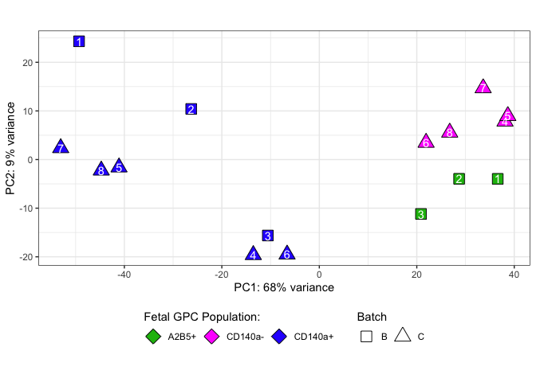

Differential Expression between CD140+ and P-/A+ Fetal hGPCs
================
John Mariani
03/06/23

``` r
source(file = "Scripts/Helper_Functions.R")
library(ggplot2)
library(DESeq2)
```

    ## Loading required package: S4Vectors

    ## Loading required package: stats4

    ## Loading required package: BiocGenerics

    ## 
    ## Attaching package: 'BiocGenerics'

    ## The following objects are masked from 'package:stats':
    ## 
    ##     IQR, mad, sd, var, xtabs

    ## The following objects are masked from 'package:base':
    ## 
    ##     anyDuplicated, aperm, append, as.data.frame, basename, cbind,
    ##     colnames, dirname, do.call, duplicated, eval, evalq, Filter, Find,
    ##     get, grep, grepl, intersect, is.unsorted, lapply, Map, mapply,
    ##     match, mget, order, paste, pmax, pmax.int, pmin, pmin.int,
    ##     Position, rank, rbind, Reduce, rownames, sapply, setdiff, sort,
    ##     table, tapply, union, unique, unsplit, which.max, which.min

    ## 
    ## Attaching package: 'S4Vectors'

    ## The following objects are masked from 'package:base':
    ## 
    ##     expand.grid, I, unname

    ## Loading required package: IRanges

    ## Loading required package: GenomicRanges

    ## Loading required package: GenomeInfoDb

    ## Loading required package: SummarizedExperiment

    ## Loading required package: MatrixGenerics

    ## Loading required package: matrixStats

    ## 
    ## Attaching package: 'MatrixGenerics'

    ## The following objects are masked from 'package:matrixStats':
    ## 
    ##     colAlls, colAnyNAs, colAnys, colAvgsPerRowSet, colCollapse,
    ##     colCounts, colCummaxs, colCummins, colCumprods, colCumsums,
    ##     colDiffs, colIQRDiffs, colIQRs, colLogSumExps, colMadDiffs,
    ##     colMads, colMaxs, colMeans2, colMedians, colMins, colOrderStats,
    ##     colProds, colQuantiles, colRanges, colRanks, colSdDiffs, colSds,
    ##     colSums2, colTabulates, colVarDiffs, colVars, colWeightedMads,
    ##     colWeightedMeans, colWeightedMedians, colWeightedSds,
    ##     colWeightedVars, rowAlls, rowAnyNAs, rowAnys, rowAvgsPerColSet,
    ##     rowCollapse, rowCounts, rowCummaxs, rowCummins, rowCumprods,
    ##     rowCumsums, rowDiffs, rowIQRDiffs, rowIQRs, rowLogSumExps,
    ##     rowMadDiffs, rowMads, rowMaxs, rowMeans2, rowMedians, rowMins,
    ##     rowOrderStats, rowProds, rowQuantiles, rowRanges, rowRanks,
    ##     rowSdDiffs, rowSds, rowSums2, rowTabulates, rowVarDiffs, rowVars,
    ##     rowWeightedMads, rowWeightedMeans, rowWeightedMedians,
    ##     rowWeightedSds, rowWeightedVars

    ## Loading required package: Biobase

    ## Welcome to Bioconductor
    ## 
    ##     Vignettes contain introductory material; view with
    ##     'browseVignettes()'. To cite Bioconductor, see
    ##     'citation("Biobase")', and for packages 'citation("pkgname")'.

    ## 
    ## Attaching package: 'Biobase'

    ## The following object is masked from 'package:MatrixGenerics':
    ## 
    ##     rowMedians

    ## The following objects are masked from 'package:matrixStats':
    ## 
    ##     anyMissing, rowMedians

``` r
library(EnhancedVolcano)
```

    ## Loading required package: ggrepel

``` r
library(data.table)
```

    ## 
    ## Attaching package: 'data.table'

    ## The following object is masked from 'package:SummarizedExperiment':
    ## 
    ##     shift

    ## The following object is masked from 'package:GenomicRanges':
    ## 
    ##     shift

    ## The following object is masked from 'package:IRanges':
    ## 
    ##     shift

    ## The following objects are masked from 'package:S4Vectors':
    ## 
    ##     first, second

``` r
library(stringr)
library(plyr)
```

    ## 
    ## Attaching package: 'plyr'

    ## The following object is masked from 'package:matrixStats':
    ## 
    ##     count

    ## The following object is masked from 'package:IRanges':
    ## 
    ##     desc

    ## The following object is masked from 'package:S4Vectors':
    ## 
    ##     rename

``` r
library(dplyr)
```

    ## 
    ## Attaching package: 'dplyr'

    ## The following objects are masked from 'package:plyr':
    ## 
    ##     arrange, count, desc, failwith, id, mutate, rename, summarise,
    ##     summarize

    ## The following objects are masked from 'package:data.table':
    ## 
    ##     between, first, last

    ## The following object is masked from 'package:Biobase':
    ## 
    ##     combine

    ## The following object is masked from 'package:matrixStats':
    ## 
    ##     count

    ## The following objects are masked from 'package:GenomicRanges':
    ## 
    ##     intersect, setdiff, union

    ## The following object is masked from 'package:GenomeInfoDb':
    ## 
    ##     intersect

    ## The following objects are masked from 'package:IRanges':
    ## 
    ##     collapse, desc, intersect, setdiff, slice, union

    ## The following objects are masked from 'package:S4Vectors':
    ## 
    ##     first, intersect, rename, setdiff, setequal, union

    ## The following objects are masked from 'package:BiocGenerics':
    ## 
    ##     combine, intersect, setdiff, union

    ## The following objects are masked from 'package:stats':
    ## 
    ##     filter, lag

    ## The following objects are masked from 'package:base':
    ## 
    ##     intersect, setdiff, setequal, union

``` r
library(tidyr)
```

    ## 
    ## Attaching package: 'tidyr'

    ## The following object is masked from 'package:S4Vectors':
    ## 
    ##     expand

``` r
library(patchwork)
library(limma)
```

    ## 
    ## Attaching package: 'limma'

    ## The following object is masked from 'package:DESeq2':
    ## 
    ##     plotMA

    ## The following object is masked from 'package:BiocGenerics':
    ## 
    ##     plotMA

``` r
library(ggVennDiagram)
library(UpSetR)
library(xlsx)
```

\#Load prior data

``` r
txi.rsem <- readRDS("RDS/txi.rsem.rds")
highTPM <- readRDS("RDS/highTPM.rds")
sampleTableFull <- read.csv("data_for_import/sampleTableFull.csv")
ensemblGeneListH <- read.csv("data_for_import/ensemblGeneList.csv")
```

# Differential Expression P-/A+ vs CD140+

``` r
txi.rsem.sort <- txi.rsem
for(i in 1:3){
  txi.rsem.sort[[i]] <- txi.rsem.sort[[i]][,colnames(txi.rsem.sort[[i]]) %in% sampleTableFull[sampleTableFull$rep %in% c("A", "B", "C"),]$sample]
}

sampleTableSort  <- sampleTableFull [sampleTableFull$rep %in% c("A", "B", "C"),]
sampleTableSort$label <- c(rep("CD140a+",3),rep("A2B5+",3))

sampleTableSort <- sampleTableSort[match(colnames(txi.rsem.sort$counts),sampleTableSort$sample),]

ddsSort <- DESeqDataSetFromTximport(txi.rsem.sort, sampleTableSort, ~rep+line)
```

    ## Warning in DESeqDataSet(se, design = design, ignoreRank): some variables in
    ## design formula are characters, converting to factors

    ## using counts and average transcript lengths from tximport

``` r
ddsSort <- DESeq(ddsSort)
```

    ## estimating size factors

    ## using 'avgTxLength' from assays(dds), correcting for library size

    ## estimating dispersions

    ## gene-wise dispersion estimates

    ## mean-dispersion relationship

    ## final dispersion estimates

    ## fitting model and testing

``` r
resultsNames(ddsSort)
```

    ## [1] "Intercept"                               
    ## [2] "rep_B_vs_A"                              
    ## [3] "rep_C_vs_A"                              
    ## [4] "line_ctrl_cd140_fetal_vs_ctrl_a2b5_fetal"

``` r
de_Cd140_vs_A2B5 <- de(ddsSort, c(0,0,0,1), 0.01, 1)
de_Cd140_vs_A2B5_all <- de(ddsSort, c(0,0,0,1), 1, 0)

table(de_Cd140_vs_A2B5$log2FoldChange > 0)
```

    ## 
    ## FALSE  TRUE 
    ##   288   435

``` r
write.table(de_Cd140_vs_A2B5, "output/de_Cd140_vs_A2B5.txt", quote = F, sep = "\t" ,row.names = F)

row.names(sampleTableSort) <- sampleTableSort$sample
```

## Make PCA from VST counts

``` r
cd140A2B5pca <- plotPCAcustom(vst(ddsSort), "group")
cd140A2B5pca$label <- sampleTableSort$label
cd140A2B5pca$rep <- sampleTableSort$rep

attributes(cd140A2B5pca)
```

    ## $names
    ## [1] "PC1"     "PC2"     "group"   "group.1" "name"    "label"   "rep"    
    ## 
    ## $row.names
    ## [1] "fCd140_1"    "fCd140_2"    "fCd140_3"    "fP_A_Plus_1" "fP_A_Plus_2"
    ## [6] "fP_A_Plus_3"
    ## 
    ## $percentVar
    ## [1] 0.6635097 0.1596288
    ## 
    ## $class
    ## [1] "data.frame"

``` r
cd140A2B5pcaGG <- ggplot(data=cd140A2B5pca, aes_string(x="PC1", y="PC2")) + theme_bw() + theme(legend.position = "bottom", legend.direction = "horizontal") + geom_point(shape = 21, size=5, aes(fill = label), colour = "black") + 
  xlab(paste0("PC1: ",round(attributes(cd140A2B5pca)$percentVar[1] * 100),"% variance")) +
  ylab(paste0("PC2: ",round(attributes(cd140A2B5pca)$percentVar[2] * 100),"% variance")) +
  coord_fixed() + scale_fill_manual(values = c("#18BA0F", "#2E30FF"), name = "Fetal GPC Population:")  + guides(fill = guide_legend(title.position = "top")) + 
  geom_text(aes(label = rep), vjust = 2) + xlim(c(-55,30)) + ylim(-25,25)
```

    ## Warning: `aes_string()` was deprecated in ggplot2 3.0.0.
    ## ℹ Please use tidy evaluation idioms with `aes()`.
    ## ℹ See also `vignette("ggplot2-in-packages")` for more information.
    ## This warning is displayed once every 8 hours.
    ## Call `lifecycle::last_lifecycle_warnings()` to see where this warning was
    ## generated.

``` r
cd140A2B5pcaGG
```

<!-- -->

## Make Volcano Plot

``` r
selectGenes <- de_Cd140_vs_A2B5[(abs(de_Cd140_vs_A2B5$log2FoldChange) > 2 & de_Cd140_vs_A2B5$padj < .0000001) | (abs(de_Cd140_vs_A2B5$log2FoldChange) > 7.5 & de_Cd140_vs_A2B5$padj < .01),]$external_gene_name

selectGenes <- selectGenes[selectGenes != "IGF2"] 

keyvals <- ifelse(
    de_Cd140_vs_A2B5_all$log2FoldChange <= -1 & de_Cd140_vs_A2B5_all$padj < 0.01, '#18BA0F',
      ifelse(de_Cd140_vs_A2B5_all$log2FoldChange >= 1 & de_Cd140_vs_A2B5_all$padj < 0.01, '#2E30FF',
        'darkgrey'))
  #keyvals[is.na(keyvals)] <- 'black'
  names(keyvals)[keyvals == '#18BA0F'] <- 'A2B5+'
  names(keyvals)[keyvals == '#2E30FF'] <- 'CD140a+'
  names(keyvals)[keyvals == 'darkgrey'] <- 'N.S.'

cd140A2B5volcano <- EnhancedVolcano(de_Cd140_vs_A2B5_all,
                lab = as.character(de_Cd140_vs_A2B5_all$external_gene_name),
                selectLab = selectGenes,
                x = 'log2FoldChange',
                y = 'padj',
                FCcutoff = 1,
                pCutoff = 0.01,
                drawConnectors = F,
                ylim = c(0,36),
                xlim = c(-9,12),
                colCustom = keyvals,
                colAlpha = 1) + theme_bw() +  theme(legend.position = "bottom", title = element_blank(), axis.title.x = element_text(hjust = .5), axis.title.y = element_text(hjust = .5), legend.title = element_text(hjust = .5)) + labs(colour = "Differentially Enriched:") + guides(colour = guide_legend(title.position = "top"))

cd140A2B5volcano
```

<!-- -->

``` r
#ggsave("Panels/fig1_pca_volcano.pdf", width = 20, height = 10, device = "pdf")
```

## CD140 Enrichment

``` r
txi.rsem.enrichment <- txi.rsem
for(i in 1:3){
  txi.rsem.enrichment[[i]] <- txi.rsem.enrichment[[i]][,colnames(txi.rsem.enrichment[[i]]) %in% sampleTableFull[sampleTableFull$rep %in% c("D", "E", "F", "G", "H"),]$sample]
}

sampleTableEnrichment <- sampleTableFull[sampleTableFull$sample %in% colnames(txi.rsem.enrichment$abundance),]
sampleTableEnrichment$label <- rep(c("CD140a-","CD140a+"),5)


ddsEnrichment <- DESeqDataSetFromTximport(txi.rsem.enrichment, sampleTableEnrichment, ~rep+group)
```

    ## Warning in DESeqDataSet(se, design = design, ignoreRank): some variables in
    ## design formula are characters, converting to factors

    ## using counts and average transcript lengths from tximport

``` r
ddsEnrichment <- DESeq(ddsEnrichment)
```

    ## estimating size factors

    ## using 'avgTxLength' from assays(dds), correcting for library size

    ## estimating dispersions

    ## gene-wise dispersion estimates

    ## mean-dispersion relationship

    ## final dispersion estimates

    ## fitting model and testing

``` r
resultsNames(ddsEnrichment)
```

    ## [1] "Intercept"                               
    ## [2] "rep_E_vs_D"                              
    ## [3] "rep_F_vs_D"                              
    ## [4] "rep_G_vs_D"                              
    ## [5] "rep_H_vs_D"                              
    ## [6] "group_ctrl_neg_fetal_vs_ctrl_cd140_fetal"

``` r
de_Enrichment <- de(ddsEnrichment, c(0,0,0,0,0,-1), 0.01,1)
de_Enrichment_all <- de(ddsEnrichment, c(0,0,0,0,0,-1), 1,0)


write.table(de_Enrichment, "output/de_Cd140_Enrichment.txt", quote = F, sep = "\t" ,row.names = F)

row.names(sampleTableEnrichment) <- sampleTableEnrichment$sample
```

## Make CD140 Enrichment PCA

``` r
cd140EnrichmentPCA <- plotPCAcustom(vst(ddsEnrichment), "group")
cd140EnrichmentPCA$label <- sampleTableEnrichment$label
cd140EnrichmentPCA$rep <- sampleTableEnrichment$rep


cd140EnrichmentPCAgg <- ggplot(data=cd140EnrichmentPCA, aes_string(x="PC1", y="PC2")) + theme_bw() + theme(legend.position = "bottom", legend.direction = "horizontal") + geom_point(shape = 21, size=5, aes(fill = label), colour = "black") + 
  xlab(paste0("PC1: ",round(attributes(cd140EnrichmentPCA)$percentVar[1] * 100),"% variance")) +
  ylab(paste0("PC2: ",round(attributes(cd140EnrichmentPCA)$percentVar[2] * 100),"% variance")) +
  coord_fixed() + scale_fill_manual(values = c("magenta", "#2E30FF"), name = "Fetal GPC Population:")  + guides(fill = guide_legend(title.position = "top")) + 
  geom_text(aes(label = rep), vjust = 2) + ylim(-25,27)

cd140EnrichmentPCAgg
```

<!-- -->
\## Make Volcano Plot

``` r
selectGenes <- de_Enrichment[(de_Enrichment$padj < 10^-45) | (de_Enrichment$padj < .01 & de_Enrichment$log2FoldChange > 9) | (de_Enrichment$padj < .01 & de_Enrichment$log2FoldChange < -6),]$external_gene_name

keyvals <- ifelse(
  de_Enrichment_all$log2FoldChange <= -1 & de_Enrichment_all$padj < 0.01, 'magenta',
  ifelse(de_Enrichment_all$log2FoldChange >= 1 & de_Enrichment_all$padj < 0.01, '#2E30FF',
         'darkgrey'))
#keyvals[is.na(keyvals)] <- 'black'
names(keyvals)[keyvals == 'magenta'] <- 'CD140a-'
names(keyvals)[keyvals == '#2E30FF'] <- 'CD140a+'
names(keyvals)[keyvals == 'darkgrey'] <- 'N.S.'

cd140EnrichmentVolcano <- EnhancedVolcano(de_Enrichment_all,
                                          lab = as.character(de_Enrichment_all$external_gene_name),
                                          selectLab = selectGenes,
                                          x = 'log2FoldChange',
                                          y = 'padj',
                                          FCcutoff = 1,
                                          pCutoff = 0.01,
                                          drawConnectors = F,
                                          ylim = c(0,190),
                                          xlim = c(-8,11),
                                          colCustom = keyvals,
                                          colAlpha = 1) + theme_bw() +  theme(legend.position = "bottom", title = element_blank(), axis.title.x = element_text(hjust = .5), axis.title.y = element_text(hjust = .5), legend.title = element_text(hjust = .5)) + labs(colour = "Differentially Enriched:") + guides(colour = guide_legend(title.position = "top"))

cd140EnrichmentVolcano
```

<!-- -->

## Make Combined PCA for Figure 1

``` r
sampleTableFig1  <- rbind(sampleTableSort, sampleTableEnrichment)

txi.rsem.Fig1 <- txi.rsem
for(i in 1:3){
  txi.rsem.Fig1[[i]] <- txi.rsem.Fig1[[i]][,colnames(txi.rsem.Fig1[[i]]) %in% sampleTableFig1$sample]
}

colnames(txi.rsem.Fig1$abundance)
```

    ##  [1] "fCd140_1"            "fCd140_2"            "fCd140_3"           
    ##  [4] "fP_A_Plus_1"         "fP_A_Plus_2"         "fP_A_Plus_3"        
    ##  [7] "July2014_hfCD140-1n" "July2014_hfCD140-1p" "July2014_hfCD140-2n"
    ## [10] "July2014_hfCD140-2p" "July2014_hfCD140-3n" "July2014_hfCD140-3p"
    ## [13] "July2014_hfCD140-4n" "July2014_hfCD140-4p" "July2014_hfCD140-5n"
    ## [16] "July2014_hfCD140-5p"

``` r
sampleTableFig1$sample
```

    ##  [1] "fCd140_1"            "fCd140_2"            "fCd140_3"           
    ##  [4] "fP_A_Plus_1"         "fP_A_Plus_2"         "fP_A_Plus_3"        
    ##  [7] "July2014_hfCD140-1n" "July2014_hfCD140-1p" "July2014_hfCD140-2n"
    ## [10] "July2014_hfCD140-2p" "July2014_hfCD140-3n" "July2014_hfCD140-3p"
    ## [13] "July2014_hfCD140-4n" "July2014_hfCD140-4p" "July2014_hfCD140-5n"
    ## [16] "July2014_hfCD140-5p"

``` r
sampleTableFig1 <- sampleTableFig1[match(colnames(txi.rsem.Fig1$counts),sampleTableFig1$sample),]

ddsFig1 <- DESeqDataSetFromTximport(txi.rsem.Fig1, sampleTableFig1, ~0+group+batch)
```

    ## Warning in DESeqDataSet(se, design = design, ignoreRank): some variables in
    ## design formula are characters, converting to factors

    ## using counts and average transcript lengths from tximport

``` r
vsd <- vst(ddsFig1)
```

    ## using 'avgTxLength' from assays(dds), correcting for library size

``` r
assay(vsd) <- limma::removeBatchEffect(assay(vsd), vsd$batch)

fig1PCA <- plotPCAcustom(vsd, "group")
fig1PCA$label <- sampleTableFig1$label
fig1PCA$Batch <- sampleTableFig1$batch


fig1PCAgg <- ggplot(data=fig1PCA, aes_string(x="PC1", y="PC2")) + theme_bw() + theme(legend.position = "bottom", legend.direction = "horizontal") + geom_point(size=5, aes(fill = label, shape = Batch), colour = "black") + 
  xlab(paste0("PC1: ",round(attributes(fig1PCA)$percentVar[1] * 100),"% variance")) +
  ylab(paste0("PC2: ",round(attributes(fig1PCA)$percentVar[2] * 100),"% variance")) +
  coord_fixed()  + guides(fill = guide_legend(title.position = "top", override.aes = list(shape = 23), order = 1), shape = guide_legend(title.position = "top")) + scale_shape_manual(values = c(22, 24)) + scale_fill_manual(values = c("#18BA0F", "magenta", "#2E30FF"), name = "Fetal GPC Population:") 


fig1PCAgg
```

<!-- -->

## Figure 1 Venn

``` r
onlyA2B5 <- de_Cd140_vs_A2B5[de_Cd140_vs_A2B5$Row.names %not in% de_Enrichment$Row.names,]
intersectFetal <- de_Cd140_vs_A2B5[de_Cd140_vs_A2B5$Row.names %in% de_Enrichment$Row.names,]
onlyNeg <- de_Enrichment[de_Enrichment$Row.names %not in% de_Cd140_vs_A2B5$Row.names,]

Venn1 <- list(
  "CD140a+ vs CD140a-" = as.character(de_Enrichment$Row.names),
  "CD140a+ vs A2B5+" = as.character(de_Cd140_vs_A2B5$Row.names))

Venn2 <- list(
  "CD140a+ Enriched vs CD140a-" = as.character(de_Enrichment[de_Enrichment$log2FoldChange>0,]$Row.names),
  "CD140a+ Enriched vs A2B5+" = as.character(de_Cd140_vs_A2B5[de_Cd140_vs_A2B5$log2FoldChange > 0,]$Row.names),
  "A2B5+ Enriched vs Cd140a+" =  as.character(de_Cd140_vs_A2B5[de_Cd140_vs_A2B5$log2FoldChange < 0,]$Row.names),
  "Cd140a- Enriched vs Cd140a+" = as.character(de_Enrichment[de_Enrichment$log2FoldChange < 0,]$Row.names))


ggVennDiagram(Venn1, label = "count") + theme(legend.position = "none") + labs(tag = "C")
```

<!-- -->

``` r
ggVennDiagram(Venn2, label = "count") + theme(legend.position = "none") + labs(tag = "C")
```

<!-- -->

``` r
100-((4/(1153+322+110+166+121+1029+1+3))*100)
```

    ## [1] 99.86231

## Upset Plot

``` r
upset(fromList(list("CD140a+ Enriched vs CD140a-" = de_Enrichment[de_Enrichment$log2FoldChange>0,]$Row.names,
                    "CD140a+ Enriched vs A2B5+" = de_Cd140_vs_A2B5[de_Cd140_vs_A2B5$log2FoldChange > 0,]$Row.names,
                    "A2B5+ Enriched vs CD140a+" =  de_Cd140_vs_A2B5[de_Cd140_vs_A2B5$log2FoldChange < 0,]$Row.names,
                    "CD140a- Enriched vs CD140a+" = de_Enrichment[de_Enrichment$log2FoldChange < 0,]$Row.names)), order.by = "degree")
```

<!-- -->

## Asemble Figure S1

``` r
figS1 <- ((cd140A2B5pcaGG | cd140A2B5volcano ) / (cd140EnrichmentPCAgg | cd140EnrichmentVolcano))
figS1
```

<!-- -->

``` r
#ggsave(plot = figS1, filename = "figures/figS1_050121.pdf", device = "pdf", units = c("in"), height = 11, width = 10, useDingbats=FALSE)
```

## Make HM

``` r
fig1HMgenes <- c("SOX10", "NKX2-2", "LINGO1", "UGT8", "GPR17", "OLIG2", "OLIG1", "PDGFRA", "SIRT2", "CNTN1", "DLX1", "HES1", "AQP4", "IL6", "PDGFRB", "IL1B", "TNF", "NRG1", "IGF1", "C3", "TREM2", "C2", "CD4", "CD68", "CLU", "NEUROD1", "NEUROD2", "GSX2", "MBP", "GAL3ST1", "GRM3", "HTR2A", "FABP7", "GABRA4", "GABRB1", "P2RY1", "EOMES", "NNAT", "PAX6", "STMN2", "EMX1")

fetalTPM <- merge(txi.rsem.Fig1$abundance, ensemblGeneListH, by.x = 0, by.y = "ensembl_gene_id")
fetalTPM <- fetalTPM[fetalTPM$external_gene_name %in% fig1HMgenes,]

fetalTPM <- fetalTPM[,1:18] %>%
  pivot_longer(-c(Row.names, external_gene_name), names_to = "Sample", values_to = "TPM")

fetalTPM$group <- mapvalues(fetalTPM$Sample,sampleTableFig1$sample, gsub(x = as.character(sampleTableFig1$group), pattern = "ctrl_", replacement = ""))

fetalHM <- fetalTPM[fetalTPM$external_gene_name %in% fig1HMgenes,]
fetalHM$TPM <- log2(fetalHM$TPM + .1)
fetalHM$group <- factor(fetalHM$group, levels = c("cd140_fetal", "a2b5_fetal", "neg_fetal"))

fetalBarA2B5 <- de_Cd140_vs_A2B5_all[de_Cd140_vs_A2B5_all$external_gene_name %in% fig1HMgenes,]
fetalBarEnrichment <- de_Enrichment_all[de_Enrichment_all$external_gene_name %in% fig1HMgenes,]

fetalOrder <- fetalBarEnrichment[match(fetalBarA2B5$external_gene_name, fetalBarEnrichment$external_gene_name),]

fetalOrder <- cbind(fetalBarA2B5, fetalBarEnrichment)
fetalOrder$rowMax <- rowMaxs(as.matrix(fetalOrder[,c(3,13)]))
fetalOrder <- fetalOrder[order(fetalOrder$rowMax, decreasing = F),]


fetalBarA2B5 <- de_Cd140_vs_A2B5[de_Cd140_vs_A2B5$external_gene_name %in% fig1HMgenes,]
fetalBarA2B5$de <- "A2B5"
fetalBarEnrichment <- de_Enrichment[de_Enrichment$external_gene_name %in% fig1HMgenes,]
fetalBarEnrichment$de <- "Enrichment"


fetalBar <- rbind(fetalBarA2B5,fetalBarEnrichment)
fetalBar$logFC <- as.numeric(fetalBar$log2FoldChange)
fetalBar$external_gene_name <- as.factor(fetalBar$external_gene_name)

fetalHM$external_gene_name <- factor(fetalHM$external_gene_name, levels = fetalOrder$external_gene_name)
fetalBar$external_gene_name <- factor(fetalBar$external_gene_name, levels = fetalOrder$external_gene_name)


###
limits <- aes(xmax = fetalBar$log2FoldChange + fetalBar$lfcSE,  
              xmin =  fetalBar$log2FoldChange - fetalBar$lfcSE)

m1 <- ggplot(fetalHM, aes(Sample, external_gene_name)) + 
  geom_tile(aes(fill = TPM)) + 
  theme(axis.text.x = element_text(angle = 90, vjust = 0.5, hjust=1), panel.spacing.x = unit(.5,"lines"),axis.title.x = element_blank(), strip.background = element_rect(color="black", fill= c("blue","magenta","green"), size=1.5, linetype="solid"), axis.title.y = element_blank(), axis.text.y = element_blank())  + 
  scale_fill_gradientn(colours = c("#009900","#fffcbd","#ff2020")) + 
  scale_x_discrete(expand = c(0, 0)) + 
  facet_grid(cols = vars(group),scales = "free", space = "free", switch = "x") + theme(axis.text.x = element_blank(), axis.ticks.x = element_blank(), legend.position = "bottom")

m1
```

<!-- -->

``` r
hLines <- seq(1.5,((length(unique(fetalBar$external_gene_name))-1)+.5), by = 1)

m2 <- ggplot(fetalBar, aes(y = external_gene_name, x = logFC, fill = de)) + 
  theme_bw() + 
  geom_errorbar(limits, width=.5, position=position_dodge(1)) + 
  geom_bar(stat = "identity", width = 1,size = 5, position = position_dodge2(preserve = "single")) + 
  scale_y_discrete(expand = c(0, 0), position = "right") + 
  theme(axis.text.y  = element_text(angle = 0, vjust = .5, hjust=0), axis.title.y = element_blank(), legend.position = "bottom",  panel.grid.major.y = element_blank())  + 
  scale_fill_manual(values = c("#18BA0F", "magenta")) + 
  geom_hline(yintercept=hLines,color="lightgrey") 


m2 | m1
```

<!-- -->

## Make Combined IPA graph

``` r
files <- paste0("data_for_import/", c("Fetal_Cd140_vs_A2B5_IPA.txt", "Fetal_CD140_Enrichment_IPA.txt"))
compNames <- c("CD140_vs_A2B5", "CD140_enrichment")

IPAparse <- function(files, compNames, pval = 0.001, filterTerms, ensembl, returnWhat = "Filtered"){
  pval <- -log10(pval)
  for(i in 1:length(files)){
    canonicalIPA <- fread(files[i], skip = "Canonical",drop = c(4,6))
    names(canonicalIPA) <- c("Pathway", "pVal", "zScore", "Genes")
    canonicalIPA$type <- "Canonical"
    upstreamIPA <- fread(files[i], skip = "Upstream Regulators", drop = c(1:2,4:6,8:10,13:14))
    upstreamIPA <- upstreamIPA[,c(1,3,2,4)]
    names(upstreamIPA) <- c("Pathway", "pVal", "zScore", "Genes")
    upstreamIPA$Pathway <- paste0(upstreamIPA$Pathway, " Signaling")
    upstreamIPA$pVal <- -log10(upstreamIPA$pVal)
    upstreamIPA$type <- "Upstream"
    functionalIPA <- fread(files[i], skip = "Diseases and Bio", drop = c(1,2,5,7,8,10,11))
    names(functionalIPA) <- c("Pathway", "pVal", "zScore", "Genes")
    functionalIPA$pVal <- -log10(functionalIPA$pVal)
    functionalIPA$type <- "Functional"
    moleculesIPAtemp <- fread(files[i], skip = "Analysis Ready Molecules", drop = c(3:4))
    if(i == 1){
      IPA <- rbind(canonicalIPA, upstreamIPA, functionalIPA)
      IPA$comparison <- compNames[i]
      moleculesIPA <- moleculesIPAtemp
    } else {
      tempIPA <- rbind(canonicalIPA, upstreamIPA, functionalIPA)
      tempIPA$comparison <- compNames[i]
      IPA <- rbind(IPA, tempIPA)
      moleculesIPA <- rbind(moleculesIPA, moleculesIPAtemp)
    }
  }
  
  
  IPA[is.na(IPA$zScore)]$zScore <- 0
  ogIPA <- IPA
  IPA <- IPA[IPA$pVal > pval,]
  filteredIPA <- IPA[!grepl(paste(filterTerms, collapse = "|"), ignore.case = T, IPA$Pathway),]
  if(returnWhat == "Filtered"){
    return(filteredIPA)
  } 
  if(returnWhat == "Deleted"){
    deletedIPA <- IPA[grepl(paste(filterTerms, collapse = "|"), ignore.case = T, IPA$Pathway),]
    return(deletedIPA)
  }
  if(returnWhat == "Molecules"){
    moleculesIPA <- merge(moleculesIPA, ensembl, by.x = "ID", by.y = "ensembl_gene_id")
    return(moleculesIPA)
  }
}


IPAfilters <- c("cancer","glioma", "abdominal", "carcinoma", "endometrium", "eye", "nose", "epidermis", "head", "lymphocyte", "renal", "snout", "tooth", 
                "connective", "tumor", "fibroblast", "rickets", "mouth", "maxilla", "cartilage", "neoplasm", "lymph", "liver", "psoriasis", "cardio",
                "cardiac", "tongue", "tinea", "herpes", "Picornaviridae", "virus", "killer T", "muscle", "myopathy", "pancreatic", "Onychomycosis",
                "leukocyte", "oral cavity","osteoclast", "Merkel", "macrophage", "Hydrometrocolpos", "Hand", "Gastric", "Thymocytes", "diabetes",
                "Dupuytren", "myoblast", "ear$", "implantation", "bone", "limb", "cleft lip", "Calcinosis", "lung", "Benign lesion", 
                "body axis", "sensory organ", "diabetic", "neutrophil", "infection of mammalia", "leukopoiesis", "neoplasia", "Sensory system development",
                "T cell", "myeloid", "aorta", "body cavity", "esophagus", "incisor", "kidney", "oesophageal", "respiratory", "skin", "cavity", "urinary",
                "foot", "digit", "heart", "acute biphenotypic leukemia", "Ankylosis", "Articular rigidity", "Atherosclero", "Blister", "Branching morphogenesis of epithelial tubule",
                "Cervical spondylotic myelopathy", "epithelial", "exocrine", "gastrointestinal", "Ejection of first polar body", "Familial arrhythmia", "Familial nonsyndromic hearing impairment", 
                "fibrosis", "mammary", "Hearing", "Morphogenesis of metanephric bud", "cochlea", "nail", "Plasma cell dyscrasia", "Secondary Leukemia", "granulocyte",
                "Tinnitus", "metastasis", "trunk", "sperm motility", "skull", "dendritic cells", "dehydration", "digestive", "microphthalmia", "myelodysplastic",
                "semicircular canal", " skeleton", "osteopenia", "osteoarthritis", "Refractory anemia with excess blasts", "rectum", "submandibular", "antiviral", "HIV-1",
                "antigen present", "gonad", "keratinocyte", "phagocyte", "coronary", "intestinal", "viral replicon", "monocyte", "viral life", "wound", "leukemia", "Airway", "colorectal", "Benign oral disorder", "Benign pelvic disease", "Glioblastoma", "Melanoma", "astrocytoma", "sarcoma", "leiomyoma", "sertoli", "short stature", "midline defect")

filteredFetalIPA <- IPAparse(files = files, compNames = compNames, filterTerms = IPAfilters, ensembl = ensemblGeneListH, returnWhat = "Filtered", pval = 0.05)

deletedFetalIPA <- IPAparse(files = files, compNames = compNames, filterTerms = IPAfilters, ensembl = ensemblGeneListH, returnWhat = "Deleted", pval = 0.05)

moleculesFetal <- IPAparse(files = files, compNames = compNames, filterTerms = IPAfilters, ensembl = ensemblGeneListH, returnWhat = "Molecules", pval = 0.05)

fetalGOterms <- c("SOX10 Signaling", "TCF7L2 Signaling", "Cell movement", "Inflammatory response", "Quantity of neurons", "IL1B Signaling", "SMARCA4 Signaling", "Synthesis of lipid", "SOX2 Signaling", "CCR2 Signaling", "ST8SIA1 Signaling", "PDGF Signaling", "Differentiation of neuroglia", "L-triiodothyronine Signaling", "NOTCH1 Signaling")
fetalGO <- filteredFetalIPA[filteredFetalIPA$Pathway %in% fetalGOterms,]

fetalGO <- fetalGO[,c(1:3,6)]

fetalGO$maxP <- 0

for(i in unique(fetalGO$Pathway)){
  maxP <- max(fetalGO[fetalGO$Pathway == i,]$pVal)
  fetalGO[fetalGO$Pathway == i,]$maxP <- maxP
}

fetalGO <- fetalGO[order(fetalGO$maxP, rev(fetalGO$comparison), decreasing = F),]

fetalGO$Pathway <- factor(fetalGO$Pathway, levels = fetalGO[!duplicated(fetalGO$Pathway),]$Pathway)

fig1IPAgg <- ggplot(fetalGO) +
  geom_point(aes(x = comparison, y = Pathway, size = pVal, colour = zScore)) +
  scale_colour_gradientn(colours = c("red", "grey", "#2E30FF"), values = scales::rescale(c(-.4,-.17,.4)), guide = guide_colourbar(direction = "horizontal", title = "Activation Z-Score", title.position = "left"))  +
  theme_bw() +
  theme(legend.position = "bottom", axis.title.x = element_blank(), axis.title.y = element_blank(), legend.box = "vertical") +
  labs(size="-Log10 P-Value")

fig1IPAgg
```

<!-- -->

## Assemble Figure 1

``` r
fig1 <- (((plot_spacer() | fig1PCAgg) + plot_layout(widths = c(1,.85))) / (((plot_spacer() / fig1IPAgg) + plot_layout(heights = c(1,3))) | m2 | m1)) + plot_layout(heights = c(1,3))

fig1 <- fig1 & plot_annotation(tag_levels = 'A')

fig1
```

<!-- -->

``` r
#ggsave(plot = fig1, filename = "figures/fig1_050121.pdf", device = "pdf", units = c("in"), height = 11, width = 10, useDingbats=FALSE)
```

### Make First supplemental table

``` r
#Differentially expressed genes in fetal GPCs
supTable1a <- de_Cd140_vs_A2B5
supTable1a <- supTable1a[,c(1,3,7:10)]
names(supTable1a) <- c("Ensembl_ID", "Log2FC_CD140a_vs_A2B5", "Adj_P_Val", "External_Gene_Name", "Gene_Biotype", "Description")
supTable1a <- supTable1a[order(supTable1a$Adj_P_Val, decreasing = F),]

supTable1b <- de_Enrichment
supTable1b <- supTable1b[,c(1,3,7:10)]
names(supTable1b) <- c("Ensembl_ID", "Log2FC_CD140a+_vs_Cd140a-", "Adj_P_Val", "External_Gene_Name", "Gene_Biotype", "Description")
supTable1b <- supTable1b[order(supTable1b$Adj_P_Val, decreasing = F),]


#Significant IPA terms between fetal GPC populations

supTable1c <- filteredFetalIPA[filteredFetalIPA$comparison == "CD140_vs_A2B5",]
supTable1c <- supTable1c[,c(1:5)]
names(supTable1c) <- c("Pathway", "Adj_-log10_P_Val", "Z_Score", "Genes", "Type")
supTable1c <- supTable1c[order(supTable1c$`Adj_-log10_P_Val`, decreasing = T),]

supTable1d <- filteredFetalIPA[filteredFetalIPA$comparison == "CD140_enrichment",]
supTable1d <- supTable1d[,c(1:5)]
names(supTable1d) <- c("Pathway", "Adj_-log10_P_Val", "Z_Score", "Genes", "Type")
supTable1d <- supTable1d[order(supTable1d$`Adj_-log10_P_Val`, decreasing = T),]

write.xlsx(supTable1a, file = "Extended Data Tables/Extended Data Table 1 - Fetal Bulk RNA-seq.xlsx", sheetName = "DE genes - Fetal CD140a vs A2B5", row.names = F, append = T)

write.xlsx(supTable1b, file = "Extended Data Tables/Extended Data Table 1 - Fetal Bulk RNA-seq.xlsx", sheetName = "DE genes - Fetal CD140a+ vs CD140a-", row.names = F, append = T)


write.xlsx(supTable1c, file = "Extended Data Tables/Extended Data Table 1 - Fetal Bulk RNA-seq.xlsx", sheetName = "Fetal Cd140a vs A2B5 IPA Terms", row.names = F, append = T)

write.xlsx(supTable1d, file = "Extended Data Tables/Extended Data Table 1 - Fetal Bulk RNA-seq.xlsx", sheetName = "Fetal Cd140a+ vs CD140a- IPA Terms", row.names = F, append = T)
```

``` r
sessionInfo()
```

    ## R version 4.2.3 (2023-03-15)
    ## Platform: aarch64-apple-darwin20 (64-bit)
    ## Running under: macOS Ventura 13.2.1
    ## 
    ## Matrix products: default
    ## BLAS:   /Library/Frameworks/R.framework/Versions/4.2-arm64/Resources/lib/libRblas.0.dylib
    ## LAPACK: /Library/Frameworks/R.framework/Versions/4.2-arm64/Resources/lib/libRlapack.dylib
    ## 
    ## locale:
    ## [1] en_US.UTF-8/en_US.UTF-8/en_US.UTF-8/C/en_US.UTF-8/en_US.UTF-8
    ## 
    ## attached base packages:
    ## [1] stats4    stats     graphics  grDevices utils     datasets  methods  
    ## [8] base     
    ## 
    ## other attached packages:
    ##  [1] xlsx_0.6.5                  UpSetR_1.4.0               
    ##  [3] ggVennDiagram_1.2.2         limma_3.54.2               
    ##  [5] patchwork_1.1.2             tidyr_1.3.0                
    ##  [7] dplyr_1.1.1                 plyr_1.8.8                 
    ##  [9] stringr_1.5.0               data.table_1.14.8          
    ## [11] EnhancedVolcano_1.16.0      ggrepel_0.9.3              
    ## [13] DESeq2_1.38.3               SummarizedExperiment_1.28.0
    ## [15] Biobase_2.58.0              MatrixGenerics_1.10.0      
    ## [17] matrixStats_0.63.0          GenomicRanges_1.50.2       
    ## [19] GenomeInfoDb_1.34.9         IRanges_2.32.0             
    ## [21] S4Vectors_0.36.2            BiocGenerics_0.44.0        
    ## [23] ggplot2_3.4.2              
    ## 
    ## loaded via a namespace (and not attached):
    ##  [1] bitops_1.0-7           sf_1.0-12              bit64_4.0.5           
    ##  [4] RColorBrewer_1.1-3     httr_1.4.5             rprojroot_2.0.3       
    ##  [7] tools_4.2.3            utf8_1.2.3             R6_2.5.1              
    ## [10] KernSmooth_2.23-20     DBI_1.1.3              colorspace_2.1-0      
    ## [13] withr_2.5.0            tidyselect_1.2.0       gridExtra_2.3         
    ## [16] bit_4.0.5              compiler_4.2.3         cli_3.6.1             
    ## [19] DelayedArray_0.24.0    labeling_0.4.2         scales_1.2.1          
    ## [22] classInt_0.4-9         proxy_0.4-27           digest_0.6.31         
    ## [25] rmarkdown_2.21         XVector_0.38.0         pkgconfig_2.0.3       
    ## [28] htmltools_0.5.5        fastmap_1.1.1          highr_0.10            
    ## [31] rlang_1.1.0            rstudioapi_0.14        RSQLite_2.3.1         
    ## [34] generics_0.1.3         farver_2.1.1           BiocParallel_1.32.6   
    ## [37] RCurl_1.98-1.12        magrittr_2.0.3         GenomeInfoDbData_1.2.9
    ## [40] Matrix_1.5-4           Rcpp_1.0.10            munsell_0.5.0         
    ## [43] fansi_1.0.4            lifecycle_1.0.3        stringi_1.7.12        
    ## [46] yaml_2.3.7             zlibbioc_1.44.0        grid_4.2.3            
    ## [49] blob_1.2.4             parallel_4.2.3         crayon_1.5.2          
    ## [52] lattice_0.21-8         Biostrings_2.66.0      annotate_1.76.0       
    ## [55] xlsxjars_0.6.1         KEGGREST_1.38.0        locfit_1.5-9.7        
    ## [58] knitr_1.42             pillar_1.9.0           geneplotter_1.76.0    
    ## [61] codetools_0.2-19       XML_3.99-0.14          glue_1.6.2            
    ## [64] evaluate_0.20          png_0.1-8              vctrs_0.6.1           
    ## [67] gtable_0.3.3           purrr_1.0.1            cachem_1.0.7          
    ## [70] xfun_0.38              xtable_1.8-4           e1071_1.7-13          
    ## [73] class_7.3-21           RVenn_1.1.0            tibble_3.2.1          
    ## [76] rJava_1.0-6            AnnotationDbi_1.60.2   memoise_2.0.1         
    ## [79] units_0.8-1
