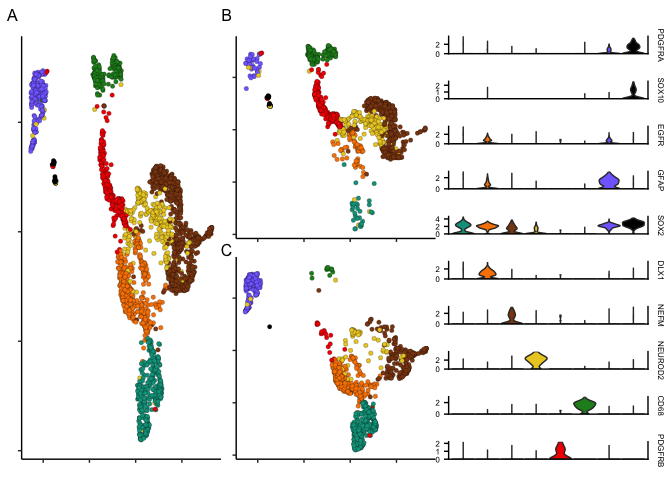

scRNA-Seq Analysis of CD140+ or P-/A+ Fetal Brain
================
John Mariani
03/06/23

``` r
source(file = "Scripts/Helper_Functions.R")
library(ggplot2)
library(Seurat)
```

    ## Attaching SeuratObject

``` r
library(xlsx)
library(patchwork)
library(ggrepel)
library(scales)
library(data.table)
library(stringr)
library(EnhancedVolcano)
library(AUCell)

palette <- c("#00A08A","#F98400","saddlebrown","#EBCC2A","#F21A00","forestgreen","slateblue1","#000000","indianred1","#9C964A","magenta","darkblue")
```

## Load Prior Data

``` r
TPM <- read.delim("output/TPM.txt", header = T)
de_Cd140_vs_A2B5 <- read.delim("output/de_Cd140_vs_A2B5.txt")
ensemblGeneListH <- read.csv("data_for_import/ensemblGeneList.csv")
```

## Process scRNA-seq data

``` r
# options(future.globals.maxSize = 16000 * 1024^2)
# # read in the data
# sampleList <- list.files(path = "Matrices/Fetal")
# Raw <- sapply(sampleList, function(x) Read10X(paste0("Matrices/Fetal/",x,"/filtered_feature_bc_matrix")))
# 
# #Look at dims
# for(i in 1:length(Raw)){
#   print(dim(Raw[[i]]))
# }
# 
# #Rename cells to make them easier to identify and avoid errors downstream
# for(i in 1:length(Raw)){
#   colnames(Raw[[i]]) <- paste0(colnames(Raw[[i]]),"_",sampleList[i])
# }
# 
# #Create list of Seurat Objects
# Objects <- sapply(c(1:length(Raw)), function(x) CreateSeuratObject(Raw[[x]], project = sampleList[x]))
# rm(Raw)
# # calculate percent mt features detected
# for (i in 1:length(Objects)) {
#   Objects[[i]] <- PercentageFeatureSet(Objects[[i]], pattern = "^MT-", col.name = "percent.mt")
# }
# 
# unfilteredViolins <- wrap_plots(VlnPlot(Objects[[1]], c("nFeature_RNA", "nCount_RNA", "percent.mt"), cols = "#18BA0F"), 
#            VlnPlot(Objects[[2]], c("nFeature_RNA", "nCount_RNA", "percent.mt"), cols = "#2E30FF"), ncol = 2)
# 
# # Remove low quality cells
# for (i in 1:length(Objects)) {
#   Objects[[i]] <- subset(x = Objects[[i]], subset = nFeature_RNA > 500 & percent.mt < 15)
# }
# 
# filteredViolins <- wrap_plots(VlnPlot(Objects[[1]], c("nFeature_RNA", "nCount_RNA", "percent.mt"), cols = "#18BA0F"),VlnPlot(Objects[[2]], c("nFeature_RNA", "nCount_RNA", "percent.mt"), cols = "#2E30FF"), ncol = 2)
# 
# 
# unfilteredViolins / filteredViolins
# 
# merged <- merge(Objects[[1]], y = Objects[2:length(Objects)])
# merged <- NormalizeData(merged, normalization.method = "LogNormalize", scale.factor = 10000)
# 
# s.genes = cc.genes$s.genes
# s.genes[s.genes == "MLF1IP"] <- "CENPU"
# g2m.genes = cc.genes$g2m.genes
# g2m.genes[g2m.genes == "FAM64A"] <- "PIMREG"
# g2m.genes[g2m.genes == "HN1"] <- "JPT1"
# 
# merged <- CellCycleScoring(merged, s.features = s.genes, g2m.features = g2m.genes, set.ident = F)
# merged$CC.difference <- merged$S.Score - merged$G2M.Score
# 
# merged = SCTransform(merged, vars.to.regress = c("nCount_RNA", "percent.mt", "CC.difference"), verbose = F)
# 
# 
# DefaultAssay(merged) <- "SCT"
# merged <- RunPCA(merged, verbose = FALSE) 
# merged <- RunUMAP(merged, dims = 1:30, verbose = FALSE, n.neighbors = 60L, repulsion.strength = .8)
# merged <- FindNeighbors(merged, dims = 1:30, verbose = FALSE)
# merged <- FindClusters(merged, verbose = FALSE, resolution = .35) 
# 
# 
# p1 <- DimPlot(merged, label = T, pt.size = .5) 
# p1
# 
# 
# 
# 
# merged <- RenameIdents(merged, "2" = "GPC")
# merged <- RenameIdents(merged, "1" = "Pre-GPC")
# merged <- RenameIdents(merged, "5" = "Microglia")
# merged <- RenameIdents(merged, "10" = "Endothelial/Pericyte")
# merged <- RenameIdents(merged, "7" = "Neuron")
# merged <- RenameIdents(merged, "9" = "Neuron")
# merged <- RenameIdents(merged, "4" = "Immature Neuron")
# merged <- RenameIdents(merged, "0" = "NPC")
# merged <- RenameIdents(merged, "8" = "NPC")
# merged <- RenameIdents(merged, "6" = "NPC")
# merged <- RenameIdents(merged, "3" = "NSC")
# 
# merged$CellType <- Idents(merged)
# 
# scCellTypeOrder <- c("GPC", "Pre-GPC", "NPC", "NSC", "Immature Neuron", "Neuron", "Microglia", "Endothelial/Pericyte")
# merged$CellType <- factor(merged$CellType, levels = scCellTypeOrder)
# 
# 
# p2 <- DimPlot(merged, label = T, pt.size = .5, group.by = "CellType") 
# p2
# 
# p1 | p2
# 
# 
# scCellTypeOrder <- c("GPC", "Pre-GPC", "NPC", "NSC", "Immature Neuron", "Neuron", "Microglia", "Endothelial/Pericyte")
# merged$CellType <- factor(merged$CellType, levels = scCellTypeOrder)
# saveRDS(merged, "RDS/RDS/a2b5CD140sc.rds")
```

### Reload object

``` r
merged <- readRDS("RDS/a2b5CD140sc.rds")
```

### Supplemental A2B5 vs CD140 figure

``` r
labelFont <- 15
titleFont <- 20


supplementalDimPlot <- DimPlotCustom(merged) + guides(fill = guide_legend(title = "Sort")) + scale_fill_manual(labels = c("P-/A+", "CD140a+"), values = c("#18BA0F", "#2E30FF")) + labs(tag = "A")
supplementalDimPlot
```

<!-- -->

``` r
### Stacked Plot
featureMerged <- merged@meta.data

cd140Percentages <- as.data.frame(table(featureMerged[featureMerged$orig.ident == "CD140_fetal",]$CellType)/nrow(featureMerged[featureMerged$orig.ident == "CD140_fetal",])*100)
a2b5Percentages <- as.data.frame(table(featureMerged[featureMerged$orig.ident == "A2B5_fetal",]$CellType)/nrow(featureMerged[featureMerged$orig.ident == "A2B5_fetal",])*100)
cd140Percentages$sort <- "CD140a"
a2b5Percentages$sort <- "A2B5"
Percentages <- rbind(cd140Percentages, a2b5Percentages)


stackedPlot <- ggplot(Percentages, aes(fill = Var1, y = Freq, x = sort))+
  geom_bar(position = "stack", stat = "identity")+
  guides(fill = guide_legend(override.aes = list(size = .6))) +
  scale_fill_manual(values = palette )+
  labs(y = "Percent", x = "Sort", fill = "Cell Type") + theme_classic() + scale_y_continuous(expand = c(0,0)) + ylab("Percent Identity") + theme(plot.tag = element_text(size = 12), legend.key.size = unit(.6, "lines"), text = element_text(size = labelFont), legend.position = "bottom") + xlab(element_blank()) + scale_x_discrete(labels= c("P-/A+", "CD140+")) + labs(tag = "B")

stackedPlot
```

<!-- -->

``` r
#### Scatter Plot

TPMscatter <- TPM
TPMscatter <- TPMscatter[,c(1,5:10)]
TPMscatter$A2B5bulk <- rowMeans(TPMscatter[,5:7])
TPMscatter$CD140bulk <- rowMeans(TPMscatter[,2:4])
TPMscatter <- merge(TPMscatter, ensemblGeneListH, by.x = 1, by.y = "ensembl_gene_id")
TPMscatter$log2fcBulk <- log2((TPMscatter$CD140bulk+.1)/(TPMscatter$A2B5bulk+.1))


scatterAverages <- as.data.frame(AverageExpression(merged, features = de_Cd140_vs_A2B5$external_gene_name, assay = "RNA", group.by = "orig.ident"))

scatterAverages <- scatterAverages[rowSums(scatterAverages) != 0,]
scatterAverages <- scatterAverages* 100
scatterAverages <- scatterAverages[scatterAverages$RNA.A2B5_fetal > 1 | scatterAverages$RNA.CD140_fetal > 1,]
scatterAverages$log2fc <- log2((scatterAverages$RNA.CD140_fetal+.1)/(scatterAverages$RNA.A2B5_fetal+.1))
scatterAverages$gene <- row.names(scatterAverages)
scatterAverages <- scatterAverages[scatterAverages$gene %in% de_Cd140_vs_A2B5$external_gene_name,]
scatterAveragesMerged <- merge(scatterAverages, de_Cd140_vs_A2B5, by.x = "gene", by.y = "external_gene_name")


cor(scatterAveragesMerged$log2fc, scatterAveragesMerged$log2FoldChange)
```

    ## [1] 0.7390376

``` r
scatterGenes <- c("SOX10", "CA10", "PDGFRA", "NEUROD1", "OLIG1", "OLIG2", "NKX2-2", "IL1B", "NEUROD2", "TBR1", "EOMES", "GABRA4", "CD68")
scatterAveragesMerged$label <- ifelse(scatterAveragesMerged$gene %in% scatterGenes, scatterAveragesMerged$gene, "")

geneLabelSize = 4
scatter <- ggplot(scatterAveragesMerged, aes(y=log2FoldChange, x=log2fc, label = label)) + geom_point(alpha = 1, size = .25, color = "darkgrey") + geom_smooth(method = "lm", fill = "lightgrey") + theme_classic() + theme(plot.tag = element_text(size = 12), text = element_text(size = labelFont), legend.text = element_text(size = 6), plot.margin = unit(c(0,0,0,0), "cm"), plot.title = element_text(hjust = 0.5, size = titleFont)) + labs(tag = "C") + geom_text_repel(size = geneLabelSize ,box.padding = .5, max.overlaps = 20000) + geom_hline(yintercept = 0, color = "black") +geom_vline(xintercept = 0, color = "black") + 
  ylab("Bulk RNA-Seq Log2 FC") + xlab("scRNA-Seq Log2 FC")
scatter
```

    ## `geom_smooth()` using formula = 'y ~ x'

    ## Warning: The following aesthetics were dropped during statistical transformation: label
    ## ℹ This can happen when ggplot fails to infer the correct grouping structure in
    ##   the data.
    ## ℹ Did you forget to specify a `group` aesthetic or to convert a numerical
    ##   variable into a factor?

<!-- -->

``` r
(supplementalDimPlot | stackedPlot | scatter) + plot_layout(width = c(3,1,2))
```

    ## `geom_smooth()` using formula = 'y ~ x'

    ## Warning: The following aesthetics were dropped during statistical transformation: label
    ## ℹ This can happen when ggplot fails to infer the correct grouping structure in
    ##   the data.
    ## ℹ Did you forget to specify a `group` aesthetic or to convert a numerical
    ##   variable into a factor?

<!-- -->

``` r
#ggsave("Panels/SupplementalSC2.pdf", width = 10, height = 6, device = "pdf", useDingbats = F)
```

### Main Figure Plots

``` r
xRange <- c(min(as.data.frame(merged@reductions$umap@cell.embeddings)$UMAP_1), max(as.data.frame(merged@reductions$umap@cell.embeddings)$UMAP_1))
yRange <- c(min(as.data.frame(merged@reductions$umap@cell.embeddings)$UMAP_2), max(as.data.frame(merged@reductions$umap@cell.embeddings)$UMAP_2))


dimPlotA2B5 <- DimPlotCustom(subset(merged, subset = orig.ident == "A2B5_fetal"), pt.size = 1.5,group.by = "CellType", plotLegend = T) + 
  xlim(xRange) + ylim(yRange) + theme(legend.position = "none", axis.text = element_blank(), axis.title = element_blank())  + scale_fill_manual(values = palette) + labs(tag = "B")

dimPlotA2B5
```

<!-- -->

``` r
dimPlotCD140 <- DimPlotCustom(subset(merged, subset = orig.ident == "CD140_fetal"), pt.size = 1.5,group.by = "CellType", plotLegend = T) + 
  xlim(xRange) + ylim(yRange) + theme(legend.position = "none", axis.text = element_blank(), axis.title = element_blank()) + scale_fill_manual(values = palette) + labs(tag = "C")

dimPlotCD140
```

<!-- -->

``` r
combinedDimPlot <- DimPlotCustom(merged, pt.size = 1.5,group.by = "CellType", plotLegend = T) + 
  xlim(xRange) + ylim(yRange) + theme(legend.position = "none", axis.text = element_blank(), axis.title = element_blank()) + scale_fill_manual(values = palette) + labs(tag = "A")


##### Small violins"
vGenes <- c("PDGFRA", "SOX10", "EGFR", "GFAP", "SOX2", "DLX1", "NEFM", "NEUROD2", "CD68", "PDGFRB")
vList <- VlnPlot(merged, vGenes, combine = F, pt.size = 0, cols = palette)

for(i in 1:length(vGenes)){
  vList[[i]] <- vList[[i]]  + ggtitle(element_blank()) + labs() +  ylab(vGenes[i]) + xlab(element_blank()) + theme(axis.title.y.left = element_blank(), axis.text.y.right = element_blank(),                                                                                                                axis.ticks.y.right = element_blank(),axis.title.y.right = element_text(angle = 0, vjust = 0.5), plot.margin = unit(c(-.25,0,-.25,0), "lines"), axis.ticks.x = element_blank(), text = element_text(size = labelFont), axis.text = element_text(size = labelFont), axis.title.y = element_text(size = labelFont)) +NoLegend()  + scale_y_continuous(breaks=pretty_breaks(n=2),expand = c(0,0), position = 'right', sec.axis = dup_axis())
  if(i != length(vGenes)){  
    vList[[i]] <- vList[[i]] + theme(axis.text.x = element_blank())
  }
}

violins <- wrap_plots(vList, ncol  = 1)

violins <- violins & theme(axis.text.x = element_blank(), axis.title.y.right  = element_text(size = 6, angle = 270), axis.text.y.left = element_text(size = 6))

violins
```

<!-- -->

``` r
combinedDimPlot | (dimPlotA2B5 / dimPlotCD140) | violins
```

<!-- -->

## Cell Type Markers

``` r
### Find Cluster Markers
Idents(merged) <- merged$CellType
MarkersMAST <- FindAllMarkers(merged, test.use = "MAST", only.pos = T, return.thresh = 0.05)
```

    ## Calculating cluster GPC

    ## 
    ## Done!

    ## Combining coefficients and standard errors

    ## Calculating log-fold changes

    ## Calculating likelihood ratio tests

    ## Refitting on reduced model...

    ## 
    ## Done!

    ## Calculating cluster Pre-GPC

    ## 
    ## Done!

    ## Combining coefficients and standard errors

    ## Calculating log-fold changes

    ## Calculating likelihood ratio tests

    ## Refitting on reduced model...

    ## 
    ## Done!

    ## Calculating cluster NPC

    ## 
    ## Done!

    ## Combining coefficients and standard errors

    ## Calculating log-fold changes

    ## Calculating likelihood ratio tests

    ## Refitting on reduced model...

    ## 
    ## Done!

    ## Calculating cluster NSC

    ## 
    ## Done!

    ## Combining coefficients and standard errors

    ## Calculating log-fold changes

    ## Calculating likelihood ratio tests

    ## Refitting on reduced model...

    ## 
    ## Done!

    ## Calculating cluster Immature Neuron

    ## 
    ## Done!

    ## Combining coefficients and standard errors

    ## Calculating log-fold changes

    ## Calculating likelihood ratio tests

    ## Refitting on reduced model...

    ## 
    ## Done!

    ## Calculating cluster Neuron

    ## 
    ## Done!

    ## Combining coefficients and standard errors

    ## Calculating log-fold changes

    ## Calculating likelihood ratio tests

    ## Refitting on reduced model...

    ## 
    ## Done!

    ## Calculating cluster Microglia

    ## 
    ## Done!

    ## Combining coefficients and standard errors

    ## Calculating log-fold changes

    ## Calculating likelihood ratio tests

    ## Refitting on reduced model...

    ## 
    ## Done!

    ## Calculating cluster Endothelial/Pericyte

    ## 
    ## Done!

    ## Combining coefficients and standard errors

    ## Calculating log-fold changes

    ## Calculating likelihood ratio tests

    ## Refitting on reduced model...

    ## 
    ## Done!

``` r
MarkersMAST <- MarkersMAST[MarkersMAST$p_val_adj < 0.05,]
MarkersMAST <- MarkersMAST[order(MarkersMAST$cluster, MarkersMAST$p_val_adj, decreasing = F),]
MarkersMAST <- MarkersMAST[,c(2:7)]
names(MarkersMAST) <- c("Log2FC", "Percent 1", "Percent 2", "Adj_P_Val", "CellType", "External_Gene_Name")

#write.xlsx(MarkersMAST, file = "Extended Data Tables/Extended Data Table 2 - Fetal scRNA-seq.xlsx", sheetName = "Significant CellType Markers", row.names = F, append = T)
```

## DE of GPC vs pre-GPCs

``` r
GPC.vs.preGPC.all <- FindMarkers(merged, test.use = "MAST", ident.1 = "GPC", ident.2 = "Pre-GPC", logfc.threshold = 0)
```

    ## 
    ## Done!

    ## Combining coefficients and standard errors

    ## Calculating log-fold changes

    ## Calculating likelihood ratio tests

    ## Refitting on reduced model...

    ## 
    ## Done!

``` r
GPC.vs.preGPC.all$gene <- row.names(GPC.vs.preGPC.all)


GPC.vs.preGPC <- GPC.vs.preGPC.all[GPC.vs.preGPC.all$p_val_adj < 0.01 & abs(GPC.vs.preGPC.all$avg_log2FC) > 0.5,]
GPC.vs.preGPC <- GPC.vs.preGPC[,c(2:6)]
names(GPC.vs.preGPC) <- c("Log2FC_GPC_vs_Pre-GPC", "Percent 1", "Percent 2", "Adj_P_Val", "External_Gene_Name")
#write.xlsx(GPC.vs.preGPC, file = "Extended Data Tables/Extended Data Table 2 - Fetal scRNA-seq.xlsx", sheetName = "DE between GPCs and Pre-GPCs", row.names = F, append = T)
```

## IPA Graph

``` r
files <- "data_for_import/GPC.vc.preGPC.IPA.txt"
compNames <- c("GPC.vc.preGPC")

for(i in 1:length(files)){
  canonicalIPA <- fread(files[i], skip = "Canonical",drop = c(4,6))
  names(canonicalIPA) <- c("Pathway", "pVal", "zScore", "Genes")
  canonicalIPA$type <- "Canonical"
  upstreamIPA <- fread(files[i], skip = "Upstream Regulators", drop = c(1:2,4:6,8:10,13:14))
  upstreamIPA <- upstreamIPA[,c(1,3,2,4)]
  names(upstreamIPA) <- c("Pathway", "pVal", "zScore", "Genes")
  upstreamIPA$Pathway <- paste0(upstreamIPA$Pathway, " Signaling")
  upstreamIPA$pVal <- -log10(upstreamIPA$pVal)
  upstreamIPA$type <- "Upstream"
  functionalIPA <- fread(files[i], skip = "Diseases and Bio", drop = c(1,2,5,7,8,10,11))
  names(functionalIPA) <- c("Pathway", "pVal", "zScore", "Genes")
  functionalIPA$pVal <- -log10(functionalIPA$pVal)
  functionalIPA$type <- "Functional"
  if(i == 1){
    IPA <- rbind(canonicalIPA, upstreamIPA, functionalIPA)
    IPA$comparison <- compNames[i]
  } else {
    tempIPA <- rbind(canonicalIPA, upstreamIPA, functionalIPA)
    tempIPA$comparison <- compNames[i]
    IPA <- rbind(IPA, tempIPA)
  }
}
```

    ## Warning in fread(files[i], skip = "Canonical", drop = c(4, 6)): Detected 5
    ## column names but the data has 6 columns (i.e. invalid file). Added 1 extra
    ## default column name for the first column which is guessed to be row names or an
    ## index. Use setnames() afterwards if this guess is not correct, or fix the file
    ## write command that created the file to create a valid file.

    ## Warning in fread(files[i], skip = "Canonical", drop = c(4, 6)): Stopped early
    ## on line 411. Expected 6 fields but found 0. Consider fill=TRUE and
    ## comment.char=. First discarded non-empty line: <<Upstream Regulators for My
    ## Projects->Fetal Adult Manuscript->GPC.vs.preGPC.logfc.5 - 2021-08-25 06:36 PM>>

    ## Warning in fread(files[i], skip = "Upstream Regulators", drop = c(1:2, 4:6, :
    ## Stopped early on line 3800. Expected 14 fields but found 0. Consider fill=TRUE
    ## and comment.char=. First discarded non-empty line: <<Causal Networks for My
    ## Projects->Fetal Adult Manuscript->GPC.vs.preGPC.logfc.5 - 2021-08-25 06:36 PM>>

    ## Warning in fread(files[i], skip = "Diseases and Bio", drop = c(1, 2, 5, :
    ## Stopped early on line 5441. Expected 11 fields but found 0. Consider fill=TRUE
    ## and comment.char=. First discarded non-empty line: <<Tox Functions for My
    ## Projects->Fetal Adult Manuscript->GPC.vs.preGPC.logfc.5 - 2021-08-25 06:36 PM>>

``` r
rm(canonicalIPA)
rm(upstreamIPA)
rm(functionalIPA)

IPA[is.na(IPA$zScore)]$zScore <- 0
ogIPA <- IPA
IPA <- IPA[IPA$pVal > -log10(0.001),]


filterTerms <- c("cancer","glioma", "abdominal", "carcinoma", "endometrium", "eye", "nose", "epidermis", "head", "lymphocyte", "renal", "snout", "tooth", 
                 "connective", "tumor", "fibroblast", "rickets", "mouth", "maxilla", "cartilage", "neoplasm", "oma", "lymph", "liver", "psoriasis", "cardio",
                 "cardiac", "tongue", "disc", "tinea", "herpes", "Picornaviridae", "virus", "killer T", "muscle", "myopathy", "pancreatic", "Onychomycosis",
                 "leukocyte", "oral cavity","osteoclast", "Merkel", "macrophage", "Hydrometrocolpos", "Hand", "Gastric", "Thymocytes", "diabetes",
                 "Dupuytren", "myoblast", "ear$", "implantation", "bone", "limb", "cleft lip", "Calcinosis", "lung", "Benign lesion", 
                 "body axis", "sensory organ", "diabetic", "neutrophil", "infection of mammalia", "leukopoiesis", "neoplasia", "Sensory system development",
                 "T cell", "myeloid", "aorta", "body cavity", "esophagus", "incisor", "kidney", "oesophageal", "respiratory", "skin", "cavity", "urinary",
                 "foot", "digit", "heart", "acute biphenotypic leukemia", "Ankylosis", "Articular rigidity", "Atherosclero", "Blister", "Branching morphogenesis of epithelial tubule",
                 "Cervical spondylotic myelopathy", "epithelial", "exocrine", "gastrointestinal", "Ejection of first polar body", "Familial arrhythmia", "Familial nonsyndromic hearing impairment", 
                 "fibrosis", "mammary", "Hearing", "Morphogenesis of metanephric bud", "cochlea", "nail", "Plasma cell dyscrasia", "Secondary Leukemia", "granulocyte",
                 "Tinnitus", "metastasis", "trunk", "sperm motility", "skull", "dendritic cells", "dehydration", "digestive", "microphthalmia", "myelodysplastic",
                 "semicircular canal", " skeleton", "osteopenia", "osteoarthritis", "Refractory anemia with excess blasts", "rectum", "submandibular", "antiviral", "HIV-1",
                 "antigen present", "gonad", "keratinocyte", "phagocyte", "coronary", "intestinal", "viral replicon", "monocyte", "viral life", "wound", "leukemia", "Airway")
filteredIPA <- IPA[!grepl(paste(filterTerms, collapse = "|"), ignore.case = T, IPA$Pathway),]
deletedIPA <- IPA[grepl(paste(filterTerms, collapse = "|"), ignore.case = T, IPA$Pathway),]

### Make Sup Table 2c

supTable2c <- filteredIPA
supTable2c <- supTable2c[,c(1:5)]
names(supTable2c) <- c("Pathway", "Adj_-log10_P_Val", "Z_Score", "Genes", "Type")
supTable2c <- supTable2c[order(supTable2c$`Adj_-log10_P_Val`, decreasing = T),]
#write.xlsx(supTable2c, file = "Extended Data Tables/Extended Data Table 2 - Fetal scRNA-seq.xlsx", sheetName = "Fetal GPC vs Pre-GPC IPA Terms", row.names = F, append = T)

gpc.vs.pre.cats <- c("CCND1 Signaling", "HMGA1 Signaling", "MYCN Signaling", "Development of neuroglia", "Differentiation of oligodendrocytes", "PDGF-AA Signaling", "FGFR2 Signaling", "ANGPT2 Signaling", "Vegf Signaling", "AGT Signaling", "BMP4 Signaling", "Migration of neuroglia", "EGFR Signaling", "PAX6 Signaling", "Proliferation of neuroglia", "MYC Signaling", "Differentiation of oligodendrocyte precursor cells")

gpc.vs.pre.GO <- filteredIPA[filteredIPA$Pathway %in% gpc.vs.pre.cats]
gpc.vs.pre.GO <- gpc.vs.pre.GO[order(gpc.vs.pre.GO$zScore, decreasing = T),]
gpc.vs.pre.GO[gpc.vs.pre.GO$Pathway == "Vegf Signaling",]$Pathway  <- "VEGF Signaling"
gpc.vs.pre.GO[gpc.vs.pre.GO$Pathway == "Differentiation of oligodendrocyte precursor cells",]$Pathway  <- "Differentiation of OPCs"

gpc.vs.pre.GO$Pathway <- factor(gpc.vs.pre.GO$Pathway, levels = rev(unique(gpc.vs.pre.GO[order(gpc.vs.pre.GO$zScore, decreasing = T),]$Pathway)))

gpc.vs.pre.GOgg <- ggplot(gpc.vs.pre.GO, aes(fill = zScore, y = pVal, x = Pathway)) + geom_bar(stat = "identity") + coord_flip() + theme_minimal() + scale_y_continuous(expand = c(0, 0), limits = c(0,25)) + theme(panel.grid.major.y = element_blank(), panel.grid.minor.y = element_blank(), panel.border = element_rect(fill  = NA), legend.position = "bottom", axis.title.y = element_blank()) + ylab("-Log10 P-Value") + scale_fill_gradientn(colours = c( "#F98400", "grey", "#00A08A"), values = scales::rescale(c(-.5,.001,.5)), guide = guide_colourbar(direction = "horizontal", title = "Activation Z-Score", title.position = "top")) +
  scale_x_discrete(labels = function(Pathway) str_wrap(Pathway, width = 20)) 

gpc.vs.pre.GOgg
```

<!-- -->

## Volcano Plot

``` r
selectGenes <- c("ARC", "GRB14", "MEG3", "BCAN", "CCL2", "NPY", "EMP3", "CD44", "VIM", "LGALS3", "HOPX", "HSPB1", "MDK", "CD99", "CLU", "IFITM3", "GFAP", "EZR", "HLA-A", "HLA-B", "HLA-C", "B2M", "ENO1", "CD63", "TIMP1", "TAGLN2", "TNC", "LRRC4C", "APOD", "GPM6A", "CADM2", "OLIG2", "OLIG1", "CCND1", "BALLC", "SIRT2", "PCDH17", "PLLP", "GRIA2", "ZFAS1", "PDGFRA", "NKX2-2", "SOX10")


keyvals <- ifelse(
  GPC.vs.preGPC.all$avg_log2FC <= -0.5 & GPC.vs.preGPC.all$p_val_adj < 0.05, '#F98400',
  ifelse(GPC.vs.preGPC.all$avg_log2FC >= .5 & GPC.vs.preGPC.all$p_val_adj < 0.05, '#00A08A',
         'darkgrey'))
#keyvals[is.na(keyvals)] <- 'black'
names(keyvals)[keyvals == '#F98400'] <- 'Pre-GPC'
names(keyvals)[keyvals == '#00A08A'] <- 'GPC'
names(keyvals)[keyvals == 'darkgrey'] <- 'N.S.'


scVolcano <- EnhancedVolcano(GPC.vs.preGPC.all, pointSize = 1,
                             lab = as.character(GPC.vs.preGPC.all$gene),
                             selectLab = selectGenes,
                             x = 'avg_log2FC',
                             y = 'p_val_adj',
                             FCcutoff = .5,
                             pCutoff = 0.05,
                             drawConnectors = F,
                             ylim = c(0,107),
                             xlim = c(-2.1, 2.1), labSize = geneLabelSize,
                             colCustom = keyvals,
                             colAlpha = 1) + theme_bw() +  theme(legend.position = "bottom", title = element_blank(), axis.title.x = element_text(hjust = .5), axis.title.y = element_text(hjust = .5), legend.title = element_text(hjust = .5), plot.tag = element_text(size = 12), text = element_text(size = 4), legend.text = element_text(size = 6), plot.margin = unit(c(0,0,0,0), "cm"), plot.title = element_text(hjust = 0.5, size = titleFont)) + labs(colour = "Differentially Enriched:") + guides(colour = guide_legend(title.position = "top"))

scVolcano
```

<!-- -->

``` r
#ggsave("Panels/scVolcano.pdf", plot = scVolcano, width = 3, height = 4, device = "pdf", useDingbats = F)
```

### SCENIC

``` r
# library(SCENIC)
# org="hgnc" # or hgnc, or dmel
# dbDir="data_for_import" # RcisTarget databases location
# myDatasetTitle="Human Fetal GPC scRNA-seq" # choose a name for your analysis
# dbs <- list.files(dbDir, pattern = ".feather")
# dbs
# scenicOptions <- initializeScenic(org=org, dbDir=dbDir, dbs=dbs, datasetTitle=myDatasetTitle, nCores=4) 
# scenicOptions@settings$verbose <- TRUE
# scenicOptions@settings$seed <- 123
# 
# exprMat <- as.matrix(GetAssayData(merged, assay = "RNA", slot = "data"))
# 
# 
# 
# #Modified from geneFilter to handle databases of different lengths
# 
# geneFilterNew <- function (exprMat, scenicOptions, minCountsPerGene = 3 * 0.01 * 
#                              ncol(exprMat), minSamples = ncol(exprMat) * 0.01) 
# {
#   outFile_genesKept <- NULL
#   dbFilePath <- NULL
#   if (class(scenicOptions) == "ScenicOptions") {
#     dbFilePath <- getDatabases(scenicOptions)[[1]]
#     outFile_genesKept <- getIntName(scenicOptions, "genesKept")
#   }
#   else {
#     dbFilePath <- scenicOptions[["dbFilePath"]]
#     outFile_genesKept <- scenicOptions[["outFile_genesKept"]]
#   }
#   if (is.null(dbFilePath)) 
#     stop("dbFilePath")
#   if (is.data.frame(exprMat)) {
#     supportedClasses <- paste(gsub("AUCell_buildRankings,", 
#                                    "", methods("AUCell_buildRankings")), collapse = ", ")
#     supportedClasses <- gsub("-method", "", supportedClasses)
#     stop("'exprMat' should be one of the following classes: ", 
#          supportedClasses, "(data.frames are not supported. Please, convert the expression matrix to one of these classes.)")
#   }
#   if (any(table(rownames(exprMat)) > 1)) 
#     stop("The rownames (gene id/name) in the expression matrix should be unique.")
#   nCountsPerGene <- rowSums(exprMat, na.rm = T)
#   nCellsPerGene <- rowSums(exprMat > 0, na.rm = T)
#   message("Maximum value in the expression matrix: ", max(exprMat, 
#                                                           na.rm = T))
#   message("Ratio of detected vs non-detected: ", signif(sum(exprMat > 
#                                                               0, na.rm = T)/sum(exprMat == 0, na.rm = T), 2))
#   message("Number of counts (in the dataset units) per gene:")
#   print(summary(nCountsPerGene))
#   message("Number of cells in which each gene is detected:")
#   print(summary(nCellsPerGene))
#   message("\nNumber of genes left after applying the following filters (sequential):")
#   genesLeft_minReads <- names(nCountsPerGene)[which(nCountsPerGene > 
#                                                       minCountsPerGene)]
#   message("\t", length(genesLeft_minReads), "\tgenes with counts per gene > ", 
#           minCountsPerGene)
#   nCellsPerGene2 <- nCellsPerGene[genesLeft_minReads]
#   genesLeft_minCells <- names(nCellsPerGene2)[which(nCellsPerGene2 > 
#                                                       minSamples)]
#   message("\t", length(genesLeft_minCells), "\tgenes detected in more than ", 
#           minSamples, " cells")
#   library(RcisTarget)
#   motifRankings1 <- importRankings(dbFilePath)
#   dbFilePath2 <- getDatabases(scenicOptions)[[2]]
#   motifRankings2 <- importRankings(dbFilePath2)
#   genesInDatabase1 <- colnames(getRanking(motifRankings1))
#   genesInDatabase2 <- colnames(getRanking(motifRankings2))
#   genesInDatabase <- genesInDatabase1[genesInDatabase1 %in% genesInDatabase2] 
#   genesLeft_minCells_inDatabases <- genesLeft_minCells[which(genesLeft_minCells %in% 
#                                                                genesInDatabase)]
#   message("\t", length(genesLeft_minCells_inDatabases), "\tgenes available in RcisTarget database")
#   genesKept <- genesLeft_minCells_inDatabases
#   if (!is.null(outFile_genesKept)) {
#     saveRDS(genesKept, file = outFile_genesKept)
#     if (getSettings(scenicOptions, "verbose")) 
#       message("Gene list saved in ", outFile_genesKept)
#   }
#   return(genesKept)
# }
# 
# 
# genesKept <- geneFilterNew(exprMat, scenicOptions=scenicOptions,
#                            minCountsPerGene=1*.01*ncol(exprMat),
#                            minSamples=ncol(exprMat)*.01)
# 
# interestingGenes <- c("NKX2-2", "SOX10", "CLDN5")
# # any missing?
# interestingGenes[which(!interestingGenes %in% genesKept)]
# 
# exprMat_filtered <- exprMat[genesKept, ]
# dim(exprMat_filtered)
# exprMat_filtered <- exprMat[genesKept, ]
# exprMat_filtered_log <- log2(exprMat_filtered+1) 
# exprMat_log <- log2(exprMat+1)
# 
# #saveRDS(exprMat_filtered_log, "output/exprMat_filtered_log.rds")
# #saveRDS(exprMat_log, "output/exprMat_log.rds")
# #saveRDS(scenicOptions, "output/scenicOptions.rds")
# 
# runCorrelation(exprMat_filtered_log, scenicOptions)
# runGenie3(exprMat_filtered_log, scenicOptions)
# 
# runSCENIC_1_coexNetwork2modules(scenicOptions)
# runSCENIC_2_createRegulons(scenicOptions)
# runSCENIC_3_scoreCells(scenicOptions, exprMat_log)
# runSCENIC_4_aucell_binarize(scenicOptions, exprMat_log)
```

## Regulons

``` r
auc <- readRDS("data_for_import/3.4_regulonAUC.Rds")
auc <- lapply(as.list(auc), getAUC)
auc <- do.call(rbind, auc)

merged[["SCENIC"]] <- CreateAssayObject(data = auc)
```

    ## Warning: Feature names cannot have underscores ('_'), replacing with dashes
    ## ('-')

``` r
DefaultAssay(merged) <- "SCENIC"

scenicDE <- FindMarkers(merged, test.use = "wilcox", ident.1 = "GPC", ident.2 = "Pre-GPC", assay = "SCENIC", slot = "data", logfc.threshold = 0, min.pct = 0)
scenicDE <- scenicDE[scenicDE$p_val_adj < 0.01,]

# SupTable 2d
supTable2d <- scenicDE
supTable2d$Regulon <- row.names(supTable2d)
supTable2d <- supTable2d[,c(2:6)]
names(supTable2d) <- c("Log2FC_GPC_vs_Pre-GPC", "Percent 1", "Percent 2", "Adj_P_Val", "Regulon")
#write.xlsx(supTable2d, file = "Extended Data Tables/Extended Data Table 2 - Fetal scRNA-seq.xlsx", sheetName = "GPC vs Pre-GPC Regulon DE ", row.names = F, append = T)


fig2top <- (combinedDimPlot | (dimPlotA2B5 / dimPlotCD140) | violins) + plot_layout(widths= (c(1,.6,1)))
fig2top
```

<!-- -->

``` r
#ggsave("Panels/fig2top.pdf", plot = fig2top, width = 8, height = 4.5, device = "pdf", useDingbats = F)


fig2bottom <- ((((plot_spacer() | (FeaturePlotCustom(merged, c("SOX10", "APOD", "HOPX", "HLA-B"), pt.size = .1)) & plot_layout(guides = "collect") & theme(legend.position = "none", axis.text = element_blank(), axis.ticks = element_blank(), axis.line = element_blank())) /
                   FeaturePlotCustom(merged, c("OLIG2-extended (40g)", "SOX10-extended (60g)", "NKX2-2 (11g)", "SATB1 (25g)"), assay = "SCENIC", nrow = 1, plotLegend = F, pt.size = .1, sharedScale = "None") & theme(legend.position = "none", axis.text = element_blank(), axis.ticks = element_blank(), axis.line = element_blank())) + plot_layout(heights = c(2,1))) |
                 gpc.vs.pre.GOgg) + plot_layout(widths = c(2,1))

fig2bottom
```

<!-- -->

``` r
#ggsave("Panels/fig2bottom.pdf", plot = fig2bottom, width = 8, height = 6, device = "pdf", useDingbats = F)

scRNAlegend <- FeaturePlotCustom(merged, c("SOX10", "APOD", "HOPX", "HLA-B"), pt.size = .1) & theme(legend.position = "bottom")

#ggsave("Panels/scRNAlegend.pdf", plot = scRNAlegend, width = 8, height = 6, device = "pdf", useDingbats = F)

regulonLegend <- FeaturePlotCustom(merged, c("OLIG2-extended (40g)", "SOX10-extended (60g)", "NKX2-2 (11g)", "SATB1 (25g)"), assay = "SCENIC", nrow = 1, plotLegend = T, pt.size = .1, sharedScale = "None")
regulonLegend
```

<!-- -->

``` r
#ggsave("Panels/regulonLegend.pdf", plot = regulonLegend, width = 8, height = 6, device = "pdf", useDingbats = F)
```

### Source Data Main Fig

``` r
sdUMAP <- as.data.frame(merged@reductions$umap@cell.embeddings)
sdMeta <- merged@meta.data

identical(row.names(sdUMAP), row.names(sdMeta))
```

    ## [1] TRUE

``` r
sdUMAP$cellName <- row.names(sdUMAP)
sdUMAP <- sdUMAP[,c(3,1,2)]

sdMain1 <- cbind(sdUMAP, sdMeta[,c("orig.ident", "CellType")])

DefaultAssay(merged) <- "RNA"

sdMain1  <- cbind(sdMain1, FetchData(merged, vGenes, slot = "data"))

DefaultAssay(merged) <- "SCENIC"

sdMain1 <- cbind(sdMain1, FetchData(merged, c("OLIG2-extended (40g)", "SOX10-extended (60g)", "NKX2-2 (11g)", "SATB1 (25g)"), slot = "data"))

#write.xlsx(sdMain1, file = "Source Data/Source_Data_Fig1.xlsx", sheetName = "Fig1E-I", row.names = F, append = T)
```

### Source data Main Supplemental 1

``` r
sdS1C <- scatterAveragesMerged
sdS1C <- sdS1C[,c(1,4,7)]
names(sdS1C) <- c("Gene", "scRNA log2FC", "Bulk log2FC")

#write.xlsx(sdS1C, file = "Source Data/Source_Data_FigS1.xlsx", sheetName = "SupFig1C", row.names = F)

sdS1D <- Percentages
names(sdS1D) <- c("Celltype", "Percent", "Sort")
#write.xlsx(sdS1D, file = "Source Data/Source_Data_FigS1.xlsx", sheetName = "SupFig1D", row.names = F, append = T)

sdS1E <- GPC.vs.preGPC.all
sdS1E <- sdS1E[,c(6,2,5)]
#write.xlsx(sdS1E, file = "Source Data/Source_Data_FigS1.xlsx", sheetName = "SupFig1E", row.names = F, append = T)

sdS1F <- sdUMAP
DefaultAssay(merged) <- "RNA"
sdS1F  <- cbind(sdS1F, FetchData(merged, c("SOX10", "APOD", "HOPX", "HLA-B"), slot = "data"))

#write.xlsx(sdS1F, file = "Source Data/Source_Data_FigS1.xlsx", sheetName = "SupFig1F", row.names = F, append = T)

sdS1G <- gpc.vs.pre.GO[,1:3]
names(sdS1G)[2] <- "-log10pVal"
names(sdS1G)
```

    ## [1] "Pathway"    "-log10pVal" "zScore"

``` r
#write.xlsx(sdS1G, file = "Source Data/Source_Data_FigS1.xlsx", sheetName = "SupFig1G", row.names = F, append = T)
```

``` r
sessionInfo()
```

    ## R version 4.2.3 (2023-03-15)
    ## Platform: aarch64-apple-darwin20 (64-bit)
    ## Running under: macOS Ventura 13.2.1
    ## 
    ## Matrix products: default
    ## BLAS:   /Library/Frameworks/R.framework/Versions/4.2-arm64/Resources/lib/libRblas.0.dylib
    ## LAPACK: /Library/Frameworks/R.framework/Versions/4.2-arm64/Resources/lib/libRlapack.dylib
    ## 
    ## locale:
    ## [1] en_US.UTF-8/en_US.UTF-8/en_US.UTF-8/C/en_US.UTF-8/en_US.UTF-8
    ## 
    ## attached base packages:
    ## [1] stats     graphics  grDevices utils     datasets  methods   base     
    ## 
    ## other attached packages:
    ##  [1] AUCell_1.20.2          EnhancedVolcano_1.16.0 stringr_1.5.0         
    ##  [4] data.table_1.14.8      scales_1.2.1           ggrepel_0.9.3         
    ##  [7] patchwork_1.1.2        xlsx_0.6.5             SeuratObject_4.1.3    
    ## [10] Seurat_4.3.0           ggplot2_3.4.2         
    ## 
    ## loaded via a namespace (and not attached):
    ##   [1] plyr_1.8.8                  igraph_1.4.1               
    ##   [3] lazyeval_0.2.2              sp_1.6-0                   
    ##   [5] GSEABase_1.60.0             splines_4.2.3              
    ##   [7] listenv_0.9.0               scattermore_0.8            
    ##   [9] GenomeInfoDb_1.34.9         digest_0.6.31              
    ##  [11] htmltools_0.5.5             fansi_1.0.4                
    ##  [13] magrittr_2.0.3              memoise_2.0.1              
    ##  [15] tensor_1.5                  cluster_2.1.4              
    ##  [17] ROCR_1.0-11                 limma_3.54.2               
    ##  [19] globals_0.16.2              Biostrings_2.66.0          
    ##  [21] annotate_1.76.0             matrixStats_0.63.0         
    ##  [23] R.utils_2.12.2              spatstat.sparse_3.0-3      
    ##  [25] prettyunits_1.1.1           colorspace_2.1-0           
    ##  [27] blob_1.2.4                  xfun_0.38                  
    ##  [29] dplyr_1.1.1                 RCurl_1.98-1.12            
    ##  [31] crayon_1.5.2                jsonlite_1.8.4             
    ##  [33] graph_1.76.0                progressr_0.13.0           
    ##  [35] spatstat.data_3.0-4         survival_3.5-5             
    ##  [37] zoo_1.8-11                  glue_1.6.2                 
    ##  [39] polyclip_1.10-4             gtable_0.3.3               
    ##  [41] zlibbioc_1.44.0             XVector_0.38.0             
    ##  [43] leiden_0.4.3                DelayedArray_0.24.0        
    ##  [45] SingleCellExperiment_1.20.1 future.apply_1.10.0        
    ##  [47] BiocGenerics_0.44.0         abind_1.4-5                
    ##  [49] DBI_1.1.3                   spatstat.random_3.2-3      
    ##  [51] miniUI_0.1.1.1              Rcpp_1.0.10                
    ##  [53] progress_1.2.2              viridisLite_0.4.1          
    ##  [55] xtable_1.8-4                reticulate_1.34.0          
    ##  [57] bit_4.0.5                   stats4_4.2.3               
    ##  [59] htmlwidgets_1.6.2           httr_1.4.5                 
    ##  [61] RColorBrewer_1.1-3          ellipsis_0.3.2             
    ##  [63] ica_1.0-3                   farver_2.1.1               
    ##  [65] R.methodsS3_1.8.2           pkgconfig_2.0.3            
    ##  [67] XML_3.99-0.14               rJava_1.0-6                
    ##  [69] uwot_0.1.14                 deldir_1.0-6               
    ##  [71] utf8_1.2.3                  labeling_0.4.2             
    ##  [73] tidyselect_1.2.0            rlang_1.1.0                
    ##  [75] reshape2_1.4.4              later_1.3.0                
    ##  [77] AnnotationDbi_1.60.2        munsell_0.5.0              
    ##  [79] tools_4.2.3                 cachem_1.0.7               
    ##  [81] cli_3.6.1                   generics_0.1.3             
    ##  [83] RSQLite_2.3.1               ggridges_0.5.4             
    ##  [85] evaluate_0.20               fastmap_1.1.1              
    ##  [87] yaml_2.3.7                  goftest_1.2-3              
    ##  [89] knitr_1.42                  bit64_4.0.5                
    ##  [91] fitdistrplus_1.1-8          purrr_1.0.1                
    ##  [93] RANN_2.6.1                  KEGGREST_1.38.0            
    ##  [95] sparseMatrixStats_1.10.0    pbapply_1.7-0              
    ##  [97] future_1.32.0               nlme_3.1-162               
    ##  [99] mime_0.12                   R.oo_1.25.0                
    ## [101] compiler_4.2.3              rstudioapi_0.14            
    ## [103] plotly_4.10.1               png_0.1-8                  
    ## [105] spatstat.utils_3.0-4        tibble_3.2.1               
    ## [107] stringi_1.7.12              highr_0.10                 
    ## [109] lattice_0.21-8              Matrix_1.5-4               
    ## [111] vctrs_0.6.1                 pillar_1.9.0               
    ## [113] lifecycle_1.0.3             spatstat.geom_3.2-9        
    ## [115] lmtest_0.9-40               RcppAnnoy_0.0.20           
    ## [117] bitops_1.0-7                cowplot_1.1.1              
    ## [119] irlba_2.3.5.1               GenomicRanges_1.50.2       
    ## [121] httpuv_1.6.9                R6_2.5.1                   
    ## [123] promises_1.2.0.1            KernSmooth_2.23-20         
    ## [125] gridExtra_2.3               IRanges_2.32.0             
    ## [127] parallelly_1.35.0           codetools_0.2-19           
    ## [129] MASS_7.3-58.3               MAST_1.24.1                
    ## [131] SummarizedExperiment_1.28.0 xlsxjars_0.6.1             
    ## [133] rprojroot_2.0.3             withr_2.5.0                
    ## [135] sctransform_0.3.5           GenomeInfoDbData_1.2.9     
    ## [137] S4Vectors_0.36.2            hms_1.1.3                  
    ## [139] mgcv_1.8-42                 parallel_4.2.3             
    ## [141] grid_4.2.3                  tidyr_1.3.0                
    ## [143] DelayedMatrixStats_1.20.0   rmarkdown_2.21             
    ## [145] MatrixGenerics_1.10.0       Rtsne_0.16                 
    ## [147] spatstat.explore_3.2-7      Biobase_2.58.0             
    ## [149] shiny_1.7.4
