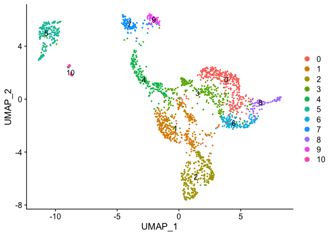
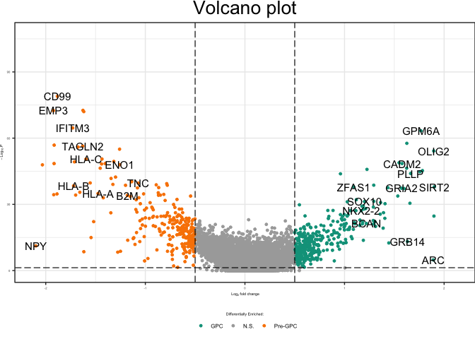

scRNA-Seq Analysis of CD140+ or P-/A+ Fetal Brain
================
John Mariani
03/06/23

``` r
source(file = "Scripts/Helper_Functions.R")
library(ggplot2)
```

    ## Warning: package 'ggplot2' was built under R version 3.6.2

``` r
library(Seurat)
library(xlsx)
```

    ## Warning: package 'xlsx' was built under R version 3.6.2

``` r
library(patchwork)
library(ggrepel)
library(scales)
```

    ## Warning: package 'scales' was built under R version 3.6.2

``` r
library(data.table)
library(stringr)
library(EnhancedVolcano)
library(AUCell)
```

## Load Prior Data

``` r
TPM <- read.delim("output/TPM.txt", header = T)
de_Cd140_vs_A2B5 <- read.delim("output/de_Cd140_vs_A2B5.txt")
ensemblGeneListH <- read.csv("data_for_import/ensemblGeneList.csv")
```

### scRNA-seq analyis

``` r
#### Plotting Functions

DimPlotCustom <- function(seurat, group.by = "orig.ident", pt.size = 2, plotLegend = T){
  embeddings <- as.data.frame(seurat@reductions$umap@cell.embeddings)
  pTemp <- ggplot(data=embeddings, aes(x=UMAP_1, y = UMAP_2)) + geom_point(aes(size = 0.5))
  yRange <- ggplot_build(pTemp)$layout$panel_scales_y[[1]]$range$range
  xRange <- ggplot_build(pTemp)$layout$panel_scales_x[[1]]$range$range
  embeddings$group <- seurat@meta.data[,group.by]
  p <- ggplot(data=embeddings, aes(x=UMAP_1, y=UMAP_2)) + geom_point(aes(fill= group), size = pt.size, colour = "black", stroke = .1, shape = 21) + theme_classic() +
    xlim(xRange) + ylim(yRange) + ylab("UMAP 2") + xlab("UMAP 1") + theme(plot.tag = element_text(size = 12), legend.position = "bottom", legend.direction = "horizontal", text = element_text(size = labelFont), legend.text = element_text(size = 6), plot.margin = unit(c(0,0,0,0), "cm"), plot.title = element_text(hjust = 0.5, size = titleFont))
  if(plotLegend == F){
    p <- p + theme(legend.position = "none")
  }
  return(p)
}

FeaturePlotCustom <- function(seurat, genes, plot = T, tag = element_blank(), plotLegend = T, cellNum = T, pt.size = .25, labelFont = 6, titleFont = 8, sharedScale = "All", nrow = NULL, ncol = NULL, split.by = NULL, sideBySide = T, color0 = "grey60", colPalette = c("dodgerblue2", "gold", "red2"), assay = "RNA"){
  embeddings <- as.data.frame(seurat@reductions$umap@cell.embeddings)
  if(assay == "RNA"){
    expr <- seurat@assays$RNA@data[genes,, drop = F]
  } else if(assay == "SCENIC"){
    expr <- seurat@assays$SCENIC@data[genes,, drop = F]
  }
  scatter_col = c("grey60",colorRampPalette(c("dodgerblue2", "gold", "red2"))(max(expr)*100))
  if(is.null(split.by)){
    p <- lapply(genes, function(x) {ggplot2::ggplot(data=embeddings[match(names(sort(expr[x,], decreasing = F)), row.names(embeddings)),], aes(x=UMAP_1, y=UMAP_2)) + ggplot2::geom_point(aes(color= sort(expr[x,], decreasing = F)), size = pt.size) +
        ggplot2::labs(col="Expression", title = x) + ggplot2::theme_classic() +
        ggplot2::ylab(element_blank()) + ggplot2::xlab(element_blank()) + ggplot2::theme(plot.tag = element_text(size = 12), text = element_text(size = labelFont), legend.text = element_text(size = 6), plot.margin = unit(c(0,0,0,0), "cm"), plot.title = element_text(hjust = 0.5, size = titleFont)) +
        if(sharedScale %in% c("All", "Gene")){
          ggplot2::scale_colour_gradientn(colors = c(color0, colorRampPalette(colPalette)(100)), limits = c(0, max(expr)))
        } else if(sharedScale == "None"){
          ggplot2::scale_colour_gradientn(colors = c(color0, colorRampPalette(colPalette)(100)), limits = c(0, max(expr[x,])))
        }})
  } else {
    xLimits <- c(min(embeddings$UMAP_1), max(embeddings$UMAP_1))
    yLimits <- c(min(embeddings$UMAP_2), max(embeddings$UMAP_2))
    splitDF <- seurat@meta.data[drop = F,,split.by]
    splits <- unique(splitDF[,1])
    q <- lapply(splits, function(y) {
      lapply(genes, function(x) {
        ggplot2::ggplot(data=embeddings[match(names(sort(expr[x,colnames(expr) %in% row.names(splitDF[splitDF[,split.by] %in% y,, drop = F])], decreasing = F)), row.names(embeddings)),], aes(x=UMAP_1, y=UMAP_2)) + ggplot2::geom_point(aes(color= sort(expr[x,colnames(expr) %in% row.names(splitDF[splitDF[,split.by] %in% y,, drop = F])], decreasing = F)), size = pt.size) +
          ggplot2::labs(col="Expression", title = paste0(x, " - ", y)) + ggplot2::theme_classic() +
          ggplot2::ylab(element_blank()) + ggplot2::xlab(element_blank()) + ggplot2::theme(plot.tag = element_text(size = 12), text = element_text(size = labelFont), legend.text = element_text(size = 6), plot.margin = unit(c(0,0,0,0), "cm"), plot.title = element_text(hjust = 0.5, size = titleFont)) +
          ggplot2::xlim(xLimits) + ggplot2::ylim(yLimits) +
          if(sharedScale == "All"){
            ggplot2::scale_colour_gradientn(colors = c(color0, colorRampPalette(colPalette)(100)), limits = c(0, max(expr)))
          } else if(sharedScale == "Gene"){
            ggplot2::scale_colour_gradientn(colors = c(color0, colorRampPalette(colPalette)(100)), limits = c(0, max(expr[x,])))
          } else if(sharedScale == "None"){
            ggplot2::scale_colour_gradientn(colors = c(color0, colorRampPalette(colPalette)(100)))
          }
      })})
    if(sideBySide == T & !is.null(split.by)){
      p <- list()
      loopCounter <- 1
      for(i in 1:length(genes)){
        for(j in 1:length(splits)) {
          p[[loopCounter]] <-q[[j]][i]
          loopCounter <- loopCounter + 1
        }
      }
    }
    p <- unlist(p, recursive = F)
  }
  if(plot == T){
    if(is.null(ncol) & is.null(nrow) & !is.null(split.by)){
      ncol = length(splits)
    }
    if(plotLegend == F){
      patchwork::wrap_plots(p, nrow = nrow, ncol = ncol) & theme(legend.position = "none")
    } else {
      patchwork::wrap_plots(p, nrow = nrow, ncol = ncol)
    }
  } else {
    return(p)
  }
}
```

## Process scRNA-seq data

``` r
options(future.globals.maxSize = 16000 * 1024^2)
# read in the data
sampleList <- list.files(path = "Matrices/Fetal")
Raw <- sapply(sampleList, function(x) Read10X(paste0("Matrices/Fetal/",x,"/filtered_feature_bc_matrix")))

#Look at dims
for(i in 1:length(Raw)){
  print(dim(Raw[[i]]))
}
```

    ## [1] 58735  1576
    ## [1] 58735  1176

``` r
#Rename cells to make them easier to identify and avoid errors downstream
for(i in 1:length(Raw)){
  colnames(Raw[[i]]) <- paste0(colnames(Raw[[i]]),"_",sampleList[i])
}

#Create list of Seurat Objects
Objects <- sapply(c(1:length(Raw)), function(x) CreateSeuratObject(Raw[[x]], project = sampleList[x]))
rm(Raw)
# calculate percent mt features detected
for (i in 1:length(Objects)) {
  Objects[[i]] <- PercentageFeatureSet(Objects[[i]], pattern = "^MT-", col.name = "percent.mt")
}

unfilteredViolins <- wrap_plots(VlnPlot(Objects[[1]], c("nFeature_RNA", "nCount_RNA", "percent.mt"), cols = "#18BA0F"), 
           VlnPlot(Objects[[2]], c("nFeature_RNA", "nCount_RNA", "percent.mt"), cols = "#2E30FF"), ncol = 2)

# Remove low quality cells
for (i in 1:length(Objects)) {
  Objects[[i]] <- subset(x = Objects[[i]], subset = nFeature_RNA > 500 & percent.mt < 15)
}

filteredViolins <- wrap_plots(VlnPlot(Objects[[1]], c("nFeature_RNA", "nCount_RNA", "percent.mt"), cols = "#18BA0F"),VlnPlot(Objects[[2]], c("nFeature_RNA", "nCount_RNA", "percent.mt"), cols = "#2E30FF"), ncol = 2)


unfilteredViolins / filteredViolins
```

<!-- -->

``` r
merged <- merge(Objects[[1]], y = Objects[2:length(Objects)])
merged <- NormalizeData(merged, normalization.method = "LogNormalize", scale.factor = 10000)

s.genes = cc.genes$s.genes
s.genes[s.genes == "MLF1IP"] <- "CENPU"
g2m.genes = cc.genes$g2m.genes
g2m.genes[g2m.genes == "FAM64A"] <- "PIMREG"
g2m.genes[g2m.genes == "HN1"] <- "JPT1"

merged <- CellCycleScoring(merged, s.features = s.genes, g2m.features = g2m.genes, set.ident = F)
merged$CC.difference <- merged$S.Score - merged$G2M.Score

merged = SCTransform(merged, vars.to.regress = c("nCount_RNA", "percent.mt", "CC.difference"), verbose = F)


DefaultAssay(merged) <- "SCT"
merged <- RunPCA(merged, verbose = FALSE) 
merged <- RunUMAP(merged, dims = 1:30, verbose = FALSE, n.neighbors = 60L, repulsion.strength = .8)
merged <- FindNeighbors(merged, dims = 1:30, verbose = FALSE)
merged <- FindClusters(merged, verbose = FALSE, resolution = .35) 


p1 <- DimPlot(merged, label = T, pt.size = .5) 
p1
```

<!-- -->

``` r
merged <- RenameIdents(merged, "2" = "GPC")
merged <- RenameIdents(merged, "1" = "Pre-GPC")
merged <- RenameIdents(merged, "5" = "Microglia")
merged <- RenameIdents(merged, "10" = "Endothelial/Pericyte")
merged <- RenameIdents(merged, "7" = "Neuron")
merged <- RenameIdents(merged, "9" = "Neuron")
merged <- RenameIdents(merged, "4" = "Immature Neuron")
merged <- RenameIdents(merged, "0" = "NPC")
merged <- RenameIdents(merged, "8" = "NPC")
merged <- RenameIdents(merged, "6" = "NPC")
merged <- RenameIdents(merged, "3" = "NSC")

merged$CellType <- Idents(merged)

scCellTypeOrder <- c("GPC", "Pre-GPC", "NPC", "NSC", "Immature Neuron", "Neuron", "Microglia", "Endothelial/Pericyte")
merged$CellType <- factor(merged$CellType, levels = scCellTypeOrder)


p2 <- DimPlot(merged, label = T, pt.size = .5, group.by = "CellType") 
p2
```

<!-- -->

``` r
p1 | p2
```

<!-- -->

``` r
palette <- c("#00A08A","#F98400","saddlebrown","#EBCC2A","#F21A00","forestgreen","slateblue1","#000000","indianred1","#9C964A","magenta","darkblue")
scCellTypeOrder <- c("GPC", "Pre-GPC", "NPC", "NSC", "Immature Neuron", "Neuron", "Microglia", "Endothelial/Pericyte")
merged$CellType <- factor(merged$CellType, levels = scCellTypeOrder)
```

### Supplemental A2B5 vs CD140 figure

``` r
labelFont <- 15
titleFont <- 20


supplementalDimPlot <- DimPlotCustom(merged) + guides(fill = guide_legend(title = "Sort")) + scale_fill_manual(labels = c("P-/A+", "CD140a+"), values = c("#18BA0F", "#2E30FF")) + labs(tag = "A")
supplementalDimPlot
```

<!-- -->

``` r
### Stacked Plot
featureMerged <- merged@meta.data

cd140Percentages <- as.data.frame(table(featureMerged[featureMerged$orig.ident == "CD140_fetal",]$CellType)/nrow(featureMerged[featureMerged$orig.ident == "CD140_fetal",])*100)
a2b5Percentages <- as.data.frame(table(featureMerged[featureMerged$orig.ident == "A2B5_fetal",]$CellType)/nrow(featureMerged[featureMerged$orig.ident == "A2B5_fetal",])*100)
cd140Percentages$sort <- "CD140a"
a2b5Percentages$sort <- "A2B5"
Percentages <- rbind(cd140Percentages, a2b5Percentages)


stackedPlot <- ggplot(Percentages, aes(fill = Var1, y = Freq, x = sort))+
  geom_bar(position = "stack", stat = "identity")+
  guides(fill = guide_legend(override.aes = list(size = .6))) +
  scale_fill_manual(values = palette )+
  labs(y = "Percent", x = "Sort", fill = "Cell Type") + theme_classic() + scale_y_continuous(expand = c(0,0)) + ylab("Percent Identity") + theme(plot.tag = element_text(size = 12), legend.key.size = unit(.6, "lines"), text = element_text(size = labelFont), legend.position = "bottom") + xlab(element_blank()) + scale_x_discrete(labels= c("P-/A+", "CD140+")) + labs(tag = "B")

stackedPlot
```

<!-- -->

``` r
#### Scatter Plot

TPMscatter <- TPM
TPMscatter <- TPMscatter[,c(1,5:10)]
TPMscatter$A2B5bulk <- rowMeans(TPMscatter[,5:7])
TPMscatter$CD140bulk <- rowMeans(TPMscatter[,2:4])
TPMscatter <- merge(TPMscatter, ensemblGeneListH, by.x = 1, by.y = "ensembl_gene_id")
TPMscatter$log2fcBulk <- log2((TPMscatter$CD140bulk+.1)/(TPMscatter$A2B5bulk+.1))


Idents(merged) <- merged$orig.ident
scatterAverages <- AverageExpression(merged, features = de_Cd140_vs_A2B5$external_gene_name, assay = "RNA")
```

    ## Finished averaging RNA for cluster A2B5_fetal

    ## Finished averaging RNA for cluster CD140_fetal

``` r
Idents(merged) <- merged$CellType
scatterAverages <- scatterAverages[[1]]

scatterAverages <- scatterAverages[rowSums(scatterAverages) != 0,]
scatterAverages <- scatterAverages* 100
scatterAverages <- scatterAverages[scatterAverages$A2B5_fetal > 1 | scatterAverages$CD140_fetal > 1,]
scatterAverages$log2fc <- log2((scatterAverages$CD140_fetal+.1)/(scatterAverages$A2B5_fetal+.1))
scatterAverages$gene <- row.names(scatterAverages)
scatterAverages <- scatterAverages[scatterAverages$gene %in% de_Cd140_vs_A2B5$external_gene_name,]

scatterAveragesMerged <- merge(scatterAverages, de_Cd140_vs_A2B5, by.x = "gene", by.y = "external_gene_name")


cor(scatterAveragesMerged$log2fc, scatterAveragesMerged$log2FoldChange)
```

    ## [1] 0.7390376

``` r
scatterGenes <- c("SOX10", "CA10", "PDGFRA", "NEUROD1", "OLIG1", "OLIG2", "NKX2-2", "IL1B", "NEUROD2", "TBR1", "EOMES", "GABRA4", "CD68")
scatterAveragesMerged$label <- ifelse(scatterAveragesMerged$gene %in% scatterGenes, scatterAveragesMerged$gene, "")

geneLabelSize = 4
scatter <- ggplot(scatterAveragesMerged, aes(y=log2FoldChange, x=log2fc, label = label)) + geom_point(alpha = 1, size = .25, color = "darkgrey") + geom_smooth(method = "lm", fill = "lightgrey") + theme_classic() + theme(plot.tag = element_text(size = 12), text = element_text(size = labelFont), legend.text = element_text(size = 6), plot.margin = unit(c(0,0,0,0), "cm"), plot.title = element_text(hjust = 0.5, size = titleFont)) + labs(tag = "C") + geom_text_repel(size = geneLabelSize ,box.padding = .5) + geom_hline(yintercept = 0, color = "black") +geom_vline(xintercept = 0, color = "black") + 
  ylab("Bulk RNA-Seq Log2 FC") + xlab("scRNA-Seq Log2 FC")
scatter
```

    ## `geom_smooth()` using formula 'y ~ x'

<!-- -->

``` r
(supplementalDimPlot | stackedPlot | scatter) + plot_layout(width = c(3,1,2))
```

    ## `geom_smooth()` using formula 'y ~ x'

<!-- -->

``` r
#ggsave("Panels/SupplementalSC2.pdf", width = 10, height = 6, device = "pdf", useDingbats = F)
```

### Main Figure Plots

``` r
xRange <- c(min(as.data.frame(merged@reductions$umap@cell.embeddings)$UMAP_1), max(as.data.frame(merged@reductions$umap@cell.embeddings)$UMAP_1))
yRange <- c(min(as.data.frame(merged@reductions$umap@cell.embeddings)$UMAP_2), max(as.data.frame(merged@reductions$umap@cell.embeddings)$UMAP_2))


dimPlotA2B5 <- DimPlotCustom(subset(merged, subset = orig.ident == "A2B5_fetal"), pt.size = 1.5,group.by = "CellType", plotLegend = T) + 
  xlim(xRange) + ylim(yRange) + theme(legend.position = "none", axis.text = element_blank(), axis.title = element_blank())  + scale_fill_manual(values = palette) + labs(tag = "B")

dimPlotA2B5
```

<!-- -->

``` r
dimPlotCD140 <- DimPlotCustom(subset(merged, subset = orig.ident == "CD140_fetal"), pt.size = 1.5,group.by = "CellType", plotLegend = T) + 
  xlim(xRange) + ylim(yRange) + theme(legend.position = "none", axis.text = element_blank(), axis.title = element_blank()) + scale_fill_manual(values = palette) + labs(tag = "C")

dimPlotCD140
```

<!-- -->

``` r
combinedDimPlot <- DimPlotCustom(merged, pt.size = 1.5,group.by = "CellType", plotLegend = T) + 
  xlim(xRange) + ylim(yRange) + theme(legend.position = "none", axis.text = element_blank(), axis.title = element_blank()) + scale_fill_manual(values = palette) + labs(tag = "A")


##### Small violins"
vGenes <- c("PDGFRA", "SOX10", "EGFR", "GFAP", "SOX2", "DLX1", "NEFM", "NEUROD2", "CD68", "PDGFRB")
vList <- VlnPlot(merged, vGenes, combine = F, pt.size = 0, cols = palette)

for(i in 1:length(vGenes)){
  vList[[i]] <- vList[[i]]  + ggtitle(element_blank()) + labs() +  ylab(vGenes[i]) + xlab(element_blank()) + theme(axis.title.y.left = element_blank(), axis.text.y.right = element_blank(),                                                                                                                axis.ticks.y.right = element_blank(),axis.title.y.right = element_text(angle = 0, vjust = 0.5), plot.margin = unit(c(-.25,0,-.25,0), "lines"), axis.ticks.x = element_blank(), text = element_text(size = labelFont), axis.text = element_text(size = labelFont), axis.title.y = element_text(size = labelFont)) +NoLegend()  + scale_y_continuous(breaks=pretty_breaks(n=2),expand = c(0,0), position = 'right', sec.axis = dup_axis())
  if(i != length(vGenes)){  
    vList[[i]] <- vList[[i]] + theme(axis.text.x = element_blank())
  }
}

violins <- wrap_plots(vList, ncol  = 1)

violins <- violins & theme(axis.text.x = element_blank(), axis.title.y.right  = element_text(size = 6, angle = 270), axis.text.y.left = element_text(size = 6))

violins
```

<!-- -->

``` r
combinedDimPlot | (dimPlotA2B5 / dimPlotCD140) | violins
```

<!-- -->

## Cell Type Markers

``` r
### Find Cluster Markers
Idents(merged) <- merged$CellType
MarkersMAST <- FindAllMarkers(merged, test.use = "MAST", only.pos = T, return.thresh = 0.05)
```

    ## Calculating cluster GPC

    ## Assuming data assay in position 1, with name et is log-transformed.

    ## 
    ## Done!

    ## Combining coefficients and standard errors

    ## Warning in melt(coefAndCI, as.is = TRUE): The melt generic in data.table has
    ## been passed a array and will attempt to redirect to the relevant reshape2
    ## method; please note that reshape2 is deprecated, and this redirection is now
    ## deprecated as well. To continue using melt methods from reshape2 while both
    ## libraries are attached, e.g. melt.list, you can prepend the namespace like
    ## reshape2::melt(coefAndCI). In the next version, this warning will become an
    ## error.

    ## Calculating log-fold changes

    ## Warning in melt(lfc): The melt generic in data.table has been passed a list
    ## and will attempt to redirect to the relevant reshape2 method; please note that
    ## reshape2 is deprecated, and this redirection is now deprecated as well. To
    ## continue using melt methods from reshape2 while both libraries are attached,
    ## e.g. melt.list, you can prepend the namespace like reshape2::melt(lfc). In the
    ## next version, this warning will become an error.

    ## Calculating likelihood ratio tests

    ## Refitting on reduced model...

    ## 
    ## Done!

    ## Warning in melt(llrt): The melt generic in data.table has been passed a list
    ## and will attempt to redirect to the relevant reshape2 method; please note that
    ## reshape2 is deprecated, and this redirection is now deprecated as well. To
    ## continue using melt methods from reshape2 while both libraries are attached,
    ## e.g. melt.list, you can prepend the namespace like reshape2::melt(llrt). In the
    ## next version, this warning will become an error.

    ## Calculating cluster Pre-GPC

    ## Assuming data assay in position 1, with name et is log-transformed.

    ## 
    ## Done!

    ## Combining coefficients and standard errors

    ## Warning in melt(coefAndCI, as.is = TRUE): The melt generic in data.table has
    ## been passed a array and will attempt to redirect to the relevant reshape2
    ## method; please note that reshape2 is deprecated, and this redirection is now
    ## deprecated as well. To continue using melt methods from reshape2 while both
    ## libraries are attached, e.g. melt.list, you can prepend the namespace like
    ## reshape2::melt(coefAndCI). In the next version, this warning will become an
    ## error.

    ## Calculating log-fold changes

    ## Warning in melt(lfc): The melt generic in data.table has been passed a list
    ## and will attempt to redirect to the relevant reshape2 method; please note that
    ## reshape2 is deprecated, and this redirection is now deprecated as well. To
    ## continue using melt methods from reshape2 while both libraries are attached,
    ## e.g. melt.list, you can prepend the namespace like reshape2::melt(lfc). In the
    ## next version, this warning will become an error.

    ## Calculating likelihood ratio tests

    ## Refitting on reduced model...

    ## 
    ## Done!

    ## Warning in melt(llrt): The melt generic in data.table has been passed a list
    ## and will attempt to redirect to the relevant reshape2 method; please note that
    ## reshape2 is deprecated, and this redirection is now deprecated as well. To
    ## continue using melt methods from reshape2 while both libraries are attached,
    ## e.g. melt.list, you can prepend the namespace like reshape2::melt(llrt). In the
    ## next version, this warning will become an error.

    ## Calculating cluster NPC

    ## Assuming data assay in position 1, with name et is log-transformed.

    ## 
    ## Done!

    ## Combining coefficients and standard errors

    ## Warning in melt(coefAndCI, as.is = TRUE): The melt generic in data.table has
    ## been passed a array and will attempt to redirect to the relevant reshape2
    ## method; please note that reshape2 is deprecated, and this redirection is now
    ## deprecated as well. To continue using melt methods from reshape2 while both
    ## libraries are attached, e.g. melt.list, you can prepend the namespace like
    ## reshape2::melt(coefAndCI). In the next version, this warning will become an
    ## error.

    ## Calculating log-fold changes

    ## Warning in melt(lfc): The melt generic in data.table has been passed a list
    ## and will attempt to redirect to the relevant reshape2 method; please note that
    ## reshape2 is deprecated, and this redirection is now deprecated as well. To
    ## continue using melt methods from reshape2 while both libraries are attached,
    ## e.g. melt.list, you can prepend the namespace like reshape2::melt(lfc). In the
    ## next version, this warning will become an error.

    ## Calculating likelihood ratio tests

    ## Refitting on reduced model...

    ## 
    ## Done!

    ## Warning in melt(llrt): The melt generic in data.table has been passed a list
    ## and will attempt to redirect to the relevant reshape2 method; please note that
    ## reshape2 is deprecated, and this redirection is now deprecated as well. To
    ## continue using melt methods from reshape2 while both libraries are attached,
    ## e.g. melt.list, you can prepend the namespace like reshape2::melt(llrt). In the
    ## next version, this warning will become an error.

    ## Calculating cluster NSC

    ## Assuming data assay in position 1, with name et is log-transformed.

    ## 
    ## Done!

    ## Combining coefficients and standard errors

    ## Warning in melt(coefAndCI, as.is = TRUE): The melt generic in data.table has
    ## been passed a array and will attempt to redirect to the relevant reshape2
    ## method; please note that reshape2 is deprecated, and this redirection is now
    ## deprecated as well. To continue using melt methods from reshape2 while both
    ## libraries are attached, e.g. melt.list, you can prepend the namespace like
    ## reshape2::melt(coefAndCI). In the next version, this warning will become an
    ## error.

    ## Calculating log-fold changes

    ## Warning in melt(lfc): The melt generic in data.table has been passed a list
    ## and will attempt to redirect to the relevant reshape2 method; please note that
    ## reshape2 is deprecated, and this redirection is now deprecated as well. To
    ## continue using melt methods from reshape2 while both libraries are attached,
    ## e.g. melt.list, you can prepend the namespace like reshape2::melt(lfc). In the
    ## next version, this warning will become an error.

    ## Calculating likelihood ratio tests

    ## Refitting on reduced model...

    ## 
    ## Done!

    ## Warning in melt(llrt): The melt generic in data.table has been passed a list
    ## and will attempt to redirect to the relevant reshape2 method; please note that
    ## reshape2 is deprecated, and this redirection is now deprecated as well. To
    ## continue using melt methods from reshape2 while both libraries are attached,
    ## e.g. melt.list, you can prepend the namespace like reshape2::melt(llrt). In the
    ## next version, this warning will become an error.

    ## Calculating cluster Immature Neuron

    ## Assuming data assay in position 1, with name et is log-transformed.

    ## 
    ## Done!

    ## Combining coefficients and standard errors

    ## Warning in melt(coefAndCI, as.is = TRUE): The melt generic in data.table has
    ## been passed a array and will attempt to redirect to the relevant reshape2
    ## method; please note that reshape2 is deprecated, and this redirection is now
    ## deprecated as well. To continue using melt methods from reshape2 while both
    ## libraries are attached, e.g. melt.list, you can prepend the namespace like
    ## reshape2::melt(coefAndCI). In the next version, this warning will become an
    ## error.

    ## Calculating log-fold changes

    ## Warning in melt(lfc): The melt generic in data.table has been passed a list
    ## and will attempt to redirect to the relevant reshape2 method; please note that
    ## reshape2 is deprecated, and this redirection is now deprecated as well. To
    ## continue using melt methods from reshape2 while both libraries are attached,
    ## e.g. melt.list, you can prepend the namespace like reshape2::melt(lfc). In the
    ## next version, this warning will become an error.

    ## Calculating likelihood ratio tests

    ## Refitting on reduced model...

    ## 
    ## Done!

    ## Warning in melt(llrt): The melt generic in data.table has been passed a list
    ## and will attempt to redirect to the relevant reshape2 method; please note that
    ## reshape2 is deprecated, and this redirection is now deprecated as well. To
    ## continue using melt methods from reshape2 while both libraries are attached,
    ## e.g. melt.list, you can prepend the namespace like reshape2::melt(llrt). In the
    ## next version, this warning will become an error.

    ## Calculating cluster Neuron

    ## Assuming data assay in position 1, with name et is log-transformed.

    ## 
    ## Done!

    ## Combining coefficients and standard errors

    ## Warning in melt(coefAndCI, as.is = TRUE): The melt generic in data.table has
    ## been passed a array and will attempt to redirect to the relevant reshape2
    ## method; please note that reshape2 is deprecated, and this redirection is now
    ## deprecated as well. To continue using melt methods from reshape2 while both
    ## libraries are attached, e.g. melt.list, you can prepend the namespace like
    ## reshape2::melt(coefAndCI). In the next version, this warning will become an
    ## error.

    ## Calculating log-fold changes

    ## Warning in melt(lfc): The melt generic in data.table has been passed a list
    ## and will attempt to redirect to the relevant reshape2 method; please note that
    ## reshape2 is deprecated, and this redirection is now deprecated as well. To
    ## continue using melt methods from reshape2 while both libraries are attached,
    ## e.g. melt.list, you can prepend the namespace like reshape2::melt(lfc). In the
    ## next version, this warning will become an error.

    ## Calculating likelihood ratio tests

    ## Refitting on reduced model...

    ## 
    ## Done!

    ## Warning in melt(llrt): The melt generic in data.table has been passed a list
    ## and will attempt to redirect to the relevant reshape2 method; please note that
    ## reshape2 is deprecated, and this redirection is now deprecated as well. To
    ## continue using melt methods from reshape2 while both libraries are attached,
    ## e.g. melt.list, you can prepend the namespace like reshape2::melt(llrt). In the
    ## next version, this warning will become an error.

    ## Calculating cluster Microglia

    ## Assuming data assay in position 1, with name et is log-transformed.

    ## 
    ## Done!

    ## Combining coefficients and standard errors

    ## Warning in melt(coefAndCI, as.is = TRUE): The melt generic in data.table has
    ## been passed a array and will attempt to redirect to the relevant reshape2
    ## method; please note that reshape2 is deprecated, and this redirection is now
    ## deprecated as well. To continue using melt methods from reshape2 while both
    ## libraries are attached, e.g. melt.list, you can prepend the namespace like
    ## reshape2::melt(coefAndCI). In the next version, this warning will become an
    ## error.

    ## Calculating log-fold changes

    ## Warning in melt(lfc): The melt generic in data.table has been passed a list
    ## and will attempt to redirect to the relevant reshape2 method; please note that
    ## reshape2 is deprecated, and this redirection is now deprecated as well. To
    ## continue using melt methods from reshape2 while both libraries are attached,
    ## e.g. melt.list, you can prepend the namespace like reshape2::melt(lfc). In the
    ## next version, this warning will become an error.

    ## Calculating likelihood ratio tests

    ## Refitting on reduced model...

    ## 
    ## Done!

    ## Warning in melt(llrt): The melt generic in data.table has been passed a list
    ## and will attempt to redirect to the relevant reshape2 method; please note that
    ## reshape2 is deprecated, and this redirection is now deprecated as well. To
    ## continue using melt methods from reshape2 while both libraries are attached,
    ## e.g. melt.list, you can prepend the namespace like reshape2::melt(llrt). In the
    ## next version, this warning will become an error.

    ## Calculating cluster Endothelial/Pericyte

    ## Assuming data assay in position 1, with name et is log-transformed.

    ## 
    ## Done!

    ## Combining coefficients and standard errors

    ## Warning in melt(coefAndCI, as.is = TRUE): The melt generic in data.table has
    ## been passed a array and will attempt to redirect to the relevant reshape2
    ## method; please note that reshape2 is deprecated, and this redirection is now
    ## deprecated as well. To continue using melt methods from reshape2 while both
    ## libraries are attached, e.g. melt.list, you can prepend the namespace like
    ## reshape2::melt(coefAndCI). In the next version, this warning will become an
    ## error.

    ## Calculating log-fold changes

    ## Warning in melt(lfc): The melt generic in data.table has been passed a list
    ## and will attempt to redirect to the relevant reshape2 method; please note that
    ## reshape2 is deprecated, and this redirection is now deprecated as well. To
    ## continue using melt methods from reshape2 while both libraries are attached,
    ## e.g. melt.list, you can prepend the namespace like reshape2::melt(lfc). In the
    ## next version, this warning will become an error.

    ## Calculating likelihood ratio tests

    ## Refitting on reduced model...

    ## 
    ## Done!

    ## Warning in melt(llrt): The melt generic in data.table has been passed a list
    ## and will attempt to redirect to the relevant reshape2 method; please note that
    ## reshape2 is deprecated, and this redirection is now deprecated as well. To
    ## continue using melt methods from reshape2 while both libraries are attached,
    ## e.g. melt.list, you can prepend the namespace like reshape2::melt(llrt). In the
    ## next version, this warning will become an error.

``` r
MarkersMAST <- MarkersMAST[MarkersMAST$p_val_adj < 0.05,]
MarkersMAST <- MarkersMAST[order(MarkersMAST$cluster, MarkersMAST$p_val_adj, decreasing = F),]
MarkersMAST <- MarkersMAST[,c(2:7)]
names(MarkersMAST) <- c("Log2FC", "Percent 1", "Percent 2", "Adj_P_Val", "CellType", "External_Gene_Name")

write.xlsx(MarkersMAST, file = "Extended Data Tables/Extended Data Table 2 - Fetal scRNA-seq.xlsx", sheetName = "Significant CellType Markers", row.names = F, append = T)
```

## DE of GPC vs pre-GPCs

``` r
GPC.vs.preGPC.all <- FindMarkers(merged, test.use = "MAST", ident.1 = "GPC", ident.2 = "Pre-GPC", logfc.threshold = 0)
```

    ## Assuming data assay in position 1, with name et is log-transformed.

    ## 
    ## Done!

    ## Combining coefficients and standard errors

    ## Warning in melt(coefAndCI, as.is = TRUE): The melt generic in data.table has
    ## been passed a array and will attempt to redirect to the relevant reshape2
    ## method; please note that reshape2 is deprecated, and this redirection is now
    ## deprecated as well. To continue using melt methods from reshape2 while both
    ## libraries are attached, e.g. melt.list, you can prepend the namespace like
    ## reshape2::melt(coefAndCI). In the next version, this warning will become an
    ## error.

    ## Calculating log-fold changes

    ## Warning in melt(lfc): The melt generic in data.table has been passed a list
    ## and will attempt to redirect to the relevant reshape2 method; please note that
    ## reshape2 is deprecated, and this redirection is now deprecated as well. To
    ## continue using melt methods from reshape2 while both libraries are attached,
    ## e.g. melt.list, you can prepend the namespace like reshape2::melt(lfc). In the
    ## next version, this warning will become an error.

    ## Calculating likelihood ratio tests

    ## Refitting on reduced model...

    ## 
    ## Done!

    ## Warning in melt(llrt): The melt generic in data.table has been passed a list
    ## and will attempt to redirect to the relevant reshape2 method; please note that
    ## reshape2 is deprecated, and this redirection is now deprecated as well. To
    ## continue using melt methods from reshape2 while both libraries are attached,
    ## e.g. melt.list, you can prepend the namespace like reshape2::melt(llrt). In the
    ## next version, this warning will become an error.

``` r
GPC.vs.preGPC.all$gene <- row.names(GPC.vs.preGPC.all)


GPC.vs.preGPC <- GPC.vs.preGPC.all[GPC.vs.preGPC.all$p_val_adj < 0.01 & abs(GPC.vs.preGPC.all$avg_logFC) > 0.5,]
GPC.vs.preGPC <- GPC.vs.preGPC[,c(2:6)]
names(GPC.vs.preGPC) <- c("Log2FC_GPC_vs_Pre-GPC", "Percent 1", "Percent 2", "Adj_P_Val", "External_Gene_Name")
write.xlsx(GPC.vs.preGPC, file = "Extended Data Tables/Extended Data Table 2 - Fetal scRNA-seq.xlsx", sheetName = "DE between GPCs and Pre-GPCs", row.names = F, append = T)
```

## IPA Graph

``` r
files <- "data_for_import/GPC.vc.preGPC.IPA.txt"
compNames <- c("GPC.vc.preGPC")

for(i in 1:length(files)){
  canonicalIPA <- fread(files[i], skip = "Canonical",drop = c(4,6))
  names(canonicalIPA) <- c("Pathway", "pVal", "zScore", "Genes")
  canonicalIPA$type <- "Canonical"
  upstreamIPA <- fread(files[i], skip = "Upstream Regulators", drop = c(1:2,4:6,8:10,13:14))
  upstreamIPA <- upstreamIPA[,c(1,3,2,4)]
  names(upstreamIPA) <- c("Pathway", "pVal", "zScore", "Genes")
  upstreamIPA$Pathway <- paste0(upstreamIPA$Pathway, " Signaling")
  upstreamIPA$pVal <- -log10(upstreamIPA$pVal)
  upstreamIPA$type <- "Upstream"
  functionalIPA <- fread(files[i], skip = "Diseases and Bio", drop = c(1,2,5,7,8,10,11))
  names(functionalIPA) <- c("Pathway", "pVal", "zScore", "Genes")
  functionalIPA$pVal <- -log10(functionalIPA$pVal)
  functionalIPA$type <- "Functional"
  if(i == 1){
    IPA <- rbind(canonicalIPA, upstreamIPA, functionalIPA)
    IPA$comparison <- compNames[i]
  } else {
    tempIPA <- rbind(canonicalIPA, upstreamIPA, functionalIPA)
    tempIPA$comparison <- compNames[i]
    IPA <- rbind(IPA, tempIPA)
  }
}
```

    ## Warning in fread(files[i], skip = "Canonical", drop = c(4, 6)): Detected 5
    ## column names but the data has 6 columns (i.e. invalid file). Added 1 extra
    ## default column name for the first column which is guessed to be row names or an
    ## index. Use setnames() afterwards if this guess is not correct, or fix the file
    ## write command that created the file to create a valid file.

    ## Warning in fread(files[i], skip = "Canonical", drop = c(4, 6)): Stopped early on
    ## line 411. Expected 6 fields but found 0. Consider fill=TRUE and comment.char=.
    ## First discarded non-empty line: <<Upstream Regulators for My Projects->Fetal
    ## Adult Manuscript->GPC.vs.preGPC.logfc.5 - 2021-08-25 06:36 PM>>

    ## Warning in fread(files[i], skip = "Upstream Regulators", drop = c(1:2, 4:6, :
    ## Stopped early on line 3800. Expected 14 fields but found 0. Consider fill=TRUE
    ## and comment.char=. First discarded non-empty line: <<Causal Networks for My
    ## Projects->Fetal Adult Manuscript->GPC.vs.preGPC.logfc.5 - 2021-08-25 06:36 PM>>

    ## Warning in fread(files[i], skip = "Diseases and Bio", drop = c(1, 2, 5, :
    ## Stopped early on line 5441. Expected 11 fields but found 0. Consider fill=TRUE
    ## and comment.char=. First discarded non-empty line: <<Tox Functions for My
    ## Projects->Fetal Adult Manuscript->GPC.vs.preGPC.logfc.5 - 2021-08-25 06:36 PM>>

``` r
rm(canonicalIPA)
rm(upstreamIPA)
rm(functionalIPA)

IPA[is.na(IPA$zScore)]$zScore <- 0
ogIPA <- IPA
IPA <- IPA[IPA$pVal > -log10(0.001),]


filterTerms <- c("cancer","glioma", "abdominal", "carcinoma", "endometrium", "eye", "nose", "epidermis", "head", "lymphocyte", "renal", "snout", "tooth", 
                 "connective", "tumor", "fibroblast", "rickets", "mouth", "maxilla", "cartilage", "neoplasm", "oma", "lymph", "liver", "psoriasis", "cardio",
                 "cardiac", "tongue", "disc", "tinea", "herpes", "Picornaviridae", "virus", "killer T", "muscle", "myopathy", "pancreatic", "Onychomycosis",
                 "leukocyte", "oral cavity","osteoclast", "Merkel", "macrophage", "Hydrometrocolpos", "Hand", "Gastric", "Thymocytes", "diabetes",
                 "Dupuytren", "myoblast", "ear$", "implantation", "bone", "limb", "cleft lip", "Calcinosis", "lung", "Benign lesion", 
                 "body axis", "sensory organ", "diabetic", "neutrophil", "infection of mammalia", "leukopoiesis", "neoplasia", "Sensory system development",
                 "T cell", "myeloid", "aorta", "body cavity", "esophagus", "incisor", "kidney", "oesophageal", "respiratory", "skin", "cavity", "urinary",
                 "foot", "digit", "heart", "acute biphenotypic leukemia", "Ankylosis", "Articular rigidity", "Atherosclero", "Blister", "Branching morphogenesis of epithelial tubule",
                 "Cervical spondylotic myelopathy", "epithelial", "exocrine", "gastrointestinal", "Ejection of first polar body", "Familial arrhythmia", "Familial nonsyndromic hearing impairment", 
                 "fibrosis", "mammary", "Hearing", "Morphogenesis of metanephric bud", "cochlea", "nail", "Plasma cell dyscrasia", "Secondary Leukemia", "granulocyte",
                 "Tinnitus", "metastasis", "trunk", "sperm motility", "skull", "dendritic cells", "dehydration", "digestive", "microphthalmia", "myelodysplastic",
                 "semicircular canal", " skeleton", "osteopenia", "osteoarthritis", "Refractory anemia with excess blasts", "rectum", "submandibular", "antiviral", "HIV-1",
                 "antigen present", "gonad", "keratinocyte", "phagocyte", "coronary", "intestinal", "viral replicon", "monocyte", "viral life", "wound", "leukemia", "Airway")
filteredIPA <- IPA[!grepl(paste(filterTerms, collapse = "|"), ignore.case = T, IPA$Pathway),]
deletedIPA <- IPA[grepl(paste(filterTerms, collapse = "|"), ignore.case = T, IPA$Pathway),]

### Make Sup Table 2c

supTable2c <- filteredIPA
supTable2c <- supTable2c[,c(1:5)]
names(supTable2c) <- c("Pathway", "Adj_-log10_P_Val", "Z_Score", "Genes", "Type")
supTable2c <- supTable2c[order(supTable2c$`Adj_-log10_P_Val`, decreasing = T),]
write.xlsx(supTable2c, file = "Extended Data Tables/Extended Data Table 2 - Fetal scRNA-seq.xlsx", sheetName = "Fetal GPC vs Pre-GPC IPA Terms", row.names = F, append = T)

gpc.vs.pre.cats <- c("CCND1 Signaling", "HMGA1 Signaling", "MYCN Signaling", "Development of neuroglia", "Differentiation of oligodendrocytes", "PDGF-AA Signaling", "FGFR2 Signaling", "ANGPT2 Signaling", "Vegf Signaling", "AGT Signaling", "BMP4 Signaling", "Migration of neuroglia", "EGFR Signaling", "PAX6 Signaling", "Proliferation of neuroglia", "MYC Signaling", "Differentiation of oligodendrocyte precursor cells")

gpc.vs.pre.GO <- filteredIPA[filteredIPA$Pathway %in% gpc.vs.pre.cats]
gpc.vs.pre.GO <- gpc.vs.pre.GO[order(gpc.vs.pre.GO$zScore, decreasing = T),]
gpc.vs.pre.GO[gpc.vs.pre.GO$Pathway == "Vegf Signaling",]$Pathway  <- "VEGF Signaling"
gpc.vs.pre.GO[gpc.vs.pre.GO$Pathway == "Differentiation of oligodendrocyte precursor cells",]$Pathway  <- "Differentiation of OPCs"

gpc.vs.pre.GO$Pathway <- factor(gpc.vs.pre.GO$Pathway, levels = rev(unique(gpc.vs.pre.GO[order(gpc.vs.pre.GO$zScore, decreasing = T),]$Pathway)))

gpc.vs.pre.GOgg <- ggplot(gpc.vs.pre.GO, aes(fill = zScore, y = pVal, x = Pathway)) + geom_bar(stat = "identity") + coord_flip() + theme_minimal() + scale_y_continuous(expand = c(0, 0), limits = c(0,25)) + theme(panel.grid.major.y = element_blank(), panel.grid.minor.y = element_blank(), panel.border = element_rect(fill  = NA), legend.position = "bottom", axis.title.y = element_blank()) + ylab("-Log10 P-Value") + scale_fill_gradientn(colours = c( "#F98400", "grey", "#00A08A"), values = scales::rescale(c(-.5,.001,.5)), guide = guide_colourbar(direction = "horizontal", title = "Activation Z-Score", title.position = "top")) +
  scale_x_discrete(labels = function(Pathway) str_wrap(Pathway, width = 20)) 

gpc.vs.pre.GOgg
```

<!-- -->

## Volcano Plot

``` r
selectGenes <- c("ARC", "GRB14", "MEG3", "BCAN", "CCL2", "NPY", "EMP3", "CD44", "VIM", "LGALS3", "HOPX", "HSPB1", "MDK", "CD99", "CLU", "IFITM3", "GFAP", "EZR", "HLA-A", "HLA-B", "HLA-C", "B2M", "ENO1", "CD63", "TIMP1", "TAGLN2", "TNC", "LRRC4C", "APOD", "GPM6A", "CADM2", "OLIG2", "OLIG1", "CCND1", "BALLC", "SIRT2", "PCDH17", "PLLP", "GRIA2", "ZFAS1", "PDGFRA", "NKX2-2", "SOX10")


keyvals <- ifelse(
  GPC.vs.preGPC.all$avg_logFC <= -0.5 & GPC.vs.preGPC.all$p_val_adj < 0.05, '#F98400',
  ifelse(GPC.vs.preGPC.all$avg_logFC >= .5 & GPC.vs.preGPC.all$p_val_adj < 0.05, '#00A08A',
         'darkgrey'))
#keyvals[is.na(keyvals)] <- 'black'
names(keyvals)[keyvals == '#F98400'] <- 'Pre-GPC'
names(keyvals)[keyvals == '#00A08A'] <- 'GPC'
names(keyvals)[keyvals == 'darkgrey'] <- 'N.S.'


scVolcano <- EnhancedVolcano(GPC.vs.preGPC.all, pointSize = 1,
                             lab = as.character(GPC.vs.preGPC.all$gene),
                             selectLab = selectGenes,
                             x = 'avg_logFC',
                             y = 'p_val_adj',
                             FCcutoff = .5,
                             pCutoff = 0.05,
                             drawConnectors = F,
                             ylim = c(0,107),
                             xlim = c(-2.1, 2.1), labSize = geneLabelSize,
                             colCustom = keyvals,
                             colAlpha = 1) + theme_bw() +  theme(legend.position = "bottom", title = element_blank(), axis.title.x = element_text(hjust = .5), axis.title.y = element_text(hjust = .5), legend.title = element_text(hjust = .5), plot.tag = element_text(size = 12), text = element_text(size = 4), legend.text = element_text(size = 6), plot.margin = unit(c(0,0,0,0), "cm"), plot.title = element_text(hjust = 0.5, size = titleFont)) + labs(colour = "Differentially Enriched:") + guides(colour = guide_legend(title.position = "top"))

scVolcano
```

<!-- -->

``` r
#ggsave("Panels/scVolcano.pdf", plot = scVolcano, width = 3, height = 4, device = "pdf", useDingbats = F)
```

### SCENIC

``` r
# library(SCENIC)
# org="hgnc" # or hgnc, or dmel
# dbDir="data_for_import" # RcisTarget databases location
# myDatasetTitle="Human Fetal GPC scRNA-seq" # choose a name for your analysis
# dbs <- list.files(dbDir, pattern = ".feather")
# dbs
# scenicOptions <- initializeScenic(org=org, dbDir=dbDir, dbs=dbs, datasetTitle=myDatasetTitle, nCores=4) 
# scenicOptions@settings$verbose <- TRUE
# scenicOptions@settings$seed <- 123
# 
# exprMat <- as.matrix(GetAssayData(merged, assay = "RNA", slot = "data"))
# 
# 
# 
# #Modified from geneFilter to handle databases of different lengths
# 
# geneFilterNew <- function (exprMat, scenicOptions, minCountsPerGene = 3 * 0.01 * 
#                              ncol(exprMat), minSamples = ncol(exprMat) * 0.01) 
# {
#   outFile_genesKept <- NULL
#   dbFilePath <- NULL
#   if (class(scenicOptions) == "ScenicOptions") {
#     dbFilePath <- getDatabases(scenicOptions)[[1]]
#     outFile_genesKept <- getIntName(scenicOptions, "genesKept")
#   }
#   else {
#     dbFilePath <- scenicOptions[["dbFilePath"]]
#     outFile_genesKept <- scenicOptions[["outFile_genesKept"]]
#   }
#   if (is.null(dbFilePath)) 
#     stop("dbFilePath")
#   if (is.data.frame(exprMat)) {
#     supportedClasses <- paste(gsub("AUCell_buildRankings,", 
#                                    "", methods("AUCell_buildRankings")), collapse = ", ")
#     supportedClasses <- gsub("-method", "", supportedClasses)
#     stop("'exprMat' should be one of the following classes: ", 
#          supportedClasses, "(data.frames are not supported. Please, convert the expression matrix to one of these classes.)")
#   }
#   if (any(table(rownames(exprMat)) > 1)) 
#     stop("The rownames (gene id/name) in the expression matrix should be unique.")
#   nCountsPerGene <- rowSums(exprMat, na.rm = T)
#   nCellsPerGene <- rowSums(exprMat > 0, na.rm = T)
#   message("Maximum value in the expression matrix: ", max(exprMat, 
#                                                           na.rm = T))
#   message("Ratio of detected vs non-detected: ", signif(sum(exprMat > 
#                                                               0, na.rm = T)/sum(exprMat == 0, na.rm = T), 2))
#   message("Number of counts (in the dataset units) per gene:")
#   print(summary(nCountsPerGene))
#   message("Number of cells in which each gene is detected:")
#   print(summary(nCellsPerGene))
#   message("\nNumber of genes left after applying the following filters (sequential):")
#   genesLeft_minReads <- names(nCountsPerGene)[which(nCountsPerGene > 
#                                                       minCountsPerGene)]
#   message("\t", length(genesLeft_minReads), "\tgenes with counts per gene > ", 
#           minCountsPerGene)
#   nCellsPerGene2 <- nCellsPerGene[genesLeft_minReads]
#   genesLeft_minCells <- names(nCellsPerGene2)[which(nCellsPerGene2 > 
#                                                       minSamples)]
#   message("\t", length(genesLeft_minCells), "\tgenes detected in more than ", 
#           minSamples, " cells")
#   library(RcisTarget)
#   motifRankings1 <- importRankings(dbFilePath)
#   dbFilePath2 <- getDatabases(scenicOptions)[[2]]
#   motifRankings2 <- importRankings(dbFilePath2)
#   genesInDatabase1 <- colnames(getRanking(motifRankings1))
#   genesInDatabase2 <- colnames(getRanking(motifRankings2))
#   genesInDatabase <- genesInDatabase1[genesInDatabase1 %in% genesInDatabase2] 
#   genesLeft_minCells_inDatabases <- genesLeft_minCells[which(genesLeft_minCells %in% 
#                                                                genesInDatabase)]
#   message("\t", length(genesLeft_minCells_inDatabases), "\tgenes available in RcisTarget database")
#   genesKept <- genesLeft_minCells_inDatabases
#   if (!is.null(outFile_genesKept)) {
#     saveRDS(genesKept, file = outFile_genesKept)
#     if (getSettings(scenicOptions, "verbose")) 
#       message("Gene list saved in ", outFile_genesKept)
#   }
#   return(genesKept)
# }
# 
# 
# genesKept <- geneFilterNew(exprMat, scenicOptions=scenicOptions,
#                            minCountsPerGene=1*.01*ncol(exprMat),
#                            minSamples=ncol(exprMat)*.01)
# 
# interestingGenes <- c("NKX2-2", "SOX10", "CLDN5")
# # any missing?
# interestingGenes[which(!interestingGenes %in% genesKept)]
# 
# exprMat_filtered <- exprMat[genesKept, ]
# dim(exprMat_filtered)
# exprMat_filtered <- exprMat[genesKept, ]
# exprMat_filtered_log <- log2(exprMat_filtered+1) 
# exprMat_log <- log2(exprMat+1)
# 
# #saveRDS(exprMat_filtered_log, "output/exprMat_filtered_log.rds")
# #saveRDS(exprMat_log, "output/exprMat_log.rds")
# #saveRDS(scenicOptions, "output/scenicOptions.rds")
# 
# runCorrelation(exprMat_filtered_log, scenicOptions)
# runGenie3(exprMat_filtered_log, scenicOptions)
# 
# runSCENIC_1_coexNetwork2modules(scenicOptions)
# runSCENIC_2_createRegulons(scenicOptions)
# runSCENIC_3_scoreCells(scenicOptions, exprMat_log)
# runSCENIC_4_aucell_binarize(scenicOptions, exprMat_log)
```

## Regulons

``` r
auc <- readRDS("data_for_import/3.4_regulonAUC.Rds")
auc <- lapply(as.list(auc), getAUC)
auc <- do.call(rbind, auc)

merged[["SCENIC"]] <- CreateAssayObject(data = auc)
```

    ## Warning: Feature names cannot have underscores ('_'), replacing with dashes
    ## ('-')

``` r
DefaultAssay(merged) <- "SCENIC"

scenicDE <- FindMarkers(merged, test.use = "wilcox", ident.1 = "GPC", ident.2 = "Pre-GPC", assay = "SCENIC", slot = "data", logfc.threshold = 0, min.pct = 0)
scenicDE <- scenicDE[scenicDE$p_val_adj < 0.01,]

# SupTable 2d
supTable2d <- scenicDE
supTable2d$Regulon <- row.names(supTable2d)
supTable2d <- supTable2d[,c(2:6)]
names(supTable2d) <- c("Log2FC_GPC_vs_Pre-GPC", "Percent 1", "Percent 2", "Adj_P_Val", "Regulon")
write.xlsx(supTable2d, file = "Extended Data Tables/Extended Data Table 2 - Fetal scRNA-seq.xlsx", sheetName = "GPC vs Pre-GPC Regulon DE ", row.names = F, append = T)


fig2top <- (combinedDimPlot | (dimPlotA2B5 / dimPlotCD140) | violins) + plot_layout(widths= (c(1,.6,1)))
fig2top
```

<!-- -->

``` r
#ggsave("Panels/fig2top.pdf", plot = fig2top, width = 8, height = 4.5, device = "pdf", useDingbats = F)


fig2bottom <- ((((plot_spacer() | (FeaturePlotCustom(merged, c("SOX10", "APOD", "HOPX", "HLA-B"), pt.size = .1)) & plot_layout(guides = "collect") & theme(legend.position = "none", axis.text = element_blank(), axis.ticks = element_blank(), axis.line = element_blank())) /
                   FeaturePlotCustom(merged, c("OLIG2-extended (40g)", "SOX10-extended (60g)", "NKX2-2 (11g)", "SATB1 (25g)"), assay = "SCENIC", nrow = 1, plotLegend = F, pt.size = .1, sharedScale = "None") & theme(legend.position = "none", axis.text = element_blank(), axis.ticks = element_blank(), axis.line = element_blank())) + plot_layout(heights = c(2,1))) |
                 gpc.vs.pre.GOgg) + plot_layout(widths = c(2,1))

fig2bottom
```

<!-- -->

``` r
#ggsave("Panels/fig2bottom.pdf", plot = fig2bottom, width = 8, height = 6, device = "pdf", useDingbats = F)

scRNAlegend <- FeaturePlotCustom(merged, c("SOX10", "APOD", "HOPX", "HLA-B"), pt.size = .1) & theme(legend.position = "bottom")

#ggsave("Panels/scRNAlegend.pdf", plot = scRNAlegend, width = 8, height = 6, device = "pdf", useDingbats = F)

regulonLegend <- FeaturePlotCustom(merged, c("OLIG2-extended (40g)", "SOX10-extended (60g)", "NKX2-2 (11g)", "SATB1 (25g)"), assay = "SCENIC", nrow = 1, plotLegend = T, pt.size = .1, sharedScale = "None")
regulonLegend
```

<!-- -->

``` r
#ggsave("Panels/regulonLegend.pdf", plot = regulonLegend, width = 8, height = 6, device = "pdf", useDingbats = F)
```

``` r
sessionInfo()
```

    ## R version 3.6.1 (2019-07-05)
    ## Platform: x86_64-apple-darwin15.6.0 (64-bit)
    ## Running under: macOS Mojave 10.14.6
    ## 
    ## Matrix products: default
    ## BLAS:   /Library/Frameworks/R.framework/Versions/3.6/Resources/lib/libRblas.0.dylib
    ## LAPACK: /Library/Frameworks/R.framework/Versions/3.6/Resources/lib/libRlapack.dylib
    ## 
    ## locale:
    ## [1] en_US.UTF-8/en_US.UTF-8/en_US.UTF-8/C/en_US.UTF-8/en_US.UTF-8
    ## 
    ## attached base packages:
    ## [1] stats     graphics  grDevices utils     datasets  methods   base     
    ## 
    ## other attached packages:
    ##  [1] AUCell_1.6.1          EnhancedVolcano_1.5.0 stringr_1.4.0        
    ##  [4] data.table_1.12.6     scales_1.1.1          ggrepel_0.8.2        
    ##  [7] patchwork_1.0.0.9000  xlsx_0.6.5            Seurat_3.1.1         
    ## [10] ggplot2_3.3.2        
    ## 
    ## loaded via a namespace (and not attached):
    ##   [1] backports_1.1.10            blme_1.0-4                 
    ##   [3] plyr_1.8.6                  igraph_1.2.6               
    ##   [5] lazyeval_0.2.2              GSEABase_1.46.0            
    ##   [7] splines_3.6.1               BiocParallel_1.18.1        
    ##   [9] listenv_0.7.0               GenomeInfoDb_1.20.0        
    ##  [11] digest_0.6.26               htmltools_0.5.0            
    ##  [13] gdata_2.18.0                magrittr_1.5               
    ##  [15] memoise_2.0.0               cluster_2.1.0              
    ##  [17] ROCR_1.0-7                  globals_0.12.4             
    ##  [19] annotate_1.62.0             matrixStats_0.57.0         
    ##  [21] RcppParallel_4.4.4          R.utils_2.9.0              
    ##  [23] prettyunits_1.1.1           colorspace_1.4-1           
    ##  [25] blob_1.2.1                  xfun_0.25                  
    ##  [27] dplyr_1.0.2                 crayon_1.3.4               
    ##  [29] RCurl_1.98-1.2              jsonlite_1.7.1             
    ##  [31] graph_1.62.0                lme4_1.1-21                
    ##  [33] survival_3.1-7              zoo_1.8-6                  
    ##  [35] ape_5.4-1                   glue_1.4.2                 
    ##  [37] gtable_0.3.0                zlibbioc_1.30.0            
    ##  [39] XVector_0.24.0              leiden_0.3.1               
    ##  [41] DelayedArray_0.10.0         SingleCellExperiment_1.6.0 
    ##  [43] future.apply_1.3.0          BiocGenerics_0.30.0        
    ##  [45] abind_1.4-5                 DBI_1.1.0                  
    ##  [47] bibtex_0.4.2.3              Rcpp_1.0.5                 
    ##  [49] metap_1.1                   progress_1.2.2             
    ##  [51] viridisLite_0.3.0           xtable_1.8-4               
    ##  [53] reticulate_1.13             bit_4.0.4                  
    ##  [55] rsvd_1.0.2                  SDMTools_1.1-221.2         
    ##  [57] stats4_3.6.1                tsne_0.1-3                 
    ##  [59] htmlwidgets_1.5.2           httr_1.4.2                 
    ##  [61] gplots_3.0.1.1              RColorBrewer_1.1-2         
    ##  [63] ellipsis_0.3.1              ica_1.0-2                  
    ##  [65] farver_2.0.3                pkgconfig_2.0.3            
    ##  [67] XML_3.99-0.3                rJava_1.0-4                
    ##  [69] R.methodsS3_1.7.1           uwot_0.1.4                 
    ##  [71] labeling_0.4.2              tidyselect_1.1.0           
    ##  [73] rlang_0.4.11                reshape2_1.4.4             
    ##  [75] later_1.1.0.1               AnnotationDbi_1.46.1       
    ##  [77] munsell_0.5.0               tools_3.6.1                
    ##  [79] cachem_1.0.6                generics_0.0.2             
    ##  [81] RSQLite_2.2.1               ggridges_0.5.1             
    ##  [83] evaluate_0.14               fastmap_1.0.1              
    ##  [85] yaml_2.2.1                  npsurv_0.4-0               
    ##  [87] knitr_1.30                  bit64_4.0.5                
    ##  [89] fitdistrplus_1.0-14         caTools_1.17.1.3           
    ##  [91] purrr_0.3.4                 RANN_2.6.1                 
    ##  [93] pbapply_1.4-3               future_1.15.1              
    ##  [95] nlme_3.1-142                mime_0.9                   
    ##  [97] R.oo_1.23.0                 compiler_3.6.1             
    ##  [99] plotly_4.9.1                png_0.1-7                  
    ## [101] lsei_1.2-0                  tibble_3.0.4               
    ## [103] stringi_1.5.3               RSpectra_0.16-0            
    ## [105] lattice_0.20-38             Matrix_1.2-18              
    ## [107] nloptr_1.2.1                vctrs_0.3.4                
    ## [109] pillar_1.4.6                lifecycle_1.0.0            
    ## [111] Rdpack_0.11-0               lmtest_0.9-37              
    ## [113] RcppAnnoy_0.0.14            cowplot_1.0.0              
    ## [115] bitops_1.0-6                irlba_2.3.3                
    ## [117] gbRd_0.4-11                 httpuv_1.5.4               
    ## [119] GenomicRanges_1.36.1        R6_2.4.1                   
    ## [121] promises_1.1.1              KernSmooth_2.23-16         
    ## [123] gridExtra_2.3               IRanges_2.18.3             
    ## [125] codetools_0.2-16            boot_1.3-23                
    ## [127] MASS_7.3-51.4               gtools_3.8.2               
    ## [129] MAST_1.10.0                 SummarizedExperiment_1.14.1
    ## [131] xlsxjars_0.6.1              rprojroot_1.3-2            
    ## [133] withr_2.4.2                 sctransform_0.2.0          
    ## [135] S4Vectors_0.22.1            GenomeInfoDbData_1.2.1     
    ## [137] hms_0.5.3                   mgcv_1.8-31                
    ## [139] parallel_3.6.1              grid_3.6.1                 
    ## [141] minqa_1.2.4                 tidyr_1.1.2                
    ## [143] rmarkdown_2.10              Rtsne_0.15                 
    ## [145] Biobase_2.44.0              shiny_1.5.0
