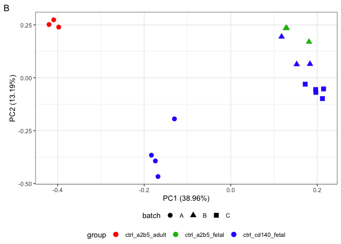
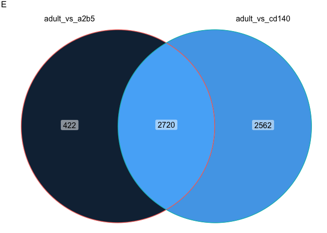
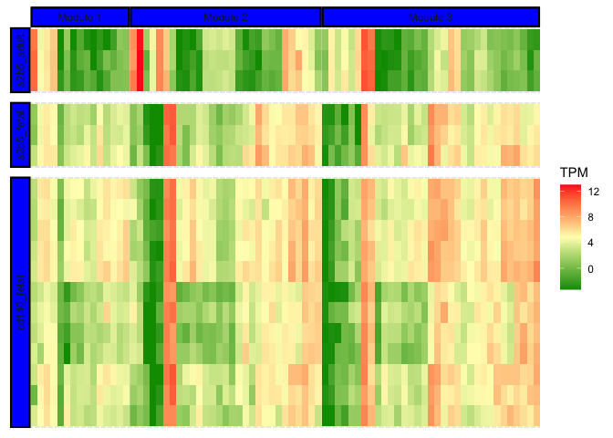
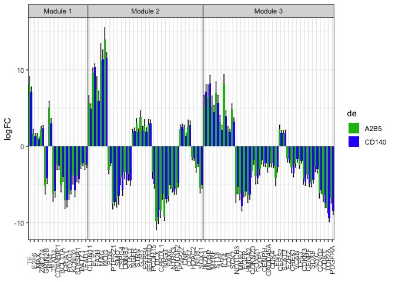
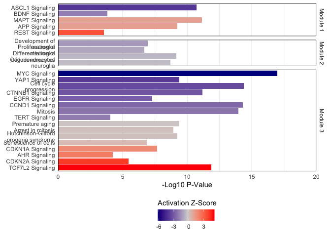
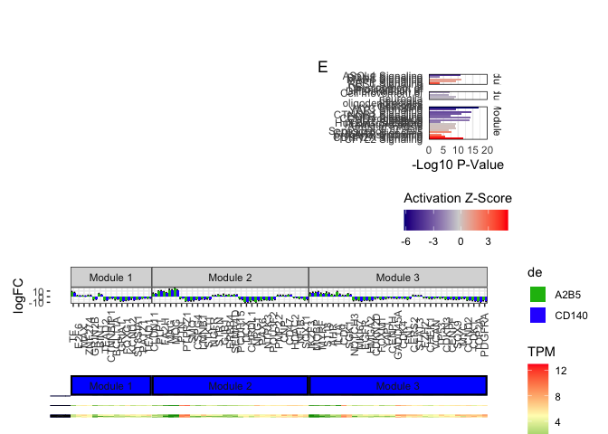

Differential Expression between Adult and Fetal hGPCs
================
John Mariani
03/06/23

``` r
source(file = "Scripts/Helper_Functions.R")
library(ggplot2)
library(DESeq2)
```

    ## Loading required package: S4Vectors

    ## Loading required package: stats4

    ## Loading required package: BiocGenerics

    ## 
    ## Attaching package: 'BiocGenerics'

    ## The following objects are masked from 'package:stats':
    ## 
    ##     IQR, mad, sd, var, xtabs

    ## The following objects are masked from 'package:base':
    ## 
    ##     anyDuplicated, aperm, append, as.data.frame, basename, cbind,
    ##     colnames, dirname, do.call, duplicated, eval, evalq, Filter, Find,
    ##     get, grep, grepl, intersect, is.unsorted, lapply, Map, mapply,
    ##     match, mget, order, paste, pmax, pmax.int, pmin, pmin.int,
    ##     Position, rank, rbind, Reduce, rownames, sapply, setdiff, sort,
    ##     table, tapply, union, unique, unsplit, which.max, which.min

    ## 
    ## Attaching package: 'S4Vectors'

    ## The following objects are masked from 'package:base':
    ## 
    ##     expand.grid, I, unname

    ## Loading required package: IRanges

    ## Loading required package: GenomicRanges

    ## Loading required package: GenomeInfoDb

    ## Loading required package: SummarizedExperiment

    ## Loading required package: MatrixGenerics

    ## Loading required package: matrixStats

    ## 
    ## Attaching package: 'MatrixGenerics'

    ## The following objects are masked from 'package:matrixStats':
    ## 
    ##     colAlls, colAnyNAs, colAnys, colAvgsPerRowSet, colCollapse,
    ##     colCounts, colCummaxs, colCummins, colCumprods, colCumsums,
    ##     colDiffs, colIQRDiffs, colIQRs, colLogSumExps, colMadDiffs,
    ##     colMads, colMaxs, colMeans2, colMedians, colMins, colOrderStats,
    ##     colProds, colQuantiles, colRanges, colRanks, colSdDiffs, colSds,
    ##     colSums2, colTabulates, colVarDiffs, colVars, colWeightedMads,
    ##     colWeightedMeans, colWeightedMedians, colWeightedSds,
    ##     colWeightedVars, rowAlls, rowAnyNAs, rowAnys, rowAvgsPerColSet,
    ##     rowCollapse, rowCounts, rowCummaxs, rowCummins, rowCumprods,
    ##     rowCumsums, rowDiffs, rowIQRDiffs, rowIQRs, rowLogSumExps,
    ##     rowMadDiffs, rowMads, rowMaxs, rowMeans2, rowMedians, rowMins,
    ##     rowOrderStats, rowProds, rowQuantiles, rowRanges, rowRanks,
    ##     rowSdDiffs, rowSds, rowSums2, rowTabulates, rowVarDiffs, rowVars,
    ##     rowWeightedMads, rowWeightedMeans, rowWeightedMedians,
    ##     rowWeightedSds, rowWeightedVars

    ## Loading required package: Biobase

    ## Welcome to Bioconductor
    ## 
    ##     Vignettes contain introductory material; view with
    ##     'browseVignettes()'. To cite Bioconductor, see
    ##     'citation("Biobase")', and for packages 'citation("pkgname")'.

    ## 
    ## Attaching package: 'Biobase'

    ## The following object is masked from 'package:MatrixGenerics':
    ## 
    ##     rowMedians

    ## The following objects are masked from 'package:matrixStats':
    ## 
    ##     anyMissing, rowMedians

``` r
library(EnhancedVolcano)
```

    ## Loading required package: ggrepel

``` r
library(data.table)
```

    ## 
    ## Attaching package: 'data.table'

    ## The following object is masked from 'package:SummarizedExperiment':
    ## 
    ##     shift

    ## The following object is masked from 'package:GenomicRanges':
    ## 
    ##     shift

    ## The following object is masked from 'package:IRanges':
    ## 
    ##     shift

    ## The following objects are masked from 'package:S4Vectors':
    ## 
    ##     first, second

``` r
library(stringr)
library(plyr)
```

    ## 
    ## Attaching package: 'plyr'

    ## The following object is masked from 'package:matrixStats':
    ## 
    ##     count

    ## The following object is masked from 'package:IRanges':
    ## 
    ##     desc

    ## The following object is masked from 'package:S4Vectors':
    ## 
    ##     rename

``` r
library(dplyr)
```

    ## 
    ## Attaching package: 'dplyr'

    ## The following objects are masked from 'package:plyr':
    ## 
    ##     arrange, count, desc, failwith, id, mutate, rename, summarise,
    ##     summarize

    ## The following objects are masked from 'package:data.table':
    ## 
    ##     between, first, last

    ## The following object is masked from 'package:Biobase':
    ## 
    ##     combine

    ## The following object is masked from 'package:matrixStats':
    ## 
    ##     count

    ## The following objects are masked from 'package:GenomicRanges':
    ## 
    ##     intersect, setdiff, union

    ## The following object is masked from 'package:GenomeInfoDb':
    ## 
    ##     intersect

    ## The following objects are masked from 'package:IRanges':
    ## 
    ##     collapse, desc, intersect, setdiff, slice, union

    ## The following objects are masked from 'package:S4Vectors':
    ## 
    ##     first, intersect, rename, setdiff, setequal, union

    ## The following objects are masked from 'package:BiocGenerics':
    ## 
    ##     combine, intersect, setdiff, union

    ## The following objects are masked from 'package:stats':
    ## 
    ##     filter, lag

    ## The following objects are masked from 'package:base':
    ## 
    ##     intersect, setdiff, setequal, union

``` r
library(tidyr)
```

    ## 
    ## Attaching package: 'tidyr'

    ## The following object is masked from 'package:S4Vectors':
    ## 
    ##     expand

``` r
library(patchwork)
library(limma)
```

    ## 
    ## Attaching package: 'limma'

    ## The following object is masked from 'package:DESeq2':
    ## 
    ##     plotMA

    ## The following object is masked from 'package:BiocGenerics':
    ## 
    ##     plotMA

``` r
library(ggVennDiagram)
library(UpSetR)
library(xlsx)
library(ggfortify)
library(igraph)
```

    ## 
    ## Attaching package: 'igraph'

    ## The following object is masked from 'package:tidyr':
    ## 
    ##     crossing

    ## The following objects are masked from 'package:dplyr':
    ## 
    ##     as_data_frame, groups, union

    ## The following object is masked from 'package:GenomicRanges':
    ## 
    ##     union

    ## The following object is masked from 'package:IRanges':
    ## 
    ##     union

    ## The following object is masked from 'package:S4Vectors':
    ## 
    ##     union

    ## The following objects are masked from 'package:BiocGenerics':
    ## 
    ##     normalize, path, union

    ## The following objects are masked from 'package:stats':
    ## 
    ##     decompose, spectrum

    ## The following object is masked from 'package:base':
    ## 
    ##     union

\#Load prior data

``` r
txi.rsem <- readRDS("RDS/txi.rsem.rds")
highTPM <- readRDS("RDS/highTPM.rds")
sampleTableFull <- read.csv("data_for_import/sampleTableFull.csv")
ensemblGeneListH <- read.csv("data_for_import/ensemblGeneList.csv")
```

\##Set up Comparison

``` r
txi.rsem.adult.fetal <- txi.rsem
for(i in 1:3){
  txi.rsem.adult.fetal[[i]] <- txi.rsem.adult.fetal[[i]][,colnames(txi.rsem.adult.fetal[[i]]) %in% sampleTableFull[sampleTableFull$group %in% c("ctrl_cd140_fetal", "ctrl_a2b5_adult", "ctrl_a2b5_fetal"),]$sample]
}

sampleTableFetalAdult  <- sampleTableFull [sampleTableFull$sample %in% colnames(txi.rsem.adult.fetal$abundance),]

sampleTableFetalAdult <- sampleTableFetalAdult[match(colnames(txi.rsem.adult.fetal$abundance), sampleTableFetalAdult$sample),]

sampleTableFetalAdult$line <- factor(sampleTableFetalAdult$line)
row.names(sampleTableFetalAdult) <- sampleTableFetalAdult$sample
```

## Differential Expression with DESeq2

``` r
ddsFetalAdult <- DESeqDataSetFromTximport(txi.rsem.adult.fetal, sampleTableFetalAdult, ~0+group+batch)
```

    ## Warning in DESeqDataSet(se, design = design, ignoreRank): some variables in
    ## design formula are characters, converting to factors

    ## using counts and average transcript lengths from tximport

``` r
identical(colnames(txi.rsem.adult.fetal$counts), row.names(sampleTableFetalAdult))
```

    ## [1] TRUE

``` r
ddsFetalAdult <- DESeq(ddsFetalAdult)
```

    ## estimating size factors

    ## using 'avgTxLength' from assays(dds), correcting for library size

    ## estimating dispersions

    ## gene-wise dispersion estimates

    ## mean-dispersion relationship

    ## final dispersion estimates

    ## fitting model and testing

``` r
resultsNames(ddsFetalAdult)
```

    ## [1] "groupctrl_a2b5_adult"  "groupctrl_a2b5_fetal"  "groupctrl_cd140_fetal"
    ## [4] "batchB"                "batchC"

``` r
de_adult_vs_a2b5 <- de(ddsFetalAdult, c(1,-1,0,0,0), 0.01,1)
de_adult_vs_cd140 <- de(ddsFetalAdult, c(1,0,-1,0,0), 0.01,1)
de_intersect <- de_adult_vs_a2b5[de_adult_vs_a2b5$Row.names %in% de_adult_vs_cd140$Row.names,]
de_adult_vs_cd140_only <- de_adult_vs_cd140[de_adult_vs_cd140$Row.names %not in% de_intersect$Row.names,]
de_adult_vs_a2b5_only <- de_adult_vs_a2b5[de_adult_vs_a2b5$Row.names %not in% de_intersect$Row.names,]
```

## Write out tables

``` r
### supTable 3
supTable3a <- merge(de_adult_vs_a2b5, de_adult_vs_cd140, by.x = "Row.names", by.y = "Row.names", all.x = T, all.y = T)
supTable3a <- supTable3a[,c(1,3,7,12,16,8:10,17:19)]

# Define a function to check the values of two columns
check_cols <- function(row) {
  # Check if both values are NA
  if(is.na(row[1]) | is.na(row[2])) {
    return(row[!is.na(row)][1])
  } else {
    return(row[1])
  }
}

supTable3a$external_gene_name <- apply(supTable3a[, c("external_gene_name.x", "external_gene_name.y")], 1, check_cols)
supTable3a$gene_biotype <- apply(supTable3a[, c("gene_biotype.x", "gene_biotype.y")], 1, check_cols)
supTable3a$description <- apply(supTable3a[, c("description.x", "description.y")], 1, check_cols)

supTable3a <- supTable3a[,-c(6:11)]


names(supTable3a) <- c("Ensembl_ID", "Log2FC_Adult_vs_Fetal_A2B5", "Adj_P_Val_Adult_vs_Fetal_A2B5", "Log2FC_Adult_vs_Fetal_CD140a", "Adj_P_Val_Adult_vs_Fetal_CD140a", "External_Gene_Name", "Gene_Biotype", "Description")
supTable3a <- supTable3a[order(supTable3a$Adj_P_Val_Adult_vs_Fetal_CD140a),]

write.xlsx(supTable3a, file = "Extended Data Tables/Extended Data Table 3 - Adult vs Fetal hGPC Bulk RNA-seq.xlsx", sheetName = "Adult vs Fetal hGPC DE", row.names = F)


write.table(de_intersect, "output/de_Adult_vs_Fetal_Intersect.txt", sep = "\t", quote = F, row.names = F)
write.table(de_adult_vs_a2b5, "output/de_adult_vs_a2b5.txt", sep = "\t", quote = F, row.names = F)
write.table(de_adult_vs_cd140, "output/de_adult_vs_cd140.txt", sep = "\t", quote = F, row.names = F)


intersectAdult <- de_intersect[de_intersect$log2FoldChange > 0,]
intersectFetal <- de_intersect[de_intersect$log2FoldChange < 0,]

write.table(intersectAdult , "Adult_Enriched.txt", sep = "\t", quote = F, row.names = F)
write.table(intersectFetal , "Fetal_Enriched.txt", sep = "\t", quote = F, row.names = F)
```

``` r
row.names(sampleTableFetalAdult) <- sampleTableFetalAdult$sample
vstFetalAdult <- assay(varianceStabilizingTransformation(ddsFetalAdult))


pcaAdultFetal <- autoplot(prcomp(t(as.matrix(vstFetalAdult))), data = sampleTableFetalAdult, colour = "group", label = F, shape = "batch", size = 3) + theme_bw()  + theme(legend.position='bottom', legend.box="vertical", legend.margin=margin()) + scale_color_manual(values = c("red", "#18BA0F", "#2E30FF")) + labs(tag = "B")

#ggsave("Panels/AdultFetalPCA.pdf", pcaAdultFetal, width = 20, height = 10, device = "pdf")

pcaAdultFetal
```

<!-- -->

``` r
VennAdultFetal <- list(
                 "adult_vs_a2b5" = as.character(de_adult_vs_a2b5$Row.names),
                 "adult_vs_cd140" = as.character(de_adult_vs_cd140$Row.names))

venn <- ggVennDiagram(VennAdultFetal, label = "count") + theme(legend.position = "none") + labs(tag = "E")

venn
```

<!-- -->

``` r
## direction check
intersectTest <- merge(de_adult_vs_a2b5, de_adult_vs_cd140, by.x = 1, by.y = 1)
table(intersectTest$log2FoldChange.x * intersectTest$log2FoldChange.x > 0)
```

    ## 
    ## TRUE 
    ## 2720

\##Make IPA network to output to Cytoscape for Adult vs Fetal

``` r
IPAparse <- function(files, compNames, pval = -log10(0.001), filterTerms, ensembl, returnWhat = "Filtered"){
  for(i in 1:length(files)){
  canonicalIPA <- fread(files[i], skip = "Canonical",drop = c(4,6))
  names(canonicalIPA) <- c("Pathway", "pVal", "zScore", "Genes")
  canonicalIPA$type <- "Canonical"
  upstreamIPA <- fread(files[i], skip = "Upstream Regulators", drop = c(1:2,4:6,8:10,13:14))
  upstreamIPA <- upstreamIPA[,c(1,3,2,4)]
  names(upstreamIPA) <- c("Pathway", "pVal", "zScore", "Genes")
  upstreamIPA$Pathway <- paste0(upstreamIPA$Pathway, " Signaling")
  upstreamIPA$pVal <- -log10(upstreamIPA$pVal)
  upstreamIPA$type <- "Upstream"
  functionalIPA <- fread(files[i], skip = "Diseases and Bio", drop = c(1,2,5,7,8,10,11))
  names(functionalIPA) <- c("Pathway", "pVal", "zScore", "Genes")
  functionalIPA$pVal <- -log10(functionalIPA$pVal)
  functionalIPA$type <- "Functional"
  moleculesIPAtemp <- fread(files[i], skip = "Analysis Ready Molecules", drop = c(3:4))
  if(i == 1){
    IPA <- rbind(canonicalIPA, upstreamIPA, functionalIPA)
    IPA$comparison <- compNames[i]
    moleculesIPA <- moleculesIPAtemp
  } else {
    tempIPA <- rbind(canonicalIPA, upstreamIPA, functionalIPA)
    tempIPA$comparison <- compNames[i]
    IPA <- rbind(IPA, tempIPA)
    moleculesIPA <- rbind(moleculesIPA, moleculesIPAtemp)
  }
  }
  

  IPA[is.na(IPA$zScore)]$zScore <- 0
  ogIPA <- IPA
  IPA <- IPA[IPA$pVal > pval,]
  filteredIPA <- IPA[!grepl(paste(filterTerms, collapse = "|"), ignore.case = T, IPA$Pathway),]
  if(returnWhat == "Filtered"){
    return(filteredIPA)
  } 
  if(returnWhat == "Deleted"){
    deletedIPA <- IPA[grepl(paste(filterTerms, collapse = "|"), ignore.case = T, IPA$Pathway),]
    return(deletedIPA)
  }
  if(returnWhat == "Molecules"){
    moleculesIPA <- merge(moleculesIPA, ensembl, by.x = "ID", by.y = "ensembl_gene_id")
    return(moleculesIPA)
  }
}

IPAfilters <- c("cancer","glioma", "abdominal", "carcinoma", "endometrium", "eye", "nose", "epidermis", "head", "lymphocyte", "renal", "snout", "tooth", 
                 "connective", "tumor", "fibroblast", "rickets", "mouth", "maxilla", "cartilage", "neoplasm", "lymph", "liver", "psoriasis", "cardio",
                 "cardiac", "tongue", "tinea", "herpes", "Picornaviridae", "virus", "killer T", "muscle", "myopathy", "pancreatic", "Onychomycosis",
                 "leukocyte", "oral cavity","osteoclast", "Merkel", "macrophage", "Hydrometrocolpos", "Hand", "Gastric", "Thymocytes", "diabetes",
                 "Dupuytren", "myoblast", "ear$", "implantation", "bone", "limb", "cleft lip", "Calcinosis", "lung", "Benign lesion", 
                 "body axis", "sensory organ", "diabetic", "neutrophil", "infection of mammalia", "leukopoiesis", "neoplasia", "Sensory system development",
                 "T cell", "myeloid", "aorta", "body cavity", "esophagus", "incisor", "kidney", "oesophageal", "respiratory", "skin", "cavity", "urinary",
                 "foot", "digit", "heart", "acute biphenotypic leukemia", "Ankylosis", "Articular rigidity", "Atherosclero", "Blister", "Branching morphogenesis of epithelial tubule",
                 "Cervical spondylotic myelopathy", "epithelial", "exocrine", "gastrointestinal", "Ejection of first polar body", "Familial arrhythmia", "Familial nonsyndromic hearing impairment", 
                 "fibrosis", "mammary", "Hearing", "Morphogenesis of metanephric bud", "cochlea", "nail", "Plasma cell dyscrasia", "Secondary Leukemia", "granulocyte",
                 "Tinnitus", "metastasis", "trunk", "sperm motility", "skull", "dendritic cells", "dehydration", "digestive", "microphthalmia", "myelodysplastic",
                 "semicircular canal", " skeleton", "osteopenia", "osteoarthritis", "Refractory anemia with excess blasts", "rectum", "submandibular", "antiviral", "HIV-1",
                 "antigen present", "gonad", "keratinocyte", "phagocyte", "coronary", "intestinal", "viral replicon", "monocyte", "viral life", "wound", "leukemia", "Airway", "colorectal", "Benign oral disorder", "Benign pelvic disease", "Glioblastoma", "Melanoma", "astrocytoma", "sarcoma", "leiomyoma", "sertoli", "short stature", "midline defect")

filteredFetalAdultIPA <- IPAparse(files = "data_for_import/Adult_vs_Fetal_Intersect_IPA.txt", compNames = "Adult_vs_Fetal", filterTerms = IPAfilters, ensembl = ensemblGeneListH)

deletedFetalAdultIPA <- IPAparse(files = "data_for_import/Adult_vs_Fetal_Intersect_IPA.txt", compNames = "Adult_vs_Fetal", filterTerms = IPAfilters, ensembl = ensemblGeneListH, returnWhat = "Deleted")

moleculesAdultFetal <- IPAparse(files = "data_for_import/Adult_vs_Fetal_Intersect_IPA.txt", compNames = "Adult_vs_Fetal", filterTerms = IPAfilters, ensembl = ensemblGeneListH, returnWhat = "Molecules")


# Pathways connected to a comparison
edgesIPA <- filteredFetalAdultIPA[,c(1,2,3,6)]

filteredIPA <- filteredFetalAdultIPA

edges <- filteredIPA %>% 
  mutate(genes = strsplit(as.character(Genes), ",")) %>% 
  unnest(genes) %>% .[,-4]

edges <- edges[,c(1,6,2,3,4,5)]
names(edges) <- c("Source", "Target",names(edges)[3:6])

moleculesAdultFetal$external_gene_name <- as.character(moleculesAdultFetal$external_gene_name)
temp <- edges[edges$Target %not in% de_intersect$external_gene_name & edges$Target %in% moleculesAdultFetal$Symbol,]$Target


for(i in temp){
    tryCatch({
      edges[edges$Target == i,]$Target <- moleculesAdultFetal[moleculesAdultFetal$Symbol == i,]$external_gene_name
    }, error=function(e){})
}


#Fix ambiguous gene annotations

mislabeledGenes <- edges[edges$Target %not in% de_intersect$external_gene_name,]
if(nrow(mislabeledGenes) == 0){
  rm(mislabeledGenes)
  message("All mislabed genes removed!")
} else {
  message("Attempt to clean up mislabeled genes failed :(")
}

# Write out Extended Data Table for IPA terms
supTable3b <- filteredFetalAdultIPA
supTable3b <- supTable3b[,c(1:5)]
names(supTable3b) <- c("Pathway", "Adj_-log10_P_Val", "Z_Score", "Genes", "Type")
supTable3b <- supTable3b[order(supTable3b$`Adj_-log10_P_Val`, decreasing = T),]


write.xlsx(supTable3b, file = "Extended Data Tables/Extended Data Table 3 - Adult vs Fetal hGPC Bulk RNA-seq.xlsx", sheetName = "Adult vs Fetal GPC IPA terms", row.names = F, append = T)
```

## Make IPA Network

``` r
edges <- edges[!duplicated(edges),]
edges$Source <- trimws(edges$Source)
edgesMN <- edges

nodes <- data.frame(id = unique(c(edges$Source, edges$Target)))
nodes$enriched <- "None"
nodes[nodes$id %in% de_intersect[de_intersect$log2FoldChange > 0,]$external_gene_name,]$enriched <- "Adult"
nodes[nodes$id %in% de_intersect[de_intersect$log2FoldChange < 0,]$external_gene_name,]$enriched <- "Fetal"
nodes[nodes$id %in% edges[edges$zScore > 1,]$Source,]$enriched <- "Adult"
nodes[nodes$id %in% edges[edges$zScore < -1,]$Source,]$enriched <- "Fetal"

nodes$type <- "GO_node"
nodes[nodes$id %in% de_intersect$external_gene_name,]$type <- "Gene_node" 


nodes <- nodes[nodes$id %in% c(edges$Source, edges$Target),]

graph <- graph_from_edgelist(as.matrix(edges[,1:2]), directed = F)

set.seed(999)
sgc <- spinglass.community(graph, spins = 3)
table(sgc$membership)
```

    ## 
    ##    1    2    3 
    ##  584  773 1211

``` r
nodesSGC <- nodes[match(sgc$names, nodes$id),]
nodesSGC$module <- paste0("Module_", sgc$membership)


nodesSGClabeled <- merge(nodesSGC, ensemblGeneListH, by.x = 1, by.y = "external_gene_name", all.x = T, all.y = F)

afGOnodes <- c("APP Signaling", "MAPT Signaling", "REST Signaling", "ASCL1 Signaling", "BDNF Signaling", "Development of neuroglia", "AHR Signaling", "Arrest in mitosis", "Differentiation of oligodendrocytes", "Cell movement of neuroglia", "Development of neuroglia", "Proliferation of neuroglia", "Premature aging", "Hutchinson-Gilford progeria syndrome", "Senescence of cells", "CCND1 Signaling", "Mitosis", "CDKN1A Signaling", "CDKN2A Signaling", "MYC Signaling", "YAP1 Signaling", "EGFR Signaling", "AHR Signaling", "TERT Signaling", "Cell cycle progression", "TCF7L2 Signaling", "CTNNB1 Signaling")

afGOnodes[afGOnodes %not in% nodesSGC$id]
```

    ## character(0)

``` r
afHMgenes <- c("BCAN", "CA10", "CD9", "CHRDL1", "CLDN11", "CNP", "CSPG4", "ERBB4", "GJB1", "MAG", "MOG", "MYRF", "NXPH1", "PCDH15", "PLP1", "PMP22", "PTN", "PTPRZ1", "SEMA4D", "SOX11", "ST8SIA1", "LMNB1","BCAS1", "CERS2", "CTNNBIP1", "E2F6", "FA2H", "HDAC2", "IKZF3", "LPAR1", "MAX", "MAZ", "MOBP", "PATZ1", "ST18", "ZNF274", "STAT3", "BIN1", "CCND2", "CD47", "YAP1", "FN1", "CHEK1", "PDGFRA", "TEAD2", "TEAD1", "AHR", "CDKN3", "CDK1", "CENPF", "CENPH", "TP53", "CDKN2D", "CDKN3", "MKI67", "MYC", "TOP2A", "BCL11A", "HMGA2", "NFIB", "EZH2", "IL1A", "SGK1", "MYC", "PDGFRA", "MOBP", "NFIB", "MAX", "SMO", "NOTCH3", "TEAD2", "EGFR", "FN1", "FOXM1", "KCND2", "STK11", "PTN", "CHEK1", "TP53", "VCAN", "CDK4", "AHR", "TOP2A", "NRG1", "PTPRZ1", "PTN", "CCND2", "BCAS1", "PLP1", "PAX6", "CHRDL1", "MOG", "BCAN", "DCX", "TF", "PCDH11X", "POU3F2", "PCDH15", "SOX9", "GADD45A", "LPAR1", "ST18", "STRN", "BCAS1", "FA2H", "PATZ1", "YAP1", "HDAC2", "SMO", "CD47", "NTRK3", "GRIA1", "GRIN2B", "NGFR", "YAP1", "FOXG1")

afHMgenes[afHMgenes %not in% nodesSGC$id]
```

    ## character(0)

``` r
afHMgenes <- afHMgenes[!duplicated(afHMgenes)]

nodes <- nodesSGC

nodes$degree <- "0"
for(i in 1:nrow(nodes)){
  nodes$degree[i] <- nrow(edges[edges$Source %in% nodes$id[i] | edges$Target %in% nodes$id[i],])
}
  
nodes$degree <- as.integer(nodes$degree)

edgesGOnetwork <- edges[edges$Source %in%  afGOnodes & edges$Target %in% afHMgenes,]

nodesGOnetwork <- nodes[nodes$id %in% c(edgesGOnetwork$Source, edgesGOnetwork$Target),]

### Swap module 1 and 2
nodeMappings <- c("Module_1", "Module_2", "Module_3")
names(nodeMappings) <- c("Module 2", "Module 1", "Module 3")

nodesGOnetwork$module <- mapvalues(nodesGOnetwork$module, nodeMappings, names(nodeMappings))

afHMgenes[afHMgenes %not in% nodesGOnetwork$id] 
```

    ## [1] "BCAN"    "CA10"    "NXPH1"   "BCAS1"   "LPAR1"   "MAZ"     "PCDH11X"

``` r
#write.table(edgesGOnetwork, "output/edgesGOnetwork.txt", quote = F, sep = "\t", row.names = F)
#write.table(nodesGOnetwork, "output/nodesGOnetwork.txt", quote = F, sep = "\t", row.names = F)
```

## Make Adult Fetal HM

``` r
de_intersect$padj_cd140 <- de_adult_vs_cd140[match(de_intersect$Row.names, de_adult_vs_cd140$Row.names, ),]$padj
de_intersect$log2FoldChange_cd140 <- de_adult_vs_cd140[match(de_intersect$Row.names, de_adult_vs_cd140$Row.names, ),]$log2FoldChange
de_intersect$padj_avg <- rowMeans(de_intersect[,c("padj", "padj_cd140")])


afTPM <- merge(txi.rsem.adult.fetal$abundance, ensemblGeneListH, by.x = 0, by.y = "ensembl_gene_id")


afTPM <- afTPM[,1:20] %>%
  pivot_longer(-c(Row.names, external_gene_name), names_to = "Sample", values_to = "TPM")
afTPM$group <- mapvalues(afTPM$Sample,sampleTableFetalAdult$sample, gsub(x = as.character(sampleTableFetalAdult$group), pattern = "ctrl_", replacement = ""))
afTPM$module <- mapvalues(afTPM$external_gene_name, nodesGOnetwork$id, nodesGOnetwork$module)
write.csv(afTPM, "output/afTPM.csv", row.names = F)


afHM <- afTPM[afTPM$external_gene_name %in% nodesGOnetwork$id,]
afHM$TPM <- log2(afHM$TPM + .1)
afHM$module <- factor(afHM$module, levels = c("Module 1", "Module 2", "Module 3"))


afBarA2B5 <- de_adult_vs_a2b5[de_adult_vs_a2b5$external_gene_name %in% nodesGOnetwork$id,]
afBarA2B5$de <- "A2B5"
afBarCD140 <- de_adult_vs_cd140[de_adult_vs_cd140$external_gene_name %in% nodesGOnetwork$id,]
afBarCD140$de <- "CD140"
afBar <- rbind(afBarCD140,afBarA2B5)
afBar$logFC <- as.numeric(afBar$log2FoldChange)
afBar$external_gene_name <- as.factor(afBar$external_gene_name)
afBar$module <- mapvalues(afBar$external_gene_name, nodesGOnetwork$id, nodesGOnetwork$module)
afBar$module <- factor(afBar$module, levels = c("Module 1", "Module 2", "Module 3"))


### Cluster within module
afHMorder <- as.data.frame(afHM[,c(1:4,6)] %>%
  pivot_wider(names_from = "Sample", values_from = c("TPM")))

afHMorder$Row.names <- NULL
row.names(afHMorder) <- afHMorder$external_gene_name
afHMorder$external_gene_name <- NULL


for(i in levels(afHMorder$module)){
  tempCluster <- hclust(dist(afHMorder[afHMorder$module %in% i, 2:19]))
  tempCluster <- tempCluster$labels[tempCluster$order]
  if(i == "Module 1"){
    afModuleOrder <- tempCluster} else{
      afModuleOrder <- c(afModuleOrder,tempCluster)
    }
}


afHM$external_gene_name <- factor(afHM$external_gene_name, levels = afModuleOrder)
afBar$external_gene_name <- factor(afBar$external_gene_name, levels = afModuleOrder)

###
limits <- aes(ymax = afBar$log2FoldChange + afBar$lfcSE,  
  ymin =  afBar$log2FoldChange - afBar$lfcSE)

m1 <- ggplot(afHM, aes(external_gene_name, Sample)) + geom_tile(aes(fill = TPM)) + theme(axis.text.x = element_text(angle = 90, vjust = 0.5, hjust=1), panel.spacing.y = unit(.5, "lines"), panel.spacing.x = unit(0,"lines"),axis.title.x = element_blank(), strip.background = element_rect(color="black", fill= c("blue","magenta","green"), size=1.5, linetype="solid"), axis.title.y = element_blank(), axis.text.y = element_blank(), axis.ticks.y = element_blank())  + scale_fill_gradientn(colours = c("#009900","#fffcbd","#ff2020")) + scale_x_discrete(expand = c(0, 0)) + facet_grid(vars(group), vars(module),scales = "free", space = "free", switch = "y") + theme(axis.text.x = element_blank(), axis.ticks.x = element_blank())

m1
```

<!-- -->

``` r
m2 <- ggplot(afBar, aes(x = external_gene_name, y = logFC, fill = de)) + theme_bw() + geom_errorbar(limits, width=.5, position=position_dodge(1)) + geom_bar(stat = "identity", width = 1,size = 5, position = "dodge") + scale_x_discrete(expand = c(0, 0)) + theme(axis.text.x = element_text(angle = 90, vjust = 0.5, hjust=.5), panel.spacing.x = unit(0, "lines"), axis.title.x = element_blank()) + facet_grid(cols = vars(module),scales = "free", space = "free")  + scale_fill_manual(values = c("#18BA0F", "#2E30FF"))

m2
```

<!-- -->
\## GO graph

``` r
curatedPathways <- read.delim("data_for_import/CuratedAdultFetalGOterms.txt", stringsAsFactors = F)

afGO <- curatedPathways[curatedPathways$Pathway %in% afGOnodes,]
afGO$module <- mapvalues(x = afGO$Pathway, nodesGOnetwork$id, to = nodesGOnetwork$module)
```

    ## The following `from` values were not present in `x`: CDK1, CDK4, EGFR, GJB1, GRIA1, EZH2, HDAC2, SMO, SOX9, TP53, GADD45A, MYC, STAT3, STK11, PDGFRA, TF, YAP1, SOX11, GRIN2B, FOXG1, NGFR, NTRK3, FN1, CENPH, SEMA4D, CSPG4, VCAN, MAG, CCND2, CD47, CDKN2D, CDKN3, CENPF, CHEK1, E2F6, FOXM1, IL1A, MKI67, PTN, SGK1, TOP2A, AHR, BIN1, CD9, CNP, MAX, PLP1, PMP22, POU3F2, TEAD1, TEAD2, BCL11A, HMGA2, LMNB1, NFIB, CTNNBIP1, CLDN11, ERBB4, MOBP, NOTCH3, NRG1, ST8SIA1, PATZ1, CERS2, FA2H, MOG, MYRF, ST18, STRN, PCDH15, PAX6, DCX, PTPRZ1, ZNF274, KCND2, IKZF3, CHRDL1

``` r
afGO <- afGO[order(afGO$pVal, decreasing = T),]
afGO$Pathway <- factor(afGO$Pathway, levels = rev(unique(afGO$Pathway)))
afGO <- afGO[order(afGO$zScore, decreasing = T),]
afGO$Pathway <- factor(afGO$Pathway, levels = afGO$Pathway)

m4 <- ggplot(afGO, aes(fill = zScore, y = pVal, x = Pathway)) + geom_bar(stat = "identity") + coord_flip() + theme_minimal() + scale_y_continuous(expand = c(0, 0), limits = c(0,20)) + theme(panel.grid.major.y = element_blank(), panel.grid.minor.y = element_blank(), panel.border = element_rect(fill  = NA), legend.position = "bottom", axis.title.y = element_blank()) + ylab("-Log10 P-Value") + facet_grid(rows = "module", space = "free", scales = "free")  + scale_fill_gradientn(colours = c("darkblue", "lightgrey", "red"),
          values = scales::rescale(c(-1,0.05,1)), guide = guide_colourbar(direction = "horizontal", title = "Activation Z-Score", title.position = "top")) + scale_x_discrete(labels = function(Pathway) str_wrap(Pathway, width = 20))
 
m4
```

<!-- -->

### Network figure

``` r
afHMgg <- m1 + theme(legend.position = "none") + labs(tag = "G")
afBargg <-m2 + theme(legend.position = "none") + labs(tag = "F")
afGOgg <- m4  + labs(tag = "E")

afNetworkFigure <- (((plot_spacer() | afGOgg) + plot_layout(widths = c(1, .25))) / afBargg / afHMgg) + plot_layout(heights = c(4,1,1))
afNetworkFigure <- afNetworkFigure  & theme(plot.tag = element_text(size = tagSize))

afNetworkKeys <- (plot_spacer() / ((plot_spacer() | afGOgg) + plot_layout(widths = c(1, .25))) / m2 / m1) + plot_layout(heights = c(3,6,1.5,2))

afNetworkKeys
```

<!-- -->

``` r
#ggsave("figures/AdultFetalNetwork2.pdf", plot = afNetworkKeys, device = "pdf", units = "in", width = 10, height =11)
```

``` r
sessionInfo()
```

    ## R version 4.2.3 (2023-03-15)
    ## Platform: aarch64-apple-darwin20 (64-bit)
    ## Running under: macOS Ventura 13.2.1
    ## 
    ## Matrix products: default
    ## BLAS:   /Library/Frameworks/R.framework/Versions/4.2-arm64/Resources/lib/libRblas.0.dylib
    ## LAPACK: /Library/Frameworks/R.framework/Versions/4.2-arm64/Resources/lib/libRlapack.dylib
    ## 
    ## locale:
    ## [1] en_US.UTF-8/en_US.UTF-8/en_US.UTF-8/C/en_US.UTF-8/en_US.UTF-8
    ## 
    ## attached base packages:
    ## [1] stats4    stats     graphics  grDevices utils     datasets  methods  
    ## [8] base     
    ## 
    ## other attached packages:
    ##  [1] igraph_1.4.1                ggfortify_0.4.16           
    ##  [3] xlsx_0.6.5                  UpSetR_1.4.0               
    ##  [5] ggVennDiagram_1.2.2         limma_3.54.2               
    ##  [7] patchwork_1.1.2             tidyr_1.3.0                
    ##  [9] dplyr_1.1.1                 plyr_1.8.8                 
    ## [11] stringr_1.5.0               data.table_1.14.8          
    ## [13] EnhancedVolcano_1.16.0      ggrepel_0.9.3              
    ## [15] DESeq2_1.38.3               SummarizedExperiment_1.28.0
    ## [17] Biobase_2.58.0              MatrixGenerics_1.10.0      
    ## [19] matrixStats_0.63.0          GenomicRanges_1.50.2       
    ## [21] GenomeInfoDb_1.34.9         IRanges_2.32.0             
    ## [23] S4Vectors_0.36.2            BiocGenerics_0.44.0        
    ## [25] ggplot2_3.4.2              
    ## 
    ## loaded via a namespace (and not attached):
    ##  [1] bitops_1.0-7           sf_1.0-12              bit64_4.0.5           
    ##  [4] RColorBrewer_1.1-3     httr_1.4.5             rprojroot_2.0.3       
    ##  [7] tools_4.2.3            utf8_1.2.3             R6_2.5.1              
    ## [10] KernSmooth_2.23-20     DBI_1.1.3              colorspace_2.1-0      
    ## [13] withr_2.5.0            tidyselect_1.2.0       gridExtra_2.3         
    ## [16] bit_4.0.5              compiler_4.2.3         cli_3.6.1             
    ## [19] DelayedArray_0.24.0    labeling_0.4.2         scales_1.2.1          
    ## [22] classInt_0.4-9         proxy_0.4-27           digest_0.6.31         
    ## [25] rmarkdown_2.21         XVector_0.38.0         pkgconfig_2.0.3       
    ## [28] htmltools_0.5.5        highr_0.10             fastmap_1.1.1         
    ## [31] rlang_1.1.0            rstudioapi_0.14        RSQLite_2.3.1         
    ## [34] generics_0.1.3         farver_2.1.1           BiocParallel_1.32.6   
    ## [37] RCurl_1.98-1.12        magrittr_2.0.3         GenomeInfoDbData_1.2.9
    ## [40] Matrix_1.5-4           Rcpp_1.0.10            munsell_0.5.0         
    ## [43] fansi_1.0.4            lifecycle_1.0.3        stringi_1.7.12        
    ## [46] yaml_2.3.7             zlibbioc_1.44.0        grid_4.2.3            
    ## [49] blob_1.2.4             parallel_4.2.3         crayon_1.5.2          
    ## [52] lattice_0.21-8         Biostrings_2.66.0      annotate_1.76.0       
    ## [55] xlsxjars_0.6.1         KEGGREST_1.38.0        locfit_1.5-9.7        
    ## [58] knitr_1.42             pillar_1.9.0           geneplotter_1.76.0    
    ## [61] codetools_0.2-19       XML_3.99-0.14          glue_1.6.2            
    ## [64] evaluate_0.20          png_0.1-8              vctrs_0.6.1           
    ## [67] gtable_0.3.3           purrr_1.0.1            cachem_1.0.7          
    ## [70] xfun_0.38              xtable_1.8-4           e1071_1.7-13          
    ## [73] class_7.3-21           RVenn_1.1.0            tibble_3.2.1          
    ## [76] rJava_1.0-6            AnnotationDbi_1.60.2   memoise_2.0.1         
    ## [79] units_0.8-1
≈