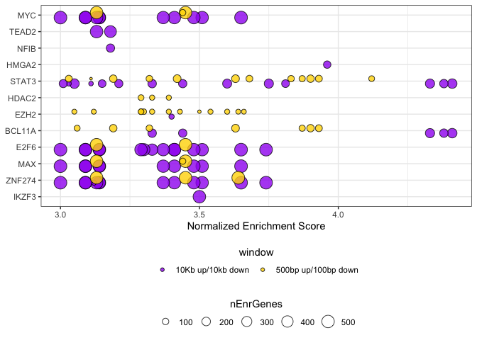
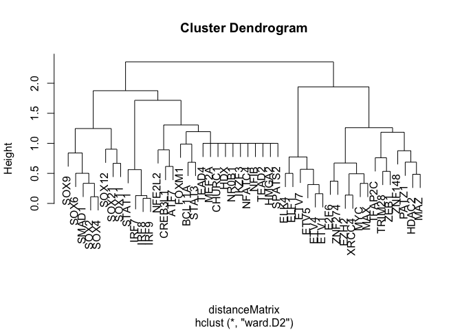
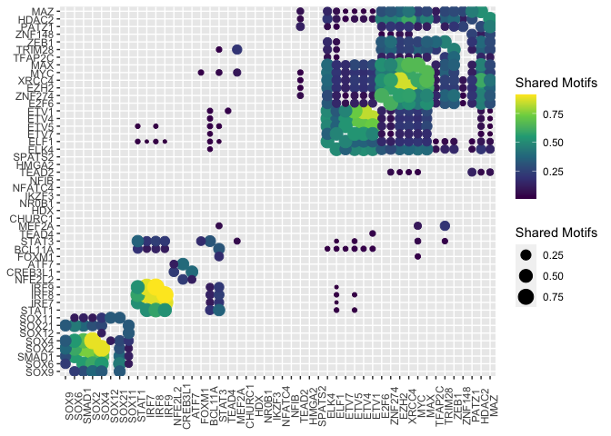
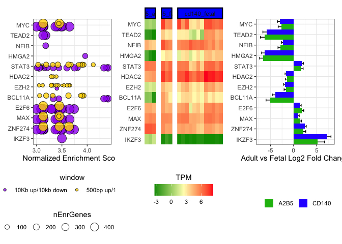

Identification of differentially active transcriptional regulators
between adult and fetal hGPCs
================
John Mariani
03/06/23

``` r
source(file = "Scripts/Helper_Functions.R")
library(ggplot2)
library(RcisTarget)
library(ggdendro)


library(DESeq2)
library(EnhancedVolcano)
library(data.table)
library(stringr)
library(plyr)
library(dplyr)
library(tidyr)
library(patchwork)
library(limma)
library(ggVennDiagram)
library(UpSetR)
library(xlsx)
library(ggfortify)
library(igraph)
```

## Load prior data

``` r
txi.rsem <- readRDS("RDS/txi.rsem.rds")
highTPM <- readRDS("RDS/highTPM.rds")
sampleTableFull <- read.csv("data_for_import/sampleTableFull.csv")
ensemblGeneListH <- read.csv("data_for_import/ensemblGeneList.csv")
de_intersect <- read.delim("output/de_Adult_vs_Fetal_Intersect.txt")
de_adult_vs_a2b5 <-  read.delim("output/de_adult_vs_a2b5.txt")
de_adult_vs_cd140 <-  read.delim("output/de_adult_vs_cd140.txt")
afTPM <- read.csv("output/afTPM.csv")
```

## RCisTarget for Fetal vs Adult

``` r
#obtained from data(motifAnnotations_hgnc in RcisTarget v1.4.0)
motifAnnotations <- read.delim("data_for_import/motifAnnotations_hgnc.txt")
motifAnnotations <- as.data.table(motifAnnotations)

#Both ranking databases available at https://resources.aertslab.org/cistarget/
motifRankings <- importRankings("data_for_import/hg38__refseq-r80__500bp_up_and_100bp_down_tss.mc9nr.feather")
```

    ## Using the column 'features' as feature index for the ranking database.

``` r
options(stringsAsFactors=FALSE)


#TF up in adult that are activating adult
rcis500AdultActivator <- TFidentify(de_intersect[de_intersect$log2FoldChange>0,]$external_gene_name, de_intersect[de_intersect$log2FoldChange>0,]$external_gene_name)
```

    ## Genes in the gene sets NOT available in the dataset: 
    ##  geneSet:    123 (12% of 1060)

``` r
rcis500AdultActivator$window <- "500bp up/100bp down"

# TF up in adult that are repressing fetal
rcis500AdultRepressor<- TFidentify(de_intersect[de_intersect$log2FoldChange<0,]$external_gene_name, de_intersect[de_intersect$log2FoldChange>0,]$external_gene_name)
```

    ## Genes in the gene sets NOT available in the dataset: 
    ##  geneSet:    160 (10% of 1658)

``` r
rcis500AdultRepressor$window <- "500bp up/100bp down"


#TF up in fetal that are activating fetal
rcis500FetalActivator <- TFidentify(de_intersect[de_intersect$log2FoldChange<0,]$external_gene_name, de_intersect[de_intersect$log2FoldChange<0,]$external_gene_name)
```

    ## Genes in the gene sets NOT available in the dataset: 
    ##  geneSet:    160 (10% of 1658)

``` r
rcis500FetalActivator$window <- "500bp up/100bp down"


# Genes up in fetal that are repressing adult
rcis500FetalRepressor<- TFidentify(de_intersect[de_intersect$log2FoldChange>0,]$external_gene_name, de_intersect[de_intersect$log2FoldChange<0,]$external_gene_name)
```

    ## Genes in the gene sets NOT available in the dataset: 
    ##  geneSet:    123 (12% of 1060)

``` r
rcis500FetalRepressor$window <- "500bp up/100bp down"


### Run again for 10K
motifRankings <- importRankings("data_for_import/hg38__refseq-r80__10kb_up_and_down_tss.mc9nr.feather")
```

    ## Using the column 'features' as feature index for the ranking database.

``` r
#TF up in adult that are activating adult
rcis10KAdultActivator <- TFidentify(de_intersect[de_intersect$log2FoldChange>0,]$external_gene_name, de_intersect[de_intersect$log2FoldChange>0,]$external_gene_name)
```

    ## Genes in the gene sets NOT available in the dataset: 
    ##  geneSet:    118 (11% of 1060)

``` r
rcis10KAdultActivator$window <- "10Kb up/10kb down"


# TF up in adult that are repressing fetal
rcis10KAdultRepressor<- TFidentify(de_intersect[de_intersect$log2FoldChange<0,]$external_gene_name, de_intersect[de_intersect$log2FoldChange>0,]$external_gene_name)
```

    ## Genes in the gene sets NOT available in the dataset: 
    ##  geneSet:    158 (10% of 1658)

``` r
rcis10KAdultRepressor$window <- "10Kb up/10kb down"


#TF up in fetal that are activating fetal
rcis10KFetalActivator <- TFidentify(de_intersect[de_intersect$log2FoldChange<0,]$external_gene_name, de_intersect[de_intersect$log2FoldChange<0,]$external_gene_name)
```

    ## Genes in the gene sets NOT available in the dataset: 
    ##  geneSet:    158 (10% of 1658)

``` r
rcis10KFetalActivator$window <- "10Kb up/10kb down"


# Genes up in fetal that are repressing adult
rcis10KFetalRepressor<- TFidentify(de_intersect[de_intersect$log2FoldChange>0,]$external_gene_name, de_intersect[de_intersect$log2FoldChange<0,]$external_gene_name)
```

    ## Genes in the gene sets NOT available in the dataset: 
    ##  geneSet:    118 (11% of 1060)

``` r
rcis10KFetalRepressor$window <- "10Kb up/10kb down"


rcisFetalRepressor <- rbind(rcis10KFetalRepressor, rcis500FetalRepressor)
rcisFetalActivator <- rbind(rcis10KFetalActivator, rcis500FetalActivator)
rcisAdultRepressor <- rbind(rcis10KAdultRepressor, rcis500AdultRepressor)
rcisAdultActivator <- rbind(rcis10KAdultActivator, rcis500AdultActivator)
rcisFetalRepressor$activity <- "Repressor"
rcisAdultRepressor$activity <- "Repressor"
rcisAdultActivator$activity <- "Activator"
rcisFetalActivator$activity <- "Activator"

### Make Sup Table 3c
supTable3c <- rbind(rcisFetalRepressor, rcisFetalActivator, rcisAdultRepressor, rcisAdultActivator)


repressors <- c("E2F6", "EZH2", "HDAC2", "ZNF274", "MAX", "BCL11A", "IKZF3")
activators <- c("MYC", "NFIB", "STAT3", "HMGA2", "TEAD2")


rcisFetalRepressor <- rcisFetalRepressor[rcisFetalRepressor$Gene %in% repressors,]
rcisAdultRepressor <- rcisAdultRepressor[rcisAdultRepressor$Gene %in% repressors,]
rcisFetalActivator <- rcisFetalActivator[rcisFetalActivator$Gene %in% activators,]
rcisAdultActivator <- rcisAdultActivator[rcisAdultActivator$Gene %in% activators,]

rcisGG <- rbind(rcisFetalRepressor, rcisAdultRepressor, rcisFetalActivator, rcisAdultActivator)
rcisGGcyto <- rcisGG
rcisGGcyto$enrichedTF <- ifelse(rcisGGcyto$Gene %in% de_intersect[de_intersect$log2FoldChange > 0,]$external_gene_name, "Adult", "Fetal")
#write.table(rcisGGcyto, "rcisGGcyto.txt", sep = "\t", quote = F, row.names = F)


rcisGG$Gene <- factor(rcisGG$Gene, levels = rev(c(sort(activators),sort(repressors))))

levels(rcisGG$Gene)
```

    ##  [1] "ZNF274" "MAX"    "IKZF3"  "HDAC2"  "EZH2"   "E2F6"   "BCL11A" "TEAD2" 
    ##  [9] "STAT3"  "NFIB"   "MYC"    "HMGA2"

``` r
tfOrder <- c("IKZF3", "ZNF274", "MAX", "E2F6", "BCL11A", "EZH2", "HDAC2", "STAT3", "HMGA2", "NFIB", "TEAD2", "MYC")


rcisGG$Gene <- factor(rcisGG$Gene, levels = tfOrder)


rcisDotPlot <-ggplot(rcisGG, aes(x=Gene, y=NES, fill = window, size = nEnrGenes)) + geom_point(shape = 21, colour = "black",na.rm=TRUE, position=position_dodge(width = .6, preserve = "total"), alpha = .8) + theme_bw() + coord_flip() + theme(legend.position = "bottom", legend.direction = "horizontal", legend.box = "vertical", axis.title.y = element_blank()) + guides(fill = guide_legend(title.position = "top", title.hjust = 0.5), size = guide_legend(title.position = "top", title.hjust = 0.5)) + scale_fill_manual(values=c("purple", "gold")) + ylab("Normalized Enrichment Score")

rcisDotPlot 
```

<!-- -->

## Motif similarity Matrix

``` r
rcisFetalRepressorMat <- rbind(rcis10KFetalRepressor, rcis500FetalRepressor)
rcisFetalActivatorMat <- rbind(rcis10KFetalActivator, rcis500FetalActivator)
rcisAdultRepressorMat <- rbind(rcis10KAdultRepressor, rcis500AdultRepressor)
rcisAdultActivatorMat <- rbind(rcis10KAdultActivator, rcis500AdultActivator)
rcisFetalRepressorMat$activity <- "Repressor"
rcisAdultRepressorMat$activity <- "Repressor"
rcisAdultActivatorMat$activity <- "Activator"
rcisFetalActivatorMat$activity <- "Activator"

rcisAll <- rbind(rcisFetalRepressorMat, rcisFetalActivatorMat, rcisAdultRepressorMat, rcisAdultActivatorMat)

tfMatrix <- as.data.frame(matrix(0, nrow = length(unique(rcisAll$Gene)), ncol = length(unique(rcisAll$Gene))))
row.names(tfMatrix) <- unique(rcisAll$Gene)
names(tfMatrix) <- row.names(tfMatrix)

rcisGGwindowless <-rcisAll
rcisGGwindowless <- rcisGGwindowless[,c("motif", "Gene")] 
rcisGGwindowless <- rcisGGwindowless[!duplicated(rcisGGwindowless),]

rcisGraph <- graph_from_edgelist(as.matrix(rcisGGwindowless))
rcisSimilarity <- as.data.frame(similarity(rcisGraph))
names(rcisSimilarity) <- row.names(rcisSimilarity) <- V(rcisGraph)$name
rcisSimilarity <- rcisSimilarity[,names(rcisSimilarity) %in% de_intersect$external_gene_name]
rcisSimilarity <-  rcisSimilarity[row.names(rcisSimilarity) %in% de_intersect$external_gene_name,]
rcisDissimilarity <- 1- rcisSimilarity

distanceMatrix <- as.dist(rcisDissimilarity)
clusters <- hclust(distanceMatrix, method = "ward.D2")

plot(clusters)
```

<!-- -->

``` r
for(i in row.names(tfMatrix)){
  for(j in row.names(tfMatrix)) {
    temp <- rcisGGwindowless[rcisGGwindowless$Gene %in% c(i,j),]
    tfMatrix[i,j] <- tfMatrix[j,i] <- nrow(temp[duplicated(temp$motif),])
  }
}


motifMatrix <- melt(as.matrix(rcisSimilarity))
```

    ## Warning in melt(as.matrix(rcisSimilarity)): The melt generic in data.table has
    ## been passed a matrix and will attempt to redirect to the relevant reshape2
    ## method; please note that reshape2 is deprecated, and this redirection is now
    ## deprecated as well. To continue using melt methods from reshape2 while both
    ## libraries are attached, e.g. melt.list, you can prepend the namespace like
    ## reshape2::melt(as.matrix(rcisSimilarity)). In the next version, this warning
    ## will become an error.

``` r
motifMatrix <- motifMatrix[motifMatrix$value != 0,]
motifMatrix[motifMatrix$Var1 == motifMatrix$Var2,]$value <- NA


motifMatrix$Var1 <- factor(motifMatrix$Var1, levels = levels(motifMatrix$Var1)[clusters$order])
motifMatrix$Var2 <- factor(motifMatrix$Var2, levels = levels(motifMatrix$Var2)[clusters$order])

names(motifMatrix)[3] <- "Shared Motifs"

motifDotPlot <- ggplot(motifMatrix, aes(x = Var1, y = Var2, size = `Shared Motifs`, colour = `Shared Motifs`)) + geom_point() + theme(axis.text.x = element_text(angle = 90), axis.title = element_blank()) + scale_color_viridis_c()
 

motifDotPlot
```

    ## Warning: Removed 48 rows containing missing values (`geom_point()`).

<!-- -->

``` r
#ggsave(filename = "panels/motifDotPlot.pdf", motifDotPlot, height = 8, width = 9, useDingbats = F)
```

### Supplemental Source Data

``` r
sdS2 <- motifMatrix

names(sdS2) <- c("Motif1", "Motif2", "Similarity")

#write.xlsx(sdS2, file = "Source Data/Source_Data_FigS2.xlsx", sheetName = "FigS2", row.names = F)
```

## Make Signaling Figure

``` r
tfGenes <- c(repressors, activators)

tfHM <- afTPM[afTPM$external_gene_name %in% tfGenes,]
tfHM$TPM <- log2(tfHM$TPM + .1)
tfHM$module <- factor(tfHM$module, levels = c("module_0", "module_1", "module_2", "module_3"))


tfBarA2B5 <- de_adult_vs_a2b5[de_adult_vs_a2b5$external_gene_name %in% tfGenes,]
tfBarA2B5$de <- "A2B5"
tfBarCD140 <- de_adult_vs_cd140[de_adult_vs_cd140$external_gene_name %in% tfGenes,]
tfBarCD140$de <- "CD140"
tfBar <- rbind(tfBarCD140,tfBarA2B5)
tfBar$logFC <- as.numeric(tfBar$log2FoldChange)
tfBar$external_gene_name <- as.factor(tfBar$external_gene_name)


### Remove modules to get rid of redundancy with other graph


###
limits <- aes(ymax = tfBar$log2FoldChange + tfBar$lfcSE,  
  ymin =  tfBar$log2FoldChange - tfBar$lfcSE)

tfHM$group <- factor(tfHM$group, levels = c("a2b5_adult", "a2b5_fetal","cd140_fetal"))

tfHM$external_gene_name <- factor(tfHM$external_gene_name, levels =levels(rcisGG$Gene))
tfBar$external_gene_name <- factor(tfBar$external_gene_name , levels =levels(rcisGG$Gene))

tfPlot1 <- ggplot(tfHM, aes(Sample, external_gene_name)) + geom_tile(aes(fill = TPM))  + theme(axis.text.x = element_text(angle = 90, vjust = 0.5, hjust=1), panel.spacing.y = unit(.5, "lines"), panel.spacing.x = unit(.5,"lines"),axis.title.x = element_blank(), strip.background = element_rect(color="black", fill= c("blue","magenta","green"), size=1.5, linetype="solid"), axis.title.y = element_blank(), axis.ticks.y = element_blank(), legend.position = "bottom", legend.direction = "horizontal")  + scale_fill_gradientn(colours = c("#009900","#fffcbd","#ff2020")) + scale_x_discrete(expand = c(0, 0)) + facet_grid(cols = vars(group),scales = "free", space = "free", switch = "y") + theme(axis.ticks.x = element_blank()) + theme(axis.text.x = element_blank()) + scale_y_discrete(expand = c(0,0)) +
  guides(fill = guide_colorbar(title.position = "top", title.hjust = 0.5)) 

tfPlot2 <- ggplot(tfBar, aes(x = external_gene_name, y = log2FoldChange, fill = de)) + theme_bw() + geom_errorbar(limits, width=.5, position=position_dodge(1)) + geom_bar(stat = "identity", width = 1,size = 5, position = "dodge") + scale_x_discrete(expand = c(0, 0)) + coord_flip() + theme(legend.position = "bottom", legend.direction =  "horizontal", legend.title = element_blank(), axis.title.y = element_blank()) + ylab("Adult vs Fetal Log2 Fold Change") + scale_fill_manual(values=c("#18BA0F", "#2E30FF")) #+ guides(fill = guide_legend(title.position = "top", title.hjust = 0.5))


rcisDotPlot | tfPlot1 | tfPlot2
```

<!-- -->

``` r
TFsignaling <- rcisDotPlot | tfPlot1 | tfPlot2

#ggsave("figures/TFsignaling.pdf", units = "in", dpi = 300, width = 16, height = 8, device = NULL, , useDingbats=FALSE)


tfPlot1 <- ggplot(tfHM, aes(external_gene_name, Sample)) + geom_tile(aes(fill = TPM)) + theme(axis.text.x = element_text(angle = 90, vjust = 0.5, hjust=1))  + scale_fill_gradientn(colours = c("#009900","#fffcbd","#ff2020")) + coord_flip()
```

## Make Signaling Network

``` r
fetalActivators <- c("TEAD2", "MYC", "HMGA2", "NFIB")
fetalRepressors <- c("BCL11A", "EZH2", "HDAC2")
adultActivators <- c("STAT3")
adultRepressors <- c("ZNF274", "MAX", "E2F6", "IKZF3")


geneSplit <- function(rcisTargetObject){
  return(rcisTargetObject %>% 
  mutate(enrichedGenes = strsplit(as.character(enrichedGenes), ";")) %>% 
  unnest(enrichedGenes))
}

rcisAdultRepressor <- geneSplit(rcisAdultRepressor)
rcisAdultActivator<- geneSplit(rcisAdultActivator)
rcisFetalRepressor <- geneSplit(rcisFetalRepressor)
rcisFetalActivator <- geneSplit(rcisFetalActivator)

rcisAdultActivator$edgeType <- "Activator"
rcisFetalActivator$edgeType <- "Activator"
rcisAdultRepressor$edgeType <- "Repressor"
rcisFetalRepressor$edgeType <- "Repressor"

rcisEdges <- rbind(rcisAdultRepressor, rcisAdultActivator, rcisFetalRepressor, rcisFetalActivator)

rcisEdges <- rcisEdges[,c(2,5,7)]
names(rcisEdges) <- c("Source","Target", "edgeType")
rcisEdges <- rcisEdges[!duplicated(rcisEdges),]

rcisEdges$TFtoTF <- "No"
rcisEdges[rcisEdges$Target %in% tfGenes,]$TFtoTF <- "Yes"

rcisDegrees <- rcisEdges %>% group_by(Target) %>% dplyr::summarise(degree = n())


fetalActivatorGenes <- c("NFIB", "MYC", "HMGA2", "TEAD2", "EZH2", "BCL11A", "HDAC2", "PTPRZ1", "ST8SIA2", "CSPG4", "PDGFRA", "CA10", "NXPH1", "PCDH15", "BCAN", "CHRDL1", "PATZ1", "TP53", "LMNB1", "TEAD2", "FN1", "YAP1", "CHEK1", "CDK5", "CENPF", "CDK4", "CDK1", "MKI67", "CDKN2D", "CCND2")

fetalActivatorGenes[fetalActivatorGenes  %not in% c(rcisEdges$Target, rcisEdges$Source)]
```

    ## character(0)

``` r
fetalRepressorGenes <- c("BCL11A", "EZH2", "HDAC2", "ZNF274", "MAX", "IKZF3", "STAT3", "CNP", "GPR37", "ERBB4", "MAG", "BCAS1", "PLP1", "CERS2", "LPAR1", "ST18", "CLDN11", "RUNX1", "BIN1", "RUNX2", "CD47", "MAP3K7", "DMTF1", "CTNNA1", "OGT")

fetalRepressorGenes[fetalRepressorGenes  %not in% c(rcisEdges$Target, rcisEdges$Source)]
```

    ## character(0)

``` r
adultActivatorGenes <- c("STAT3", "PLP1", "CNP", "PMP22", "SEMA4D", "CLDN11", "GPR37", "MYRF", "MAG", "BCAS1", "ST18", "ERBB4", "CERS2", "LPAR1", "GJB1", "BIN1", "DMTF1", "CD47", "CTNNA1", "RUNX2", "RUNX1", "MAP3K7", "OGT", "MAX", "E2F6", "IKZF3", "ZNF274")

adultActivatorGenes[adultActivatorGenes  %not in% c(rcisEdges$Target, rcisEdges$Source)]
```

    ## character(0)

``` r
adultRepressorGenes <- c("ZNF274", "MAX", "E2F6", "IKZF3", "BCL11A", "EZH2", "HDAC2", "NFIB", "MYC", "HMGA2", "TEAD2", "CHRDL1", "ST8SIA1", "PTPRZ1", "CA10", "PDGFRA", "BCAN", "NXPH1", "CSPG4", "PCDH15", "YAP1", "LMNB1", "PATZ1", "TEAD1", "FN1", "TP53", "CDK1", "CDK4", "CCND2", "CENPF", "CDKN2D", "CDK5", "CENPH", "CDKN3", "MKI67", "CHEK1")

adultRepressorGenes[adultRepressorGenes  %not in% c(rcisEdges$Target, rcisEdges$Source)]
```

    ## character(0)

``` r
fetalActivatorNetwork <- rcisEdges[rcisEdges$Target %in% fetalActivatorGenes & rcisEdges$Source %in% fetalActivators,]
fetalRepressorNetwork <- rcisEdges[rcisEdges$Target %in% fetalRepressorGenes & rcisEdges$Source %in% fetalRepressors,]
adultActivatorNetwork <- rcisEdges[rcisEdges$Target %in% adultActivatorGenes & rcisEdges$Source %in% adultActivators,]
adultRepressorNetwork <- rcisEdges[rcisEdges$Target %in% adultRepressorGenes & rcisEdges$Source %in% adultRepressors,]


makeNodes <- function(NetworkEdges){
  tempNodes <- data.frame(id = unique(c(NetworkEdges$Source,NetworkEdges$Target)))
tempNodes$enriched <- ifelse(tempNodes$id %in% de_intersect[de_intersect$log2FoldChange > 0,]$external_gene_name, "Adult", "Fetal")
tempNodes$nodeType <- "Gene"
tempNodes[tempNodes$id %in% repressors,]$nodeType <- "Repressor"
tempNodes[tempNodes$id %in% activators,]$nodeType <- "Activator"
return(tempNodes)
}

adultRepressorNodes <- makeNodes(adultRepressorNetwork)
adultActivatorNodes <- makeNodes(adultActivatorNetwork)
fetalRepressorNodes <- makeNodes(fetalRepressorNetwork)
fetalActivatorNodes <- makeNodes(fetalActivatorNetwork) 

write.table(adultRepressorNetwork, "output/adultRepressorNetwork.txt", sep = "\t", quote = F, row.names = F)

write.table(adultRepressorNodes, "output/adultRepressorNodes.txt", sep = "\t", quote = F, row.names = F)

write.table(adultActivatorNetwork, "output/adultActivatorNetwork.txt", sep = "\t", quote = F, row.names = F)

write.table(adultActivatorNodes, "output/adultActivatorNodes.txt", sep = "\t", quote = F, row.names = F)

write.table(fetalRepressorNetwork, "output/fetalRepressorNetwork.txt", sep = "\t", quote = F, row.names = F)

write.table(fetalRepressorNodes, "output/fetalRepressorNodes.txt", sep = "\t", quote = F, row.names = F)

write.table(fetalActivatorNetwork, "output/fetalActivatorNetwork.txt", sep = "\t", quote = F, row.names = F)

write.table(fetalActivatorNodes, "output/fetalActivatorNodes.txt", sep = "\t", quote = F, row.names = F)
```

## Make Sup Table 3c

``` r
supTable3c <- rcisAll[order(rcisAll$NES, decreasing = T),]
#write.xlsx(supTable3c, file = "Extended Data Tables/Extended Data Table 3 - Adult vs Fetal hGPC Bulk RNA-seq.xlsx", sheetName = "Active TFs in Fetal vs Adult", row.names = F, append = T)
```

### Fig3 Source Data

``` r
sd3A <- rcisGG

#write.xlsx(sd3A, file = "Source Data/Source_Data_Fig3.xlsx", sheetName = "Fig3A", row.names = F)

sd3B <- tfHM
sd3B <- sd3B[,c(2:4)]
sd3B <- pivot_wider(data = sd3B,  names_from = Sample, id_cols = external_gene_name, values_from = TPM)
names(sd3B)[2:4] <- paste0("Adult_", names(sd3B)[2:4])
names(sd3B)[1] <- "Gene"

sd3B <- as.data.frame(sd3B)


#write.xlsx(sd3B, file = "Source Data/Source_Data_Fig3.xlsx", sheetName = "Fig3B", row.names = F, append = T)

sd3C <- tfBar[,c(8,3,4,11)]
names(sd3C) <- c("Gene", "Log2FC", "SE", "Comparison")

#write.xlsx(sd3C, file = "Source Data/Source_Data_Fig3.xlsx", sheetName = "Fig3C", row.names = F, append = T)

sd3D <- fetalActivatorNetwork
sd3D <- as.data.frame(sd3D[,1:2])

#write.xlsx(sd3D, file = "Source Data/Source_Data_Fig3.xlsx", sheetName = "Fig3D", row.names = F, append = T)

sd3E <- fetalRepressorNetwork
sd3E <- as.data.frame(sd3E[,1:2])

#write.xlsx(sd3E, file = "Source Data/Source_Data_Fig3.xlsx", sheetName = "Fig3E", row.names = F, append = T)

sd3F <- adultActivatorNetwork
sd3F <- as.data.frame(sd3F[,1:2])

#write.xlsx(sd3F, file = "Source Data/Source_Data_Fig3.xlsx", sheetName = "Fig3F", row.names = F, append = T)

sd3G <- adultRepressorNetwork
sd3G <- as.data.frame(sd3G[,1:2])

#write.xlsx(sd3G, file = "Source Data/Source_Data_Fig3.xlsx", sheetName = "Fig3G", row.names = F, append = T)
```

``` r
sessionInfo()
```

    ## R version 4.2.3 (2023-03-15)
    ## Platform: aarch64-apple-darwin20 (64-bit)
    ## Running under: macOS Ventura 13.2.1
    ## 
    ## Matrix products: default
    ## BLAS:   /Library/Frameworks/R.framework/Versions/4.2-arm64/Resources/lib/libRblas.0.dylib
    ## LAPACK: /Library/Frameworks/R.framework/Versions/4.2-arm64/Resources/lib/libRlapack.dylib
    ## 
    ## locale:
    ## [1] en_US.UTF-8/en_US.UTF-8/en_US.UTF-8/C/en_US.UTF-8/en_US.UTF-8
    ## 
    ## attached base packages:
    ## [1] stats4    stats     graphics  grDevices utils     datasets  methods  
    ## [8] base     
    ## 
    ## other attached packages:
    ##  [1] igraph_1.4.1                ggfortify_0.4.16           
    ##  [3] xlsx_0.6.5                  UpSetR_1.4.0               
    ##  [5] ggVennDiagram_1.2.2         limma_3.54.2               
    ##  [7] patchwork_1.1.2             tidyr_1.3.0                
    ##  [9] dplyr_1.1.1                 plyr_1.8.8                 
    ## [11] stringr_1.5.0               data.table_1.14.8          
    ## [13] EnhancedVolcano_1.16.0      ggrepel_0.9.3              
    ## [15] DESeq2_1.38.3               SummarizedExperiment_1.28.0
    ## [17] Biobase_2.58.0              MatrixGenerics_1.10.0      
    ## [19] matrixStats_0.63.0          GenomicRanges_1.50.2       
    ## [21] GenomeInfoDb_1.34.9         IRanges_2.32.0             
    ## [23] S4Vectors_0.36.2            BiocGenerics_0.44.0        
    ## [25] ggdendro_0.1.23             RcisTarget_1.18.2          
    ## [27] ggplot2_3.4.2              
    ## 
    ## loaded via a namespace (and not attached):
    ##  [1] colorspace_2.1-0          ellipsis_0.3.2           
    ##  [3] rprojroot_2.0.3           XVector_0.38.0           
    ##  [5] rstudioapi_0.14           farver_2.1.1             
    ##  [7] bit64_4.0.5               AnnotationDbi_1.60.2     
    ##  [9] fansi_1.0.4               codetools_0.2-19         
    ## [11] R.methodsS3_1.8.2         sparseMatrixStats_1.10.0 
    ## [13] cachem_1.0.7              geneplotter_1.76.0       
    ## [15] knitr_1.42                rJava_1.0-6              
    ## [17] annotate_1.76.0           png_0.1-8                
    ## [19] R.oo_1.25.0               graph_1.76.0             
    ## [21] shiny_1.7.4               compiler_4.2.3           
    ## [23] httr_1.4.5                assertthat_0.2.1         
    ## [25] Matrix_1.5-4              fastmap_1.1.1            
    ## [27] cli_3.6.1                 later_1.3.0              
    ## [29] htmltools_0.5.5           tools_4.2.3              
    ## [31] gtable_0.3.3              glue_1.6.2               
    ## [33] GenomeInfoDbData_1.2.9    reshape2_1.4.4           
    ## [35] Rcpp_1.0.10               vctrs_0.6.1              
    ## [37] Biostrings_2.66.0         DelayedMatrixStats_1.20.0
    ## [39] xfun_0.38                 xlsxjars_0.6.1           
    ## [41] mime_0.12                 lifecycle_1.0.3          
    ## [43] XML_3.99-0.14             zlibbioc_1.44.0          
    ## [45] MASS_7.3-58.3             zoo_1.8-11               
    ## [47] scales_1.2.1              promises_1.2.0.1         
    ## [49] parallel_4.2.3            RColorBrewer_1.1-3       
    ## [51] yaml_2.3.7                memoise_2.0.1            
    ## [53] gridExtra_2.3             stringi_1.7.12           
    ## [55] RSQLite_2.3.1             highr_0.10               
    ## [57] BiocParallel_1.32.6       rlang_1.1.0              
    ## [59] pkgconfig_2.0.3           bitops_1.0-7             
    ## [61] AUCell_1.20.2             evaluate_0.20            
    ## [63] lattice_0.21-8            purrr_1.0.1              
    ## [65] labeling_0.4.2            bit_4.0.5                
    ## [67] tidyselect_1.2.0          GSEABase_1.60.0          
    ## [69] magrittr_2.0.3            R6_2.5.1                 
    ## [71] generics_0.1.3            DelayedArray_0.24.0      
    ## [73] DBI_1.1.3                 pillar_1.9.0             
    ## [75] withr_2.5.0               KEGGREST_1.38.0          
    ## [77] RCurl_1.98-1.12           tibble_3.2.1             
    ## [79] crayon_1.5.2              utf8_1.2.3               
    ## [81] RVenn_1.1.0               rmarkdown_2.21           
    ## [83] locfit_1.5-9.7            grid_4.2.3               
    ## [85] blob_1.2.4                digest_0.6.31            
    ## [87] xtable_1.8-4              httpuv_1.6.9             
    ## [89] R.utils_2.12.2            arrow_11.0.0.3           
    ## [91] munsell_0.5.0             viridisLite_0.4.1
