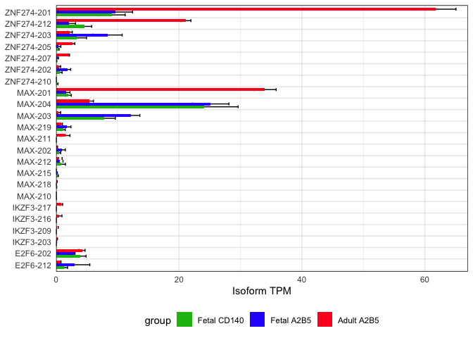

Identification of differentially active transcriptional regulators
between adult and fetal hGPCs
================
John Mariani
03/06/23

``` r
library(ggplot2)
library(tximport)
library(matrixStats)
library(data.table)
```

## Process isoform data

``` r
#Read in RSEM gene output
temp = list.files(path = "./data_for_import/isoforms", pattern="isoforms.results")

names(temp) <- substr(temp,1,nchar(temp)-22)

txi.rsem.isoforms <- tximport(paste0("./data_for_import/isoforms/",temp), txIn = T, txOut = T, type = "rsem")
```

    ## reading in files with read_tsv

    ## 1 2 3 4 5 6 7 8 9 10 11 12 13

``` r
colnames(txi.rsem.isoforms)
```

    ## NULL

``` r
for(i in 1:3){
  colnames(txi.rsem.isoforms[[i]]) <- names(temp)
}


isoformTPM <- txi.rsem.isoforms$abundance


filename="data_for_import/ensembl_transcript_list.csv"
if(file.exists(filename)){
  ensemblTranscriptListH <- read.csv(filename)} else{
    marth <- useMart(biomart = "ENSEMBL_MART_ENSEMBL", dataset = "hsapiens_gene_ensembl", host = 'http://jan2019.archive.ensembl.org/', ensemblRedirect = T)
    ensemblTranscriptListH <- getBM(attributes = c("ensembl_transcript_id", "external_transcript_name", "ensembl_gene_id","external_gene_name", "gene_biotype", "transcript_biotype", "description"), filters = "ensembl_transcript_id",values = row.names(isoformTPM), mart = marth)
    write.csv(ensemblTranscriptListH, filename, row.names = F)
  }


isoformTPM <- merge(isoformTPM, ensemblTranscriptListH, by.x = 0, by.y = "ensembl_transcript_id")
```

### Make Isoform graph

### Only protein-coding

``` r
adultRepressors <- isoformTPM[isoformTPM$external_gene_name %in% c("E2F6", "MAX", "ZNF274", "IKZF3"),]

adultRepressors$adultMean <- rowMeans(adultRepressors[,2:4])
adultRepressors$adultSE<- rowSds(as.matrix(adultRepressors[,2:4])) / sqrt(3)

adultRepressors$cd140Mean <- rowMeans(adultRepressors[,c(5:7,11:14)])
adultRepressors$cd140SE<- rowSds(as.matrix(adultRepressors[,c(5:7,11:14)])) / sqrt(7)

adultRepressors$a2b5Mean <- rowMeans(adultRepressors[,8:10])
adultRepressors$a2b5SE<- rowSds(as.matrix(adultRepressors[,8:10])) / sqrt(3)

adultRepressors <- adultRepressors[rowMeans(adultRepressors[,c(21,23,25)]) > 0,]

adultRepressors <- rbindlist(list(adultRepressors[,c(15,17,19,21,22)], adultRepressors[,c(15,17,19,23,24)], adultRepressors[,c(15,17,19,25,26)]))
```

    ## Column 4 ['cd140Mean'] of item 2 is missing in item 1. Use fill=TRUE to fill with NA (NULL for list columns), or use.names=FALSE to ignore column names. use.names='check' (default from v1.12.2) emits this message and proceeds as if use.names=FALSE for  backwards compatibility. See news item 5 in v1.12.2 for options to control this message.

``` r
adultRepressors$group <- c(rep("Adult A2B5", 39), rep("Fetal CD140", 39), rep("Fetal A2B5", 39))

adultRepressors <- adultRepressors[order(adultRepressors$external_gene_name, adultRepressors$adultMean, decreasing = T),]
adultRepressors$external_transcript_name <- factor(adultRepressors$external_transcript_name, levels = rev(adultRepressors[!duplicated(adultRepressors$external_transcript_name),]$external_transcript_name))
adultRepressors$group <- factor(adultRepressors$group, levels = rev(c("Adult A2B5", "Fetal A2B5", "Fetal CD140")))

adultRepressorsPC <- adultRepressors[adultRepressors$transcript_biotype == "protein_coding",]


limits <- aes(ymax = adultRepressorsPC$adultMean + adultRepressorsPC$adultSE,  
  ymin =  adultRepressorsPC$adultMean - adultRepressorsPC$adultSE)

adultRepressorsPC <- adultRepressorsPC[order(adultRepressorsPC$external_gene_name, adultRepressorsPC$adultMean, decreasing = T),]
adultRepressorsPC$external_transcript_name <- factor(adultRepressorsPC$external_transcript_name, levels = rev(adultRepressorsPC[!duplicated(adultRepressorsPC$external_transcript_name),]$external_transcript_name))


isoformPlotPC <- ggplot(adultRepressorsPC, aes(fill = group, y = adultMean, x = external_transcript_name))  + geom_errorbar(limits, position=position_dodge(.75), width = 0.75) + geom_col(width=0.75,    
  position=position_dodge(0.75))  + coord_flip() + theme_minimal() + scale_y_continuous(expand = c(0, 0), limits = c(0,67)) + theme(panel.grid.major.y = element_blank(), panel.grid.minor.y = element_blank(), panel.border = element_rect(fill  = NA), legend.position = "bottom", axis.title.y = element_blank()) + ylab("Isoform TPM") + geom_vline(xintercept = seq(0.5, length(unique(adultRepressors$external_transcript_name)), by = 1), color="lightgray", size=.5, alpha=.5) + scale_fill_manual(values = c("#18BA0F", "#2E30FF", "#ff2020"))
```

    ## Warning: Using `size` aesthetic for lines was deprecated in ggplot2 3.4.0.
    ## ℹ Please use `linewidth` instead.
    ## This warning is displayed once every 8 hours.
    ## Call `lifecycle::last_lifecycle_warnings()` to see where this warning was
    ## generated.

``` r
isoformPlotPC
```

<!-- -->

``` r
sessionInfo()
```

    ## R version 4.2.3 (2023-03-15)
    ## Platform: aarch64-apple-darwin20 (64-bit)
    ## Running under: macOS Ventura 13.2.1
    ## 
    ## Matrix products: default
    ## BLAS:   /Library/Frameworks/R.framework/Versions/4.2-arm64/Resources/lib/libRblas.0.dylib
    ## LAPACK: /Library/Frameworks/R.framework/Versions/4.2-arm64/Resources/lib/libRlapack.dylib
    ## 
    ## locale:
    ## [1] en_US.UTF-8/en_US.UTF-8/en_US.UTF-8/C/en_US.UTF-8/en_US.UTF-8
    ## 
    ## attached base packages:
    ## [1] stats     graphics  grDevices utils     datasets  methods   base     
    ## 
    ## other attached packages:
    ## [1] data.table_1.14.8  matrixStats_0.63.0 tximport_1.26.1    ggplot2_3.4.2     
    ## 
    ## loaded via a namespace (and not attached):
    ##  [1] highr_0.10       pillar_1.9.0     compiler_4.2.3   tools_4.2.3     
    ##  [5] bit_4.0.5        digest_0.6.31    evaluate_0.20    lifecycle_1.0.3 
    ##  [9] tibble_3.2.1     gtable_0.3.3     pkgconfig_2.0.3  rlang_1.1.0     
    ## [13] cli_3.6.1        rstudioapi_0.14  parallel_4.2.3   yaml_2.3.7      
    ## [17] xfun_0.38        fastmap_1.1.1    withr_2.5.0      dplyr_1.1.1     
    ## [21] knitr_1.42       generics_0.1.3   vctrs_0.6.1      hms_1.1.3       
    ## [25] bit64_4.0.5      rprojroot_2.0.3  grid_4.2.3       tidyselect_1.2.0
    ## [29] glue_1.6.2       R6_2.5.1         fansi_1.0.4      vroom_1.6.1     
    ## [33] rmarkdown_2.21   farver_2.1.1     readr_2.1.4      tzdb_0.3.0      
    ## [37] magrittr_2.0.3   scales_1.2.1     htmltools_0.5.5  colorspace_2.1-0
    ## [41] labeling_0.4.2   utf8_1.2.3       munsell_0.5.0    crayon_1.5.2
