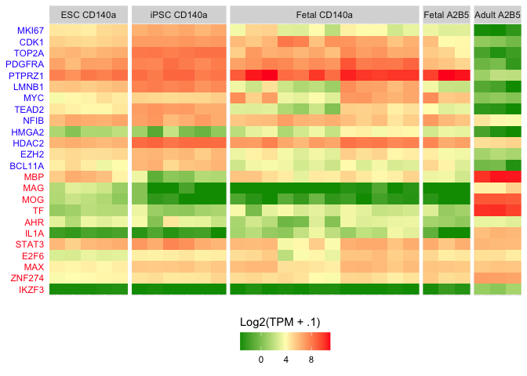

Comparison of ESC- and iPSC-derived hGPCs to primary and adult hGPCs
================
John Mariani
10/11/23

``` r
library(ggplot2)
library(tximport)
library(dplyr)
library(plyr)
library(tidyr)
```

### Load prior data

``` r
ensemblGeneListH <- read.csv("data_for_import/ensemblGeneList.csv")
de_intersect <- read.delim("output/de_Adult_vs_Fetal_Intersect.txt")
```

### Comparison to iPSC line C27

``` r
#Read in RSEM gene output
sampleTableGPC <- read.csv("data_for_import/sampleTableGPC.csv")
nrow(sampleTableGPC)
```

    ## [1] 29

``` r
temp = list.files(path = "./data_for_import/genes", pattern="genes.results")
length(temp)
```

    ## [1] 34

``` r
names(temp) <- substr(temp, 1, nchar(temp)-19)
temp <- temp[names(temp) %in% sampleTableGPC$sample]


txi.rsem.gpc <- tximport(paste0("./data_for_import/genes/",temp), type = "rsem")
```

    ## It looks like you are importing RSEM genes.results files, setting txIn=FALSE

    ## reading in files with read_tsv

    ## 1 2 3 4 5 6 7 8 9 10 11 12 13 14 15 16 17 18 19 20 21 22 23 24 25 26 27 28 29

``` r
for(i in 1:3){
  colnames(txi.rsem.gpc[[i]]) <- names(temp)
}


sampleTableGPC <- sampleTableGPC[match(names(temp), sampleTableGPC$sample),]
```

### GPC Heatmap

``` r
markerHMgenes <- c("MKI67", "CDK1", "TOP2A", "PDGFRA", "PTPRZ1", "LMNB1", "MYC", "TEAD2", "NFIB", "HMGA2", "HDAC2", "EZH2", "BCL11A", "MBP", "MAG", "MOG", "TF", "AHR", "IL1A","STAT3", "E2F6", "MAX", "ZNF274", "IKZF3")


markerTPM <- merge(txi.rsem.gpc$abundance, ensemblGeneListH, by.x = 0, by.y = "ensembl_gene_id")
markerTPM <- markerTPM[markerTPM$external_gene_name %in% markerHMgenes,]


markerTPM <- markerTPM[,1:31] %>%
  pivot_longer(-c(Row.names, external_gene_name), names_to = "Sample", values_to = "TPM")

markerTPM$group <- mapvalues(markerTPM$Sample,sampleTableGPC$sample, as.character(sampleTableGPC$label))

markerTPM$TPM <- log2(markerTPM$TPM + .1)

markerTPM$group <- factor(markerTPM$group, levels =c("ESC CD140a", "iPSC CD140a", "Fetal CD140a", "Fetal A2B5", "Adult A2B5"))
markerTPM$external_gene_name <- factor(markerTPM$external_gene_name, levels = rev(c(markerHMgenes)))


###

gpcHMgg <- ggplot(markerTPM, aes(Sample, external_gene_name)) + geom_tile(aes(fill = TPM)) + 
  theme(panel.spacing.y = unit(.5, "lines"), 
        panel.spacing.x = unit(.25,"lines"), 
        axis.title.x = element_blank(), 
        axis.title.y = element_blank(), 
        axis.text.x = element_blank(), 
        axis.ticks.y = element_blank(), 
        axis.text.y = element_text(colour = ifelse(levels(markerTPM$external_gene_name) %in% de_intersect[de_intersect$log2FoldChange > 0,]$external_gene_name, "#FF2020", "#2E30FF")))  + 
  scale_fill_gradientn(colours = c("#009900","#fffcbd","#ff2020"), guide = guide_colourbar(direction = "horizontal", title = "Log2(TPM + .1)", title.position = "top")) + scale_x_discrete(expand = c(0, 0))  + theme(axis.ticks.x = element_blank(), legend.position = "bottom", legend.direction = "horizontal") + facet_grid(cols = vars(group), scales = "free", space  = "free")


gpcHMgg
```

<!-- -->

``` r
#ggsave("figures/ExFig4/gpcHMgg.pdf", units = "in", dpi = 300, width = 16, height = 8, device = NULL)
```

## Source Data

``` r
sdS4A <- markerTPM
sdS4A <- sdS4A[,c(2:4)]

sdS4A <- pivot_wider(data = sdS4A,  names_from = Sample, id_cols = external_gene_name, values_from = TPM)
names(sdS4A)[2:4] <- paste0("Adult_", names(sdS4A)[2:4])
names(sdS4A)[1] <- "Gene"

sdS4A <- as.data.frame(sdS4A)

#write.xlsx(sdS4A, file = "Source Data/Source_Data_FigS4.xlsx", sheetName = "FigS4A", row.names = F)
```

``` r
sessionInfo()
```

    ## R version 4.2.3 (2023-03-15)
    ## Platform: aarch64-apple-darwin20 (64-bit)
    ## Running under: macOS Ventura 13.2.1
    ## 
    ## Matrix products: default
    ## BLAS:   /Library/Frameworks/R.framework/Versions/4.2-arm64/Resources/lib/libRblas.0.dylib
    ## LAPACK: /Library/Frameworks/R.framework/Versions/4.2-arm64/Resources/lib/libRlapack.dylib
    ## 
    ## locale:
    ## [1] en_US.UTF-8/en_US.UTF-8/en_US.UTF-8/C/en_US.UTF-8/en_US.UTF-8
    ## 
    ## attached base packages:
    ## [1] stats     graphics  grDevices utils     datasets  methods   base     
    ## 
    ## other attached packages:
    ## [1] tidyr_1.3.0     plyr_1.8.8      dplyr_1.1.1     tximport_1.26.1
    ## [5] ggplot2_3.4.2  
    ## 
    ## loaded via a namespace (and not attached):
    ##  [1] Rcpp_1.0.10      highr_0.10       pillar_1.9.0     compiler_4.2.3  
    ##  [5] tools_4.2.3      bit_4.0.5        digest_0.6.31    evaluate_0.20   
    ##  [9] lifecycle_1.0.3  tibble_3.2.1     gtable_0.3.3     pkgconfig_2.0.3 
    ## [13] rlang_1.1.0      cli_3.6.1        rstudioapi_0.14  parallel_4.2.3  
    ## [17] yaml_2.3.7       xfun_0.38        fastmap_1.1.1    withr_2.5.0     
    ## [21] knitr_1.42       hms_1.1.3        generics_0.1.3   vctrs_0.6.1     
    ## [25] bit64_4.0.5      rprojroot_2.0.3  grid_4.2.3       tidyselect_1.2.0
    ## [29] glue_1.6.2       R6_2.5.1         fansi_1.0.4      vroom_1.6.1     
    ## [33] rmarkdown_2.21   farver_2.1.1     tzdb_0.3.0       purrr_1.0.1     
    ## [37] readr_2.1.4      magrittr_2.0.3   scales_1.2.1     htmltools_0.5.5 
    ## [41] colorspace_2.1-0 labeling_0.4.2   utf8_1.2.3       munsell_0.5.0   
    ## [45] crayon_1.5.2
