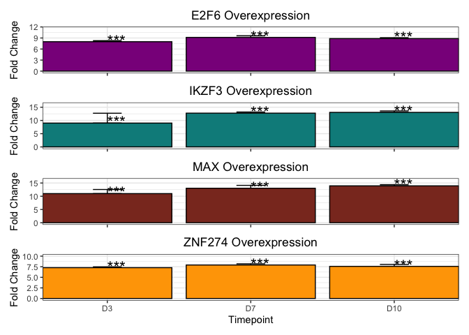

qPCR Analysis of Adult Repressor OE in C27 hGPCs
================
John Mariani
03/06/23

``` r
library(tidyverse)
```

    ## ── Attaching core tidyverse packages ──────────────────────── tidyverse 2.0.0 ──
    ## ✔ dplyr     1.1.1     ✔ readr     2.1.4
    ## ✔ forcats   1.0.0     ✔ stringr   1.5.0
    ## ✔ ggplot2   3.4.2     ✔ tibble    3.2.1
    ## ✔ lubridate 1.9.2     ✔ tidyr     1.3.0
    ## ✔ purrr     1.0.1     
    ## ── Conflicts ────────────────────────────────────────── tidyverse_conflicts() ──
    ## ✖ dplyr::filter() masks stats::filter()
    ## ✖ dplyr::lag()    masks stats::lag()
    ## ℹ Use the conflicted package (<http://conflicted.r-lib.org/>) to force all conflicts to become errors

``` r
library(lsmeans)
```

    ## Loading required package: emmeans
    ## The 'lsmeans' package is now basically a front end for 'emmeans'.
    ## Users are encouraged to switch the rest of the way.
    ## See help('transition') for more information, including how to
    ## convert old 'lsmeans' objects and scripts to work with 'emmeans'.

``` r
library(ggplot2)
library(patchwork)
library(cowplot)
```

    ## 
    ## Attaching package: 'cowplot'
    ## 
    ## The following object is masked from 'package:patchwork':
    ## 
    ##     align_plots
    ## 
    ## The following object is masked from 'package:lubridate':
    ## 
    ##     stamp

``` r
library(plyr)
```

    ## ------------------------------------------------------------------------------
    ## You have loaded plyr after dplyr - this is likely to cause problems.
    ## If you need functions from both plyr and dplyr, please load plyr first, then dplyr:
    ## library(plyr); library(dplyr)
    ## ------------------------------------------------------------------------------
    ## 
    ## Attaching package: 'plyr'
    ## 
    ## The following objects are masked from 'package:dplyr':
    ## 
    ##     arrange, count, desc, failwith, id, mutate, rename, summarise,
    ##     summarize
    ## 
    ## The following object is masked from 'package:purrr':
    ## 
    ##     compact

\##Read in CTs and organize data

``` r
cts <- read.csv("data_for_import/overexpressionCTs.csv", stringsAsFactors = F)
cts$Condition  <- trimws(cts$Condition, which = "both")


rubric <- unique(cts$Condition)
rubric
```

    ## [1] "C" "E" "I" "M" "Z"

``` r
names(rubric) <- c("Dox", "E2F6", "IKZF3", "MAX", "ZNF274")
cts$Condition <- mapvalues(cts$Condition, from = rubric, names(rubric))

cts <- tibble(cts)

ctsLonger <- pivot_longer(cts, cols = c("MKI67", "CDK1", "CDKN1A", "CDKN2A", "IL1A", "MBP", "PDGFRA"), values_to = "deltaCT", names_to = "Gene")
ctsLonger <- ctsLonger[!is.na(ctsLonger$deltaCT),]

ctsLonger$group <- paste0(ctsLonger$Gene, "_", ctsLonger$Timepoint)
```

## Calculate Delta CTs

``` r
DoxAverages <- data.frame(group = unique(ctsLonger$group))

DoxAverages$DoxAverage <- NA

for(i in DoxAverages$group){
  tempMean <- mean(ctsLonger[ctsLonger$group == i & ctsLonger$Condition == "Dox",]$deltaCT)
  DoxAverages[DoxAverages$group == i,]$DoxAverage <- tempMean
}

ctsLonger$deltaDeltaCT <- NA

for(i in 1:nrow(ctsLonger)){
  ctsLonger$deltaDeltaCT[i] <-  ctsLonger$deltaCT[i] - DoxAverages[DoxAverages$group == ctsLonger$group[i],]$DoxAverage
}

ctsLonger$FC <- 2^-ctsLonger$deltaDeltaCT
ctsLonger$Timepoint <- factor(ctsLonger$Timepoint, levels = c("D3", "D7", "D10"))

ctsLonger$conditionTP <- paste0(ctsLonger$Condition, "_", ctsLonger$Timepoint)


summaryFCs <- ctsLonger %>% 
  group_by(Condition, Timepoint, Gene) %>% 
  dplyr::summarise(meanFC = mean(FC),
            std = sd(FC),
            n = n())
```

    ## `summarise()` has grouped output by 'Condition', 'Timepoint'. You can override
    ## using the `.groups` argument.

``` r
summaryFCs2 <- summaryFCs %>%
  group_by(Timepoint, Gene,) %>%
  dplyr::summarise(adjustedFC = meanFC / meanFC[Condition == "Dox"],
            temp = meanFC[Condition == "Dox"],
            Condition = Condition,
            std = std, 
            n = n)
```

    ## Warning: Returning more (or less) than 1 row per `summarise()` group was deprecated in
    ## dplyr 1.1.0.
    ## ℹ Please use `reframe()` instead.
    ## ℹ When switching from `summarise()` to `reframe()`, remember that `reframe()`
    ##   always returns an ungrouped data frame and adjust accordingly.
    ## Call `lifecycle::last_lifecycle_warnings()` to see where this warning was
    ## generated.

    ## `summarise()` has grouped output by 'Timepoint', 'Gene'. You can override using
    ## the `.groups` argument.

``` r
summaryFCs2$std <- summaryFCs2$std / summaryFCs2$temp
summaryFCs2$SE <- summaryFCs2$std / (summaryFCs2$n^.5)

summaryFCs2$Gene <- factor(summaryFCs2$Gene, levels = c("MKI67", "CDK1", "PDGFRA", "CDKN1A", "CDKN2A", "IL1A", "MBP"))
```

\##Calculate LM Significance with lsmeans

``` r
for(i in 1:length(unique(ctsLonger$Gene))){
  gene <- unique(ctsLonger$Gene)[i]
  anovaGene <- ctsLonger[ctsLonger$Gene == gene,]
  lm1 <- lm(deltaCT~Condition * Timepoint + Replicate, anovaGene)
  tempSummary <- summary(lsmeans(lm1, ~ Condition | Timepoint) %>%
                           contrast("trt.vs.ctrl", ref = 1) %>%
                           update(by = NULL, adjust = "bh"))
  
  tempSummary$Condition <- gsub( " .*$", "",tempSummary$contrast)
  tempSummary$Gene <- gene
  tempSummary$sig <- ifelse(tempSummary$p.value < .001, "***", 
                            ifelse(tempSummary$p.value < .01, "**", 
                                   ifelse(tempSummary$p.value < .05, "*", 
                                          ifelse(tempSummary$p.value < .1, "", ""))))
  if(i == 1){
    lmSummary <- tempSummary
  } else {
    lmSummary <- rbind(lmSummary, tempSummary)
  }
}
```

## Make Heat map

``` r
lmSummary$concat <- paste(lmSummary$Condition, lmSummary$Timepoint, lmSummary$Gene, sep = "_")
summaryFCs2$concat <- paste(summaryFCs2$Condition, summaryFCs2$Timepoint, summaryFCs2$Gene, sep = "_")
summaryFCs2$sig <- ""

summaryFCs2[summaryFCs2$concat %in% lmSummary$concat,]$sig <- mapvalues(x = summaryFCs2[summaryFCs2$concat %in% lmSummary$concat,]$concat, from = lmSummary$concat, to = lmSummary$sig, )

summaryFCs3 <- summaryFCs2
summaryFCs3$Gene <- factor(summaryFCs3$Gene, levels = rev(levels(summaryFCs3$Gene)))


targetGG <- ggplot(summaryFCs3[summaryFCs2$Condition != "Dox",], aes(Timepoint, Gene)) + geom_tile(aes(fill = log2(adjustedFC)), colour = "black") +
  facet_grid(cols = vars(Timepoint, Condition), scales = "free", space  = "free") +
  scale_fill_gradientn(colours = c("darkblue","lightgrey","red"), values = scales::rescale(c(-.7,-.1,.7)), guide = guide_colourbar(direction = "horizontal", title = "Log2 FC vs Timepoint Dox Control", title.position = "top")) +
  theme(panel.spacing.x = unit(0,"lines"), axis.text.x = element_blank(), axis.ticks.x = element_blank(), legend.position = "bottom", axis.title.x = element_blank()) +
  scale_x_discrete(expand = c(0,0)) + scale_y_discrete(expand = c(0,0)) + 
  geom_text(aes(label = sig), size = 8)

targetGG
```

<!-- -->

## Gene overexpression graphs

``` r
cts <- read.csv("data_for_import/repressorCTs.csv", stringsAsFactors = F)
cts$Condition  <- trimws(cts$Condition, which = "both")


rubric <- unique(cts$Condition)
rubric
```

    ## [1] "E" "I" "M" "Z" "C"

``` r
names(rubric) <- c("E2F6", "IKZF3", "MAX", "ZNF274", "Dox")
cts$Condition <- mapvalues(cts$Condition, from = rubric, names(rubric))


cts <- tibble(cts)

ctsLonger <- pivot_longer(cts, cols = c("E2F6", "IKZF3", "MAX", "ZNF274"), values_to = "deltaCT", names_to = "Gene")
ctsLonger <- ctsLonger[!is.na(ctsLonger$deltaCT),]


ctsLonger$group <- paste0(ctsLonger$Gene, "_", ctsLonger$Timepoint)
```

## Calculate Delta CTs

``` r
DoxAverages <- data.frame(group = unique(ctsLonger$group))

DoxAverages$DoxAverage <- NA

for(i in DoxAverages$group){
  tempMean <- mean(ctsLonger[ctsLonger$group == i & ctsLonger$Condition == "Dox",]$deltaCT)
  DoxAverages[DoxAverages$group == i,]$DoxAverage <- tempMean
}

ctsLonger$deltaDeltaCT <- NA

for(i in 1:nrow(ctsLonger)){
  ctsLonger$deltaDeltaCT[i] <-  ctsLonger$deltaCT[i] - DoxAverages[DoxAverages$group == ctsLonger$group[i],]$DoxAverage
}


ctsLonger$FC <- 2^-ctsLonger$deltaDeltaCT
ctsLonger$Timepoint <- factor(ctsLonger$Timepoint, levels = c("D3", "D7", "D10"))


DoxAverages10 <- DoxAverages

for(i in DoxAverages10$group){
  tempMean <- mean(ctsLonger[ctsLonger$group == i & ctsLonger$Condition == "Dox",]$FC)
  DoxAverages10[DoxAverages10$group == i,]$DoxAverage <- tempMean
}


ctsLonger$adjFC <- NA

for(i in 1:nrow(ctsLonger)){
  ctsLonger$adjFC[i] <-  ctsLonger$FC[i] / DoxAverages10[DoxAverages10$group == ctsLonger$group[i],]$DoxAverage
}

ctsLonger$adjFC <- log2(ctsLonger$adjFC)

ctsLonger$conditionTP <- paste0(ctsLonger$Condition, "_", ctsLonger$Timepoint)


summaryFCs <- ctsLonger %>% 
  group_by(Condition, Timepoint, Gene) %>% 
  dplyr::summarise(adjustedFC = mean(adjFC),
            std = sd(adjFC),
            n = n())
```

    ## `summarise()` has grouped output by 'Condition', 'Timepoint'. You can override
    ## using the `.groups` argument.

``` r
summaryFCs2 <- summaryFCs

summaryFCs2$SE <- summaryFCs2$std / (summaryFCs2$n^.5)
```

## Calculate statistics with lsmeans

``` r
for(i in 1:length(unique(ctsLonger$Gene))){
  gene <- unique(ctsLonger$Gene)[i]
  anovaGene <- ctsLonger[ctsLonger$Gene == gene,]
  lm1 <- lm(deltaCT~Condition * Timepoint + Replicate, anovaGene)
  tempSummary <- summary(lsmeans(lm1, ~ Condition | Timepoint) %>%
                           contrast("trt.vs.ctrl", ref = 1) %>%
                           update(by = NULL, adjust = "bh"))
  
  tempSummary$Condition <- gsub( " .*$", "",tempSummary$contrast)
  tempSummary$Gene <- gene
  tempSummary$sig <- ifelse(tempSummary$p.value < .001, "***", 
                            ifelse(tempSummary$p.value < .01, "**", 
                                   ifelse(tempSummary$p.value < .05, "*", 
                                          ifelse(tempSummary$p.value < .1, "", ""))))
  if(i == 1){
    lmSummary <- tempSummary
  } else {
    lmSummary <- rbind(lmSummary, tempSummary)
  }
}
```

## Make Plots

``` r
lmSummary$concat <- paste(lmSummary$Condition, lmSummary$Timepoint, lmSummary$Gene, sep = "_")
summaryFCs2$concat <- paste(summaryFCs2$Condition, summaryFCs2$Timepoint, summaryFCs2$Gene, sep = "_")
summaryFCs2$sig <- ""

summaryFCs2[summaryFCs2$concat %in% lmSummary$concat,]$sig <- mapvalues(x = summaryFCs2[summaryFCs2$concat %in% lmSummary$concat,]$concat, from = lmSummary$concat, to = lmSummary$sig, )


OE <- ggplot(summaryFCs2[summaryFCs2$Condition != "Dox",], aes(fill = Condition, x = Timepoint, y = adjustedFC, label = sig)) + 
  geom_errorbar(aes(ymin=adjustedFC, ymax=adjustedFC+SE), width=.2,
                position=position_dodge(.9)) + geom_bar(position = "dodge", stat = "summary", colour = "black") + theme_bw() + 
  labs(y = "Fold Change") + geom_text(vjust = .4, position = position_dodge(width = .9), size = 6, angle = 90, hjust = 0) + facet_wrap(~Gene, scales = "free", nrow = 4) + theme(legend.position = "bottom") +
  scale_x_discrete(expand = c(0,0)) + scale_y_continuous(expand = c(0,126))

oeLegend <- get_legend(OE)
```

    ## No summary function supplied, defaulting to `mean_se()`
    ## No summary function supplied, defaulting to `mean_se()`
    ## No summary function supplied, defaulting to `mean_se()`
    ## No summary function supplied, defaulting to `mean_se()`

``` r
E2F6 <- ggplot(summaryFCs2[summaryFCs2$Condition == "E2F6",], aes(x = Timepoint, y = adjustedFC, label = sig)) + 
  geom_errorbar(aes(ymin=adjustedFC, ymax=adjustedFC+SE), width=.2,
                position=position_dodge(.9)) + geom_bar(position = "dodge", stat = "summary", colour = "black", fill = "darkmagenta") + theme_bw() + 
  labs(y = "Fold Change") + geom_text(vjust = .4, position = position_dodge(width = .9), size = 6, angle = 0, hjust = 0) + theme(legend.position = "none", axis.text.x = element_blank(), axis.title.x = element_blank(), plot.title = element_text(hjust = 0.5)) +
  scale_x_discrete(expand = c(0,0)) + ggtitle("E2F6 Overexpression") + ylim(c(0,11.5))

IKZF3 <- ggplot(summaryFCs2[summaryFCs2$Condition == "IKZF3",], aes(x = Timepoint, y = adjustedFC, label = sig)) + 
  geom_errorbar(aes(ymin=adjustedFC, ymax=adjustedFC+SE), width=.2,
                position=position_dodge(.9)) + geom_bar(position = "dodge", stat = "summary", colour = "black", fill = "forestgreen") + theme_bw() + 
  labs(y = "Fold Change") + geom_text(vjust = .4, position = position_dodge(width = .9), size = 6, angle = 0, hjust = 0) + theme(legend.position = "none", axis.text.x = element_blank(), axis.title.x = element_blank(), plot.title = element_text(hjust = 0.5)) +
  scale_x_discrete(expand = c(0,0)) + ggtitle("IKZF3 Overexpression") + ylim(c(0,16))

MAX <- ggplot(summaryFCs2[summaryFCs2$Condition == "MAX",], aes(x = Timepoint, y = adjustedFC, label = sig)) + 
  geom_errorbar(aes(ymin=adjustedFC, ymax=adjustedFC+SE), width=.2,
                position=position_dodge(.9)) + geom_bar(position = "dodge", stat = "summary", colour = "black", fill = "cyan4") + theme_bw() + 
  labs(y = "Fold Change") + geom_text(vjust = .4, position = position_dodge(width = .9), size = 6, angle = 0, hjust = 0) + theme(legend.position = "none", axis.text.x = element_blank(), axis.title.x = element_blank(), plot.title = element_text(hjust = 0.5)) +
  scale_x_discrete(expand = c(0,0)) + ggtitle("MAX Overexpression") + ylim(c(0,16))

ZNF274 <- ggplot(summaryFCs2[summaryFCs2$Condition == "ZNF274",], aes(x = Timepoint, y = adjustedFC, label = sig)) + 
  geom_errorbar(aes(ymin=adjustedFC, ymax=adjustedFC+SE), width=.2,
                position=position_dodge(.9)) + geom_bar(position = "dodge", stat = "summary", colour = "black", fill = "orange") + theme_bw() + 
  labs(y = "Fold Change") + geom_text(vjust = .4, position = position_dodge(width = .9), size = 6, angle = 0, hjust = 0) + theme(legend.position = "none", plot.title = element_text(hjust = 0.5)) +
  scale_x_discrete(expand = c(0,0)) + ggtitle("ZNF274 Overexpression") + ylim(c(0,10))

qpcrGGs <- ((E2F6 / IKZF3 / MAX / ZNF274) | targetGG) + plot_layout(widths = c(1,2))

qpcrGGs
```

    ## No summary function supplied, defaulting to `mean_se()`
    ## No summary function supplied, defaulting to `mean_se()`
    ## No summary function supplied, defaulting to `mean_se()`
    ## No summary function supplied, defaulting to `mean_se()`

<!-- -->

``` r
saveRDS(qpcrGGs, "RDS/qpcrGGs.rds")
```

``` r
sessionInfo()
```

    ## R version 4.2.3 (2023-03-15)
    ## Platform: aarch64-apple-darwin20 (64-bit)
    ## Running under: macOS Ventura 13.2.1
    ## 
    ## Matrix products: default
    ## BLAS:   /Library/Frameworks/R.framework/Versions/4.2-arm64/Resources/lib/libRblas.0.dylib
    ## LAPACK: /Library/Frameworks/R.framework/Versions/4.2-arm64/Resources/lib/libRlapack.dylib
    ## 
    ## locale:
    ## [1] en_US.UTF-8/en_US.UTF-8/en_US.UTF-8/C/en_US.UTF-8/en_US.UTF-8
    ## 
    ## attached base packages:
    ## [1] stats     graphics  grDevices utils     datasets  methods   base     
    ## 
    ## other attached packages:
    ##  [1] plyr_1.8.8      cowplot_1.1.1   patchwork_1.1.2 lsmeans_2.30-0 
    ##  [5] emmeans_1.8.5   lubridate_1.9.2 forcats_1.0.0   stringr_1.5.0  
    ##  [9] dplyr_1.1.1     purrr_1.0.1     readr_2.1.4     tidyr_1.3.0    
    ## [13] tibble_3.2.1    ggplot2_3.4.2   tidyverse_2.0.0
    ## 
    ## loaded via a namespace (and not attached):
    ##  [1] Rcpp_1.0.10        highr_0.10         pillar_1.9.0       compiler_4.2.3    
    ##  [5] tools_4.2.3        digest_0.6.31      timechange_0.2.0   evaluate_0.20     
    ##  [9] lifecycle_1.0.3    gtable_0.3.3       pkgconfig_2.0.3    rlang_1.1.0       
    ## [13] cli_3.6.1          rstudioapi_0.14    yaml_2.3.7         mvtnorm_1.1-3     
    ## [17] xfun_0.38          fastmap_1.1.1      withr_2.5.0        knitr_1.42        
    ## [21] generics_0.1.3     vctrs_0.6.1        hms_1.1.3          rprojroot_2.0.3   
    ## [25] grid_4.2.3         tidyselect_1.2.0   glue_1.6.2         R6_2.5.1          
    ## [29] fansi_1.0.4        rmarkdown_2.21     farver_2.1.1       tzdb_0.3.0        
    ## [33] magrittr_2.0.3     scales_1.2.1       htmltools_0.5.5    xtable_1.8-4      
    ## [37] colorspace_2.1-0   labeling_0.4.2     utf8_1.2.3         estimability_1.4.1
    ## [41] stringi_1.7.12     munsell_0.5.0      crayon_1.5.2
