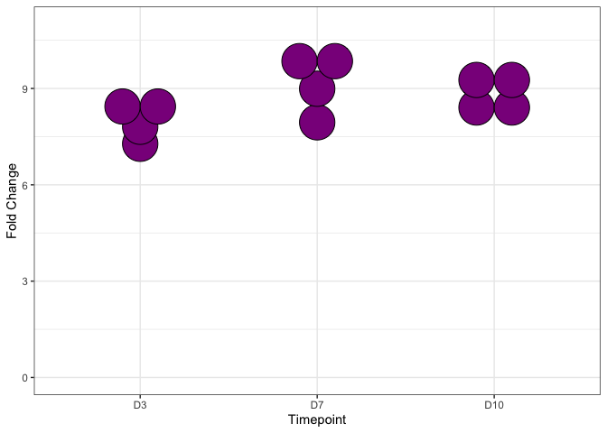

qPCR and ICC Analysis of Adult Repressor OE in ESC- or iSPC-derived
hGPCs
================
John Mariani
10/12/23

``` r
library(tidyverse)
library(emmeans)
library(ggplot2)
library(patchwork)
library(cowplot)
library(plyr)
library(xlsx)
```

## Gene overexpression graphs

``` r
cts <- read.csv("data_for_import/repressorCTs.csv", stringsAsFactors = F)
cts$Condition  <- trimws(cts$Condition, which = "both")


rubric <- unique(cts$Condition)
rubric
```

    ## [1] "E" "I" "M" "Z" "C"

``` r
names(rubric) <- c("E2F6", "IKZF3", "MAX", "ZNF274", "Dox")
cts$Condition <- mapvalues(cts$Condition, from = rubric, names(rubric))


cts <- tibble(cts)

ctsLonger <- pivot_longer(cts, cols = c("E2F6", "IKZF3", "MAX", "ZNF274"), values_to = "deltaCT", names_to = "Gene")
ctsLonger <- ctsLonger[!is.na(ctsLonger$deltaCT),]


ctsLonger$group <- paste0(ctsLonger$Gene, "_", ctsLonger$Timepoint)
```

## Calculate Delta CTs

``` r
DoxAverages <- data.frame(group = unique(ctsLonger$group))

DoxAverages$DoxAverage <- NA

for(i in DoxAverages$group){
  tempMean <- mean(ctsLonger[ctsLonger$group == i & ctsLonger$Condition == "Dox",]$deltaCT)
  DoxAverages[DoxAverages$group == i,]$DoxAverage <- tempMean
}

ctsLonger$deltaDeltaCT <- NA

for(i in 1:nrow(ctsLonger)){
  ctsLonger$deltaDeltaCT[i] <-  ctsLonger$deltaCT[i] - DoxAverages[DoxAverages$group == ctsLonger$group[i],]$DoxAverage
}


ctsLonger$FC <- 2^-ctsLonger$deltaDeltaCT
ctsLonger$Timepoint <- factor(ctsLonger$Timepoint, levels = c("D3", "D7", "D10"))


DoxAverages10 <- DoxAverages

for(i in DoxAverages10$group){
  tempMean <- mean(ctsLonger[ctsLonger$group == i & ctsLonger$Condition == "Dox",]$FC)
  DoxAverages10[DoxAverages10$group == i,]$DoxAverage <- tempMean
}


ctsLonger$adjFC <- NA

for(i in 1:nrow(ctsLonger)){
  ctsLonger$adjFC[i] <-  ctsLonger$FC[i] / DoxAverages10[DoxAverages10$group == ctsLonger$group[i],]$DoxAverage
}

ctsLonger$adjFC <- log2(ctsLonger$adjFC)

ctsLonger$conditionTP <- paste0(ctsLonger$Condition, "_", ctsLonger$Timepoint)


summaryFCs <- ctsLonger %>% 
  group_by(Condition, Timepoint, Gene) %>% 
  dplyr::summarise(adjustedFC = mean(adjFC),
            std = sd(adjFC),
            n = n())
```

    ## `summarise()` has grouped output by 'Condition', 'Timepoint'. You can override
    ## using the `.groups` argument.

``` r
summaryFCs2 <- summaryFCs

summaryFCs2$SE <- summaryFCs2$std / (summaryFCs2$n^.5)
```

## Calculate statistics with emmeans

``` r
for(i in 1:length(unique(ctsLonger$Gene))){
  gene <- unique(ctsLonger$Gene)[i]
  anovaGene <- ctsLonger[ctsLonger$Gene == gene,]
  lm1 <- lm(deltaCT~Condition * Timepoint + Replicate, anovaGene)
  tempSummary <- summary(emmeans(lm1, ~ Condition | Timepoint) %>%
                           contrast("trt.vs.ctrl", ref = 1) %>%
                           update(by = NULL, adjust = "bh"))
  
  tempSummary$Condition <- gsub( " .*$", "",tempSummary$contrast)
  tempSummary$Gene <- gene
  tempSummary$sig <- ifelse(tempSummary$p.value < .001, "***", 
                            ifelse(tempSummary$p.value < .01, "**", 
                                   ifelse(tempSummary$p.value < .05, "*", 
                                          ifelse(tempSummary$p.value < .1, "", ""))))
  if(i == 1){
    lmSummary <- tempSummary
  } else {
    lmSummary <- rbind(lmSummary, tempSummary)
  }
}
```

## Make Plots

``` r
lmSummary$concat <- paste(lmSummary$Condition, lmSummary$Timepoint, lmSummary$Gene, sep = "_")
summaryFCs2$concat <- paste(summaryFCs2$Condition, summaryFCs2$Timepoint, summaryFCs2$Gene, sep = "_")
summaryFCs2$sig <- ""

summaryFCs2[summaryFCs2$concat %in% lmSummary$concat,]$sig <- mapvalues(x = summaryFCs2[summaryFCs2$concat %in% lmSummary$concat,]$concat, from = lmSummary$concat, to = lmSummary$sig, )


OE <- ggplot(summaryFCs2[summaryFCs2$Condition != "Dox",], aes(fill = Condition, x = Timepoint, y = adjustedFC, label = sig)) + 
  geom_errorbar(aes(ymin=adjustedFC, ymax=adjustedFC+SE), width=.2,
                position=position_dodge(.9)) + geom_bar(position = "dodge", stat = "summary", colour = "black") + theme_bw() + 
  labs(y = "Fold Change") + geom_text(vjust = .4, position = position_dodge(width = .9), size = 6, angle = 90, hjust = 0) + facet_wrap(~Gene, scales = "free", nrow = 4) + theme(legend.position = "bottom") +
  scale_x_discrete(expand = c(0,0)) + scale_y_continuous(expand = c(0,126))

oeLegend <- get_legend(OE)
```

    ## No summary function supplied, defaulting to `mean_se()`
    ## No summary function supplied, defaulting to `mean_se()`
    ## No summary function supplied, defaulting to `mean_se()`
    ## No summary function supplied, defaulting to `mean_se()`

``` r
E2F6 <- ggplot(summaryFCs2[summaryFCs2$Condition == "E2F6",], aes(x = Timepoint, y = adjustedFC, label = sig)) + 
  geom_errorbar(aes(ymin=adjustedFC, ymax=adjustedFC+SE), width=.2,
                position=position_dodge(.9)) + geom_bar(position = "dodge", stat = "summary", colour = "black", fill = "darkmagenta") + theme_bw() + 
  labs(y = "Fold Change") + geom_text(vjust = .4, position = position_dodge(width = .9), size = 6, angle = 0, hjust = 0) + theme(legend.position = "none", axis.text.x = element_blank(), axis.title.x = element_blank(), plot.title = element_text(hjust = 0.5)) +
  scale_x_discrete(expand = c(0,0)) + ggtitle("E2F6 Overexpression") + ylim(c(0,11.5))

IKZF3 <- ggplot(summaryFCs2[summaryFCs2$Condition == "IKZF3",], aes(x = Timepoint, y = adjustedFC, label = sig)) + 
  geom_errorbar(aes(ymin=adjustedFC, ymax=adjustedFC+SE), width=.2,
                position=position_dodge(.9)) + geom_bar(position = "dodge", stat = "summary", colour = "black", fill = "cyan4") + theme_bw() + 
  labs(y = "Fold Change") + geom_text(vjust = .4, position = position_dodge(width = .9), size = 6, angle = 0, hjust = 0) + theme(legend.position = "none", axis.text.x = element_blank(), axis.title.x = element_blank(), plot.title = element_text(hjust = 0.5)) +
  scale_x_discrete(expand = c(0,0)) + ggtitle("IKZF3 Overexpression") + ylim(c(0,16))

MAX <- ggplot(summaryFCs2[summaryFCs2$Condition == "MAX",], aes(x = Timepoint, y = adjustedFC, label = sig)) + 
  geom_errorbar(aes(ymin=adjustedFC, ymax=adjustedFC+SE), width=.2,
                position=position_dodge(.9)) + geom_bar(position = "dodge", stat = "summary", colour = "black", fill = "tomato4") + theme_bw() + 
  labs(y = "Fold Change") + geom_text(vjust = .4, position = position_dodge(width = .9), size = 6, angle = 0, hjust = 0) + theme(legend.position = "none", axis.text.x = element_blank(), axis.title.x = element_blank(), plot.title = element_text(hjust = 0.5)) +
  scale_x_discrete(expand = c(0,0)) + ggtitle("MAX Overexpression") + ylim(c(0,16))

ZNF274 <- ggplot(summaryFCs2[summaryFCs2$Condition == "ZNF274",], aes(x = Timepoint, y = adjustedFC, label = sig)) + 
  geom_errorbar(aes(ymin=adjustedFC, ymax=adjustedFC+SE), width=.2,
                position=position_dodge(.9)) + geom_bar(position = "dodge", stat = "summary", colour = "black", fill = "orange") + theme_bw() + 
  labs(y = "Fold Change") + geom_text(vjust = .4, position = position_dodge(width = .9), size = 6, angle = 0, hjust = 0) + theme(legend.position = "none", plot.title = element_text(hjust = 0.5)) +
  scale_x_discrete(expand = c(0,0)) + ggtitle("ZNF274 Overexpression") + ylim(c(0,10))

(E2F6 / IKZF3 / MAX / ZNF274)
```

    ## No summary function supplied, defaulting to `mean_se()`
    ## No summary function supplied, defaulting to `mean_se()`
    ## No summary function supplied, defaulting to `mean_se()`
    ## No summary function supplied, defaulting to `mean_se()`

<!-- -->

## Remake with dots 4C with dots

``` r
E2F6dot <- ggplot(ctsLonger[ctsLonger$Condition == "E2F6",], aes(x = Timepoint, y = adjFC)) + geom_dotplot(binaxis = "y", stackdir = "center", fill = "darkmagenta", dotsize = 3) + theme_bw() + labs(y = "Fold Change") + ylim(c(0, 11))


E2F6dot
```

    ## Bin width defaults to 1/30 of the range of the data. Pick better value with
    ## `binwidth`.

<!-- -->

``` r
IKZF3dot <- ggplot(ctsLonger[ctsLonger$Condition == "IKZF3",], aes(x = Timepoint, y = adjFC)) + geom_dotplot(binaxis = "y", stackdir = "center", fill = "cyan4", dotsize = 3) + theme_bw() + 
  labs(y = "Fold Change") + ylim(c(0, 18))

IKZF3dot
```

    ## Bin width defaults to 1/30 of the range of the data. Pick better value with
    ## `binwidth`.

<!-- -->

``` r
MAXdot <- ggplot(ctsLonger[ctsLonger$Condition == "MAX",], aes(x = Timepoint, y = adjFC)) + geom_dotplot(binaxis = "y", stackdir = "center", fill = "tomato4", dotsize = 3) + theme_bw() + 
  labs(y = "Fold Change") + ylim(c(0, 16))

MAXdot
```

    ## Bin width defaults to 1/30 of the range of the data. Pick better value with
    ## `binwidth`.

<!-- -->

``` r
ZNF274dot <- ggplot(ctsLonger[ctsLonger$Condition == "ZNF274",], aes(x = Timepoint, y = adjFC)) + geom_dotplot(binaxis = "y", stackdir = "center", fill = "orange", dotsize = 3) + theme_bw() + 
  labs(y = "Fold Change") + ylim(c(0, 10))

ZNF274dot
```

    ## Bin width defaults to 1/30 of the range of the data. Pick better value with
    ## `binwidth`.

<!-- -->

``` r
(E2F6dot / IKZF3dot / MAXdot / ZNF274dot) 
```

    ## Bin width defaults to 1/30 of the range of the data. Pick better value with
    ## `binwidth`.
    ## Bin width defaults to 1/30 of the range of the data. Pick better value with
    ## `binwidth`.
    ## Bin width defaults to 1/30 of the range of the data. Pick better value with
    ## `binwidth`.
    ## Bin width defaults to 1/30 of the range of the data. Pick better value with
    ## `binwidth`.

<!-- -->

``` r
qpcrGGsDot <- (E2F6dot / IKZF3dot / MAXdot / ZNF274dot) & theme(axis.text = element_blank(), axis.title = element_blank())
qpcrGGsDot
```

    ## Bin width defaults to 1/30 of the range of the data. Pick better value with
    ## `binwidth`.
    ## Bin width defaults to 1/30 of the range of the data. Pick better value with
    ## `binwidth`.
    ## Bin width defaults to 1/30 of the range of the data. Pick better value with
    ## `binwidth`.
    ## Bin width defaults to 1/30 of the range of the data. Pick better value with
    ## `binwidth`.

<!-- -->

``` r
ggsave("Panels/Fig4C.pdf", width = 2, height = 4)
```

    ## Bin width defaults to 1/30 of the range of the data. Pick better value with
    ## `binwidth`.
    ## Bin width defaults to 1/30 of the range of the data. Pick better value with
    ## `binwidth`.
    ## Bin width defaults to 1/30 of the range of the data. Pick better value with
    ## `binwidth`.
    ## Bin width defaults to 1/30 of the range of the data. Pick better value with
    ## `binwidth`.

``` r
E2F6dot <- ggplot(ctsLonger[ctsLonger$Condition == "E2F6",], aes(x = Timepoint, y = adjFC)) + geom_violin(fill = "darkmagenta") + geom_point(colour = "black", fill = "white", shape = 21) + theme_bw() + ggtitle("E2F6")
```

## Source Data

``` r
sd4C <- summaryFCs2
sd4C <- as.data.frame(sd4C[,c(1,2,3,4,6,7,9)])
#write.xlsx(sd4C, file = "Source Data/Source_Data_Fig4.xlsx", sheetName = "Fig4C", row.names = F)


sd4C_pVal <- lmSummary
sd4C_pVal <- sd4C_pVal[,c(1,2,9,7)]
#write.xlsx(sd4C_pVal, file = "Source Data/Source_Data_Fig4.xlsx", sheetName = "Fig4C_pVal", row.names = F, append = T)
```

## Read in CTs and organize data

``` r
cts <- read.csv("data_for_import/overexpressionCTs.csv", stringsAsFactors = F)
cts$Condition  <- trimws(cts$Condition, which = "both")


rubric <- unique(cts$Condition)
rubric
```

    ## [1] "C" "E" "I" "M" "Z"

``` r
names(rubric) <- c("Dox", "E2F6", "IKZF3", "MAX", "ZNF274")
cts$Condition <- mapvalues(cts$Condition, from = rubric, names(rubric))

cts <- tibble(cts)

ctsLonger <- pivot_longer(cts, cols = c("MKI67", "CDK1", "CDKN1A", "CDKN2A", "IL1A", "MBP", "PDGFRA"), values_to = "deltaCT", names_to = "Gene")
ctsLonger <- ctsLonger[!is.na(ctsLonger$deltaCT),]

ctsLonger$group <- paste0(ctsLonger$Gene, "_", ctsLonger$Timepoint)
```

## Calculate Delta CTs

``` r
DoxAverages <- data.frame(group = unique(ctsLonger$group))

DoxAverages$DoxAverage <- NA

for(i in DoxAverages$group){
  tempMean <- mean(ctsLonger[ctsLonger$group == i & ctsLonger$Condition == "Dox",]$deltaCT)
  DoxAverages[DoxAverages$group == i,]$DoxAverage <- tempMean
}

ctsLonger$deltaDeltaCT <- NA

for(i in 1:nrow(ctsLonger)){
  ctsLonger$deltaDeltaCT[i] <-  ctsLonger$deltaCT[i] - DoxAverages[DoxAverages$group == ctsLonger$group[i],]$DoxAverage
}

ctsLonger$FC <- 2^-ctsLonger$deltaDeltaCT
ctsLonger$Timepoint <- factor(ctsLonger$Timepoint, levels = c("D3", "D7", "D10"))

ctsLonger$conditionTP <- paste0(ctsLonger$Condition, "_", ctsLonger$Timepoint)


summaryFCs <- ctsLonger %>% 
  group_by(Condition, Timepoint, Gene) %>% 
  dplyr::summarise(meanFC = mean(FC),
            std = sd(FC),
            n = n())
```

    ## `summarise()` has grouped output by 'Condition', 'Timepoint'. You can override
    ## using the `.groups` argument.

``` r
summaryFCs2 <- summaryFCs %>%
  group_by(Timepoint, Gene,) %>%
  dplyr::summarise(adjustedFC = meanFC / meanFC[Condition == "Dox"],
            temp = meanFC[Condition == "Dox"],
            Condition = Condition,
            std = std, 
            n = n)
```

    ## Warning: Returning more (or less) than 1 row per `summarise()` group was deprecated in
    ## dplyr 1.1.0.
    ## ℹ Please use `reframe()` instead.
    ## ℹ When switching from `summarise()` to `reframe()`, remember that `reframe()`
    ##   always returns an ungrouped data frame and adjust accordingly.
    ## Call `lifecycle::last_lifecycle_warnings()` to see where this warning was
    ## generated.

    ## `summarise()` has grouped output by 'Timepoint', 'Gene'. You can override using
    ## the `.groups` argument.

``` r
summaryFCs2$std <- summaryFCs2$std / summaryFCs2$temp
summaryFCs2$SE <- summaryFCs2$std / (summaryFCs2$n^.5)

summaryFCs2$Gene <- factor(summaryFCs2$Gene, levels = c("MKI67", "CDK1", "PDGFRA", "CDKN1A", "CDKN2A", "IL1A", "MBP"))
```

## Calculate LM Significance with emmeans

``` r
for(i in 1:length(unique(ctsLonger$Gene))){
  gene <- unique(ctsLonger$Gene)[i]
  anovaGene <- ctsLonger[ctsLonger$Gene == gene,]
  lm1 <- lm(deltaCT~Condition * Timepoint + Replicate, anovaGene)
  tempSummary <- summary(emmeans(lm1, ~ Condition | Timepoint) %>%
                           contrast("trt.vs.ctrl", ref = 1) %>%
                           update(by = NULL, adjust = "bh"))
  
  tempSummary$Condition <- gsub( " .*$", "",tempSummary$contrast)
  tempSummary$Gene <- gene
  tempSummary$sig <- ifelse(tempSummary$p.value < .001, "***", 
                            ifelse(tempSummary$p.value < .01, "**", 
                                   ifelse(tempSummary$p.value < .05, "*", 
                                          ifelse(tempSummary$p.value < .1, "", ""))))
  if(i == 1){
    lmSummary <- tempSummary
  } else {
    lmSummary <- rbind(lmSummary, tempSummary)
  }
}
```

## Make Heat map

``` r
lmSummary$concat <- paste(lmSummary$Condition, lmSummary$Timepoint, lmSummary$Gene, sep = "_")
summaryFCs2$concat <- paste(summaryFCs2$Condition, summaryFCs2$Timepoint, summaryFCs2$Gene, sep = "_")
summaryFCs2$sig <- ""

summaryFCs2[summaryFCs2$concat %in% lmSummary$concat,]$sig <- mapvalues(x = summaryFCs2[summaryFCs2$concat %in% lmSummary$concat,]$concat, from = lmSummary$concat, to = lmSummary$sig, )

summaryFCs3 <- summaryFCs2
summaryFCs3$Gene <- factor(summaryFCs3$Gene, levels = rev(levels(summaryFCs3$Gene)))


targetGG <- ggplot(summaryFCs3[summaryFCs2$Condition != "Dox",], aes(Timepoint, Gene)) + geom_tile(aes(fill = log2(adjustedFC)), colour = "black") +
  facet_grid(cols = vars(Timepoint, Condition), scales = "free", space  = "free") +
  scale_fill_gradientn(colours = c("darkblue","lightgrey","red"), values = scales::rescale(c(-.7,-.1,.7)), guide = guide_colourbar(direction = "horizontal", title = "Log2 FC vs Timepoint Dox Control", title.position = "top")) +
  theme(panel.spacing.x = unit(0,"lines"), axis.text.x = element_blank(), axis.ticks.x = element_blank(), legend.position = "bottom", axis.title.x = element_blank()) +
  scale_x_discrete(expand = c(0,0)) + scale_y_discrete(expand = c(0,0)) + 
  geom_text(aes(label = sig), size = 8)

targetGG
```

<!-- -->

## Source data

``` r
sd4D <- summaryFCs3
sd4D <- as.data.frame(sd4D[,c(1,2,3,5,7,8,10)])
#write.xlsx(sd4D, file = "Source Data/Source_Data_Fig4.xlsx", sheetName = "Fig4D", row.names = F, append = T)


sd4D_pVal <- lmSummary
sd4D_pVal <- sd4D_pVal[,c(1,2,9,7)]

#write.xlsx(sd4D_pVal, file = "Source Data/Source_Data_Fig4.xlsx", sheetName = "Fig4D_pVal", row.names = F, append = T)
```

## P16 and P21 ICC Analysis

``` r
ICC <- read.csv("data_for_import/ICC_Proportions_ICC.csv")


ICC$Condition <- factor(ICC$Condition, levels = c("EGFP", "E2F6", "IKZF3", "MAX", "ZNF274"))

ICC$GFP <- factor(ICC$GFP, levels = c("+", "-"))
ICC$Replicate <- factor(ICC$Replicate)

icc_lm <- lm(data = ICC, formula = Proportion ~ Condition * GFP * Target + Replicate)
icc_lm
```

    ## 
    ## Call:
    ## lm(formula = Proportion ~ Condition * GFP * Target + Replicate, 
    ##     data = ICC)
    ## 
    ## Coefficients:
    ##                    (Intercept)                   ConditionE2F6  
    ##                       0.526535                        0.332137  
    ##                 ConditionIKZF3                    ConditionMAX  
    ##                       0.198439                        0.232777  
    ##                ConditionZNF274                            GFP-  
    ##                       0.313732                       -0.181831  
    ##                      Targetp21                      Replicate2  
    ##                      -0.147694                       -0.134101  
    ##                     Replicate3              ConditionE2F6:GFP-  
    ##                      -0.109341                       -0.006555  
    ##            ConditionIKZF3:GFP-               ConditionMAX:GFP-  
    ##                      -0.053749                        0.005160  
    ##           ConditionZNF274:GFP-         ConditionE2F6:Targetp21  
    ##                      -0.072649                       -0.111762  
    ##       ConditionIKZF3:Targetp21          ConditionMAX:Targetp21  
    ##                      -0.106019                       -0.197189  
    ##      ConditionZNF274:Targetp21                  GFP-:Targetp21  
    ##                      -0.106618                        0.154988  
    ##   ConditionE2F6:GFP-:Targetp21   ConditionIKZF3:GFP-:Targetp21  
    ##                      -0.139588                       -0.016622  
    ##    ConditionMAX:GFP-:Targetp21  ConditionZNF274:GFP-:Targetp21  
    ##                      -0.042549                       -0.098547

``` r
icc_EMM <- emmeans(icc_lm, ~Condition | GFP | Target)
icc_EMM
```

    ## GFP = +, Target = p16:
    ##  Condition emmean     SE df lower.CL upper.CL
    ##  EGFP       0.445 0.0498 38    0.345    0.546
    ##  E2F6       0.778 0.0498 38    0.677    0.878
    ##  IKZF3      0.644 0.0498 38    0.543    0.745
    ##  MAX        0.678 0.0498 38    0.577    0.779
    ##  ZNF274     0.759 0.0498 38    0.658    0.860
    ## 
    ## GFP = -, Target = p16:
    ##  Condition emmean     SE df lower.CL upper.CL
    ##  EGFP       0.264 0.0498 38    0.163    0.364
    ##  E2F6       0.589 0.0498 38    0.488    0.690
    ##  IKZF3      0.408 0.0498 38    0.307    0.509
    ##  MAX        0.501 0.0498 38    0.401    0.602
    ##  ZNF274     0.505 0.0498 38    0.404    0.606
    ## 
    ## GFP = +, Target = p21:
    ##  Condition emmean     SE df lower.CL upper.CL
    ##  EGFP       0.298 0.0498 38    0.197    0.399
    ##  E2F6       0.518 0.0498 38    0.417    0.619
    ##  IKZF3      0.390 0.0498 38    0.289    0.491
    ##  MAX        0.333 0.0498 38    0.232    0.434
    ##  ZNF274     0.505 0.0498 38    0.404    0.606
    ## 
    ## GFP = -, Target = p21:
    ##  Condition emmean     SE df lower.CL upper.CL
    ##  EGFP       0.271 0.0498 38    0.170    0.372
    ##  E2F6       0.345 0.0498 38    0.244    0.446
    ##  IKZF3      0.293 0.0498 38    0.192    0.394
    ##  MAX        0.269 0.0498 38    0.168    0.370
    ##  ZNF274     0.307 0.0498 38    0.206    0.408
    ## 
    ## Results are averaged over the levels of: Replicate 
    ## Confidence level used: 0.95

``` r
icc_EMMcont <-summary(icc_EMM %>% contrast("trt.vs.ctrl", ref = 1, adjust = "BH"))

icc_EMMcont
```

    ## GFP = +, Target = p16:
    ##  contrast      estimate     SE df t.ratio p.value
    ##  E2F6 - EGFP     0.3321 0.0705 38   4.713  0.0001
    ##  IKZF3 - EGFP    0.1984 0.0705 38   2.816  0.0077
    ##  MAX - EGFP      0.2328 0.0705 38   3.303  0.0028
    ##  ZNF274 - EGFP   0.3137 0.0705 38   4.452  0.0001
    ## 
    ## GFP = -, Target = p16:
    ##  contrast      estimate     SE df t.ratio p.value
    ##  E2F6 - EGFP     0.3256 0.0705 38   4.620  0.0002
    ##  IKZF3 - EGFP    0.1447 0.0705 38   2.053  0.0470
    ##  MAX - EGFP      0.2379 0.0705 38   3.376  0.0023
    ##  ZNF274 - EGFP   0.2411 0.0705 38   3.421  0.0023
    ## 
    ## GFP = +, Target = p21:
    ##  contrast      estimate     SE df t.ratio p.value
    ##  E2F6 - EGFP     0.2204 0.0705 38   3.127  0.0111
    ##  IKZF3 - EGFP    0.0924 0.0705 38   1.311  0.2635
    ##  MAX - EGFP      0.0356 0.0705 38   0.505  0.6165
    ##  ZNF274 - EGFP   0.2071 0.0705 38   2.939  0.0111
    ## 
    ## GFP = -, Target = p21:
    ##  contrast      estimate     SE df t.ratio p.value
    ##  E2F6 - EGFP     0.0742 0.0705 38   1.053  0.9797
    ##  IKZF3 - EGFP    0.0220 0.0705 38   0.313  0.9797
    ##  MAX - EGFP     -0.0018 0.0705 38  -0.026  0.9797
    ##  ZNF274 - EGFP   0.0359 0.0705 38   0.510  0.9797
    ## 
    ## Results are averaged over the levels of: Replicate 
    ## P value adjustment: BH method for 4 tests

``` r
# Plotting

ICC_Plotting <- ICC %>% group_by(Condition, GFP, Target) %>%
  dplyr::summarise(avg.pct = mean(Proportion), std = sd(Proportion), n = n())
```

    ## `summarise()` has grouped output by 'Condition', 'GFP'. You can override using
    ## the `.groups` argument.

``` r
ICC_Plotting$SE <- ICC_Plotting$std / (ICC_Plotting$n^.5)

ICC_Plotting$avg.pct <- ICC_Plotting$avg.pct * 100
ICC_Plotting$SE <- ICC_Plotting$SE * 100

ICC_Plotting <- ICC_Plotting[order(ICC_Plotting$Target, ICC_Plotting$GFP, ICC_Plotting$Condition),]


#


EMM_Sig <- matrix(icc_EMMcont$p.value, nrow = 4)
EMM_Sig <- rbind(matrix(1, nrow = 1, ncol = 4), EMM_Sig)


ICC_Plotting$pval <- c(EMM_Sig)
ICC_Plotting$pval <- as.numeric(ICC_Plotting$pval)

ICC_Plotting$sig <- ifelse(ICC_Plotting$pval < .0001, "****", 
                        ifelse(ICC_Plotting$pval < .001, "***", 
                            ifelse(ICC_Plotting$pval < .01, "**", 
                                   ifelse(ICC_Plotting$pval < .05, "*", 
                                          ifelse(ICC_Plotting$pval < .1, "", "")))))


#

ggplot(ICC_Plotting , aes(x = GFP, fill = Condition, y = avg.pct, label = sig)) + geom_errorbar(aes(ymin = avg.pct - SE, ymax = avg.pct + SE), position = position_dodge(width=0.9), width = 0.25) +  geom_col(position = "dodge") + geom_text(size =6 , position = position_dodge2(preserve = 'single',width = 0.9), hjust = .5, color = "black", aes(group = Condition), vjust = 0) + theme_bw() + facet_wrap(facets = ~GFP + Target, scales = "free_x") + scale_fill_manual(values = c("forestgreen", "darkmagenta", "cyan2", "tomato4", "orange")) + scale_y_continuous(expand = c(0,0), limits = c(0,100)) + scale_x_discrete(expand = c(0,0))
```

<!-- -->

``` r
ggsave("figures/ICC_plots.pdf", width = 8, height = 4)
```

## Remake p16/p21 as Dot Plots

``` r
ICCdot <- ICC
ICCdot$Percent <- ICCdot$Proportion * 100

ggplot(ICCdot, aes(x = Condition, y = Percent, fill = Condition)) + geom_dotplot(binaxis = "y", stackdir = "center", dotsize = 3) + theme_bw() + ylim(0,100) + facet_wrap(facets = ~GFP + Target, scales = "free_x") + scale_fill_manual(values = c("forestgreen", "darkmagenta", "cyan2", "tomato4", "orange"))
```

    ## Bin width defaults to 1/30 of the range of the data. Pick better value with
    ## `binwidth`.

<!-- -->

``` r
ggsave(filename = "Panels/fig4E.pdf", height = 6, width = 8)
```

    ## Bin width defaults to 1/30 of the range of the data. Pick better value with
    ## `binwidth`.

## Source Data

``` r
sd4E <- ICC[ICC$GFP == "+",]

#write.xlsx(sd4E, file = "Source Data/Source_Data_Fig4.xlsx", sheetName = "Fig4E", row.names = F, append = T)

sd4E_pVal <- icc_EMMcont[icc_EMMcont$GFP == "+",]

sd4E_pVal <- sd4E_pVal[,c(1,2,3,8)]

#write.xlsx(sd4E_pVal, file = "Source Data/Source_Data_Fig4.xlsx", sheetName = "Fig4E_pVal", row.names = F, append = T)


sdS4B <- ICC[ICC$GFP == "-",]

#write.xlsx(sdS4B, file = "Source Data/Source_Data_FigS4.xlsx", sheetName = "FigS4B", row.names = F, append = T)

sdS4B_pVal <- icc_EMMcont[icc_EMMcont$GFP == "-",]
sdS4B_pVal <- sdS4B_pVal[,c(1,2,3,8)]

#write.xlsx(sdS4B_pVal, file = "Source Data/Source_Data_FigS4.xlsx", sheetName = "FigS4B_pVal", row.names = F, append = T)
```

``` r
sessionInfo()
```

    ## R version 4.2.3 (2023-03-15)
    ## Platform: aarch64-apple-darwin20 (64-bit)
    ## Running under: macOS Ventura 13.2.1
    ## 
    ## Matrix products: default
    ## BLAS:   /Library/Frameworks/R.framework/Versions/4.2-arm64/Resources/lib/libRblas.0.dylib
    ## LAPACK: /Library/Frameworks/R.framework/Versions/4.2-arm64/Resources/lib/libRlapack.dylib
    ## 
    ## locale:
    ## [1] en_US.UTF-8/en_US.UTF-8/en_US.UTF-8/C/en_US.UTF-8/en_US.UTF-8
    ## 
    ## attached base packages:
    ## [1] stats     graphics  grDevices utils     datasets  methods   base     
    ## 
    ## other attached packages:
    ##  [1] xlsx_0.6.5      plyr_1.8.8      cowplot_1.1.1   patchwork_1.1.2
    ##  [5] emmeans_1.8.5   lubridate_1.9.2 forcats_1.0.0   stringr_1.5.0  
    ##  [9] dplyr_1.1.1     purrr_1.0.1     readr_2.1.4     tidyr_1.3.0    
    ## [13] tibble_3.2.1    ggplot2_3.4.2   tidyverse_2.0.0
    ## 
    ## loaded via a namespace (and not attached):
    ##  [1] zoo_1.8-11         tidyselect_1.2.0   xfun_0.38          rJava_1.0-6       
    ##  [5] splines_4.2.3      lattice_0.21-8     colorspace_2.1-0   vctrs_0.6.1       
    ##  [9] generics_0.1.3     htmltools_0.5.5    yaml_2.3.7         utf8_1.2.3        
    ## [13] survival_3.5-5     rlang_1.1.0        pillar_1.9.0       glue_1.6.2        
    ## [17] withr_2.5.0        multcomp_1.4-25    lifecycle_1.0.3    munsell_0.5.0     
    ## [21] gtable_0.3.3       ragg_1.2.5         mvtnorm_1.1-3      codetools_0.2-19  
    ## [25] evaluate_0.20      labeling_0.4.2     knitr_1.42         tzdb_0.3.0        
    ## [29] fastmap_1.1.1      xlsxjars_0.6.1     fansi_1.0.4        highr_0.10        
    ## [33] Rcpp_1.0.10        TH.data_1.1-2      xtable_1.8-4       scales_1.2.1      
    ## [37] systemfonts_1.0.4  farver_2.1.1       textshaping_0.3.6  hms_1.1.3         
    ## [41] digest_0.6.31      stringi_1.7.12     grid_4.2.3         rprojroot_2.0.3   
    ## [45] cli_3.6.1          tools_4.2.3        sandwich_3.1-0     magrittr_2.0.3    
    ## [49] crayon_1.5.2       pkgconfig_2.0.3    MASS_7.3-58.3      Matrix_1.5-4      
    ## [53] estimability_1.4.1 timechange_0.2.0   rmarkdown_2.21     rstudioapi_0.14   
    ## [57] R6_2.5.1           compiler_4.2.3
