scRNA-Seq Analysis of ZNF274 or E2F6 Overexpression in C27 hGPCs
================
John Mariani
10/11/23

``` r
source("Scripts/Helper_Functions.R")
library(Seurat)
library(ggplot2)
library(patchwork)
library(scPlottingTools)
library(xlsx)
library(ggVennDiagram)
library(data.table)
library(plyr)
library(RcisTarget)
library(AUCell)
library(tidyr)
library(AUCell)
library(GSEABase)
library(RColorBrewer)
library(tidyverse)
library(lsmeans)
library(ComplexUpset)


options(future.globals.maxSize = 16000 * 1024^2)
```

\#Load prior data

``` r
ObjectsH <- readRDS("RDS/ObjectsH_Pre.rds")
de_intersect <- read.delim("output/de_Adult_vs_Fetal_Intersect.txt")
source("Scripts/Helper_Functions.R")
highTPM <- readRDS("RDS/highTPM.rds")
de_intersect_all <- read.delim("output/de_Adult_vs_Fetal_Intersect_all.txt")
```

# Make Quality Violin Plots

``` r
middleV <- VlnPlot(ObjectsH[[1]], c("nFeature_RNA", "nCount_RNA", "percent.mt"), pt.size = .01) & theme(axis.text = element_text(size = 8), plot.title = element_text(size = 10), axis.title = element_text(size = 10))
topV <- VlnPlot(ObjectsH[[2]], c("nFeature_RNA", "nCount_RNA", "percent.mt"), pt.size = .01) & theme(axis.text = element_text(size = 8), plot.title = element_text(size = 10), axis.title = element_text(size = 10))
bottomV <- VlnPlot(ObjectsH[[3]], c("nFeature_RNA", "nCount_RNA", "percent.mt"), pt.size = .01) & theme(axis.text = element_text(size = 8), plot.title = element_text(size = 10), axis.title = element_text(size = 10))

topV[[1]] <- topV[[1]] + ylab("EGFP CTR") + ggtitle("Unique Genes") 
topV[[2]] <- topV[[2]] + ggtitle("UMIs") 
topV[[3]] <- topV[[3]] + ggtitle("MT Gene%") 
topV <- topV & theme(axis.text.x = element_blank(), axis.title.x = element_blank())

middleV[[1]] <- middleV[[1]] + ylab("E2F6 OE")
middleV <- middleV & theme(axis.text.x = element_blank(), axis.title.x = element_blank(), plot.title = element_blank())

bottomV[[1]] <- bottomV[[1]] + ylab("ZNF274 OE")
bottomV <- bottomV & theme(axis.text.x = element_blank(), axis.title.x = element_blank(), plot.title = element_blank())

topV / middleV / bottomV
```

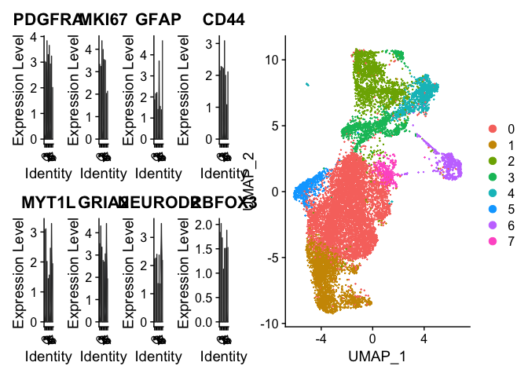<!-- -->

``` r
for (i in 1:3) {
  ObjectsH[[i]] <- subset(x = ObjectsH[[i]], subset = nFeature_RNA > 500 & percent.mt < 15)
}


middleV2 <- VlnPlot(ObjectsH[[1]], c("nFeature_RNA", "nCount_RNA", "percent.mt"), pt.size = .01) & theme(axis.text = element_text(size = 8), plot.title = element_text(size = 10), axis.title = element_text(size = 10))
topV2 <- VlnPlot(ObjectsH[[2]], c("nFeature_RNA", "nCount_RNA", "percent.mt"), pt.size = .01) & theme(axis.text = element_text(size = 8), plot.title = element_text(size = 10), axis.title = element_text(size = 10))
bottomV2 <- VlnPlot(ObjectsH[[3]], c("nFeature_RNA", "nCount_RNA", "percent.mt"), pt.size = .01) & theme(axis.text = element_text(size = 8), plot.title = element_text(size = 10), axis.title = element_text(size = 10))

topV2[[1]] <- topV2[[1]] + ylab("EGFP CTR") + ggtitle("Unique Genes")
topV2[[2]] <- topV2[[2]] + ggtitle("UMIs")
topV2[[3]] <- topV2[[3]] + ggtitle("MT Gene%")
topV2 <- topV2 & theme(axis.text.x = element_blank(), axis.title.x = element_blank())

middleV2[[1]] <- middleV2[[1]] + ylab("E2F6 OE")
middleV2 <- middleV2 & theme(axis.text.x = element_blank(), axis.title.x = element_blank(), plot.title = element_blank())

bottomV2[[1]] <- bottomV2[[1]] + ylab("ZNF274 OE")
bottomV2 <- bottomV2 & theme(axis.text.x = element_blank(), axis.title.x = element_blank(), plot.title = element_blank())

topV2 / middleV2 / bottomV2
```

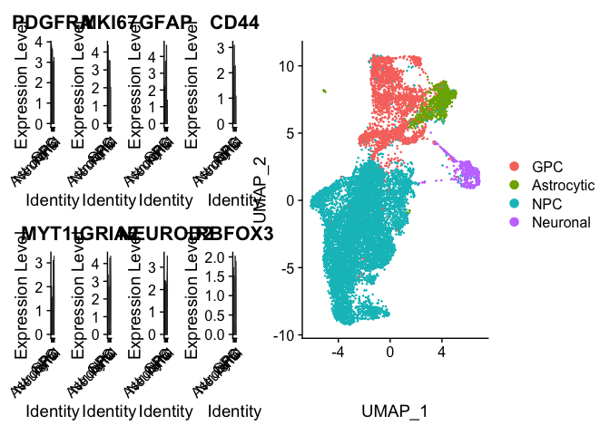<!-- -->

``` r
topSup <- (topV / middleV / bottomV) | (topV2 / middleV2 / bottomV2) 


topSup 
```

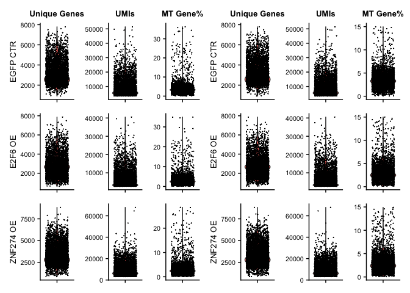<!-- -->

# Load Integrated Data and identify Celltypes

``` r
integrated <- readRDS("RDS/integrated_OE.rds")

DefaultAssay(integrated) <- "RNA"
integrated <- NormalizeData(integrated)

VlnPlot(integrated, c("PDGFRA", "MKI67", "GFAP", "CD44", "MYT1L", "GRIA2", "NEUROD2", "RBFOX3"), ncol = 4, pt.size = 0) | DimPlot(integrated)
```

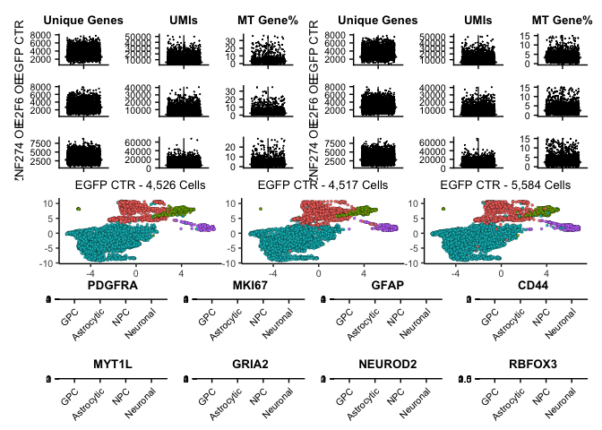<!-- -->

``` r
integrated <- RenameIdents(integrated, "4" = "Astrocytic")
integrated <- RenameIdents(integrated, "6" = "Neuronal")
integrated <- RenameIdents(integrated, "2" = "GPC")
integrated <- RenameIdents(integrated, "3" = "GPC")
integrated <- RenameIdents(integrated, "0" = "NPC")
integrated <- RenameIdents(integrated, "1" = "NPC")
integrated <- RenameIdents(integrated, "5" = "NPC")
integrated <- RenameIdents(integrated, "7" = "NPC")

Idents(integrated) <- factor(Idents(integrated), levels = c("GPC", "Astrocytic", "NPC", "Neuronal"))
integrated$CellType <- Idents(integrated)


VlnPlot(integrated, c("PDGFRA", "MKI67", "GFAP", "CD44", "MYT1L", "GRIA2", "NEUROD2", "RBFOX3"), ncol = 4, pt.size = 0) | DimPlot(integrated)
```

<!-- -->

``` r
temp <- unique(integrated$orig.ident)
names(temp) <- c("E2F6 OE", "EGFP CTR", "ZNF274 OE")
integrated$label <- mapvalues(integrated$orig.ident, from = temp, to = names(temp))
integrated$label <- factor(integrated$label, levels = c("EGFP CTR", "E2F6 OE", "ZNF274 OE"))


#saveRDS(integrated, "RDS/integrated_OE_processed.rds")
```

## Make Supplement Figure

``` r
table(integrated$label)
```

    ## 
    ##  EGFP CTR   E2F6 OE ZNF274 OE 
    ##      4526      4517      5584

``` r
suppDims <- (scPlottingTools::DimPlotCustom(integrated, group.by = "CellType", split.by = "label") & NoLegend())
suppDims[[1]] <- suppDims[[1]]  + ggtitle ("EGFP CTR - 4,526 Cells")
suppDims[[2]] <- suppDims[[2]]  + ggtitle ("E2F6 OE - 4,517 Cells")
suppDims[[3]] <- suppDims[[3]]  + ggtitle ("ZNF274 OE - 5,584 Cells")

suppBottomFigure <- suppDims /
VlnPlot(integrated, c("PDGFRA", "MKI67", "GFAP", "CD44", "MYT1L", "GRIA2", "NEUROD2", "RBFOX3"), pt.size = 0, ncol  = 4) & theme(axis.title = element_blank())

suppBottomFigure <- suppBottomFigure & theme(axis.text = element_text(size = 8), plot.title = element_text(size = 10))


(topSup / suppBottomFigure) + plot_layout(heights = c(1,1.3)) 
```

<!-- -->

``` r
#ggsave("figures/Supp/SupFig3.pdf", width = 8.5, height = 11)
```

## Determine GPC markers

``` r
table(integrated$label)
```

    ## 
    ##  EGFP CTR   E2F6 OE ZNF274 OE 
    ##      4526      4517      5584

``` r
# GPCvsAll <- FindMarkers(subset(integrated, subset = label == "EGFP CTR"), ident.1 = "GPC", test.use = "MAST", logfc.threshold = 0)
# GPCvsAll$gene <- row.names(GPCvsAll)
# GPCvsAll.sig <- GPCvsAll[GPCvsAll$p_val_adj < 0.05,]
# GPCvsAll.sig <- GPCvsAll.sig[order(GPCvsAll.sig$avg_log2FC, decreasing = T),]
# GPCvsAll.sig <- GPCvsAll.sig[,c(2:6)]
# names(GPCvsAll.sig) <- c("Log2FC GPC vs Non-GPC", "GPC pct", "Non-GPC pct", "Adj P-Vale", "Gene")
# #write.xlsx(GPCvsAll.sig, file = "Extended Data Tables/Extended Data Table 4 - Adult Repressor scRNAseq.xlsx", row.names = F, sheetName = "GPC Cluster Markers")
# 
# 
# GPCvsAstrocyte <- FindMarkers(subset(integrated, subset = label == "EGFP CTR"), ident.1 = "GPC", ident.2 = "Astrocytic", test.use = "MAST", logfc.threshold = 0)
# GPCvsAstrocyte$gene <- row.names(GPCvsAstrocyte)
# GPCvsAstrocyte.sig <- GPCvsAstrocyte[GPCvsAstrocyte$p_val_adj < 0.05,]
# GPCvsAstrocyte.sig <- GPCvsAstrocyte.sig[order(GPCvsAstrocyte.sig$avg_log2FC, decreasing = T),]
# 
# 
# GPCvsNPC <- FindMarkers(subset(integrated, subset = label == "EGFP CTR"), ident.1 = "GPC", ident.2 = "NPC", test.use = "MAST", logfc.threshold = 0)
# GPCvsNPC$gene <- row.names(GPCvsNPC)
# GPCvsNPC.sig <- GPCvsNPC[GPCvsNPC$p_val_adj < 0.05,]
# GPCvsNPC.sig <- GPCvsNPC.sig[order(GPCvsNPC.sig$avg_log2FC, decreasing = T),]
# 
# GPCvsNeuronal <- FindMarkers(subset(integrated, subset = label == "EGFP CTR"), ident.1 = "GPC", ident.2 = "Neuronal", test.use = "MAST", logfc.threshold = 0)
# GPCvsNeuronal$gene <- row.names(GPCvsNeuronal)
# GPCvsNeuronal.sig <- GPCvsNeuronal[GPCvsNeuronal$p_val_adj < 0.05,]
# GPCvsNeuronal.sig <- GPCvsNeuronal.sig[order(GPCvsNeuronal.sig$avg_log2FC, decreasing = T),]
# 
# 
# allMarkers <- FindAllMarkers(subset(integrated, subset = label == "EGFP CTR"), test.use = "MAST", logfc.threshold = 0)
```

## Subset GPC population for DE analysis

``` r
GPC <- subset(integrated, idents = "GPC")

#saveRDS(GPC, "RDS/GPC_OE_processed.rds")


#### Over expression plots
GPCfeaturePlots <- (FeaturePlotCustom(GPC, c("PDGFRA", "E2F6", "ZNF274"), split.by = "label", sharedScale = "All") & theme(legend.position = "bottom")) + plot_layout(guides = "collect")
GPCfeaturePlots 
```

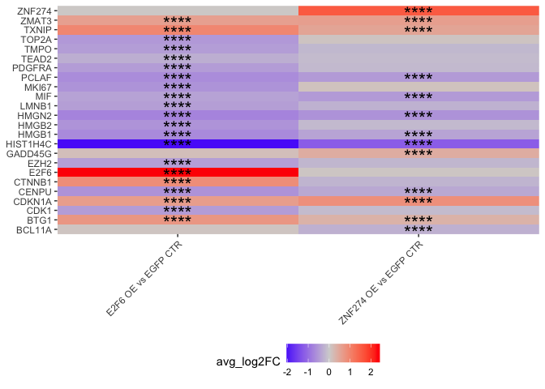<!-- -->

``` r
frequencies <- DotPlot(GPC, group.by = "label", features = row.names(GPC))
```

    ## Warning: Scaling data with a low number of groups may produce misleading
    ## results

``` r
freq <- frequencies$data
freq <- freq[freq$pct.exp > .1,]
features <- unique(freq$features.plot)
features <- features[features != "eGFP"]


#### DE
E2F6vsEGFPall <- FindMarkers(GPC, ident.1 = "E2F6 OE", ident.2 = "EGFP CTR", test.use = "MAST", group.by = "label", logfc.threshold = 0, features = features)
```

    ## 
    ## Done!

    ## Combining coefficients and standard errors

    ## Calculating log-fold changes

    ## Calculating likelihood ratio tests

    ## Refitting on reduced model...

    ## 
    ## Done!

``` r
ZNF274vsEGFPall <- FindMarkers(GPC, ident.1 = "ZNF274 OE", ident.2 = "EGFP CTR", test.use = "MAST", group.by = "label", logfc.threshold = 0, features = features)
```

    ## 
    ## Done!

    ## Combining coefficients and standard errors

    ## Calculating log-fold changes

    ## Calculating likelihood ratio tests

    ## Refitting on reduced model...

    ## 
    ## Done!

``` r
E2F6vsEGFPall$gene <- row.names(E2F6vsEGFPall)
ZNF274vsEGFPall$gene <- row.names(ZNF274vsEGFPall)

E2F6vsEGFP <- E2F6vsEGFPall[E2F6vsEGFPall$p_val_adj < 0.05 & abs(E2F6vsEGFPall$avg_log2FC) > 0.25,]
ZNF274vsEGFP <- ZNF274vsEGFPall[ZNF274vsEGFPall$p_val_adj < 0.05 & abs(ZNF274vsEGFPall$avg_log2FC) > 0.25,]

E2F6vsEGFP$gene <- row.names(E2F6vsEGFP)
ZNF274vsEGFP$gene <- row.names(ZNF274vsEGFP)

#write.table(E2F6vsEGFP, "output/E2F6vsEGFP.txt", quote = F, row.names = F, sep = "\t")
#write.table(ZNF274vsEGFP, "output/ZNF274vsEGFP.txt", quote = F, row.names = F, sep = "\t")

sup4a <- E2F6vsEGFP
sup4b <- ZNF274vsEGFP

sup4a <- sup4a[,c(2:6)]
names(sup4a) <- c("Log2FC_E2F6_vs_CTR", "Percent E2F6", "Percent Ctr",  "Adj_P_Val",    "External_Gene_Name")

sup4b <- sup4b[,c(2:6)]
names(sup4b) <- c("Log2FC_ZNF274_vs_CTR",   "Percent ZNF274",   "Percent Ctr",  "Adj_P_Val",    "External_Gene_Name")


# Write out Extended Data Table
#write.xlsx(E2F6vsEGFP, file = "Extended Data Tables/Extended Data Table 4 - Adult Repressor scRNAseq.xlsx", row.names = F, sheetName = "E2F6_OE_vs_EGFP_CTR_DE", append = T)

#write.xlsx(ZNF274vsEGFP, file = "Extended Data Tables/Extended Data Table 4 - Adult Repressor scRNAseq.xlsx", row.names = F, sheetName = "ZNF274_OE_vs_EGFP_CTR_DE", append = T)
```

## Venn

``` r
VennAging <- list(
  "E2F6 vs EGFP" =E2F6vsEGFP$gene,
  "ZNF274 vs EGFP" = ZNF274vsEGFP$gene)

venn <- ggVennDiagram(VennAging, label = "count") + theme(legend.position = "none")

venn
```

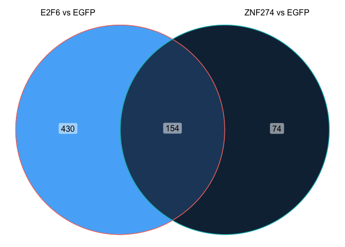<!-- -->

``` r
intersectingGenes <- merge(E2F6vsEGFP, ZNF274vsEGFP, by.x = 0, by.y = 0)

table(intersectingGenes$avg_log2FC.x * intersectingGenes$avg_log2FC.y > 0)
```

    ## 
    ## FALSE  TRUE 
    ##     2   152

``` r
table(intersectingGenes$avg_log2FC.x < 0, intersectingGenes$avg_log2FC.y < 0)
```

    ##        
    ##         FALSE TRUE
    ##   FALSE    47    2
    ##   TRUE      0  105

## TF Enrichment

``` r
#obtained from data(motifAnnotations_hgnc in RcisTarget v1.4.0)
motifAnnotations <- read.delim("data_for_import/motifAnnotations_hgnc.txt")
motifAnnotations <- as.data.table(motifAnnotations)

#Both ranking databases available at https://resources.aertslab.org/cistarget/
motifRankings500 <- importRankings("data_for_import/hg38__refseq-r80__500bp_up_and_100bp_down_tss.mc9nr.feather")
```

    ## Using the column 'features' as feature index for the ranking database.

``` r
motifRankings10K <- importRankings("data_for_import/hg38__refseq-r80__10kb_up_and_down_tss.mc9nr.feather")
```

    ## Using the column 'features' as feature index for the ranking database.

``` r
options(stringsAsFactors=FALSE)


tfOrder <- c("IKZF3", "ZNF274", "MAX", "E2F6", "BCL11A", "EZH2", "HDAC2", "STAT3", "HMGA2", "NFIB", "TEAD2", "MYC")

adultRepressors <- c("IKZF3", "ZNF274", "MAX", "E2F6")

fetalRepressors <- c("BCL11A", "EZH2", "HDAC2")
fetalActivators <- c("HMGA2", "NFIB", "TEAD2", "MYC")

# E2F6 Repressed Targets
E2F6_Repressor <- TFidentify2(E2F6vsEGFP[E2F6vsEGFP$avg_log2FC < 0,]$gene, c(E2F6vsEGFP[E2F6vsEGFP$avg_log2FC > 0,]$gene, adultRepressors) , activity = "Repressor")
```

    ## Genes in the gene sets NOT available in the dataset: 
    ##  geneSet:    10 (3% of 345)

    ## Genes in the gene sets NOT available in the dataset: 
    ##  geneSet:    10 (3% of 345)

``` r
E2F6_DotPlot <- E2F6_Repressor[E2F6_Repressor$Gene %in% c("E2F6", "ZNF274"),]
E2F6_Repressor <- E2F6_Repressor[E2F6_Repressor$Gene == "E2F6",]

# ZNF274 Repressed Targets
ZNF274_Repressor <- TFidentify2(ZNF274vsEGFP[ZNF274vsEGFP$avg_log2FC < 0,]$gene, c(ZNF274vsEGFP[ZNF274vsEGFP$avg_log2FC > 0,]$gene, adultRepressors), activity = "Repressor")
```

    ## Genes in the gene sets NOT available in the dataset: 
    ##  geneSet:    12 (9% of 139)

    ## Genes in the gene sets NOT available in the dataset: 
    ##  geneSet:    12 (9% of 139)

``` r
ZNF274_DotPlot <- ZNF274_Repressor[ZNF274_Repressor$Gene %in% c("E2F6", "ZNF274"),]
ZNF274_Repressor <- ZNF274_Repressor[ZNF274_Repressor$Gene == "ZNF274",]


# E2F6 Backwards Targets
E2F6_Backwards_Targets <- TFidentify2(E2F6vsEGFP[E2F6vsEGFP$avg_log2FC > 0,]$gene, "E2F6", activity = "Activator", window = "500")
```

    ## Genes in the gene sets NOT available in the dataset: 
    ##  geneSet:    3 (1% of 239)

``` r
# ZNF274 Backwards Targets
ZNF274_Backwards_Targets <- TFidentify2(ZNF274vsEGFP[ZNF274vsEGFP$avg_log2FC > 0,]$gene, "ZNF274", activity = "Activator", window = "10K")
```

    ## Genes in the gene sets NOT available in the dataset: 
    ##  geneSet:    1 (1% of 89)

``` r
geneSplit <- function(rcisTargetObject){
  return(rcisTargetObject %>% 
           mutate(enrichedGenes = strsplit(as.character(enrichedGenes), ";")) %>% 
           unnest(enrichedGenes))
}

E2F6_Targets <- geneSplit(E2F6_Repressor)
E2F6_Targets <- E2F6_Targets[!duplicated(E2F6_Targets[ , c("Gene", "enrichedGenes")]), ] 
E2F6_Aging_Targets <- E2F6_Targets[E2F6_Targets$enrichedGenes %in% de_intersect[de_intersect$log2FoldChange < 0,]$external_gene_name,]

ZNF274_Targets <- geneSplit(ZNF274_Repressor)
ZNF274_Targets <- ZNF274_Targets[!duplicated(ZNF274_Targets[ , c("Gene", "enrichedGenes")]), ] 
ZNF274_Aging_Targets <- ZNF274_Targets[ZNF274_Targets$enrichedGenes %in% de_intersect[de_intersect$log2FoldChange < 0,]$external_gene_name,]


# Backwards Targets
E2F6_Backwards_Targets <- geneSplit(E2F6_Backwards_Targets)
E2F6_Backwards_Targets <- E2F6_Backwards_Targets[!duplicated(E2F6_Backwards_Targets[ , c("Gene", "enrichedGenes")]), ] 

ZNF274_Backwards_Targets <- geneSplit(ZNF274_Backwards_Targets)
ZNF274_Backwards_Targets <- ZNF274_Backwards_Targets[!duplicated(ZNF274_Backwards_Targets[ , c("Gene", "enrichedGenes")]), ] 
```

## Write out supp table for motif enrichment

``` r
supTableE2F6targets <- E2F6_DotPlot
names(supTableE2F6targets)[1:2] <- c("Motif", "TF")
supTableE2F6targets$activity <- NULL
supTableE2F6targets$Comparison <- "E2F6_OE_vs_EGFP_CTR"


#write.xlsx(supTableE2F6targets, file = "Extended Data Tables/Extended Data Table 4 - Adult Repressor scRNAseq.xlsx", sheetName = "E2F6 OE vs EGFP CTR Motifs", row.names = F, append = T)

supTableZNF274targets <- ZNF274_DotPlot
names(supTableZNF274targets)[1:2] <- c("Motif", "TF")
supTableZNF274targets$activity <- NULL
supTableZNF274targets$Comparison <- "ZNF274_OE_vs_EGFP_CTR"


#write.xlsx(supTableZNF274targets, file = "Extended Data Tables/Extended Data Table 4 - Adult Repressor scRNAseq.xlsx", sheetName = "ZNF274 OE vs EGFP CTR Motifs", row.names = F, append = T)
```

## Enrichment of targets in repressed vs activated genes

``` r
##
E2F6_Indirect_Repressed <- E2F6vsEGFP[E2F6vsEGFP$avg_log2FC < 0 & E2F6vsEGFP$gene %not in% E2F6_Targets$enrichedGenes,]
E2F6_Indirect_Activated <- E2F6vsEGFP[E2F6vsEGFP$avg_log2FC > 0 & E2F6vsEGFP$gene %not in% E2F6_Backwards_Targets$enrichedGenes,]

e2f6_fisher_direct <- data.frame("Direct" = c(nrow(E2F6_Targets), nrow(E2F6_Backwards_Targets)), "Indirect" = c(nrow(E2F6_Indirect_Repressed), nrow(E2F6_Indirect_Activated)), row.names = c("Repressed", "Activated"))

fisher.test(e2f6_fisher_direct, alternative = "greater")
```

    ## 
    ##  Fisher's Exact Test for Count Data
    ## 
    ## data:  e2f6_fisher_direct
    ## p-value < 2.2e-16
    ## alternative hypothesis: true odds ratio is greater than 1
    ## 95 percent confidence interval:
    ##  23.72825      Inf
    ## sample estimates:
    ## odds ratio 
    ##   36.02984

``` r
##
ZNF274_Indirect_Repressed <- ZNF274vsEGFP[ZNF274vsEGFP$avg_log2FC < 0 & ZNF274vsEGFP$gene %not in% ZNF274_Targets$enrichedGenes,]
ZNF274_Indirect_Activated <- ZNF274vsEGFP[ZNF274vsEGFP$avg_log2FC > 0 & ZNF274vsEGFP$gene %not in% ZNF274_Backwards_Targets$enrichedGenes,]

znf274_fisher_direct <- data.frame("Direct" = c(nrow(ZNF274_Targets), nrow(ZNF274_Backwards_Targets)), "Indirect" = c(nrow(ZNF274_Indirect_Repressed), nrow(ZNF274_Indirect_Activated)), row.names = c("Repressed", "Activated"))

fisher.test(znf274_fisher_direct, alternative = "greater")
```

    ## 
    ##  Fisher's Exact Test for Count Data
    ## 
    ## data:  znf274_fisher_direct
    ## p-value = 3.15e-11
    ## alternative hypothesis: true odds ratio is greater than 1
    ## 95 percent confidence interval:
    ##  4.17217     Inf
    ## sample estimates:
    ## odds ratio 
    ##   7.463127

## FC Heatmap

``` r
#####  scRNA-seq FC Heatmap
E2F6vsEGFPall$Comparison <- "E2F6 OE vs EGFP CTR"
ZNF274vsEGFPall$Comparison <- "ZNF274 OE vs EGFP CTR"

agingHM <- rbind(E2F6vsEGFPall, ZNF274vsEGFPall)

agingHMgenes <- unique(c("CDK1", "PDGFRA", "EZH2", "HMGB1", "BCL11A", "TEAD2", "E2F6", "ZNF274", "MKI67", "PCLAF", "MIF", "CENPU", "CDKN1A", "TXNIP", 
                  "HIST1H4C", "TOP2A", "LMNB1", "BTG1", "CTNNB1", "GADD45G", "HMGN2", "HMGB1","HMGB2", "TMPO", "ETV1", "HIST1H1D", "HMGB3", "IDH2", "NUSAP1", "PEG10", "HIST2H2AC", "HIST1H1B", "HIST1H1C", "NPY", "CENPU", "HNRNPD", "ATAD2"))

agingHM <- agingHM[agingHM$gene %in% agingHMgenes,]
agingHM$gene <- factor(agingHM$gene)
agingHM$p_val_adj <- ifelse(abs(agingHM$avg_log2FC) < 0.25, 1, agingHM$p_val_adj)


agingHM$sig <- ifelse(agingHM$p_val_adj < .0001, "****", 
                          ifelse(agingHM$p_val_adj < .001, "***", 
                                 ifelse(agingHM$p_val_adj < .01, "**", 
                                        ifelse(agingHM$p_val_adj < .05, "*", ""))))


qPCRtargets <- c("ETV1", "HIST1H1D", "HMGB3", "IDH2", "NUSAP1", "PEG10")

agingHM$face <- ifelse(agingHM$gene %in% qPCRtargets, "plain", "bold")
levels(agingHM$gene)
```

    ##  [1] "ATAD2"     "BCL11A"    "BTG1"      "CDK1"      "CDKN1A"    "CENPU"    
    ##  [7] "CTNNB1"    "E2F6"      "ETV1"      "EZH2"      "GADD45G"   "HIST1H1B" 
    ## [13] "HIST1H1C"  "HIST1H1D"  "HIST1H4C"  "HIST2H2AC" "HMGB1"     "HMGB2"    
    ## [19] "HMGB3"     "HMGN2"     "HNRNPD"    "IDH2"      "LMNB1"     "MIF"      
    ## [25] "MKI67"     "NPY"       "NUSAP1"    "PCLAF"     "PDGFRA"    "PEG10"    
    ## [31] "TEAD2"     "TMPO"      "TOP2A"     "TXNIP"     "ZNF274"

``` r
## Make HM Annotation

oeAnnotation <- data.frame(gene = agingHMgenes)

oeAnnotation$E2F6 = ifelse(oeAnnotation$gene %in% E2F6_Targets$enrichedGenes, "darkmagenta", "white")
oeAnnotation$ZNF274 = ifelse(oeAnnotation$gene  %in% ZNF274_Targets$enrichedGenes, "orange", "white")


oeAnnotation <- oeAnnotation[order(oeAnnotation[,2], oeAnnotation[,3]),]
oeAnnotation$gene <- factor(oeAnnotation$gene, levels = oeAnnotation$gene)

oeAnnotation <- pivot_longer(oeAnnotation, cols = c(E2F6, ZNF274))
oeAnnotation$name <- gsub(x = oeAnnotation$name, pattern = "E2F6", replacement = "E2F6 Targets")
oeAnnotation$name <- gsub(x = oeAnnotation$name, pattern = "ZNF274", replacement = "ZNF274 Targets")


oeAnnotationGG <- ggplot(oeAnnotation, aes(x = name, y = gene, fill = value)) + geom_tile(colour = "black") + scale_fill_manual(values = c("darkmagenta", "orange", "white")) + scale_x_discrete(expand = c(0,0)) + scale_y_discrete(expand = c(0,0)) + NoLegend() + 
  theme(axis.text.x = element_text(angle = 45, hjust = 1, vjust = 1), axis.title = element_blank(), axis.text.y = element_blank())
oeAnnotationGG
```

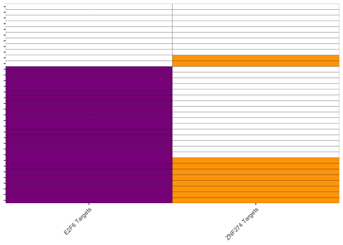<!-- -->

``` r
agingFC <-  data.frame(gene = agingHMgenes)
agingFC <- merge(agingFC, de_intersect_all[,c(8,3,7)], by.x = "gene", by.y = "external_gene_name", all.x = T)
agingFC$adult <- "Adult vs Fetal GPC"

agingFC$padj <- ifelse(abs(agingFC$log2FoldChange) < 1, 1, agingFC$padj)


agingFC$sig <- ifelse(agingFC$padj < .0001, "****", 
                          ifelse(agingFC$padj < .001, "***", 
                                 ifelse(agingFC$padj < .01, "**", 
                                        ifelse(agingFC$padj < .05, "*", ""))))

agingFC$gene <- factor(agingFC$gene, levels = levels(oeAnnotation$gene))

agingFCGG <- ggplot(agingFC, aes(y = gene, fill = log2FoldChange, x = adult, label = sig)) + geom_tile(colour = "black") + scale_fill_gradientn(colours = c("blue","lightgrey","red"), values = scales::rescale(c(min(agingFC$log2FoldChange),0,max(agingFC$log2FoldChange))), guide = "colorbar", limits=c(min(agingFC$log2FoldChange),max(agingFC$log2FoldChange))) + scale_x_discrete(expand = c(0,0)) + scale_y_discrete(expand = c(0,0)) +
    geom_text(vjust = .7, size = 6, hjust = .5, angle = 0)   +
  theme(axis.text.x = element_text(angle = 45, hjust = 1, vjust = 1), axis.title = element_blank(), legend.position = "bottom", axis.text.y = element_blank()) 

agingFCGG
```

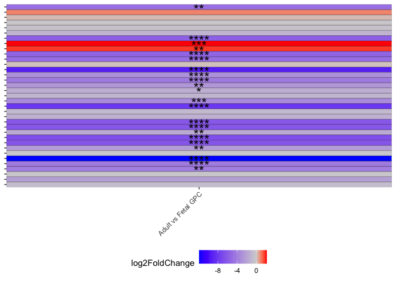<!-- -->

``` r
agingHM$gene <-  factor(agingHM$gene, levels = levels(oeAnnotation$gene))

agingHMgg2 <- ggplot(agingHM, aes(x = Comparison, y = gene, fill = avg_log2FC, label = sig)) + geom_tile(colour = "black") + scale_fill_gradient2(low = "blue", high = "red", midpoint = 0, mid = "lightgrey") +
  geom_text(vjust = .7, size = 6, hjust = .5, angle = 0)   + 
  scale_x_discrete(expand = c(0,0)) + 
  scale_y_discrete(expand = c(0,0)) + 
  theme(axis.text.x = element_text(angle = 45, hjust = 1, vjust = 1), axis.title = element_blank(), legend.position = "bottom", axis.text.y = element_text(face = ifelse(levels(agingHM$gene) %in% qPCRtargets, "bold", "plain"), colour  = ifelse(levels(agingHM$gene) %in% qPCRtargets, "blue", "black"), hjust = .5))
```

    ## Warning: Vectorized input to `element_text()` is not officially supported.
    ## ℹ Results may be unexpected or may change in future versions of ggplot2.

``` r
agingHMgg2
```

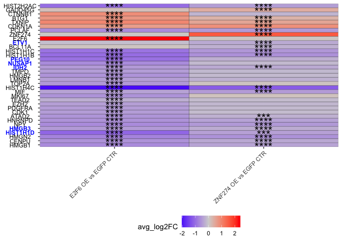<!-- -->

``` r
(agingFCGG | agingHMgg2 | oeAnnotationGG) + plot_layout(widths = c(.5,1,.25))
```

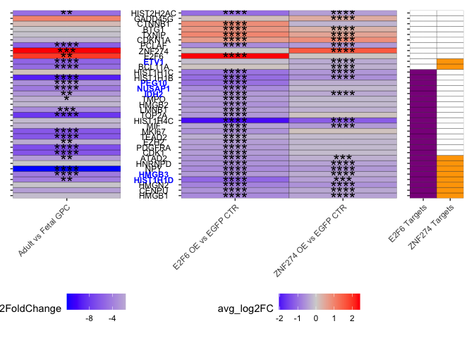<!-- -->

# Enrichment of targets from bulk

``` r
## Filtered lists for genes only detectable in both datasets
# aging to consider because they're in sc
de_intersect_sc <- de_intersect[de_intersect$external_gene_name %in% features | de_intersect$Row.names %in% features,]

# All shared genes between both data sets
highTPM_sc <- unique(features[features %in% c(highTPM$external_gene_name, row.names(highTPM))])
highTPM_sc <- unique(features[features %in% c(highTPM$external_gene_name)])
#saveRDS(highTPM_sc, "output/highTPM_sc.rds")

bulkTargets <- read.xlsx("Extended Data Tables/Extended Data Table 3 - Adult vs Fetal hGPC Bulk RNA-seq.xlsx", sheetName = "Active TFs in Fetal vs Adult")
E2F6_bulk_targets <- bulkTargets[bulkTargets$Gene == "E2F6",]
E2F6_bulk_targets <- geneSplit(E2F6_bulk_targets)
E2F6_bulk_targets <- E2F6_bulk_targets[!duplicated(E2F6_bulk_targets[ , c("Gene", "enrichedGenes")]), ] 
E2F6_bulk_targets <- E2F6_bulk_targets[E2F6_bulk_targets$enrichedGenes %in% highTPM_sc,]

ZNF274_bulk_targets <- bulkTargets[bulkTargets$Gene == "ZNF274",]
ZNF274_bulk_targets <- geneSplit(ZNF274_bulk_targets)
ZNF274_bulk_targets <- ZNF274_bulk_targets[!duplicated(ZNF274_bulk_targets[ , c("Gene", "enrichedGenes")]), ] 
ZNF274_bulk_targets <- ZNF274_bulk_targets[ZNF274_bulk_targets$enrichedGenes %in% highTPM_sc,]


# scDE genes that are detectable in the bulk
E2F6vsEGFP_fisher <-  E2F6vsEGFP[E2F6vsEGFP$gene  %in% c(highTPM$external_gene_name, row.names(highTPM)),]
ZNF274vsEGFP_fisher <- ZNF274vsEGFP[ZNF274vsEGFP$gene %in% c(highTPM$external_gene_name, row.names(highTPM)),]

# Repressed in OE GPCs and Adult GPCs
E2F6vsEGFP_repressed <- E2F6vsEGFP_fisher[E2F6vsEGFP_fisher$avg_log2FC < 0,]
Aging_repressed <- de_intersect_sc[de_intersect_sc$log2FoldChange < 0,]
E2F6_doubleRepressed <- E2F6vsEGFP_repressed[E2F6vsEGFP_repressed$gene %in% Aging_repressed$external_gene_name,]

ZNF274vsEGFP_repressed <- ZNF274vsEGFP_fisher[ZNF274vsEGFP_fisher$avg_log2FC < 0,]
ZNF274_doubleRepressed <- ZNF274vsEGFP_repressed[ZNF274vsEGFP_repressed$gene %in% Aging_repressed$external_gene_name,]
```

# E2F6 scRNA and Bulk targets

``` r
# Repressed Target in scRNA
E2F6_doubleRepressed_scTarget <- E2F6_doubleRepressed[E2F6_doubleRepressed$gene %in% E2F6_Targets$enrichedGenes,]

# Repressed Target in Bulk
E2F6_doubleRepressed_bulkTarget <- E2F6_doubleRepressed[E2F6_doubleRepressed$gene %in% E2F6_bulk_targets$enrichedGenes,]

# Repressed Target in Both
E2F6_doubleRepressed_both <- E2F6_doubleRepressed_scTarget[E2F6_doubleRepressed_scTarget$gene %in% E2F6_doubleRepressed_bulkTarget$gene,]

# Repressed Tareget in scRNA but not Bulk. There are no genes repressed targets in only bulk and not scRNA here
E2F6_doubleRepressed_scOnly <- E2F6_doubleRepressed_scTarget[E2F6_doubleRepressed_scTarget$gene %not in% E2F6_doubleRepressed_bulkTarget$gene,]

e2f6_fisher_direct_bulk <- data.frame("scDirect" = c(nrow(E2F6_doubleRepressed_both), nrow(E2F6_doubleRepressed_scOnly)), "scNotDirect" = c(0, 115-109), row.names = c("bulkDirect", "bulkNotDirect"))


fisher.test(e2f6_fisher_direct_bulk, alternative = "greater")
```

    ## 
    ##  Fisher's Exact Test for Count Data
    ## 
    ## data:  e2f6_fisher_direct_bulk
    ## p-value = 0.00116
    ## alternative hypothesis: true odds ratio is greater than 1
    ## 95 percent confidence interval:
    ##  3.315313      Inf
    ## sample estimates:
    ## odds ratio 
    ##        Inf

``` r
e2f6Upset <- data.frame(row.names = E2F6_doubleRepressed$gene, 
                        "Shared\nRepressed\nGenes" = T,
                        "E2F6 OE\nGPC Targets" = E2F6_doubleRepressed$gene %in% E2F6_doubleRepressed_scTarget$gene,
                        "Adult GPC\nTargets" = E2F6_doubleRepressed$gene %in% E2F6_doubleRepressed_bulkTarget$gene, check.names = F)


e2f6Upsetgg <- ComplexUpset::upset(e2f6Upset, names(e2f6Upset), name='Geneset', width_ratio=0.3, keep_empty_groups = T, sort_intersections="descending", intersections = list(c("Shared\nRepressed\nGenes", "E2F6 OE\nGPC Targets"), c("Shared\nRepressed\nGenes", "Adult GPC\nTargets"), c("Shared\nRepressed\nGenes", "E2F6 OE\nGPC Targets", "Adult GPC\nTargets"), "Shared\nRepressed\nGenes"), base_annotations = list(
        'Intersection size'=(
            intersection_size() + theme(axis.title.y = element_blank()))))

e2f6Upsetgg
```

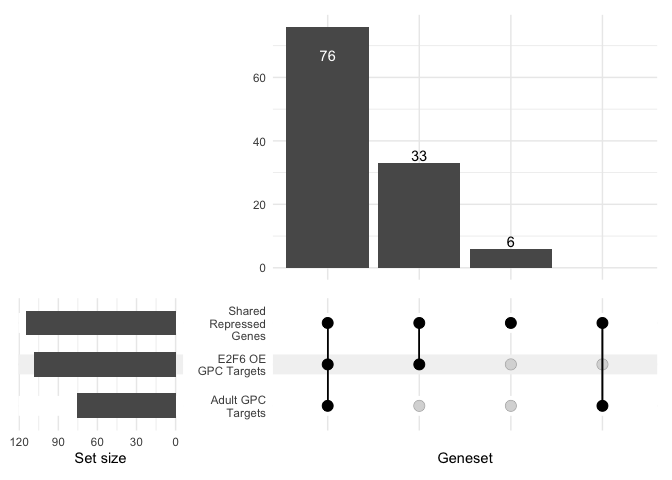<!-- -->

# ZNF274 scRNA and Bulk Targets

``` r
# Repressed Target in scRNA
ZNF274_doubleRepressed_scTarget <- ZNF274_doubleRepressed[ZNF274_doubleRepressed$gene %in% ZNF274_Targets$enrichedGenes,]

# Repressed Target in Bulk
ZNF274_doubleRepressed_bulkTarget <- ZNF274_doubleRepressed[ZNF274_doubleRepressed$gene %in% ZNF274_bulk_targets$enrichedGenes,]

# Repressed Target in Both
ZNF274_doubleRepressed_both <- ZNF274_doubleRepressed_scTarget[ZNF274_doubleRepressed_scTarget$gene %in% ZNF274_doubleRepressed_bulkTarget$gene,]

# Repressed Target in scRNA but not Bulk
ZNF274_doubleRepressed_scOnly <- ZNF274_doubleRepressed_scTarget[ZNF274_doubleRepressed_scTarget$gene %not in% ZNF274_doubleRepressed_bulkTarget$gene,]

# Repressed Target in Bulk but not scRNA
ZNF274_doubleRepressed_bulkOnly <- ZNF274_doubleRepressed_bulkTarget[ZNF274_doubleRepressed_bulkTarget$gene %not in% ZNF274_doubleRepressed_scTarget$gene,]

# Not targets but repressed
ZNF274_doubleRepressed_neither <- ZNF274_doubleRepressed[ZNF274_doubleRepressed$gene %not in% c(ZNF274_doubleRepressed_scTarget$gene, ZNF274_doubleRepressed_bulkTarget$gene),]

znf274_fisher_direct_bulk <- data.frame("scDirect" = c(nrow(ZNF274_doubleRepressed_both), nrow(ZNF274_doubleRepressed_scOnly)), "scNotDirect" = c(nrow(ZNF274_doubleRepressed_bulkOnly), nrow(ZNF274_doubleRepressed_neither)), row.names = c("bulkDirect", "bulkNotDirect"))

fisher.test(znf274_fisher_direct_bulk, alternative = "greater")
```

    ## 
    ##  Fisher's Exact Test for Count Data
    ## 
    ## data:  znf274_fisher_direct_bulk
    ## p-value = 0.07128
    ## alternative hypothesis: true odds ratio is greater than 1
    ## 95 percent confidence interval:
    ##  0.8725815       Inf
    ## sample estimates:
    ## odds ratio 
    ##   3.995994

``` r
znf274Upset <- data.frame(row.names = ZNF274_doubleRepressed$gene, 
                        "Shared\nRepressed\nGenes" = T,
                        "ZNF274 OE\nGPC Targets" = ZNF274_doubleRepressed$gene %in% ZNF274_doubleRepressed_scTarget$gene,
                        "Adult GPC\nTargets" = ZNF274_doubleRepressed$gene %in% ZNF274_doubleRepressed_bulkTarget$gene, check.names = F)


znf274Upsetgg <- ComplexUpset::upset(znf274Upset, names(znf274Upset), name='Geneset', width_ratio=0.3, keep_empty_groups = T, intersections = list(c("Shared\nRepressed\nGenes", "ZNF274 OE\nGPC Targets"), c("Shared\nRepressed\nGenes", "Adult GPC\nTargets"), c("Shared\nRepressed\nGenes", "ZNF274 OE\nGPC Targets", "Adult GPC\nTargets"), "Shared\nRepressed\nGenes"), base_annotations = list(
        'Intersection size'=(
            intersection_size()
            + theme(axis.title.y = element_blank()))))


znf274Upsetgg
```

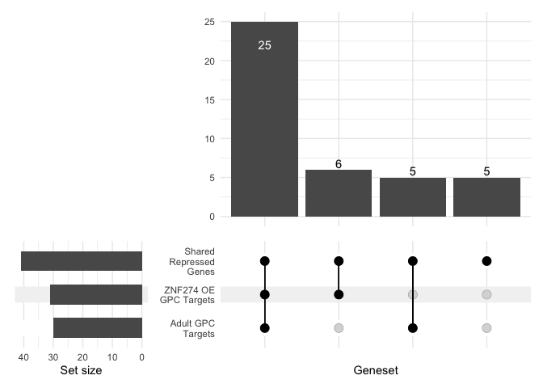<!-- -->

``` r
e2f6Upsetgg / znf274Upsetgg
```

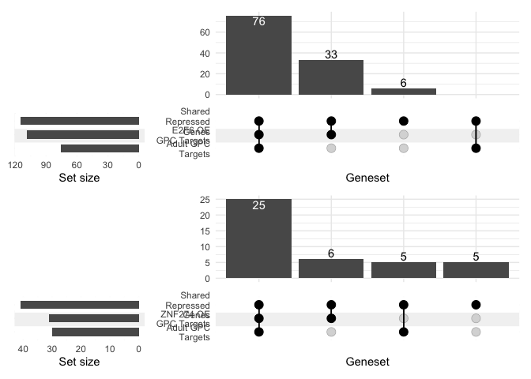<!-- -->

``` r
# E2F6 target in both
# Of genes repressed in both, which are E2F6 targets?

E2F6_Targets_pared <- E2F6_Targets[E2F6_Targets$enrichedGenes %in% highTPM$external_gene_name,]
ZNF274_Targets_pared <- ZNF274_Targets[ZNF274_Targets$enrichedGenes %in% highTPM$external_gene_name,]

E2F6_bulk_targets_pared <- E2F6_bulk_targets[E2F6_bulk_targets$enrichedGenes %in% freq$features.plot,]
ZNF274_bulk_targets_pared <- ZNF274_bulk_targets[ZNF274_bulk_targets$enrichedGenes %in% freq$features.plot,]


E2F6_direct_sc_bulk <- nrow(E2F6_Targets_pared[E2F6_Targets_pared$enrichedGenes %in% E2F6_bulk_targets_pared$enrichedGenes,])

E2F6_direct_sc_nobulk <- nrow(E2F6_Targets_pared) - E2F6_direct_sc_bulk

E2F6_direct_nosc_bulk <- nrow(E2F6_bulk_targets_pared) - E2F6_direct_sc_bulk


E2F6_direct_nosc_nobulk <- unique(c(de_intersect_sc[de_intersect_sc$log2FoldChange < 0,]$external_gene_name, E2F6vsEGFP[E2F6vsEGFP$avg_log2FC < 0,]$gene))

E2F6_direct_nosc_nobulk <- length(E2F6_direct_nosc_nobulk[E2F6_direct_nosc_nobulk %not in% E2F6_Targets$enrichedGenes & E2F6_direct_nosc_nobulk %not in% E2F6_bulk_targets$enrichedGenes])

e2f6_fisher_direct_bulk <- data.frame("scDirect" = c(E2F6_direct_sc_bulk, E2F6_direct_sc_nobulk), "scNotDirect" = c(E2F6_direct_nosc_bulk, E2F6_direct_nosc_nobulk), row.names = c("bulkDirect", "bulkNotDirect"))

fisher.test(e2f6_fisher_direct_bulk, alternative = "less")
```

    ## 
    ##  Fisher's Exact Test for Count Data
    ## 
    ## data:  e2f6_fisher_direct_bulk
    ## p-value < 2.2e-16
    ## alternative hypothesis: true odds ratio is less than 1
    ## 95 percent confidence interval:
    ##  0.0000000 0.1787832
    ## sample estimates:
    ## odds ratio 
    ##  0.1401221

## IPA Graph

``` r
##### IPA
filename="data_for_import/ensemblGeneList.csv"
if(file.exists(filename)){
  ensemblGeneListH <- read.csv(filename)} else{
    marth <- useMart(biomart = "ENSEMBL_MART_ENSEMBL", dataset = "hsapiens_gene_ensembl", host = 'http://jan2019.archive.ensembl.org/', ensemblRedirect = T)
    ensemblGeneListH <- getBM(attributes = c("ensembl_gene_id","external_gene_name", "gene_biotype", "description"), filters = "ensembl_gene_id",values = row.names(txi.rsem$counts), mart = marth)
    write.csv(ensemblGeneListH, filename, row.names = F)
  }


files <- paste0("data_for_import/", c("ZNF274vsEGFP_IPA.txt", "E2F6vsEGFP_IPA.txt"))
compNames <- c("ZNF274 OE vs EGFP CTR", "E2F6 OE vs EGFP CTR")

IPAparse <- function(files, compNames, pval = 0.001, filterTerms, ensembl, returnWhat = "Filtered"){
  pval <- -log10(pval)
  for(i in 1:length(files)){
    canonicalIPA <- fread(files[i], skip = "Canonical",drop = c(4,6))
    names(canonicalIPA) <- c("Pathway", "pVal", "zScore", "Genes")
    canonicalIPA$type <- "Canonical"
    upstreamIPA <- fread(files[i], skip = "Upstream Regulators", drop = c(1:2,4:6,8:10,13:14))
    upstreamIPA <- upstreamIPA[,c(1,3,2,4)]
    names(upstreamIPA) <- c("Pathway", "pVal", "zScore", "Genes")
    upstreamIPA$Pathway <- paste0(upstreamIPA$Pathway, " Signaling")
    upstreamIPA$pVal <- -log10(upstreamIPA$pVal)
    upstreamIPA$type <- "Upstream"
    functionalIPA <- fread(files[i], skip = "Diseases and Bio", drop = c(1,2,5,7,8,10,11))
    names(functionalIPA) <- c("Pathway", "pVal", "zScore", "Genes")
    functionalIPA$pVal <- -log10(functionalIPA$pVal)
    functionalIPA$type <- "Functional"
    moleculesIPAtemp <- fread(files[i], skip = "Analysis Ready Molecules", drop = c(3:4))
    if(i == 1){
      IPA <- rbind(canonicalIPA, upstreamIPA, functionalIPA)
      IPA$comparison <- compNames[i]
      moleculesIPA <- moleculesIPAtemp
    } else {
      tempIPA <- rbind(canonicalIPA, upstreamIPA, functionalIPA)
      tempIPA$comparison <- compNames[i]
      IPA <- rbind(IPA, tempIPA)
      moleculesIPA <- rbind(moleculesIPA, moleculesIPAtemp)
    }
  }
  
  
  IPA[is.na(IPA$zScore)]$zScore <- 0
  ogIPA <- IPA
  IPA <- IPA[IPA$pVal > pval,]
  filteredIPA <- IPA[!grepl(paste(filterTerms, collapse = "|"), ignore.case = T, IPA$Pathway),]
  if(returnWhat == "Filtered"){
    return(filteredIPA)
  } 
  if(returnWhat == "Deleted"){
    deletedIPA <- IPA[grepl(paste(filterTerms, collapse = "|"), ignore.case = T, IPA$Pathway),]
    return(deletedIPA)
  }
  if(returnWhat == "Molecules"){
    moleculesIPA <- merge(moleculesIPA, ensembl, by.x = "ID", by.y = "ensembl_gene_id")
    return(moleculesIPA)
  }
}


IPAfilters <- c("cancer","glioma", "abdominal", "carcinoma", "endometrium", "eye", "nose", "epidermis", "head", "lymphocyte", "renal", "snout", "tooth", 
                "connective", "tumor", "fibroblast", "rickets", "mouth", "maxilla", "cartilage", "neoplasm", "lymph", "liver", "psoriasis", "cardio",
                "cardiac", "tongue", "tinea", "herpes", "Picornaviridae", "virus", "killer T", "muscle", "myopathy", "pancreatic", "Onychomycosis",
                "leukocyte", "oral cavity","osteoclast", "Merkel", "macrophage", "Hydrometrocolpos", "Hand", "Gastric", "Thymocytes", "diabetes",
                "Dupuytren", "myoblast", "ear$", "implantation", "bone", "limb", "cleft lip", "Calcinosis", "lung", "Benign lesion", 
                "body axis", "sensory organ", "diabetic", "neutrophil", "infection of mammalia", "leukopoiesis", "neoplasia", "Sensory system development",
                "T cell", "myeloid", "aorta", "body cavity", "esophagus", "incisor", "kidney", "oesophageal", "respiratory", "skin", "cavity", "urinary",
                "foot", "digit", "heart", "acute biphenotypic leukemia", "Ankylosis", "Articular rigidity", "Atherosclero", "Blister", "Branching morphogenesis of epithelial tubule",
                "Cervical spondylotic myelopathy", "epithelial", "exocrine", "gastrointestinal", "Ejection of first polar body", "Familial arrhythmia", "Familial nonsyndromic hearing impairment", 
                "fibrosis", "mammary", "Hearing", "Morphogenesis of metanephric bud", "cochlea", "nail", "Plasma cell dyscrasia", "Secondary Leukemia", "granulocyte",
                "Tinnitus", "metastasis", "trunk", "sperm motility", "skull", "dendritic cells", "dehydration", "digestive", "microphthalmia", "myelodysplastic",
                "semicircular canal", " skeleton", "osteopenia", "osteoarthritis", "Refractory anemia with excess blasts", "rectum", "submandibular", "antiviral", "HIV-1",
                "antigen present", "gonad", "keratinocyte", "phagocyte", "coronary", "intestinal", "viral replicon", "monocyte", "viral life", "wound", "leukemia", "Airway", "colorectal", "Benign oral disorder", "Benign pelvic disease", "Glioblastoma", "Melanoma", "astrocytoma", "sarcoma", "leiomyoma", "sertoli", "short stature", "midline defect")

filteredAgingIPA <- IPAparse(files = files, compNames = compNames, filterTerms = IPAfilters, ensembl = ensemblGeneListH, returnWhat = "Filtered", pval = 0.05)
```

    ## Warning in fread(files[i], skip = "Canonical", drop = c(4, 6)): Detected 5
    ## column names but the data has 6 columns (i.e. invalid file). Added 1 extra
    ## default column name for the first column which is guessed to be row names or an
    ## index. Use setnames() afterwards if this guess is not correct, or fix the file
    ## write command that created the file to create a valid file.

    ## Warning in fread(files[i], skip = "Canonical", drop = c(4, 6)): Stopped early
    ## on line 404. Expected 6 fields but found 0. Consider fill=TRUE and
    ## comment.char=. First discarded non-empty line: <<Upstream Regulators for My
    ## Projects->Aging_scRNA->ZNF274vsEGFP - 2023-01-29 06:53 PM>>

    ## Warning in fread(files[i], skip = "Upstream Regulators", drop = c(1:2, 4:6, :
    ## Stopped early on line 2484. Expected 14 fields but found 0. Consider fill=TRUE
    ## and comment.char=. First discarded non-empty line: <<Causal Networks for My
    ## Projects->Aging_scRNA->ZNF274vsEGFP - 2023-01-29 06:53 PM>>

    ## Warning in fread(files[i], skip = "Diseases and Bio", drop = c(1, 2, 5, :
    ## Stopped early on line 3714. Expected 11 fields but found 0. Consider fill=TRUE
    ## and comment.char=. First discarded non-empty line: <<Tox Functions for My
    ## Projects->Aging_scRNA->ZNF274vsEGFP - 2023-01-29 06:53 PM>>

    ## Warning in fread(files[i], skip = "Canonical", drop = c(4, 6)): Detected 5
    ## column names but the data has 6 columns (i.e. invalid file). Added 1 extra
    ## default column name for the first column which is guessed to be row names or an
    ## index. Use setnames() afterwards if this guess is not correct, or fix the file
    ## write command that created the file to create a valid file.

    ## Warning in fread(files[i], skip = "Canonical", drop = c(4, 6)): Stopped early
    ## on line 476. Expected 6 fields but found 0. Consider fill=TRUE and
    ## comment.char=. First discarded non-empty line: <<Upstream Regulators for My
    ## Projects->Aging_scRNA->E2F6vsEGFP - 2023-01-29 06:52 PM>>

    ## Warning in fread(files[i], skip = "Upstream Regulators", drop = c(1:2, 4:6, :
    ## Stopped early on line 3062. Expected 14 fields but found 0. Consider fill=TRUE
    ## and comment.char=. First discarded non-empty line: <<Causal Networks for My
    ## Projects->Aging_scRNA->E2F6vsEGFP - 2023-01-29 06:52 PM>>

    ## Warning in fread(files[i], skip = "Diseases and Bio", drop = c(1, 2, 5, :
    ## Stopped early on line 4774. Expected 11 fields but found 0. Consider fill=TRUE
    ## and comment.char=. First discarded non-empty line: <<Tox Functions for My
    ## Projects->Aging_scRNA->E2F6vsEGFP - 2023-01-29 06:52 PM>>

``` r
deletedAgingIPA <- IPAparse(files = files, compNames = compNames, filterTerms = IPAfilters, ensembl = ensemblGeneListH, returnWhat = "Deleted", pval = 0.05)
```

    ## Warning in fread(files[i], skip = "Canonical", drop = c(4, 6)): Detected 5
    ## column names but the data has 6 columns (i.e. invalid file). Added 1 extra
    ## default column name for the first column which is guessed to be row names or an
    ## index. Use setnames() afterwards if this guess is not correct, or fix the file
    ## write command that created the file to create a valid file.

    ## Warning in fread(files[i], skip = "Canonical", drop = c(4, 6)): Stopped early
    ## on line 404. Expected 6 fields but found 0. Consider fill=TRUE and
    ## comment.char=. First discarded non-empty line: <<Upstream Regulators for My
    ## Projects->Aging_scRNA->ZNF274vsEGFP - 2023-01-29 06:53 PM>>

    ## Warning in fread(files[i], skip = "Upstream Regulators", drop = c(1:2, 4:6, :
    ## Stopped early on line 2484. Expected 14 fields but found 0. Consider fill=TRUE
    ## and comment.char=. First discarded non-empty line: <<Causal Networks for My
    ## Projects->Aging_scRNA->ZNF274vsEGFP - 2023-01-29 06:53 PM>>

    ## Warning in fread(files[i], skip = "Diseases and Bio", drop = c(1, 2, 5, :
    ## Stopped early on line 3714. Expected 11 fields but found 0. Consider fill=TRUE
    ## and comment.char=. First discarded non-empty line: <<Tox Functions for My
    ## Projects->Aging_scRNA->ZNF274vsEGFP - 2023-01-29 06:53 PM>>

    ## Warning in fread(files[i], skip = "Canonical", drop = c(4, 6)): Detected 5
    ## column names but the data has 6 columns (i.e. invalid file). Added 1 extra
    ## default column name for the first column which is guessed to be row names or an
    ## index. Use setnames() afterwards if this guess is not correct, or fix the file
    ## write command that created the file to create a valid file.

    ## Warning in fread(files[i], skip = "Canonical", drop = c(4, 6)): Stopped early
    ## on line 476. Expected 6 fields but found 0. Consider fill=TRUE and
    ## comment.char=. First discarded non-empty line: <<Upstream Regulators for My
    ## Projects->Aging_scRNA->E2F6vsEGFP - 2023-01-29 06:52 PM>>

    ## Warning in fread(files[i], skip = "Upstream Regulators", drop = c(1:2, 4:6, :
    ## Stopped early on line 3062. Expected 14 fields but found 0. Consider fill=TRUE
    ## and comment.char=. First discarded non-empty line: <<Causal Networks for My
    ## Projects->Aging_scRNA->E2F6vsEGFP - 2023-01-29 06:52 PM>>

    ## Warning in fread(files[i], skip = "Diseases and Bio", drop = c(1, 2, 5, :
    ## Stopped early on line 4774. Expected 11 fields but found 0. Consider fill=TRUE
    ## and comment.char=. First discarded non-empty line: <<Tox Functions for My
    ## Projects->Aging_scRNA->E2F6vsEGFP - 2023-01-29 06:52 PM>>

``` r
moleculesAging <- IPAparse(files = files, compNames = compNames, filterTerms = IPAfilters, ensembl = ensemblGeneListH, returnWhat = "Molecules", pval = 0.05)
```

    ## Warning in fread(files[i], skip = "Canonical", drop = c(4, 6)): Detected 5
    ## column names but the data has 6 columns (i.e. invalid file). Added 1 extra
    ## default column name for the first column which is guessed to be row names or an
    ## index. Use setnames() afterwards if this guess is not correct, or fix the file
    ## write command that created the file to create a valid file.

    ## Warning in fread(files[i], skip = "Canonical", drop = c(4, 6)): Stopped early
    ## on line 404. Expected 6 fields but found 0. Consider fill=TRUE and
    ## comment.char=. First discarded non-empty line: <<Upstream Regulators for My
    ## Projects->Aging_scRNA->ZNF274vsEGFP - 2023-01-29 06:53 PM>>

    ## Warning in fread(files[i], skip = "Upstream Regulators", drop = c(1:2, 4:6, :
    ## Stopped early on line 2484. Expected 14 fields but found 0. Consider fill=TRUE
    ## and comment.char=. First discarded non-empty line: <<Causal Networks for My
    ## Projects->Aging_scRNA->ZNF274vsEGFP - 2023-01-29 06:53 PM>>

    ## Warning in fread(files[i], skip = "Diseases and Bio", drop = c(1, 2, 5, :
    ## Stopped early on line 3714. Expected 11 fields but found 0. Consider fill=TRUE
    ## and comment.char=. First discarded non-empty line: <<Tox Functions for My
    ## Projects->Aging_scRNA->ZNF274vsEGFP - 2023-01-29 06:53 PM>>

    ## Warning in fread(files[i], skip = "Canonical", drop = c(4, 6)): Detected 5
    ## column names but the data has 6 columns (i.e. invalid file). Added 1 extra
    ## default column name for the first column which is guessed to be row names or an
    ## index. Use setnames() afterwards if this guess is not correct, or fix the file
    ## write command that created the file to create a valid file.

    ## Warning in fread(files[i], skip = "Canonical", drop = c(4, 6)): Stopped early
    ## on line 476. Expected 6 fields but found 0. Consider fill=TRUE and
    ## comment.char=. First discarded non-empty line: <<Upstream Regulators for My
    ## Projects->Aging_scRNA->E2F6vsEGFP - 2023-01-29 06:52 PM>>

    ## Warning in fread(files[i], skip = "Upstream Regulators", drop = c(1:2, 4:6, :
    ## Stopped early on line 3062. Expected 14 fields but found 0. Consider fill=TRUE
    ## and comment.char=. First discarded non-empty line: <<Causal Networks for My
    ## Projects->Aging_scRNA->E2F6vsEGFP - 2023-01-29 06:52 PM>>

    ## Warning in fread(files[i], skip = "Diseases and Bio", drop = c(1, 2, 5, :
    ## Stopped early on line 4774. Expected 11 fields but found 0. Consider fill=TRUE
    ## and comment.char=. First discarded non-empty line: <<Tox Functions for My
    ## Projects->Aging_scRNA->E2F6vsEGFP - 2023-01-29 06:52 PM>>

``` r
agingGOterms <- c("Senescence of cells", "YAP1 Signaling", "E2F6 Signaling", "TP53 Signaling", "CDKN2A Signaling", "Mitochondrial Dysfunction", "CDKN1A Signaling", "DNA damage", "TXNIP Signaling", "Oxidative Phosphorylation",  "TEAD1 Signaling", "Cell cycle progression",
                  "PDGFRA Signaling", "CDK1 Signaling", "EZH2 Signaling", "HMGB1 Signaling", "MYC Signaling", "PCLAF Signaling", "ERBB2 Signaling", "E2F3 Signaling", "HMGA1 Signaling")

agingGO <- filteredAgingIPA[filteredAgingIPA$Pathway %in% agingGOterms,]

agingGO <- agingGO[,c(1:3,6)]

agingGO$maxP <- 0

for(i in unique(agingGO$Pathway)){
  maxP <- max(agingGO[agingGO$Pathway == i,]$pVal)
  agingGO[agingGO$Pathway == i,]$maxP <- maxP
}

agingGO <- agingGO[order(agingGO$maxP, rev(agingGO$comparison), decreasing = F),]

agingGO$Pathway <- factor(agingGO$Pathway, levels = agingGO[!duplicated(agingGO$Pathway),]$Pathway)

# agingFigGO <- ggplot(agingGO) +
#   geom_point(aes(y = comparison, x = Pathway, size = pVal, colour = zScore)) +
#   scale_colour_gradient2(high = "red", mid = "grey", low = "#2E30FF", midpoint = 0,guide = guide_colourbar(direction = "vertical", title = "Activation Z-Score", title.position = "top"))+
#   #scale_colour_gradientn(colours = c("#2E30FF", "grey", "red" ), values = scales::rescale(c(-.4,-.1,.4)), guide = guide_colourbar(direction = "horizontal", title = "Activation Z-Score", title.position = "left"))  +
#   theme_bw() +
#   theme(legend.position = "right", axis.title.x = element_blank(), axis.title.y = element_blank(), legend.box = "vertical", axis.text.x =  element_text(angle = 90, hjust = 1, vjust = .05)) +
#   labs(size="-Log10 P-Value")
# 
# agingFigGO

agingFigGO2 <- ggplot(agingGO) +
  geom_point(aes(x = comparison, y = Pathway, size = pVal, colour = zScore)) +
  scale_colour_gradient2(high = "red", mid = "grey", low = "#2E30FF", midpoint = 0,guide = guide_colourbar(direction = "horizontal", title = "Activation Z-Score", title.position = "left"))+
  #scale_colour_gradientn(colours = c("#2E30FF", "grey", "red" ), values = scales::rescale(c(-.4,-.1,.4)), guide = guide_colourbar(direction = "horizontal", title = "Activation Z-Score", title.position = "left"))  +
  theme_bw() +
  theme(legend.position = "bottom", axis.title.x = element_blank(), axis.title.y = element_blank(), legend.box = "horizontal", axis.text.x =  element_text(angle = 45, hjust = 1, vjust = 1)) +
  labs(size="-Log10 P-Value")

agingFigGO2
```

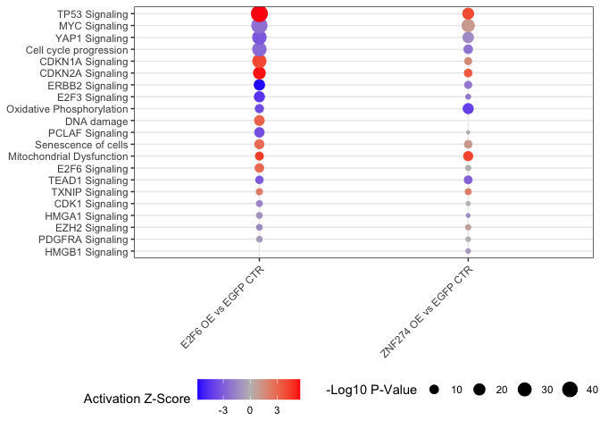<!-- -->

## IPA sup Tables

``` r
# Write out Extended Data Table for IPA terms
supTable4c <- filteredAgingIPA[filteredAgingIPA$comparison == "E2F6 OE vs EGFP CTR",]
supTable4c <- supTable4c[,c(1:5)]
names(supTable4c) <- c("Pathway", "Adj_-log10_P_Val", "Z_Score", "Genes", "Type")
supTable4c <- supTable4c[order(supTable4c$`Adj_-log10_P_Val`, decreasing = T),]

supTable4d <- filteredAgingIPA[filteredAgingIPA$comparison == "ZNF274 OE vs EGFP CTR",]
supTable4d <- supTable4d[,c(1:5)]
names(supTable4d) <- c("Pathway", "Adj_-log10_P_Val", "Z_Score", "Genes", "Type")
supTable4d <- supTable4d[order(supTable4d$`Adj_-log10_P_Val`, decreasing = T),]


#write.xlsx(supTable4c, file = "Extended Data Tables/Extended Data Table 4 - Adult Repressor scRNAseq.xlsx", sheetName = "E2F6 OE vs EGFP CTR IPA terms", row.names = F, append = T)

#write.xlsx(supTable4d, file = "Extended Data Tables/Extended Data Table 4 - Adult Repressor scRNAseq.xlsx", sheetName = "ZNF274 OE vs EGFP CTR IPA terms", row.names = F, append = T)
```

## AUCell

``` r
genesetE2F6 <- GeneSet(E2F6_doubleRepressed_scTarget$gene, setName = "E2F6 Regulon")
genesetZNF274 <- GeneSet(ZNF274_doubleRepressed_scTarget$gene, setName = "ZNF274 Regulon")


geneSets <- GeneSetCollection(c(genesetE2F6,genesetZNF274))

cells_AUC <- AUCell_run(as.matrix(GPC@assays$RNA@data), geneSets)
AUC <- getAUC(cells_AUC)

AUCassay <- CreateAssayObject(AUC)

GPC[["AUC"]] <- AUCassay

DefaultAssay(GPC) <- "AUC"

aucViolins <- VlnPlot(GPC, c("E2F6 Regulon", "ZNF274 Regulon"), group.by = "label", ncol = 1, pt.size = 0, cols = c("forestgreen", "darkmagenta", "orange")) & stat_summary(fun.y = median, geom='point', size = 20, colour = "black", shape = 95) & ylab("Regulon Activity") & theme(axis.title.x = element_blank())
```

    ## Warning: The `fun.y` argument of `stat_summary()` is deprecated as of ggplot2 3.3.0.
    ## ℹ Please use the `fun` argument instead.
    ## This warning is displayed once every 8 hours.
    ## Call `lifecycle::last_lifecycle_warnings()` to see where this warning was
    ## generated.

``` r
aucViolins[[1]] <- aucViolins[[1]]  + theme(axis.text.x = element_blank())

aucViolins
```

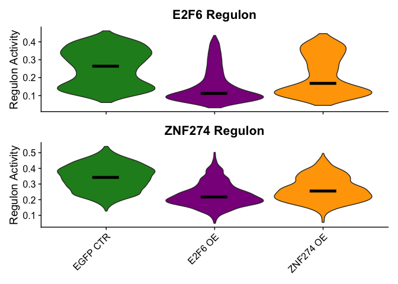<!-- -->

``` r
ZNF274vsEGFP_AUC <- FindMarkers(GPC, ident.1 = "ZNF274 OE", ident.2 = "EGFP CTR", group.by = "label", test.use = "wilcox", logfc.threshold = 0)
E2F6vsEGFP_AUC <- FindMarkers(GPC, ident.1 = "E2F6 OE", ident.2 = "EGFP CTR", group.by = "label", test.use = "wilcox", logfc.threshold = 0)

ZNF274vsEGFP_AUC
```

    ##                       p_val  avg_log2FC pct.1 pct.2    p_val_adj
    ## ZNF274 Regulon 3.411944e-72 -0.08267327     1     1 6.823888e-72
    ## E2F6 Regulon   1.283850e-20 -0.05087475     1     1 2.567699e-20

``` r
E2F6vsEGFP_AUC
```

    ##                        p_val avg_log2FC pct.1 pct.2     p_val_adj
    ## ZNF274 Regulon 2.005743e-145 -0.1215530     1     1 4.011485e-145
    ## E2F6 Regulon   3.745331e-112 -0.1241168     1     1 7.490663e-112

## Read in CTs and organize data

``` r
ctsLonger <- read.csv("data_for_import/directTargetDeltaCTs.csv")


ctsLonger$Set <- factor(ctsLonger$Set)
ctsLonger$Condition <- factor(ctsLonger$Condition, levels = c("GFP", "E2F6", "ZNF274"))
```

## Calculate Delta Delta CTs

``` r
GFPAverages <- ctsLonger[ctsLonger$Condition == "GFP",] %>% group_by(Gene) %>% dplyr::summarize(GPFdeltaCT = mean(deltaCT))

ctsLonger$deltaDeltaCT <- NA

for(i in 1:nrow(ctsLonger)){
  ctsLonger$deltaDeltaCT[i] <-  ctsLonger$deltaCT[i] - GFPAverages[GFPAverages$Gene == ctsLonger$Gene[i],]$GPFdeltaCT
}

ctsLonger$FC <- 2^-ctsLonger$deltaDeltaCT

# Adjust for set effect for plotting
ctsLonger <- ctsLonger %>% dplyr::group_by(Gene, Set) %>%
  dplyr::mutate(setLog2FC = deltaCT[Condition == "GFP"] - deltaCT)

summaryFCs <- ctsLonger %>% 
  group_by(Condition, Gene) %>% 
  dplyr::summarise(meanSetLog2FC = mean(setLog2FC),
            std = sd(FC),
            n = n())
```

    ## `summarise()` has grouped output by 'Condition'. You can override using the
    ## `.groups` argument.

``` r
summaryFCs$SE <- summaryFCs$std / (summaryFCs$n^.5)

summaryFCsPlotting <- summaryFCs[summaryFCs$Condition != "GFP",]
```

``` r
lm1 <- lm(deltaCT~Condition*Gene + Set, ctsLonger)

summary(lm1)
```

    ## 
    ## Call:
    ## lm(formula = deltaCT ~ Condition * Gene + Set, data = ctsLonger)
    ## 
    ## Residuals:
    ##      Min       1Q   Median       3Q      Max 
    ## -1.79499 -0.66131 -0.00177  0.69786  2.75721 
    ## 
    ## Coefficients:
    ##                              Estimate Std. Error t value Pr(>|t|)    
    ## (Intercept)                   17.5180     0.5903  29.677  < 2e-16 ***
    ## ConditionE2F6                  2.6643     0.7729   3.447  0.00114 ** 
    ## ConditionZNF274                1.9002     0.7729   2.459  0.01738 *  
    ## GeneHIST1H1D                  -3.7839     0.7729  -4.896 1.03e-05 ***
    ## GeneHMGB3                     -1.2104     0.7729  -1.566  0.12350    
    ## GeneIDH2                      -1.8178     0.7729  -2.352  0.02257 *  
    ## GeneNUSAP1                    -2.2841     0.7729  -2.955  0.00472 ** 
    ## GenePEG10                     -4.4763     0.7729  -5.792 4.34e-07 ***
    ## SetCM016                      -0.4614     0.3643  -1.266  0.21113    
    ## SetCRP016                      0.3885     0.3643   1.066  0.29135    
    ## SetCRP027                      1.6959     0.3643   4.655 2.34e-05 ***
    ## ConditionE2F6:GeneHIST1H1D    -1.5472     1.0930  -1.416  0.16298    
    ## ConditionZNF274:GeneHIST1H1D  -1.3429     1.0930  -1.229  0.22485    
    ## ConditionE2F6:GeneHMGB3       -0.8582     1.0930  -0.785  0.43597    
    ## ConditionZNF274:GeneHMGB3     -0.5433     1.0930  -0.497  0.62128    
    ## ConditionE2F6:GeneIDH2        -1.2038     1.0930  -1.101  0.27592    
    ## ConditionZNF274:GeneIDH2      -0.6761     1.0930  -0.619  0.53896    
    ## ConditionE2F6:GeneNUSAP1      -0.3194     1.0930  -0.292  0.77131    
    ## ConditionZNF274:GeneNUSAP1     0.6340     1.0930   0.580  0.56443    
    ## ConditionE2F6:GenePEG10        1.0855     1.0930   0.993  0.32533    
    ## ConditionZNF274:GenePEG10      1.7585     1.0930   1.609  0.11382    
    ## ---
    ## Signif. codes:  0 '***' 0.001 '**' 0.01 '*' 0.05 '.' 0.1 ' ' 1
    ## 
    ## Residual standard error: 1.093 on 51 degrees of freedom
    ## Multiple R-squared:  0.8243, Adjusted R-squared:  0.7554 
    ## F-statistic: 11.96 on 20 and 51 DF,  p-value: 6.346e-13

``` r
EMM <- emmeans(lm1, ~ Condition | Gene)


EMMcont <- EMM %>% contrast("trt.vs.ctrl", ref = 1, adjust = "BH")


lmSummary <- summary(EMMcont)

lmSummary$sig <- ifelse(lmSummary$p.value < .0001, "****", 
                        ifelse(lmSummary$p.value < .001, "***", 
                            ifelse(lmSummary$p.value < .01, "**", 
                                   ifelse(lmSummary$p.value < .05, "*", 
                                          ifelse(lmSummary$p.value < .1, "", "")))))

lmSummary
```

    ## Gene = ETV1:
    ##  contrast     estimate    SE df t.ratio p.value sig 
    ##  E2F6 - GFP      2.664 0.773 51   3.447  0.0023 **  
    ##  ZNF274 - GFP    1.900 0.773 51   2.459  0.0174 *   
    ## 
    ## Gene = HIST1H1D:
    ##  contrast     estimate    SE df t.ratio p.value sig 
    ##  E2F6 - GFP      1.117 0.773 51   1.445  0.3089     
    ##  ZNF274 - GFP    0.557 0.773 51   0.721  0.4742     
    ## 
    ## Gene = HMGB3:
    ##  contrast     estimate    SE df t.ratio p.value sig 
    ##  E2F6 - GFP      1.806 0.773 51   2.337  0.0468 *   
    ##  ZNF274 - GFP    1.357 0.773 51   1.756  0.0852     
    ## 
    ## Gene = IDH2:
    ##  contrast     estimate    SE df t.ratio p.value sig 
    ##  E2F6 - GFP      1.461 0.773 51   1.890  0.1194     
    ##  ZNF274 - GFP    1.224 0.773 51   1.584  0.1194     
    ## 
    ## Gene = NUSAP1:
    ##  contrast     estimate    SE df t.ratio p.value sig 
    ##  E2F6 - GFP      2.345 0.773 51   3.034  0.0038 **  
    ##  ZNF274 - GFP    2.534 0.773 51   3.279  0.0038 **  
    ## 
    ## Gene = PEG10:
    ##  contrast     estimate    SE df t.ratio p.value sig 
    ##  E2F6 - GFP      3.750 0.773 51   4.852  <.0001 ****
    ##  ZNF274 - GFP    3.659 0.773 51   4.734  <.0001 ****
    ## 
    ## Results are averaged over the levels of: Set 
    ## P value adjustment: BH method for 2 tests

``` r
summaryFCsPlotting <- summaryFCsPlotting[order(summaryFCsPlotting$Gene, summaryFCsPlotting$Condition),]
summaryFCsPlotting$sig <- lmSummary$sig

qpcrGG <- ggplot(summaryFCsPlotting, aes(x = Gene, y = meanSetLog2FC, fill = Condition, label = sig))  + geom_errorbar(aes(ymin = meanSetLog2FC - SE, ymax = meanSetLog2FC + SE), position = position_dodge(width=0.9), width = 0.25)+ geom_col(position = "dodge") + scale_x_discrete(expand = c(0,0)) + scale_y_continuous(expand = c(0,0), limits = c(-5,0)) + theme_bw() + geom_text(size =6 , position = position_dodge2(preserve = 'single',width = 0.9), hjust = .5,
            color = "white", aes(group = Condition), vjust = 0) + scale_fill_manual(values = c("darkmagenta", "orange")) + theme(legend.position = "bottom", axis.title.x = element_blank()) + ylab("Mean Log2 FC vs Set Matched EGFP Controls")

qpcrGG
```

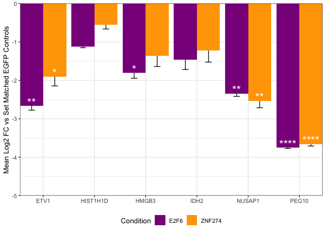<!-- -->

## qPCR Dot Plot Remake

``` r
ggplot(ctsLonger[ctsLonger$Condition != "GFP",], aes(x = Gene, y = setLog2FC, fill = Condition)) + geom_boxplot() + theme_bw() + scale_fill_manual(values = c("darkmagenta", "orange")) + NoLegend()
```

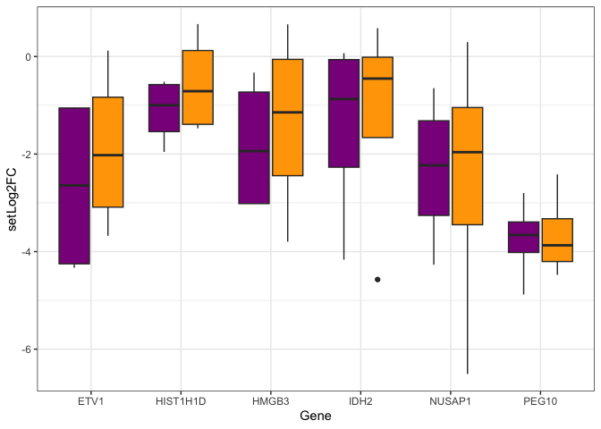<!-- -->

``` r
ggsave("Panels/validation_qPCR.pdf", height = 3, width = 2)
```

## KI67 ICC

``` r
ki67 <- read.csv("data_for_import/KI67_Proportions.csv")


ki67$Condition <- factor(ki67$Condition, levels = c("GFP", "Dox","E2F6", "ZNF274"))
#ki67$Condition <- relevel(ki67$Condition, "Dox")
ki67$Set <- factor(ki67$Set)


ki67_lm <- lm(data = ki67, formula = Proportion ~ Condition + Set)
summary(ki67_lm)
```

    ## 
    ## Call:
    ## lm(formula = Proportion ~ Condition + Set, data = ki67)
    ## 
    ## Residuals:
    ##        Min         1Q     Median         3Q        Max 
    ## -0.0040170 -0.0018330 -0.0004971  0.0021372  0.0046644 
    ## 
    ## Coefficients:
    ##                  Estimate Std. Error t value Pr(>|t|)    
    ## (Intercept)      0.049006   0.002696  18.175 1.79e-06 ***
    ## ConditionDox    -0.019341   0.003113  -6.212 0.000803 ***
    ## ConditionE2F6   -0.036217   0.003113 -11.632 2.43e-05 ***
    ## ConditionZNF274 -0.038241   0.003113 -12.283 1.77e-05 ***
    ## SetCM15         -0.006815   0.002696  -2.528 0.044827 *  
    ## SetCM16         -0.001989   0.002696  -0.738 0.488496    
    ## ---
    ## Signif. codes:  0 '***' 0.001 '**' 0.01 '*' 0.05 '.' 0.1 ' ' 1
    ## 
    ## Residual standard error: 0.003813 on 6 degrees of freedom
    ## Multiple R-squared:  0.9712, Adjusted R-squared:  0.9472 
    ## F-statistic: 40.49 on 5 and 6 DF,  p-value: 0.0001514

``` r
ki67_EMM <- emmeans(ki67_lm,  ~Condition)

ki67_summary <- pairs(ki67_EMM, adjust = "BH")

ki67_summary
```

    ##  contrast      estimate      SE df t.ratio p.value
    ##  GFP - Dox      0.01934 0.00311  6   6.212  0.0014
    ##  GFP - E2F6     0.03622 0.00311  6  11.632  0.0001
    ##  GFP - ZNF274   0.03824 0.00311  6  12.283  0.0001
    ##  Dox - E2F6     0.01688 0.00311  6   5.420  0.0020
    ##  Dox - ZNF274   0.01890 0.00311  6   6.070  0.0014
    ##  E2F6 - ZNF274  0.00202 0.00311  6   0.650  0.5396
    ## 
    ## Results are averaged over the levels of: Set 
    ## P value adjustment: BH method for 6 tests

``` r
ki67_plotting <- ki67 %>% group_by(Condition) %>%
  dplyr::summarise(avg.prop = mean(Proportion), std = sd(Proportion), n = n())


ki67_plotting$SE <- ki67_plotting$std / (ki67_plotting$n^.5)

ki67_plotting$avg.pct <- ki67_plotting$avg.prop * 100
ki67_plotting$SE <- ki67_plotting$SE * 100

ggplot(ki67_plotting, aes(x = Condition, y = avg.pct, fill = Condition)) + geom_errorbar(aes(ymin = avg.pct - SE, ymax = avg.pct + SE), position = position_dodge(width=0.9), width = 0.25) + geom_col() + scale_x_discrete(expand = c(0,0)) + scale_y_continuous(expand = c(0,0), limits = c(0,6)) +
  theme_bw() + scale_fill_manual(values = c("forestgreen", "navy", "darkmagenta", "orange")) + ylab("Percent KI67+") + theme(legend.position = "none")
```

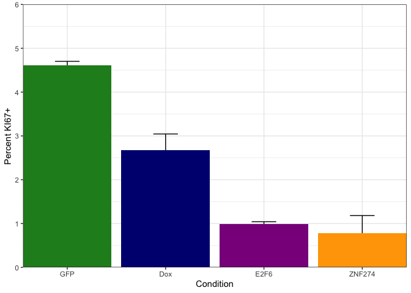<!-- -->

## KI67 Dot plot remake

``` r
ki67$Percent <- ki67$Proportion * 100

ki67GG <- ggplot(ki67, aes(x = Condition, y = Percent, fill = Condition)) + geom_dotplot(binaxis = "y", stackdir = "center", dotsize = 1) + theme_bw()  + scale_fill_manual(values = c("forestgreen", "navy", "darkmagenta", "orange")) + ylim(0,6) + NoLegend()

ki67GG
```

    ## Bin width defaults to 1/30 of the range of the data. Pick better value with
    ## `binwidth`.

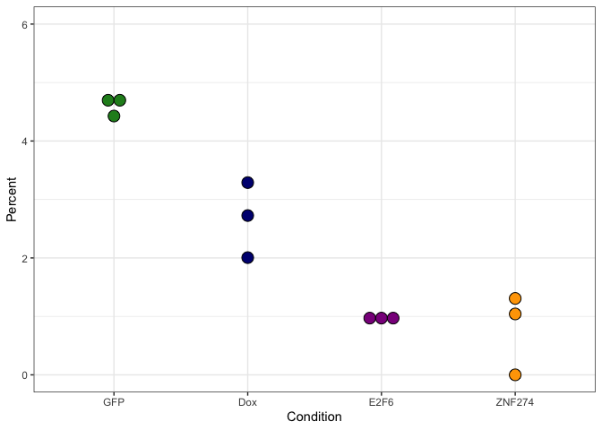<!-- -->

# bGal

``` r
bGal <- read.csv("data_for_import/bGal.csv")
unique(bGal$Condition)
```

    ## [1] "Dox"    "E2F6"   "GFP"    "ZNF274"

``` r
bGal$Condition <- mapvalues(bGal$Condition, from = unique(bGal$Condition), to = c("Dox Ctr", "E2F6 OE", "EGFP Ctr", "ZNF274 OE"))
bGal$Condition <- factor(bGal$Condition, levels = c("EGFP Ctr", "Dox Ctr", "E2F6 OE", "ZNF274 OE"))


#bGal <- bGal[bGal$Condition != "Dox",]

lm2 <- lm(data = bGal, bGal ~Condition + Set)
summary(lm2)
```

    ## 
    ## Call:
    ## lm(formula = bGal ~ Condition + Set, data = bGal)
    ## 
    ## Residuals:
    ##        Min         1Q     Median         3Q        Max 
    ## -0.0256954 -0.0055358 -0.0001675  0.0098310  0.0146458 
    ## 
    ## Coefficients:
    ##                    Estimate Std. Error t value Pr(>|t|)   
    ## (Intercept)         0.05923    0.01094   5.412  0.00165 **
    ## ConditionDox Ctr   -0.01172    0.01264  -0.927  0.38964   
    ## ConditionE2F6 OE    0.05265    0.01264   4.166  0.00591 **
    ## ConditionZNF274 OE -0.00333    0.01264  -0.263  0.80099   
    ## SetCM015            0.02303    0.01094   2.104  0.08003 . 
    ## SetCM016            0.02314    0.01094   2.114  0.07896 . 
    ## ---
    ## Signif. codes:  0 '***' 0.001 '**' 0.01 '*' 0.05 '.' 0.1 ' ' 1
    ## 
    ## Residual standard error: 0.01548 on 6 degrees of freedom
    ## Multiple R-squared:  0.8638, Adjusted R-squared:  0.7504 
    ## F-statistic: 7.613 on 5 and 6 DF,  p-value: 0.0141

``` r
EMM2 <- emmeans(lm2, ~Condition)


bGal_summary <- pairs(EMM2, adjust = "BH")
bGal_summary
```

    ##  contrast             estimate     SE df t.ratio p.value
    ##  EGFP Ctr - Dox Ctr    0.01172 0.0126  6   0.927  0.5845
    ##  EGFP Ctr - E2F6 OE   -0.05265 0.0126  6  -4.166  0.0118
    ##  EGFP Ctr - ZNF274 OE  0.00333 0.0126  6   0.263  0.8010
    ##  Dox Ctr - E2F6 OE    -0.06436 0.0126  6  -5.093  0.0118
    ##  Dox Ctr - ZNF274 OE  -0.00839 0.0126  6  -0.664  0.6379
    ##  E2F6 OE - ZNF274 OE   0.05598 0.0126  6   4.429  0.0118
    ## 
    ## Results are averaged over the levels of: Set 
    ## P value adjustment: BH method for 6 tests

``` r
bGalPlotting <- bGal %>% group_by(Condition) %>%
  dplyr::summarise(avg.pct = mean(bGal), std = sd(bGal), n = n())

bGalPlotting$SE <- bGalPlotting$std / (bGalPlotting$n^.5)

bGalPlotting$avg.pct <- bGalPlotting$avg.pct * 100
bGalPlotting$SE <- bGalPlotting$SE * 100
bGalPlotting$Condition <- factor(bGalPlotting$Condition, levels = c("EGFP Ctr", "Dox Ctr", "E2F6 OE", "ZNF274 OE"))

bGalGG <- ggplot(bGalPlotting, aes(x = Condition, y = avg.pct, fill = Condition)) + geom_errorbar(aes(ymin = avg.pct - SE, ymax = avg.pct + SE), position = position_dodge(width=0.9), width = 0.25) + geom_col() + scale_x_discrete(expand = c(0,0)) + scale_y_continuous(expand = c(0,0), limits = c(0,15)) +
  theme_bw() + scale_fill_manual(values = c("forestgreen", "navy", "darkmagenta", "orange")) + ylab("Percent β-Galactosidase+ GPCs") + theme(legend.position = "none")

bGalGG
```

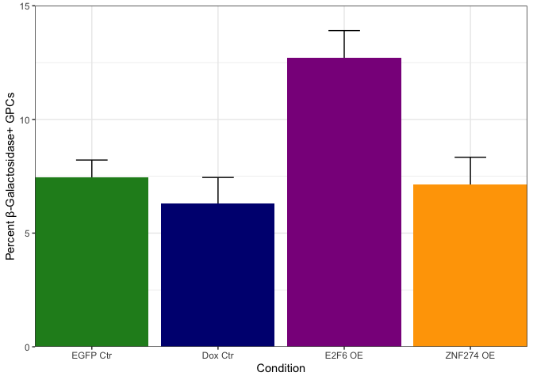<!-- -->

``` r
#ggsave("figures/bGal.pdf")
```

## bGAL Dot plot remake

``` r
bGal$Percent <- bGal$bGal * 100

bGalGG <- ggplot(bGal, aes(x = Condition, y = Percent, fill = Condition)) + geom_dotplot(binaxis = "y", stackdir = "center", dotsize = 1) + theme_bw()  + scale_fill_manual(values = c("forestgreen", "navy", "darkmagenta", "orange"))  + NoLegend() + ylim(0,20)

bGalGG
```

    ## Bin width defaults to 1/30 of the range of the data. Pick better value with
    ## `binwidth`.

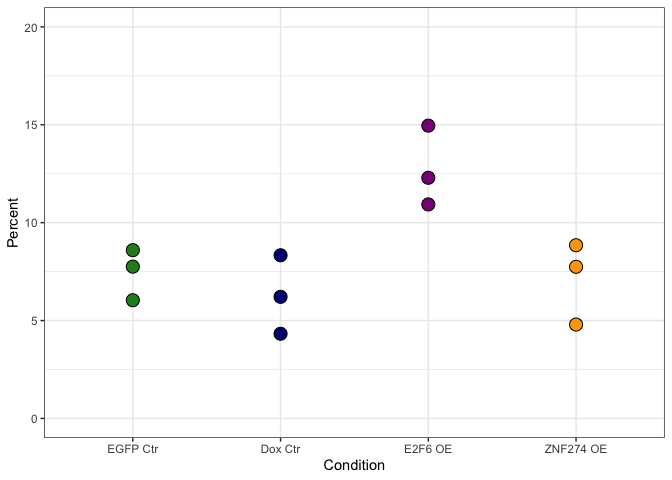<!-- -->

``` r
ki67GG | bGalGG
```

    ## Bin width defaults to 1/30 of the range of the data. Pick better value with
    ## `binwidth`.
    ## Bin width defaults to 1/30 of the range of the data. Pick better value with
    ## `binwidth`.

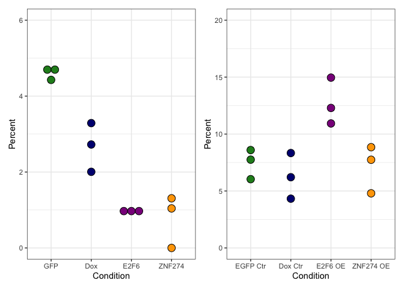<!-- -->

``` r
ggsave("Panels/KI67_dotPlot.pdf", width = 8, height = 6)
```

    ## Bin width defaults to 1/30 of the range of the data. Pick better value with
    ## `binwidth`.
    ## Bin width defaults to 1/30 of the range of the data. Pick better value with
    ## `binwidth`.

## Source Data

``` r
sdUMAP <- as.data.frame(GPC@reductions$umap@cell.embeddings)
sdMeta <- GPC@meta.data

identical(row.names(sdUMAP), row.names(sdMeta))
```

    ## [1] TRUE

``` r
sdUMAP$cellName <- row.names(sdUMAP)
sdUMAP <- sdUMAP[,c(3,1,2)]

sd5A <- cbind(sdUMAP, sdMeta[,c("label")])
names(sd5A)[4] <- "Sample"
names(sd5A)
```

    ## [1] "cellName" "UMAP_1"   "UMAP_2"   "Sample"

``` r
DefaultAssay(GPC) <- "RNA"

sd5A  <- cbind(sd5A, FetchData(GPC, c("PDGFRA", "E2F6", "ZNF274"), slot = "data"))

#write.xlsx(sd5A, file = "Source Data/Source_Data_Fig5.xlsx", sheetName = "Fig5A", row.names = F, append = T)

sd5B <- data.frame(gene = unique(c(E2F6vsEGFP$gene, ZNF274vsEGFP$gene)))
sd5B$E2F6_vs_EGFP <- ifelse(sd5B$gene %in% E2F6vsEGFP$gene, "Sig", "NS")
sd5B$ZNF274_vs_EGFP <- ifelse(sd5B$gene %in% ZNF274vsEGFP$gene, "Sig", "NS")

#write.xlsx(sd5B, file = "Source Data/Source_Data_Fig5.xlsx", sheetName = "Fig5B", row.names = F, append = T)

sd5C <- e2f6Upset
sd5C$gene <- row.names(sd5C)

#write.xlsx(sd5C, file = "Source Data/Source_Data_Fig5.xlsx", sheetName = "Fig5C", row.names = F, append = T)

sd5D <- znf274Upset
sd5D$gene <- row.names(sd5D)


#write.xlsx(sd5D, file = "Source Data/Source_Data_Fig5.xlsx", sheetName = "Fig5D", row.names = F, append = T)


DefaultAssay(GPC) <- "AUC"
sd5E <- FetchData(GPC, c("E2F6 Regulon", "ZNF274 Regulon"), slot = "data")

sd5E <- cbind(sd5E, sdMeta[,c("label")])
names(sd5E)[3] <- "Sample"
sd5E$cellName <- row.names(sd5E)
sd5E <- sd5E[,c(4,1,2,3)]

#write.xlsx(sd5E, file = "Source Data/Source_Data_Fig5.xlsx", sheetName = "Fig5E", row.names = F, append = T)


sd5F <- agingFC
names(sd5F) <- c("Gene", "Log2FC", "FDR", "Comparison", "Significance")

#write.xlsx(sd5F, file = "Source Data/Source_Data_Fig5.xlsx", sheetName = "Fig5F", row.names = F, append = T)
  

sd5G <- agingHM
sd5G <- sd5G[,c(6,2,5,7,8)]
names(sd5G) <- c("Gene", "Log2FC", "FDR", "Comparison", "Significance")

#write.xlsx(sd5G, file = "Source Data/Source_Data_Fig5.xlsx", sheetName = "Fig5G", row.names = F, append = T)

sd5H <- data.frame(gene = agingHMgenes)

sd5H$E2F6_Target = ifelse(sd5H$gene %in% E2F6_Targets$enrichedGenes, "Target", "Non-Target")
sd5H$ZNF274_Target = ifelse(sd5H$gene  %in% ZNF274_Targets$enrichedGenes, "Target", "Non-Target")

#write.xlsx(sd5H, file = "Source Data/Source_Data_Fig5.xlsx", sheetName = "Fig5H", row.names = F, append = T)


sd5I <- ctsLonger
sd5I <- sd5I[,c(2,5,8)]
sd5I <- as.data.frame(sd5I)
#write.xlsx(sd5I, file = "Source Data/Source_Data_Fig5.xlsx", sheetName = "Fig5I", row.names = F, append = T)

sd5I_pVal <- lmSummary
sd5I_pVal <- sd5I_pVal[,c(1,2,7)]
#write.xlsx(sd5I_pVal, file = "Source Data/Source_Data_Fig5.xlsx", sheetName = "Fig5I_pVal", row.names = F, append = T)

sd5J <- agingGO
sd5J <- sd5J[,c(1:4)]

#write.xlsx(sd5J, file = "Source Data/Source_Data_Fig5.xlsx", sheetName = "Fig5J", row.names = F, append = T)

sd5K <- ki67
sd5K <- sd5K[,c(3,2,5)]

#write.xlsx(sd5K, file = "Source Data/Source_Data_Fig5.xlsx", sheetName = "Fig5K", row.names = F, append = T)

sd5K_pVal <- as.data.frame(ki67_summary)
sd5K_pVal <- sd5K_pVal[,c(1,6)]
#write.xlsx(sd5K_pVal, file = "Source Data/Source_Data_Fig5.xlsx", sheetName = "Fig5K_pVal", row.names = F, append = T)


sd5L <- bGal
sd5L <- sd5L[,c(1,2,4)]
names(sd5L)
```

    ## [1] "Condition" "Set"       "Percent"

``` r
#write.xlsx(sd5L, file = "Source Data/Source_Data_Fig5.xlsx", sheetName = "Fig5L", row.names = F, append = T)

sd5L_pVal <- as.data.frame(bGal_summary)
sd5L_pVal <- sd5L_pVal[,c(1,6)]
#write.xlsx(sd5L_pVal, file = "Source Data/Source_Data_Fig5.xlsx", sheetName = "Fig5L_pVal", row.names = F, append = T)
```

\#Session Info

``` r
sessionInfo()
```

    ## R version 4.2.3 (2023-03-15)
    ## Platform: aarch64-apple-darwin20 (64-bit)
    ## Running under: macOS Ventura 13.2.1
    ## 
    ## Matrix products: default
    ## BLAS:   /Library/Frameworks/R.framework/Versions/4.2-arm64/Resources/lib/libRblas.0.dylib
    ## LAPACK: /Library/Frameworks/R.framework/Versions/4.2-arm64/Resources/lib/libRlapack.dylib
    ## 
    ## locale:
    ## [1] en_US.UTF-8/en_US.UTF-8/en_US.UTF-8/C/en_US.UTF-8/en_US.UTF-8
    ## 
    ## attached base packages:
    ## [1] stats4    stats     graphics  grDevices utils     datasets  methods  
    ## [8] base     
    ## 
    ## other attached packages:
    ##  [1] ComplexUpset_1.3.3         lsmeans_2.30-0            
    ##  [3] emmeans_1.8.5              lubridate_1.9.2           
    ##  [5] forcats_1.0.0              stringr_1.5.0             
    ##  [7] dplyr_1.1.1                purrr_1.0.1               
    ##  [9] readr_2.1.4                tibble_3.2.1              
    ## [11] tidyverse_2.0.0            RColorBrewer_1.1-3        
    ## [13] GSEABase_1.60.0            graph_1.76.0              
    ## [15] annotate_1.76.0            XML_3.99-0.14             
    ## [17] AnnotationDbi_1.60.2       IRanges_2.32.0            
    ## [19] S4Vectors_0.36.2           Biobase_2.58.0            
    ## [21] BiocGenerics_0.44.0        tidyr_1.3.0               
    ## [23] AUCell_1.20.2              RcisTarget_1.18.2         
    ## [25] plyr_1.8.8                 data.table_1.14.8         
    ## [27] ggVennDiagram_1.2.2        xlsx_0.6.5                
    ## [29] scPlottingTools_0.0.0.9000 patchwork_1.1.2           
    ## [31] ggplot2_3.4.2              SeuratObject_4.1.3        
    ## [33] Seurat_4.3.0              
    ## 
    ## loaded via a namespace (and not attached):
    ##   [1] utf8_1.2.3                  spatstat.explore_3.2-7     
    ##   [3] reticulate_1.34.0           R.utils_2.12.2             
    ##   [5] tidyselect_1.2.0            RSQLite_2.3.1              
    ##   [7] htmlwidgets_1.6.2           grid_4.2.3                 
    ##   [9] Rtsne_0.16                  munsell_0.5.0              
    ##  [11] ragg_1.2.5                  units_0.8-1                
    ##  [13] codetools_0.2-19            ica_1.0-3                  
    ##  [15] future_1.32.0               miniUI_0.1.1.1             
    ##  [17] withr_2.5.0                 spatstat.random_3.2-3      
    ##  [19] colorspace_2.1-0            progressr_0.13.0           
    ##  [21] highr_0.10                  knitr_1.42                 
    ##  [23] rstudioapi_0.14             SingleCellExperiment_1.20.1
    ##  [25] ROCR_1.0-11                 tensor_1.5                 
    ##  [27] rJava_1.0-6                 listenv_0.9.0              
    ##  [29] labeling_0.4.2              MatrixGenerics_1.10.0      
    ##  [31] GenomeInfoDbData_1.2.9      polyclip_1.10-4            
    ##  [33] farver_2.1.1                bit64_4.0.5                
    ##  [35] rprojroot_2.0.3             TH.data_1.1-2              
    ##  [37] parallelly_1.35.0           vctrs_0.6.1                
    ##  [39] generics_0.1.3              xfun_0.38                  
    ##  [41] timechange_0.2.0            R6_2.5.1                   
    ##  [43] GenomeInfoDb_1.34.9         RVenn_1.1.0                
    ##  [45] bitops_1.0-7                spatstat.utils_3.0-4       
    ##  [47] arrow_11.0.0.3              cachem_1.0.7               
    ##  [49] DelayedArray_0.24.0         assertthat_0.2.1           
    ##  [51] promises_1.2.0.1            scales_1.2.1               
    ##  [53] multcomp_1.4-25             gtable_0.3.3               
    ##  [55] globals_0.16.2              goftest_1.2-3              
    ##  [57] sandwich_3.1-0              rlang_1.1.0                
    ##  [59] systemfonts_1.0.4           splines_4.2.3              
    ##  [61] lazyeval_0.2.2              spatstat.geom_3.2-9        
    ##  [63] yaml_2.3.7                  reshape2_1.4.4             
    ##  [65] abind_1.4-5                 httpuv_1.6.9               
    ##  [67] tools_4.2.3                 ellipsis_0.3.2             
    ##  [69] proxy_0.4-27                ggridges_0.5.4             
    ##  [71] Rcpp_1.0.10                 progress_1.2.2             
    ##  [73] sparseMatrixStats_1.10.0    zlibbioc_1.44.0            
    ##  [75] classInt_0.4-9              RCurl_1.98-1.12            
    ##  [77] prettyunits_1.1.1           deldir_1.0-6               
    ##  [79] pbapply_1.7-0               cowplot_1.1.1              
    ##  [81] zoo_1.8-11                  SummarizedExperiment_1.28.0
    ##  [83] ggrepel_0.9.3               cluster_2.1.4              
    ##  [85] magrittr_2.0.3              scattermore_0.8            
    ##  [87] lmtest_0.9-40               RANN_2.6.1                 
    ##  [89] mvtnorm_1.1-3               fitdistrplus_1.1-8         
    ##  [91] matrixStats_0.63.0          hms_1.1.3                  
    ##  [93] xlsxjars_0.6.1              mime_0.12                  
    ##  [95] evaluate_0.20               xtable_1.8-4               
    ##  [97] gridExtra_2.3               compiler_4.2.3             
    ##  [99] KernSmooth_2.23-20          crayon_1.5.2               
    ## [101] R.oo_1.25.0                 htmltools_0.5.5            
    ## [103] later_1.3.0                 tzdb_0.3.0                 
    ## [105] DBI_1.1.3                   MASS_7.3-58.3              
    ## [107] sf_1.0-12                   MAST_1.24.1                
    ## [109] Matrix_1.5-4                cli_3.6.1                  
    ## [111] R.methodsS3_1.8.2           parallel_4.2.3             
    ## [113] igraph_1.4.1                GenomicRanges_1.50.2       
    ## [115] pkgconfig_2.0.3             sp_1.6-0                   
    ## [117] plotly_4.10.1               spatstat.sparse_3.0-3      
    ## [119] XVector_0.38.0              estimability_1.4.1         
    ## [121] digest_0.6.31               sctransform_0.3.5          
    ## [123] RcppAnnoy_0.0.20            spatstat.data_3.0-4        
    ## [125] Biostrings_2.66.0           rmarkdown_2.21             
    ## [127] leiden_0.4.3                uwot_0.1.14                
    ## [129] DelayedMatrixStats_1.20.0   shiny_1.7.4                
    ## [131] lifecycle_1.0.3             nlme_3.1-162               
    ## [133] jsonlite_1.8.4              limma_3.54.2               
    ## [135] viridisLite_0.4.1           fansi_1.0.4                
    ## [137] pillar_1.9.0                lattice_0.21-8             
    ## [139] KEGGREST_1.38.0             fastmap_1.1.1              
    ## [141] httr_1.4.5                  survival_3.5-5             
    ## [143] glue_1.6.2                  png_0.1-8                  
    ## [145] bit_4.0.5                   class_7.3-21               
    ## [147] stringi_1.7.12              blob_1.2.4                 
    ## [149] textshaping_0.3.6           memoise_2.0.1              
    ## [151] e1071_1.7-13                irlba_2.3.5.1              
    ## [153] future.apply_1.10.0
