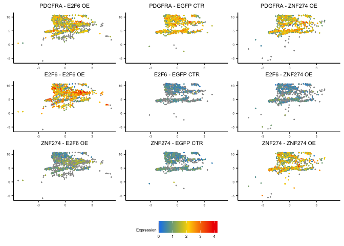

scRNA-Seq Analysis of ZNF274 or E2F6 Overexpression in C27 hGPCs
================
John Mariani
03/06/23

``` r
source("Scripts/Helper_Functions.R")
library(Seurat)
library(ggplot2)
library(patchwork)
library(scPlottingTools)
library(xlsx)
library(ggVennDiagram)
library(data.table)
library(plyr)

options(future.globals.maxSize = 16000 * 1024^2)
```

# Make Quality Violin Plots

``` r
ObjectsH <- readRDS("RDS/ObjectsH_Pre.rds")

theme(axis.text = element_text(size = 8), plot.title = element_text(size = 10))
```

    ## List of 2
    ##  $ axis.text :List of 11
    ##   ..$ family       : NULL
    ##   ..$ face         : NULL
    ##   ..$ colour       : NULL
    ##   ..$ size         : num 8
    ##   ..$ hjust        : NULL
    ##   ..$ vjust        : NULL
    ##   ..$ angle        : NULL
    ##   ..$ lineheight   : NULL
    ##   ..$ margin       : NULL
    ##   ..$ debug        : NULL
    ##   ..$ inherit.blank: logi FALSE
    ##   ..- attr(*, "class")= chr [1:2] "element_text" "element"
    ##  $ plot.title:List of 11
    ##   ..$ family       : NULL
    ##   ..$ face         : NULL
    ##   ..$ colour       : NULL
    ##   ..$ size         : num 10
    ##   ..$ hjust        : NULL
    ##   ..$ vjust        : NULL
    ##   ..$ angle        : NULL
    ##   ..$ lineheight   : NULL
    ##   ..$ margin       : NULL
    ##   ..$ debug        : NULL
    ##   ..$ inherit.blank: logi FALSE
    ##   ..- attr(*, "class")= chr [1:2] "element_text" "element"
    ##  - attr(*, "class")= chr [1:2] "theme" "gg"
    ##  - attr(*, "complete")= logi FALSE
    ##  - attr(*, "validate")= logi TRUE

``` r
middleV <- VlnPlot(ObjectsH[[1]], c("nFeature_RNA", "nCount_RNA", "percent.mt"), pt.size = .01) & theme(axis.text = element_text(size = 8), plot.title = element_text(size = 10), axis.title = element_text(size = 10))
topV <- VlnPlot(ObjectsH[[2]], c("nFeature_RNA", "nCount_RNA", "percent.mt"), pt.size = .01) & theme(axis.text = element_text(size = 8), plot.title = element_text(size = 10), axis.title = element_text(size = 10))
bottomV <- VlnPlot(ObjectsH[[3]], c("nFeature_RNA", "nCount_RNA", "percent.mt"), pt.size = .01) & theme(axis.text = element_text(size = 8), plot.title = element_text(size = 10), axis.title = element_text(size = 10))

topV[[1]] <- topV[[1]] + ylab("EGFP CTR") + ggtitle("Unique Genes") 
topV[[2]] <- topV[[2]] + ggtitle("UMIs") 
topV[[3]] <- topV[[3]] + ggtitle("MT Gene%") 
topV <- topV & theme(axis.text.x = element_blank(), axis.title.x = element_blank())

middleV[[1]] <- middleV[[1]] + ylab("E2F6 OE")
middleV <- middleV & theme(axis.text.x = element_blank(), axis.title.x = element_blank(), plot.title = element_blank())

bottomV[[1]] <- bottomV[[1]] + ylab("ZNF274 OE")
bottomV <- bottomV & theme(axis.text.x = element_blank(), axis.title.x = element_blank(), plot.title = element_blank())

topV / middleV / bottomV
```

<!-- -->

``` r
for (i in 1:3) {
  ObjectsH[[i]] <- subset(x = ObjectsH[[i]], subset = nFeature_RNA > 500 & percent.mt < 15)
}


middleV2 <- VlnPlot(ObjectsH[[1]], c("nFeature_RNA", "nCount_RNA", "percent.mt"), pt.size = .01) & theme(axis.text = element_text(size = 8), plot.title = element_text(size = 10), axis.title = element_text(size = 10))
topV2 <- VlnPlot(ObjectsH[[2]], c("nFeature_RNA", "nCount_RNA", "percent.mt"), pt.size = .01) & theme(axis.text = element_text(size = 8), plot.title = element_text(size = 10), axis.title = element_text(size = 10))
bottomV2 <- VlnPlot(ObjectsH[[3]], c("nFeature_RNA", "nCount_RNA", "percent.mt"), pt.size = .01) & theme(axis.text = element_text(size = 8), plot.title = element_text(size = 10), axis.title = element_text(size = 10))

topV2[[1]] <- topV2[[1]] + ylab("EGFP CTR") + ggtitle("Unique Genes")
topV2[[2]] <- topV2[[2]] + ggtitle("UMIs")
topV2[[3]] <- topV2[[3]] + ggtitle("MT Gene%")
topV2 <- topV2 & theme(axis.text.x = element_blank(), axis.title.x = element_blank())

middleV2[[1]] <- middleV2[[1]] + ylab("E2F6 OE")
middleV2 <- middleV2 & theme(axis.text.x = element_blank(), axis.title.x = element_blank(), plot.title = element_blank())

bottomV2[[1]] <- bottomV2[[1]] + ylab("ZNF274 OE")
bottomV2 <- bottomV2 & theme(axis.text.x = element_blank(), axis.title.x = element_blank(), plot.title = element_blank())

topV2 / middleV2 / bottomV2
```

<!-- -->

``` r
topSup <- (topV / middleV / bottomV) | (topV2 / middleV2 / bottomV2) 


topSup 
```

<!-- -->

# Load Integrated Data and identify Celltypes

``` r
integrated <- readRDS("RDS/integrated_OE.rds")

DefaultAssay(integrated) <- "RNA"
integrated <- NormalizeData(integrated)

VlnPlot(integrated, c("PDGFRA", "MKI67", "GFAP", "CD44", "MYT1L", "GRIA2", "NEUROD2", "RBFOX3"), ncol = 4, pt.size = 0) | DimPlot(integrated)
```

<!-- -->

``` r
integrated <- RenameIdents(integrated, "4" = "Astrocytic")
integrated <- RenameIdents(integrated, "6" = "Neuronal")
integrated <- RenameIdents(integrated, "2" = "GPC")
integrated <- RenameIdents(integrated, "3" = "GPC")
integrated <- RenameIdents(integrated, "0" = "NPC")
integrated <- RenameIdents(integrated, "1" = "NPC")
integrated <- RenameIdents(integrated, "5" = "NPC")
integrated <- RenameIdents(integrated, "7" = "NPC")

Idents(integrated) <- factor(Idents(integrated), levels = c("GPC", "Astrocytic", "NPC", "Neuronal"))
integrated$CellType <- Idents(integrated)


VlnPlot(integrated, c("PDGFRA", "MKI67", "GFAP", "CD44", "MYT1L", "GRIA2", "NEUROD2", "RBFOX3"), ncol = 4, pt.size = 0) | DimPlot(integrated)
```

<!-- -->

``` r
temp <- unique(integrated$orig.ident)
names(temp) <- c("E2F6 OE", "EGFP CTR", "ZNF274 OE")
integrated$label <- mapvalues(integrated$orig.ident, from = temp, to = names(temp))
integrated$label <- factor(integrated$label, levels = c("EGFP CTR", "E2F6 OE", "ZNF274 OE"))
```

## Make Supplement Figure

``` r
table(integrated$label)
```

    ## 
    ##  EGFP CTR   E2F6 OE ZNF274 OE 
    ##      4526      4517      5584

``` r
suppDims <- (DimPlotCustom(integrated, group.by = "CellType", split.by = "label") & NoLegend())
suppDims[[1]] <- suppDims[[1]]  + ggtitle ("EGFP CTR - 4,526 Cells")
suppDims[[2]] <- suppDims[[2]]  + ggtitle ("EGFP CTR - 4,517 Cells")
suppDims[[3]] <- suppDims[[3]]  + ggtitle ("EGFP CTR - 5,584 Cells")

suppBottomFigure <- suppDims /
VlnPlot(integrated, c("PDGFRA", "MKI67", "GFAP", "CD44", "MYT1L", "GRIA2", "NEUROD2", "RBFOX3"), pt.size = 0, ncol  = 4) & theme(axis.title = element_blank())

suppBottomFigure <- suppBottomFigure & theme(axis.text = element_text(size = 8), plot.title = element_text(size = 10))


(topSup / suppBottomFigure) + plot_layout(heights = c(1,1.3)) 
```

<!-- -->

``` r
ggsave("figures/ExtendedDataFigure7.pdf", width = 8.5, height = 11)
```

## Subset GPC population for DE analysis

``` r
GPC <- subset(integrated, idents = "GPC")

#### Over expression plots
GPCfeaturePlots <- FeaturePlotCustom(GPC, c("PDGFRA", "E2F6", "ZNF274"), split.by = "label", sharedScale = "All")+ plot_layout(guides = "collect")
GPCfeaturePlots 
```

<!-- -->

``` r
frequencies <- DotPlot(GPC, group.by = "label", features = row.names(GPC))
```

    ## Warning: Scaling data with a low number of groups may produce misleading
    ## results

``` r
freq <- frequencies$data
freq <- freq[freq$pct.exp > .1,]
features <- unique(freq$features.plot)


#### DE
E2F6vsEGFPall <- FindMarkers(GPC, ident.1 = "E2F6 OE", ident.2 = "EGFP CTR", test.use = "MAST", group.by = "label", logfc.threshold = 0, features = features)
```

    ## 
    ## Done!

    ## Combining coefficients and standard errors

    ## Calculating log-fold changes

    ## Calculating likelihood ratio tests

    ## Refitting on reduced model...

    ## 
    ## Done!

``` r
ZNF274vsEGFPall <- FindMarkers(GPC, ident.1 = "ZNF274 OE", ident.2 = "EGFP CTR", test.use = "MAST", group.by = "label", logfc.threshold = 0, features = features)
```

    ## 
    ## Done!

    ## Combining coefficients and standard errors

    ## Calculating log-fold changes

    ## Calculating likelihood ratio tests

    ## Refitting on reduced model...

    ## 
    ## Done!

``` r
E2F6vsEGFPall$gene <- row.names(E2F6vsEGFPall)
ZNF274vsEGFPall$gene <- row.names(ZNF274vsEGFPall)

E2F6vsEGFP <- E2F6vsEGFPall[E2F6vsEGFPall$p_val_adj < 0.05 & abs(E2F6vsEGFPall$avg_log2FC) > 0.25,]
ZNF274vsEGFP <- ZNF274vsEGFPall[ZNF274vsEGFPall$p_val_adj < 0.05 & abs(ZNF274vsEGFPall$avg_log2FC) > 0.25,]

E2F6vsEGFP$gene <- row.names(E2F6vsEGFP)
ZNF274vsEGFP$gene <- row.names(ZNF274vsEGFP)

write.table(E2F6vsEGFP, "output/E2F6vsEGFP.txt", quote = F, row.names = F, sep = "\t")
write.table(ZNF274vsEGFP, "output/ZNF274vsEGFP.txt", quote = F, row.names = F, sep = "\t")

sup4a <- E2F6vsEGFP
sup4b <- ZNF274vsEGFP

sup4a <- sup4a[,c(2:6)]
names(sup4a) <- c("Log2FC_E2F6_vs_CTR", "Percent E2F6", "Percent Ctr",  "Adj_P_Val",    "External_Gene_Name")

sup4b <- sup4b[,c(2:6)]
names(sup4b) <- c("Log2FC_ZNF274_vs_CTR",   "Percent ZNF274",   "Percent Ctr",  "Adj_P_Val",    "External_Gene_Name")


# Write out Extended Data Table
write.xlsx(E2F6vsEGFP, file = "Extended Data Tables/Extended Data Table 4 - Adult Repressor scRNAseq.xlsx", row.names = F, sheetName = "E2F6_OE_vs_EGFP_CTR_DE")

write.xlsx(ZNF274vsEGFP, file = "Extended Data Tables/Extended Data Table 4 - Adult Repressor scRNAseq.xlsx", row.names = F, sheetName = "ZNF274_OE_vs_EGFP_CTR_DE", append = T)
```

## Venn

``` r
VennAging <- list(
  "E2F6 vs EGFP" =E2F6vsEGFP$gene,
  "ZNF274 vs EGFP" = ZNF274vsEGFP$gene)

venn <- ggVennDiagram(VennAging, label = "count") + theme(legend.position = "none")

venn
```

<!-- -->

``` r
intersectingGenes <- merge(E2F6vsEGFP, ZNF274vsEGFP, by.x = 0, by.y = 0)

table(intersectingGenes$avg_log2FC.x > 0, intersectingGenes$avg_log2FC.y > 0)
```

    ##        
    ##         FALSE TRUE
    ##   FALSE   106    0
    ##   TRUE      2   47

## FC Heatmap

``` r
#####  FC Heatmap
E2F6vsEGFPall$Comparison <- "E2F6 OE vs EGFP CTR"
ZNF274vsEGFPall$Comparison <- "ZNF274 OE vs EGFP CTR"

agingHM <- rbind(E2F6vsEGFPall, ZNF274vsEGFPall)

agingHMgenes <- c("CDK1", "PDGFRA", "EZH2", "HMGB1", "BCL11A", "TEAD2", "E2F6", "ZNF274", "MKI67", "PCLAF", "MIF", "CENPU", "CDKN1A", "TXNIP", 
                  "HIST1H4C", "TOP2A", "LMNB1", "BTG1", "CTNNB1", "ZMAT3", "GADD45G", "HMGN2", "HMGB1","HMGB2", "TMPO")


agingHM <- agingHM[agingHM$gene %in% agingHMgenes,]
agingHM$p_val_adj <- ifelse(abs(agingHM$avg_log2FC) < 0.25, 1, agingHM$p_val_adj)


agingHM$sig <- ifelse(agingHM$p_val_adj < .0001, "****", 
                          ifelse(agingHM$p_val_adj < .001, "***", 
                                 ifelse(agingHM$p_val_adj < .01, "**", 
                                        ifelse(agingHM$p_val_adj < .05, "*", ""))))

# agingHMgg <- ggplot(agingHM, aes(y = Comparison, x = gene, fill = avg_log2FC, label = sig)) + geom_tile() + scale_fill_gradient2(low = "blue", high = "red", midpoint = 0, mid = "lightgrey") +
#   geom_text(vjust = .7, size = 6, hjust = .5, angle = 90)  + 
#   scale_x_discrete(expand = c(0,0)) + 
#   scale_y_discrete(expand = c(0,0)) +
#   theme(axis.text.x = element_text(angle = 90, hjust = 1, vjust = 0.05), axis.title = element_blank()) 
# 
# agingHMgg

agingHMgg2 <- ggplot(agingHM, aes(x = Comparison, y = gene, fill = avg_log2FC, label = sig)) + geom_tile() + scale_fill_gradient2(low = "blue", high = "red", midpoint = 0, mid = "lightgrey") +
  geom_text(vjust = .7, size = 6, hjust = .5, angle = 0)   + 
  scale_x_discrete(expand = c(0,0)) + 
  scale_y_discrete(expand = c(0,0)) +
  theme(axis.text.x = element_text(angle = 45, hjust = 1, vjust = 1), axis.title = element_blank(), legend.position = "bottom") 

agingHMgg2
```

<!-- -->

## IPA Graph

``` r
##### IPA
filename="data_for_import/ensemblGeneList.csv"
if(file.exists(filename)){
  ensemblGeneListH <- read.csv(filename)} else{
    marth <- useMart(biomart = "ENSEMBL_MART_ENSEMBL", dataset = "hsapiens_gene_ensembl", host = 'http://jan2019.archive.ensembl.org/', ensemblRedirect = T)
    ensemblGeneListH <- getBM(attributes = c("ensembl_gene_id","external_gene_name", "gene_biotype", "description"), filters = "ensembl_gene_id",values = row.names(txi.rsem$counts), mart = marth)
    write.csv(ensemblGeneListH, filename, row.names = F)
  }


files <- paste0("data_for_import/", c("ZNF274vsEGFP_IPA.txt", "E2F6vsEGFP_IPA.txt"))
compNames <- c("ZNF274 OE vs EGFP CTR", "E2F6 OE vs EGFP CTR")

IPAparse <- function(files, compNames, pval = 0.001, filterTerms, ensembl, returnWhat = "Filtered"){
  pval <- -log10(pval)
  for(i in 1:length(files)){
    canonicalIPA <- fread(files[i], skip = "Canonical",drop = c(4,6))
    names(canonicalIPA) <- c("Pathway", "pVal", "zScore", "Genes")
    canonicalIPA$type <- "Canonical"
    upstreamIPA <- fread(files[i], skip = "Upstream Regulators", drop = c(1:2,4:6,8:10,13:14))
    upstreamIPA <- upstreamIPA[,c(1,3,2,4)]
    names(upstreamIPA) <- c("Pathway", "pVal", "zScore", "Genes")
    upstreamIPA$Pathway <- paste0(upstreamIPA$Pathway, " Signaling")
    upstreamIPA$pVal <- -log10(upstreamIPA$pVal)
    upstreamIPA$type <- "Upstream"
    functionalIPA <- fread(files[i], skip = "Diseases and Bio", drop = c(1,2,5,7,8,10,11))
    names(functionalIPA) <- c("Pathway", "pVal", "zScore", "Genes")
    functionalIPA$pVal <- -log10(functionalIPA$pVal)
    functionalIPA$type <- "Functional"
    moleculesIPAtemp <- fread(files[i], skip = "Analysis Ready Molecules", drop = c(3:4))
    if(i == 1){
      IPA <- rbind(canonicalIPA, upstreamIPA, functionalIPA)
      IPA$comparison <- compNames[i]
      moleculesIPA <- moleculesIPAtemp
    } else {
      tempIPA <- rbind(canonicalIPA, upstreamIPA, functionalIPA)
      tempIPA$comparison <- compNames[i]
      IPA <- rbind(IPA, tempIPA)
      moleculesIPA <- rbind(moleculesIPA, moleculesIPAtemp)
    }
  }
  
  
  IPA[is.na(IPA$zScore)]$zScore <- 0
  ogIPA <- IPA
  IPA <- IPA[IPA$pVal > pval,]
  filteredIPA <- IPA[!grepl(paste(filterTerms, collapse = "|"), ignore.case = T, IPA$Pathway),]
  if(returnWhat == "Filtered"){
    return(filteredIPA)
  } 
  if(returnWhat == "Deleted"){
    deletedIPA <- IPA[grepl(paste(filterTerms, collapse = "|"), ignore.case = T, IPA$Pathway),]
    return(deletedIPA)
  }
  if(returnWhat == "Molecules"){
    moleculesIPA <- merge(moleculesIPA, ensembl, by.x = "ID", by.y = "ensembl_gene_id")
    return(moleculesIPA)
  }
}


IPAfilters <- c("cancer","glioma", "abdominal", "carcinoma", "endometrium", "eye", "nose", "epidermis", "head", "lymphocyte", "renal", "snout", "tooth", 
                "connective", "tumor", "fibroblast", "rickets", "mouth", "maxilla", "cartilage", "neoplasm", "lymph", "liver", "psoriasis", "cardio",
                "cardiac", "tongue", "tinea", "herpes", "Picornaviridae", "virus", "killer T", "muscle", "myopathy", "pancreatic", "Onychomycosis",
                "leukocyte", "oral cavity","osteoclast", "Merkel", "macrophage", "Hydrometrocolpos", "Hand", "Gastric", "Thymocytes", "diabetes",
                "Dupuytren", "myoblast", "ear$", "implantation", "bone", "limb", "cleft lip", "Calcinosis", "lung", "Benign lesion", 
                "body axis", "sensory organ", "diabetic", "neutrophil", "infection of mammalia", "leukopoiesis", "neoplasia", "Sensory system development",
                "T cell", "myeloid", "aorta", "body cavity", "esophagus", "incisor", "kidney", "oesophageal", "respiratory", "skin", "cavity", "urinary",
                "foot", "digit", "heart", "acute biphenotypic leukemia", "Ankylosis", "Articular rigidity", "Atherosclero", "Blister", "Branching morphogenesis of epithelial tubule",
                "Cervical spondylotic myelopathy", "epithelial", "exocrine", "gastrointestinal", "Ejection of first polar body", "Familial arrhythmia", "Familial nonsyndromic hearing impairment", 
                "fibrosis", "mammary", "Hearing", "Morphogenesis of metanephric bud", "cochlea", "nail", "Plasma cell dyscrasia", "Secondary Leukemia", "granulocyte",
                "Tinnitus", "metastasis", "trunk", "sperm motility", "skull", "dendritic cells", "dehydration", "digestive", "microphthalmia", "myelodysplastic",
                "semicircular canal", " skeleton", "osteopenia", "osteoarthritis", "Refractory anemia with excess blasts", "rectum", "submandibular", "antiviral", "HIV-1",
                "antigen present", "gonad", "keratinocyte", "phagocyte", "coronary", "intestinal", "viral replicon", "monocyte", "viral life", "wound", "leukemia", "Airway", "colorectal", "Benign oral disorder", "Benign pelvic disease", "Glioblastoma", "Melanoma", "astrocytoma", "sarcoma", "leiomyoma", "sertoli", "short stature", "midline defect")

filteredAgingIPA <- IPAparse(files = files, compNames = compNames, filterTerms = IPAfilters, ensembl = ensemblGeneListH, returnWhat = "Filtered", pval = 0.05)
```

    ## Warning in fread(files[i], skip = "Canonical", drop = c(4, 6)): Detected 5
    ## column names but the data has 6 columns (i.e. invalid file). Added 1 extra
    ## default column name for the first column which is guessed to be row names or an
    ## index. Use setnames() afterwards if this guess is not correct, or fix the file
    ## write command that created the file to create a valid file.

    ## Warning in fread(files[i], skip = "Canonical", drop = c(4, 6)): Stopped early
    ## on line 404. Expected 6 fields but found 0. Consider fill=TRUE and
    ## comment.char=. First discarded non-empty line: <<Upstream Regulators for My
    ## Projects->Aging_scRNA->ZNF274vsEGFP - 2023-01-29 06:53 PM>>

    ## Warning in fread(files[i], skip = "Upstream Regulators", drop = c(1:2, 4:6, :
    ## Stopped early on line 2484. Expected 14 fields but found 0. Consider fill=TRUE
    ## and comment.char=. First discarded non-empty line: <<Causal Networks for My
    ## Projects->Aging_scRNA->ZNF274vsEGFP - 2023-01-29 06:53 PM>>

    ## Warning in fread(files[i], skip = "Diseases and Bio", drop = c(1, 2, 5, :
    ## Stopped early on line 3714. Expected 11 fields but found 0. Consider fill=TRUE
    ## and comment.char=. First discarded non-empty line: <<Tox Functions for My
    ## Projects->Aging_scRNA->ZNF274vsEGFP - 2023-01-29 06:53 PM>>

    ## Warning in fread(files[i], skip = "Canonical", drop = c(4, 6)): Detected 5
    ## column names but the data has 6 columns (i.e. invalid file). Added 1 extra
    ## default column name for the first column which is guessed to be row names or an
    ## index. Use setnames() afterwards if this guess is not correct, or fix the file
    ## write command that created the file to create a valid file.

    ## Warning in fread(files[i], skip = "Canonical", drop = c(4, 6)): Stopped early
    ## on line 476. Expected 6 fields but found 0. Consider fill=TRUE and
    ## comment.char=. First discarded non-empty line: <<Upstream Regulators for My
    ## Projects->Aging_scRNA->E2F6vsEGFP - 2023-01-29 06:52 PM>>

    ## Warning in fread(files[i], skip = "Upstream Regulators", drop = c(1:2, 4:6, :
    ## Stopped early on line 3062. Expected 14 fields but found 0. Consider fill=TRUE
    ## and comment.char=. First discarded non-empty line: <<Causal Networks for My
    ## Projects->Aging_scRNA->E2F6vsEGFP - 2023-01-29 06:52 PM>>

    ## Warning in fread(files[i], skip = "Diseases and Bio", drop = c(1, 2, 5, :
    ## Stopped early on line 4774. Expected 11 fields but found 0. Consider fill=TRUE
    ## and comment.char=. First discarded non-empty line: <<Tox Functions for My
    ## Projects->Aging_scRNA->E2F6vsEGFP - 2023-01-29 06:52 PM>>

``` r
deletedAgingIPA <- IPAparse(files = files, compNames = compNames, filterTerms = IPAfilters, ensembl = ensemblGeneListH, returnWhat = "Deleted", pval = 0.05)
```

    ## Warning in fread(files[i], skip = "Canonical", drop = c(4, 6)): Detected 5
    ## column names but the data has 6 columns (i.e. invalid file). Added 1 extra
    ## default column name for the first column which is guessed to be row names or an
    ## index. Use setnames() afterwards if this guess is not correct, or fix the file
    ## write command that created the file to create a valid file.

    ## Warning in fread(files[i], skip = "Canonical", drop = c(4, 6)): Stopped early
    ## on line 404. Expected 6 fields but found 0. Consider fill=TRUE and
    ## comment.char=. First discarded non-empty line: <<Upstream Regulators for My
    ## Projects->Aging_scRNA->ZNF274vsEGFP - 2023-01-29 06:53 PM>>

    ## Warning in fread(files[i], skip = "Upstream Regulators", drop = c(1:2, 4:6, :
    ## Stopped early on line 2484. Expected 14 fields but found 0. Consider fill=TRUE
    ## and comment.char=. First discarded non-empty line: <<Causal Networks for My
    ## Projects->Aging_scRNA->ZNF274vsEGFP - 2023-01-29 06:53 PM>>

    ## Warning in fread(files[i], skip = "Diseases and Bio", drop = c(1, 2, 5, :
    ## Stopped early on line 3714. Expected 11 fields but found 0. Consider fill=TRUE
    ## and comment.char=. First discarded non-empty line: <<Tox Functions for My
    ## Projects->Aging_scRNA->ZNF274vsEGFP - 2023-01-29 06:53 PM>>

    ## Warning in fread(files[i], skip = "Canonical", drop = c(4, 6)): Detected 5
    ## column names but the data has 6 columns (i.e. invalid file). Added 1 extra
    ## default column name for the first column which is guessed to be row names or an
    ## index. Use setnames() afterwards if this guess is not correct, or fix the file
    ## write command that created the file to create a valid file.

    ## Warning in fread(files[i], skip = "Canonical", drop = c(4, 6)): Stopped early
    ## on line 476. Expected 6 fields but found 0. Consider fill=TRUE and
    ## comment.char=. First discarded non-empty line: <<Upstream Regulators for My
    ## Projects->Aging_scRNA->E2F6vsEGFP - 2023-01-29 06:52 PM>>

    ## Warning in fread(files[i], skip = "Upstream Regulators", drop = c(1:2, 4:6, :
    ## Stopped early on line 3062. Expected 14 fields but found 0. Consider fill=TRUE
    ## and comment.char=. First discarded non-empty line: <<Causal Networks for My
    ## Projects->Aging_scRNA->E2F6vsEGFP - 2023-01-29 06:52 PM>>

    ## Warning in fread(files[i], skip = "Diseases and Bio", drop = c(1, 2, 5, :
    ## Stopped early on line 4774. Expected 11 fields but found 0. Consider fill=TRUE
    ## and comment.char=. First discarded non-empty line: <<Tox Functions for My
    ## Projects->Aging_scRNA->E2F6vsEGFP - 2023-01-29 06:52 PM>>

``` r
moleculesAging <- IPAparse(files = files, compNames = compNames, filterTerms = IPAfilters, ensembl = ensemblGeneListH, returnWhat = "Molecules", pval = 0.05)
```

    ## Warning in fread(files[i], skip = "Canonical", drop = c(4, 6)): Detected 5
    ## column names but the data has 6 columns (i.e. invalid file). Added 1 extra
    ## default column name for the first column which is guessed to be row names or an
    ## index. Use setnames() afterwards if this guess is not correct, or fix the file
    ## write command that created the file to create a valid file.

    ## Warning in fread(files[i], skip = "Canonical", drop = c(4, 6)): Stopped early
    ## on line 404. Expected 6 fields but found 0. Consider fill=TRUE and
    ## comment.char=. First discarded non-empty line: <<Upstream Regulators for My
    ## Projects->Aging_scRNA->ZNF274vsEGFP - 2023-01-29 06:53 PM>>

    ## Warning in fread(files[i], skip = "Upstream Regulators", drop = c(1:2, 4:6, :
    ## Stopped early on line 2484. Expected 14 fields but found 0. Consider fill=TRUE
    ## and comment.char=. First discarded non-empty line: <<Causal Networks for My
    ## Projects->Aging_scRNA->ZNF274vsEGFP - 2023-01-29 06:53 PM>>

    ## Warning in fread(files[i], skip = "Diseases and Bio", drop = c(1, 2, 5, :
    ## Stopped early on line 3714. Expected 11 fields but found 0. Consider fill=TRUE
    ## and comment.char=. First discarded non-empty line: <<Tox Functions for My
    ## Projects->Aging_scRNA->ZNF274vsEGFP - 2023-01-29 06:53 PM>>

    ## Warning in fread(files[i], skip = "Canonical", drop = c(4, 6)): Detected 5
    ## column names but the data has 6 columns (i.e. invalid file). Added 1 extra
    ## default column name for the first column which is guessed to be row names or an
    ## index. Use setnames() afterwards if this guess is not correct, or fix the file
    ## write command that created the file to create a valid file.

    ## Warning in fread(files[i], skip = "Canonical", drop = c(4, 6)): Stopped early
    ## on line 476. Expected 6 fields but found 0. Consider fill=TRUE and
    ## comment.char=. First discarded non-empty line: <<Upstream Regulators for My
    ## Projects->Aging_scRNA->E2F6vsEGFP - 2023-01-29 06:52 PM>>

    ## Warning in fread(files[i], skip = "Upstream Regulators", drop = c(1:2, 4:6, :
    ## Stopped early on line 3062. Expected 14 fields but found 0. Consider fill=TRUE
    ## and comment.char=. First discarded non-empty line: <<Causal Networks for My
    ## Projects->Aging_scRNA->E2F6vsEGFP - 2023-01-29 06:52 PM>>

    ## Warning in fread(files[i], skip = "Diseases and Bio", drop = c(1, 2, 5, :
    ## Stopped early on line 4774. Expected 11 fields but found 0. Consider fill=TRUE
    ## and comment.char=. First discarded non-empty line: <<Tox Functions for My
    ## Projects->Aging_scRNA->E2F6vsEGFP - 2023-01-29 06:52 PM>>

``` r
agingGOterms <- c("Senescence of cells", "YAP1 Signaling", "E2F6 Signaling", "TP53 Signaling", "CDKN2A Signaling", "Mitochondrial Dysfunction", "CDKN1A Signaling", "DNA damage", "TXNIP Signaling", "Oxidative Phosphorylation",  "TEAD1 Signaling", "Cell cycle progression",
                  "PDGFRA Signaling", "CDK1 Signaling", "EZH2 Signaling", "HMGB1 Signaling", "MYC Signaling", "PCLAF Signaling", "ERBB2 Signaling", "E2F3 Signaling", "HMGA1 Signaling")

agingGO <- filteredAgingIPA[filteredAgingIPA$Pathway %in% agingGOterms,]

agingGO <- agingGO[,c(1:3,6)]

agingGO$maxP <- 0

for(i in unique(agingGO$Pathway)){
  maxP <- max(agingGO[agingGO$Pathway == i,]$pVal)
  agingGO[agingGO$Pathway == i,]$maxP <- maxP
}

agingGO <- agingGO[order(agingGO$maxP, rev(agingGO$comparison), decreasing = F),]

agingGO$Pathway <- factor(agingGO$Pathway, levels = agingGO[!duplicated(agingGO$Pathway),]$Pathway)

# agingFigGO <- ggplot(agingGO) +
#   geom_point(aes(y = comparison, x = Pathway, size = pVal, colour = zScore)) +
#   scale_colour_gradient2(high = "red", mid = "grey", low = "#2E30FF", midpoint = 0,guide = guide_colourbar(direction = "vertical", title = "Activation Z-Score", title.position = "top"))+
#   #scale_colour_gradientn(colours = c("#2E30FF", "grey", "red" ), values = scales::rescale(c(-.4,-.1,.4)), guide = guide_colourbar(direction = "horizontal", title = "Activation Z-Score", title.position = "left"))  +
#   theme_bw() +
#   theme(legend.position = "right", axis.title.x = element_blank(), axis.title.y = element_blank(), legend.box = "vertical", axis.text.x =  element_text(angle = 90, hjust = 1, vjust = .05)) +
#   labs(size="-Log10 P-Value")
# 
# agingFigGO

agingFigGO2 <- ggplot(agingGO) +
  geom_point(aes(x = comparison, y = Pathway, size = pVal, colour = zScore)) +
  scale_colour_gradient2(high = "red", mid = "grey", low = "#2E30FF", midpoint = 0,guide = guide_colourbar(direction = "horizontal", title = "Activation Z-Score", title.position = "left"))+
  #scale_colour_gradientn(colours = c("#2E30FF", "grey", "red" ), values = scales::rescale(c(-.4,-.1,.4)), guide = guide_colourbar(direction = "horizontal", title = "Activation Z-Score", title.position = "left"))  +
  theme_bw() +
  theme(legend.position = "bottom", axis.title.x = element_blank(), axis.title.y = element_blank(), legend.box = "horizontal", axis.text.x =  element_text(angle = 45, hjust = 1, vjust = 1)) +
  labs(size="-Log10 P-Value")

agingFigGO2
```

<!-- -->

## IPA sup Tables

``` r
# Write out Extended Data Table for IPA terms
supTable4c <- filteredAgingIPA[filteredAgingIPA$comparison == "E2F6 OE vs EGFP CTR",]
supTable4c <- supTable4c[,c(1:5)]
names(supTable4c) <- c("Pathway", "Adj_-log10_P_Val", "Z_Score", "Genes", "Type")
supTable4c <- supTable4c[order(supTable4c$`Adj_-log10_P_Val`, decreasing = T),]

supTable4d <- filteredAgingIPA[filteredAgingIPA$comparison == "ZNF274 OE vs EGFP CTR",]
supTable4d <- supTable4d[,c(1:5)]
names(supTable4d) <- c("Pathway", "Adj_-log10_P_Val", "Z_Score", "Genes", "Type")
supTable4d <- supTable4d[order(supTable4d$`Adj_-log10_P_Val`, decreasing = T),]


write.xlsx(supTable4c, file = "Extended Data Tables/Extended Data Table 4 - Adult Repressor scRNAseq.xlsx", sheetName = "E2F6 OE vs EGFP CTR IPA terms", row.names = F, append = T)

write.xlsx(supTable4d, file = "Extended Data Tables/Extended Data Table 4 - Adult Repressor scRNAseq.xlsx", sheetName = "ZNF274 OE vs EGFP CTR IPA terms", row.names = F, append = T)
```

\#Session Info

``` r
sessionInfo()
```

    ## R version 4.2.3 (2023-03-15)
    ## Platform: aarch64-apple-darwin20 (64-bit)
    ## Running under: macOS Ventura 13.2.1
    ## 
    ## Matrix products: default
    ## BLAS:   /Library/Frameworks/R.framework/Versions/4.2-arm64/Resources/lib/libRblas.0.dylib
    ## LAPACK: /Library/Frameworks/R.framework/Versions/4.2-arm64/Resources/lib/libRlapack.dylib
    ## 
    ## locale:
    ## [1] en_US.UTF-8/en_US.UTF-8/en_US.UTF-8/C/en_US.UTF-8/en_US.UTF-8
    ## 
    ## attached base packages:
    ## [1] stats     graphics  grDevices utils     datasets  methods   base     
    ## 
    ## other attached packages:
    ## [1] plyr_1.8.8                 data.table_1.14.8         
    ## [3] ggVennDiagram_1.2.2        xlsx_0.6.5                
    ## [5] scPlottingTools_0.0.0.9000 patchwork_1.1.2           
    ## [7] ggplot2_3.4.2              SeuratObject_4.1.3        
    ## [9] Seurat_4.3.0              
    ## 
    ## loaded via a namespace (and not attached):
    ##   [1] systemfonts_1.0.4           igraph_1.4.1               
    ##   [3] lazyeval_0.2.2              sp_1.6-0                   
    ##   [5] splines_4.2.3               listenv_0.9.0              
    ##   [7] scattermore_0.8             GenomeInfoDb_1.34.9        
    ##   [9] digest_0.6.31               htmltools_0.5.5            
    ##  [11] fansi_1.0.4                 magrittr_2.0.3             
    ##  [13] tensor_1.5                  cluster_2.1.4              
    ##  [15] ROCR_1.0-11                 globals_0.16.2             
    ##  [17] matrixStats_0.63.0          spatstat.sparse_3.0-1      
    ##  [19] prettyunits_1.1.1           RVenn_1.1.0                
    ##  [21] colorspace_2.1-0            ggrepel_0.9.3              
    ##  [23] textshaping_0.3.6           xfun_0.38                  
    ##  [25] dplyr_1.1.1                 crayon_1.5.2               
    ##  [27] RCurl_1.98-1.12             jsonlite_1.8.4             
    ##  [29] progressr_0.13.0            spatstat.data_3.0-1        
    ##  [31] survival_3.5-5              zoo_1.8-11                 
    ##  [33] glue_1.6.2                  polyclip_1.10-4            
    ##  [35] gtable_0.3.3                zlibbioc_1.44.0            
    ##  [37] XVector_0.38.0              leiden_0.4.3               
    ##  [39] DelayedArray_0.24.0         future.apply_1.10.0        
    ##  [41] SingleCellExperiment_1.20.1 BiocGenerics_0.44.0        
    ##  [43] abind_1.4-5                 scales_1.2.1               
    ##  [45] DBI_1.1.3                   spatstat.random_3.1-4      
    ##  [47] miniUI_0.1.1.1              Rcpp_1.0.10                
    ##  [49] progress_1.2.2              viridisLite_0.4.1          
    ##  [51] xtable_1.8-4                units_0.8-1                
    ##  [53] reticulate_1.28             proxy_0.4-27               
    ##  [55] stats4_4.2.3                htmlwidgets_1.6.2          
    ##  [57] httr_1.4.5                  RColorBrewer_1.1-3         
    ##  [59] ellipsis_0.3.2              ica_1.0-3                  
    ##  [61] pkgconfig_2.0.3             rJava_1.0-6                
    ##  [63] farver_2.1.1                uwot_0.1.14                
    ##  [65] deldir_1.0-6                utf8_1.2.3                 
    ##  [67] tidyselect_1.2.0            labeling_0.4.2             
    ##  [69] rlang_1.1.0                 reshape2_1.4.4             
    ##  [71] later_1.3.0                 munsell_0.5.0              
    ##  [73] tools_4.2.3                 cli_3.6.1                  
    ##  [75] generics_0.1.3              ggridges_0.5.4             
    ##  [77] evaluate_0.20               stringr_1.5.0              
    ##  [79] fastmap_1.1.1               yaml_2.3.7                 
    ##  [81] ragg_1.2.5                  goftest_1.2-3              
    ##  [83] knitr_1.42                  fitdistrplus_1.1-8         
    ##  [85] purrr_1.0.1                 RANN_2.6.1                 
    ##  [87] pbapply_1.7-0               future_1.32.0              
    ##  [89] nlme_3.1-162                mime_0.12                  
    ##  [91] compiler_4.2.3              rstudioapi_0.14            
    ##  [93] plotly_4.10.1               png_0.1-8                  
    ##  [95] e1071_1.7-13                spatstat.utils_3.0-2       
    ##  [97] tibble_3.2.1                stringi_1.7.12             
    ##  [99] highr_0.10                  lattice_0.21-8             
    ## [101] Matrix_1.5-4                classInt_0.4-9             
    ## [103] vctrs_0.6.1                 pillar_1.9.0               
    ## [105] lifecycle_1.0.3             spatstat.geom_3.1-0        
    ## [107] lmtest_0.9-40               RcppAnnoy_0.0.20           
    ## [109] cowplot_1.1.1               bitops_1.0-7               
    ## [111] irlba_2.3.5.1               GenomicRanges_1.50.2       
    ## [113] httpuv_1.6.9                R6_2.5.1                   
    ## [115] promises_1.2.0.1            KernSmooth_2.23-20         
    ## [117] gridExtra_2.3               IRanges_2.32.0             
    ## [119] parallelly_1.35.0           codetools_0.2-19           
    ## [121] MASS_7.3-58.3               SummarizedExperiment_1.28.0
    ## [123] MAST_1.24.1                 xlsxjars_0.6.1             
    ## [125] rprojroot_2.0.3             withr_2.5.0                
    ## [127] sctransform_0.3.5           GenomeInfoDbData_1.2.9     
    ## [129] S4Vectors_0.36.2            hms_1.1.3                  
    ## [131] parallel_4.2.3              grid_4.2.3                 
    ## [133] class_7.3-21                tidyr_1.3.0                
    ## [135] rmarkdown_2.21              MatrixGenerics_1.10.0      
    ## [137] Rtsne_0.16                  sf_1.0-12                  
    ## [139] spatstat.explore_3.1-0      Biobase_2.58.0             
    ## [141] shiny_1.7.4
