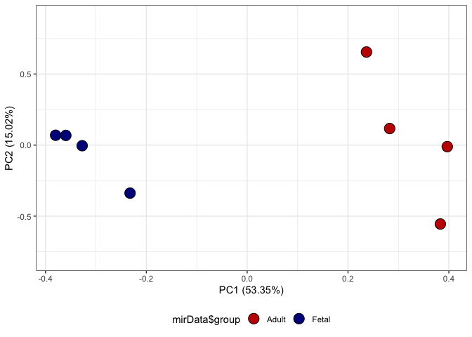
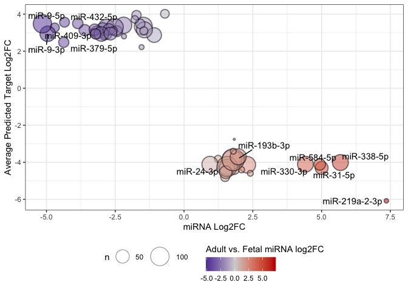
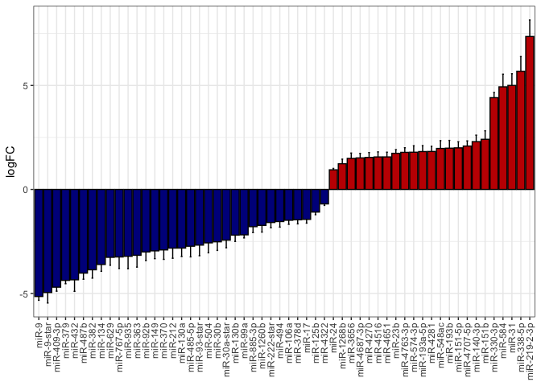
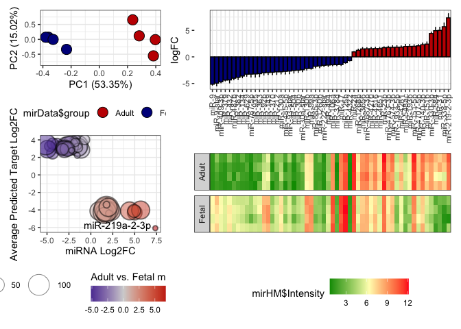
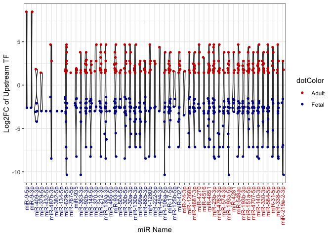
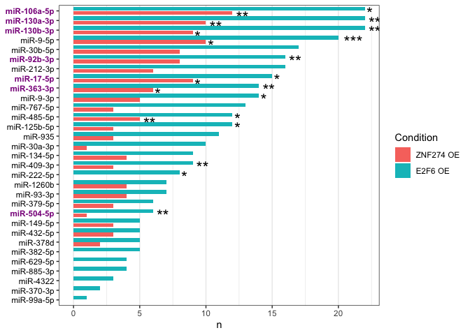
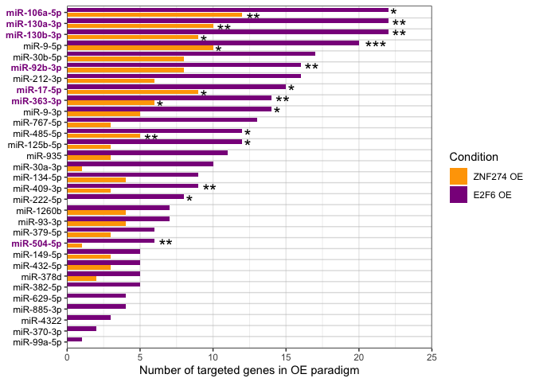

Differential Expression Analysis of Adult vs Fetal hGPC miRNAs
================
John Mariani
03/06/23

``` r
source("Scripts/Helper_Functions.R")
library(limma)
library(pd.mirna.3.0)
library(miRBaseConverter)
library(miRNAtap)
library(tidyr)
library(dplyr)
library(plyr)
library(trqwe)
library(xlsx)
library(ggplot2)
library(ggfortify)
library(ggrepel)
library(patchwork)
library(Seurat)
library(tidyr)
library(data.table)
```

## Load Prior Data

``` r
de_intersect <- read.delim("output/de_Adult_vs_Fetal_Intersect.txt")
supTable3a <- read.xlsx("Extended Data Tables/Extended Data Table 3 - Adult vs Fetal hGPC Bulk RNA-seq.xlsx", sheetName = "Adult vs Fetal hGPC DE")
adultRepressorNetwork <- read.table("output/adultRepressorNetwork.txt", header = T)
adultActivatorNetwork <- read.table("output/adultActivatorNetwork.txt", header = T)
fetalRepressorNetwork <- read.table("output/fetalRepressorNetwork.txt", header = T)
fetalActivatorNetwork <-  read.table("output/fetalActivatorNetwork.txt", header = T)

E2F6vsEGFP <- read.table("output/E2F6vsEGFP.txt", header = T)
ZNF274vsEGFP <- read.table("output/ZNF274vsEGFP.txt", header = T)

activators <- c("MYC", "NFIB", "STAT3", "HMGA2", "TEAD2")
highTPM <- readRDS("RDS/highTPM.rds")
highTPM_sc <- readRDS("output/highTPM_sc.rds")
```

## Load data and conduct differential expression with limma

``` r
#Function used throughout

dataFolder <- "data_for_import/miRNA/"

annotation <- read.csv("data_for_import/miRNA-3_0-st-v1.annotations.201405132.csv")


#Read in and run RMA on CEL files
fns <- list.celfiles(path = dataFolder)
fns
```

    ## [1] "20.3_wk_CD140a+_(miRNA-3_0).CEL" "20.5_wk_CD140a+_(miRNA-3_0).CEL"
    ## [3] "21_wk_CD140a+_(miRNA-3_0).CEL"   "21.1_wk_CD140a+_(miRNA-3_0).CEL"
    ## [5] "SID_372_(miRNA-3_0).CEL"         "SID348_(miRNA-3_0).CEL"         
    ## [7] "SID390_(miRNA-3_0).CEL"          "SID398_(miRNA-3_0).CEL"

``` r
Data <- read.celfiles(filenames=paste0(dataFolder,fns))
```

    ## Platform design info loaded.

    ## Reading in : data_for_import/miRNA/20.3_wk_CD140a+_(miRNA-3_0).CEL
    ## Reading in : data_for_import/miRNA/20.5_wk_CD140a+_(miRNA-3_0).CEL
    ## Reading in : data_for_import/miRNA/21_wk_CD140a+_(miRNA-3_0).CEL
    ## Reading in : data_for_import/miRNA/21.1_wk_CD140a+_(miRNA-3_0).CEL
    ## Reading in : data_for_import/miRNA/SID_372_(miRNA-3_0).CEL
    ## Reading in : data_for_import/miRNA/SID348_(miRNA-3_0).CEL
    ## Reading in : data_for_import/miRNA/SID390_(miRNA-3_0).CEL
    ## Reading in : data_for_import/miRNA/SID398_(miRNA-3_0).CEL

``` r
eset <- oligo::rma(Data)
```

    ## Background correcting
    ## Normalizing
    ## Calculating Expression

``` r
edata <- data.frame(exprs(eset))

humanMirAnnotation <- annotation[annotation$Species.Scientific.Name == "Homo sapiens" & annotation$Sequence.Type == "miRNA",]


# Filter on list of human mir probes
edata_mir <- edata[row.names(edata) %in% humanMirAnnotation$Probe.Set.ID,]

mirData <- data.frame(sample = names(edata_mir), group = c(rep("Fetal",4), rep("Adult",4)))


design <- model.matrix(~0+group, mirData)
colnames(design) <- make.names(colnames(design))

fitV <- lmFit(edata_mir, design)
fitV2 <- eBayes(fitV)
colnames(design) 
```

    ## [1] "groupAdult" "groupFetal"

``` r
cont.matrix <- makeContrasts(comparison = groupAdult - groupFetal,
                             levels=design)

fitV2 <- contrasts.fit(fitV2, cont.matrix)
fitV2 <- eBayes(fitV2)

mirFetalAdultAll <- topTable(fitV2, coef = 1,number = 1000000000, p.value = 0.01)


humanMirAnnotationDE <- humanMirAnnotation[humanMirAnnotation$Probe.Set.ID %in% row.names(mirFetalAdultAll),]
humanMirAnnotationDE[,12:13] <- miRNA_AccessionToName(humanMirAnnotationDE$Accession,targetVersion = "v22")

#Fails to find hsa-miR-3656 appropriately so is filled in manually
humanMirAnnotationDE[is.na(humanMirAnnotationDE$TargetName),]$TargetName <- "hsa-miR-3656"
humanMirAnnotationDE$mirName <- gsub(humanMirAnnotationDE$TargetName, pattern = "hsa-", replacement = "")

mirFetalAdultAll <- merge(mirFetalAdultAll,humanMirAnnotationDE, by.x=0,by.y=1)

### Make Sup Table 5a
supTable5a <- mirFetalAdultAll[,c(8:10,2,6)]
names(supTable5a) <- c("Probe_Set_Name", "Accession", "Transcript_ID_Array_Design", "Log2FC_Adult_vs_Fetal_GPC", "Adj_P_Val")
supTable5a <- supTable5a[order(supTable5a$Adj_P_Val, decreasing = F),]
#write.xlsx(supTable5a, file = "Extended Data Tables/Extended Data Table 5 - Adult vs Fetal miRNA Microarray.xlsx", sheetName = "DE Adult vs Fetal GPC miRNAs", row.names = F, append = T)
```

## Find miRNA targets using miRNAtap

``` r
humanMirsDE <- setNames(data.frame(matrix(ncol = 4, nrow = 0)), c("rank_product", "rank_final", "mir", "entrez"))
for(i in 1:length(mirFetalAdultAll$mirName)){
  tryCatch({
    #print(mirFetalAdultAll$mirName[i])
    temp <- as.data.frame(getPredictedTargets(as.character(mirFetalAdultAll$mirName[i]), species = 'hsa',method = 'geom', min_src = 2))
    temp$mir <- as.character(mirFetalAdultAll$mirName[i])
    temp$entrez <- row.names(temp)
    temp <- temp[,c("rank_product", "rank_final", "mir", "entrez")]
    humanMirsDE <- rbind(humanMirsDE, temp)
  }, error=function(e){})
}
```

    ## Loading required package: miRNAtap.db

``` r
table(mirFetalAdultAll$logFC > 0)
```

    ## 
    ## FALSE  TRUE 
    ##    33    23

``` r
mirPCA <- autoplot(prcomp(t(edata_mir)), data = mirData, size = 1) + geom_point(shape = 21, size = 5, aes(fill =  mirData$group)) + theme_bw() + ylim(-.8,.9) + theme(legend.position = "bottom", legend.direction = "horizontal") + scale_fill_manual(values = c("#C40000", "#00008B"))

mirPCA
```

<!-- -->

``` r
write.table(mirFetalAdultAll, "output/de_mirFetalAdultAll.txt", sep ="\t", row.names = F, quote = F)
```

## Determine proper direction miRs

``` r
filename="data_for_import/ensembl_miR_list.csv"
if(file.exists(filename)){
  ensemblGeneListMir <- read.csv(filename)} else{
    marth <- useMart(biomart = "ENSEMBL_MART_ENSEMBL", dataset = "hsapiens_gene_ensembl", host = 'http://jan2019.archive.ensembl.org/', ensemblRedirect = T)
    ensemblGeneListMir <- getBM(attributes = c("entrezgene", "external_gene_name", "gene_biotype", "description"), filters = "entrezgene",unique(row.names(humanMirsDE)), mart = marth)
    write.csv(ensemblGeneListMir, filename, row.names = F)
  } 

nrow(humanMirsDE[unique(humanMirsDE$entrez),])
```

    ## [1] 10919

``` r
humanMirsLabeled <- merge(humanMirsDE, ensemblGeneListMir, by.x = "entrez", by.y = "entrezgene")


#### 
mirFetalAdultLabeled <- merge(mirFetalAdultAll, humanMirsDE, by.x = 20, by.y = 3)
mirFetalAdultLabeled <- merge(mirFetalAdultLabeled, ensemblGeneListMir, by.x = "entrez", by.y = "entrezgene")
write.table(mirFetalAdultLabeled, quote = F, row.names = F, file = "output/mirFetalAdultLabeled.txt", sep = "\t")

adult_vs_fetal_mir <- de_intersect
adult_vs_fetal_mir <- adult_vs_fetal_mir[,c(1,3,7,8,9,10)]
names(adult_vs_fetal_mir) <- c("ensembl_id", "a2b5_FC", "a2b5_padj", "external_gene_name", "gene_biotype", "description")

adult_vs_fetal_mir <- merge(adult_vs_fetal_mir, mirFetalAdultLabeled, by.x = "external_gene_name", by.y = "external_gene_name")
adult_vs_fetal_mir$X <- NULL
adult_vs_fetal_mir <- adult_vs_fetal_mir[!duplicated(adult_vs_fetal_mir),]


mirDownGeneUpFinal<- adult_vs_fetal_mir[adult_vs_fetal_mir$a2b5_FC > 0 & adult_vs_fetal_mir$logFC < 0,]
mirUpGeneDownFinal<- adult_vs_fetal_mir[adult_vs_fetal_mir$a2b5_FC< 0 & adult_vs_fetal_mir$logFC > 0,]

mirProperDirection <- rbind(mirDownGeneUpFinal,mirUpGeneDownFinal)


### Make Sup Table 5b
supTable5b <- mirProperDirection
supTable5b <- supTable5b[,c(8,10,1,3)]
names(supTable5b) <- c("miR_Name", "miR_Log2FC_Adult_vs_Fetal_GPC", "External_Gene_Name", "Target_Gene_Log2FC_Adult_vs_Fetal_A2B5_GPC")
#write.xlsx(supTable5b, file = "Extended Data Tables/Extended Data Table 5 - Adult vs Fetal miRNA microarray.xlsx", sheetName = "Predicted miRNA targets", row.names = F, append = T)
```

## Make miRNA Dot Plot

``` r
mirDotPlot <- mirProperDirection %>%
  group_by(mirName) %>%
  dplyr::summarise(logFCmean = mean(a2b5_FC,na.rm = TRUE), mirLogFC = mean(logFC), n = n())

mirDotPlotFetal <- mirDotPlot[mirDotPlot$mirLogFC < 0,]
mirDotPlotAdult <- mirDotPlot[mirDotPlot$mirLogFC > 0,]

mean(mirDotPlotFetal$n)
```

    ## [1] 36.34375

``` r
mean(mirDotPlotAdult$n)
```

    ## [1] 46.3913

``` r
sd(mirDotPlotFetal$n)
```

    ## [1] 24.53255

``` r
sd(mirDotPlotAdult$n)
```

    ## [1] 37.81623

``` r
signif(length(unique(mirDownGeneUpFinal$external_gene_name)) / length(de_intersect[de_intersect$log2FoldChange > 0,]$external_gene_name)*100,3)
```

    ## [1] 48.8

``` r
signif(length(unique(mirUpGeneDownFinal$external_gene_name)) / length(de_intersect[de_intersect$log2FoldChange < 0,]$external_gene_name)*100, 3)
```

    ## [1] 39.9

``` r
length(unique(mirUpGeneDownFinal$external_gene_name))
```

    ## [1] 663

``` r
miRinteresting <- c("miR-9-3p", "miR-9-5p", "miR-193b-3p", "miR-338-5p", "miR-24-3p", "miR-193a-5p", "miR-31-5p", "miR-584-5p", "miR-330-3p", "miR-409-3p", "miR-379-5p", "miR-432-5p", "miR-219a-2-3p")

mirDotPlot$label <- ""
mirDotPlot[mirDotPlot$mirName %in% miRinteresting,]$label <- mirDotPlot[mirDotPlot$mirName %in% miRinteresting,]$mirName


mirGGdotPlot <- ggplot(mirDotPlot, aes(y = logFCmean, x = mirLogFC, label = label)) + geom_point(shape = 21, aes(fill = mirLogFC, stroke = 1, size = n),  alpha = 0.5) +  scale_size(range = c(0.5, 12)) + theme_bw() + geom_text_repel() +
  scale_fill_gradient2(midpoint = 0, low = "#00008B", mid = "lightgrey", high = "#C40000", space = "Lab", guide = guide_colourbar(direction = "horizontal", title = "Adult vs. Fetal miRNA log2FC", title.position = "top")) + theme(legend.position = "bottom") + xlab("miRNA Log2FC") + ylab("Average Predicted Target Log2FC")


mirGGdotPlot
```

    ## Warning: ggrepel: 1 unlabeled data points (too many overlaps). Consider
    ## increasing max.overlaps

<!-- -->
\### miR HM

``` r
mirHM <- edata_mir %>% set_rownames(row.names(.))  %>%
  as_tibble(rownames = "row") %>%
  pivot_longer(-row, names_to = "Sample", values_to = "Intensity")


mirHM <- mirHM[mirHM$row %in% mirFetalAdultAll$Row.names, ]

mirHM$group <- mapvalues(mirHM$Sample, mirData$sample, as.character(mirData$group))

mirBar <- mirFetalAdultAll
mirBar$logFC <- as.numeric(mirBar$logFC)
mirBar$Row.names <- as.factor(mirBar$Row.names)
mirBar$direction <- "Fetal"
mirBar[mirBar$logFC > 0,]$direction <- "Adult"


#Grab SE from limma
mirSE <- fitV2$stdev.unscaled * fitV2$sigma
colnames(mirSE) <- "StandardError"
mirBar <- merge(mirBar, mirSE, by.x = "Row.names", by.y = 0)
mirBar <- mirBar[order(mirBar$logFC),]

mirBar$shortName <- gsub("hsa-", "", mirBar$Transcript.ID.Array.Design.)
mirBar$shortName <- factor(mirBar$shortName, levels = mirBar$shortName)
mirHM$row <- factor(mirHM$row, levels = mirBar$Row.names)


m1 <- ggplot(mirHM, aes(row, Sample)) + theme_bw() + geom_tile(aes(fill = mirHM$Intensity)) + theme(legend.position = "bottom", legend.direction = "horizontal", axis.text.x = element_blank(), axis.text.y = element_blank(), axis.ticks = element_blank(), axis.title = element_blank())  + scale_fill_gradientn(colours = c("#009900","#fffcbd","#ff2020")) + facet_grid(vars(group),scales = "free", space = "free", switch = "y") + scale_y_discrete(expand = c(0,0))

m2 <- ggplot(mirBar, aes(x = shortName, y = logFC, fill = direction)) + 
   geom_errorbar(aes(ymin=logFC-StandardError, ymax=logFC+StandardError), width=.2,
                 position=position_dodge(.9)) +
  geom_col(colour = "black") + theme_bw() + 
  theme(axis.text.x = element_text(angle = 90, vjust = 0.5, hjust=1), axis.title.x = element_blank(), legend.position = "none") + scale_fill_manual(values = c("#C40000", "#00008B"))


m2
```

<!-- -->

``` r
(((mirPCA /mirGGdotPlot) + plot_layout(heights = c(1,1.75))) | (m2 / m1)) + plot_layout(widths = c(1,2))
```

    ## Warning: Use of `mirHM$Intensity` is discouraged.
    ## ℹ Use `Intensity` instead.

    ## Warning: ggrepel: 12 unlabeled data points (too many overlaps). Consider
    ## increasing max.overlaps

<!-- -->

``` r
#ggsave("panels/mirSignaling.pdf", units = "in", dpi = 300, width = 16, height = 8, device = NULL)
```

## Make miRNA Network

``` r
miRsCurated <- read.csv("data_for_import/miRNAtap_Curated_Network.csv")

mirAdultEdges <- mirProperDirection[mirProperDirection$mirName %in% miRsCurated$Adult_miR_Network & mirProperDirection$external_gene_name %in% miRsCurated$Adult_miR_Network,]

mirAdultEdges <- mirAdultEdges[,c(8,1)]

mirFetalEdges <- mirProperDirection[mirProperDirection$mirName %in% miRsCurated$Fetal_miR_Network & mirProperDirection$external_gene_name %in% miRsCurated$Fetal_miR_Network,]

mirFetalEdges <- mirFetalEdges[,c(8,1)]

mirFetalEdges <- mirFetalEdges[!duplicated(mirFetalEdges[, c("mirName", "external_gene_name")]),]

mirAdultEdges <- mirAdultEdges[!duplicated(mirAdultEdges[, c("mirName", "external_gene_name")]),]

mirAdultNodes <- data.frame(node = unique(c(mirAdultEdges$mirName, mirAdultEdges$external_gene_name)))
mirFetalNodes <- data.frame(node = unique(c(mirFetalEdges$mirName, mirFetalEdges$external_gene_name)))

mirAdultNodes$type <- ifelse(mirAdultNodes$node %in% mirFetalAdultLabeled$mirName, "miRNA", "Gene Target")
mirFetalNodes$type <- ifelse(mirFetalNodes$node %in% mirFetalAdultLabeled$mirName, "miRNA", "Gene Target")

mirAdultNodes$enriched <- ifelse(mirAdultNodes$node %in% mirFetalAdultLabeled$mirName, "Adult", "Fetal")
mirFetalNodes$enriched <- ifelse(mirFetalNodes$node %in% mirFetalAdultLabeled$mirName, "Fetal", "Adult")

write.csv(mirAdultEdges, "output/mirFetalEdges.csv", quote = F, row.names = F)
write.csv(mirFetalEdges, "output/mirAdultEdges.csv", quote = F, row.names = F)
write.csv(mirAdultNodes, "output/mirAdultNodes.csv", quote = F, row.names = F)
write.csv(mirFetalNodes, "output/mirFetalNodes.csv", quote = F, row.names = F)
```

## Source Data

``` r
temp <- prcomp(t(as.matrix(edata_mir)))$x
sd6A <- ggplot_build(mirPCA)

sd6A <- sd6A$data
sd6A <- sd6A[[1]]
sd6A$sample <- row.names(temp)
sd6A <- sd6A[,c(11,1,2)]
sd6A$group = c(rep("Fetal",4), rep("Adult", 4))
sd6A$sample <- c("CD140a_20.3", "CD140a_20.5", "CD140a_21", "CD140a_21.1", "Adult_372", "Adult_348", "Adult_390", "Adult_398")

#write.xlsx(sd6A, file = "Source Data/Source_Data_Fig6.xlsx", sheetName = "Fig6A", row.names = F, append = T)

                  

sd6Btop <- mirBar
sd6Btop <- sd6Btop[,c(1,20,2,22)]
names(sd6Btop) <- c("row", "miRNA", "Log2FC", "SE")

sd6Bbottom <- mirHM
sd6Bbottom <- sd6Bbottom[,1:3]
sd6Bbottom <- pivot_wider(data = sd6Bbottom,  names_from = Sample, id_cols = row, values_from = Intensity)
names(sd6Bbottom) <- c("row", "CD140a_20.3", "CD140a_20.5", "CD140a_21", "CD140a_21.1", "Adult_372", "Adult_348", "Adult_390", "Adult_398")

sd6B <- merge(sd6Btop, sd6Bbottom, by.x = "row", by.y = "row")
sd6B <- sd6B[,-1]

#write.xlsx(sd6B, file = "Source Data/Source_Data_Fig6.xlsx", sheetName = "Fig6B", row.names = F, append = T)

sd6C <- mirDotPlot
sd6C <- sd6C[,c(1:4)]
names(sd6C) <- c("miRNA", "Mean Target Log2FC", "miRNA Log2FC", "Number of Targets")
sd6C <- as.data.frame(sd6C)

#write.xlsx(sd6C, file = "Source Data/Source_Data_Fig6.xlsx", sheetName = "Fig6C", row.names = F, append = T)

sd6D <-mirFetalEdges
names(sd6D) <- c("miRNA", "Target")

#write.xlsx(sd6D, file = "Source Data/Source_Data_Fig6.xlsx", sheetName = "Fig6D", row.names = F, append = T)


sd6E <- mirAdultEdges
names(sd6E) <- c("miRNA", "Target")

#write.xlsx(sd6E, file = "Source Data/Source_Data_Fig6.xlsx", sheetName = "Fig6E", row.names = F, append = T)
```

### TrasnmiR

``` r
TransmiR <- read.delim("data_for_import/transmiR.tsv", sep = "\t", header = F)
humanMirAnnotationDE$strippedName <- gsub(x = humanMirAnnotationDE$TargetName, pattern = "-5p", replacement = "")
humanMirAnnotationDE$strippedName <- gsub(x = humanMirAnnotationDE$strippedName, pattern = "-3p", replacement = "")
humanMirAnnotationDE$strippedNameLower <- tolower(humanMirAnnotationDE$strippedName)


TransmiRDE <- TransmiR[TransmiR$V2 %in% tolower(humanMirAnnotationDE$strippedName),]
leftout <- humanMirAnnotationDE[tolower(humanMirAnnotationDE$strippedName) %not in% TransmiR$V2,]


### hsa-miR-3656 is not in the db.
### hsa-miR-378d can be in two different loci

TransmiRDE <- TransmiRDE[TransmiRDE$V1 %in% de_intersect$external_gene_name,]
unique(TransmiRDE$V1)
```

    ##  [1] "AHR"    "ARNT"   "BCL11A" "BCL6"   "BMPR1A" "BRD3"   "CCND2"  "CTBP2" 
    ##  [9] "E2F6"   "EHMT2"  "ELF1"   "ELL2"   "EOMES"  "EPAS1"  "ETV1"   "ETV4"  
    ## [17] "EZH2"   "FGFR1"  "FOXK1"  "FOXM1"  "FOXO1"  "FOXP1"  "GLI2"   "HDAC2" 
    ## [25] "HES1"   "HEY1"   "IL1B"   "INTS11" "KDM1A"  "KDM4A"  "KDM4C"  "MAX"   
    ## [33] "MAZ"    "MBD3"   "MEF2A"  "MYC"    "NFE2L2" "NIPBL"  "NME2"   "NR2F1" 
    ## [41] "NR2F2"  "NR3C1"  "OTX2"   "PBX1"   "PCGF2"  "PRDM5"  "RUNX1"  "RUNX2" 
    ## [49] "SMAD1"  "SNAI2"  "SOX2"   "SOX4"   "SOX9"   "STAT1"  "STAT3"  "TCF3"  
    ## [57] "TEAD1"  "TEAD2"  "TEAD4"  "TFAP2C" "THAP11" "TP53"   "TRIM24" "TRIM28"
    ## [65] "YAP1"   "ZEB1"

``` r
TransmirDEcollapsed <- TransmiRDE[,1:2]
TransmirDEcollapsed <- TransmirDEcollapsed[!duplicated(TransmirDEcollapsed),]
TransmirDEcollapsed <- merge(TransmirDEcollapsed, humanMirAnnotationDE, by.x = "V2", by.y = "strippedNameLower")
TransmirDEcollapsed <- merge(TransmirDEcollapsed, mirFetalAdultAll, by.x = "mirName", by.y = "mirName")
TransmirDEcollapsed <- merge(TransmirDEcollapsed, de_intersect, by.x = "V1", by.y = "external_gene_name")
TransmirDEcollapsed <- TransmirDEcollapsed[,c("mirName", "V1", "logFC", "log2FoldChange")]
TransmirDEcollapsed <- TransmirDEcollapsed[order(TransmirDEcollapsed$logFC, decreasing = F),]
TransmirDEcollapsed$mirName <- factor(TransmirDEcollapsed$mirName, levels = unique(TransmirDEcollapsed$mirName))
TransmirDEcollapsed$dotColor <- ifelse(TransmirDEcollapsed$log2FoldChange < 0, "Fetal", "Adult")
TransmirLabelColor <- ifelse(TransmirDEcollapsed[!duplicated(TransmirDEcollapsed$mirName),]$logFC < 0,  "#00008B","#C40000")

### Sup Table 5c
supTable5c <- TransmirDEcollapsed[,c(1:3)]
supTable5c <- merge(supTable5c, supTable3a, by.x = 2, by.y = "External_Gene_Name")
supTable5c <- supTable5c[,c(2,1,3,5,7)]
names(supTable5c)[1:3] <- c("mirName", "External_Gene_Name", "mir_Log2FC")
#write.xlsx(supTable5c, file = "Extended Data Tables/Extended Data Table 5 - Adult vs Fetal miRNA microarray.xlsx", sheetName = "TransmiR Predictions", row.names = F, append = T)
```

## Plot TF-miRNA pairs

``` r
ggplot(TransmirDEcollapsed, aes(x=mirName, y=log2FoldChange)) + geom_violin(trim=TRUE) +  geom_jitter(aes(color = dotColor), shape=16, position=position_jitter(0.2)) + theme_bw() + theme(axis.text.x = element_text(angle = 90, vjust = 0.5, hjust=1, color = TransmirLabelColor)) + scale_color_manual(values = c("#C40000", "#00008B")) + xlab("miR Name") + ylab("Log2FC of Upstream TF")
```

    ## Warning: Vectorized input to `element_text()` is not officially supported.
    ## ℹ Results may be unexpected or may change in future versions of ggplot2.

    ## Warning: Groups with fewer than two data points have been dropped.
    ## Groups with fewer than two data points have been dropped.
    ## Groups with fewer than two data points have been dropped.
    ## Groups with fewer than two data points have been dropped.
    ## Groups with fewer than two data points have been dropped.

<!-- -->

``` r
#ggsave("../Panels/transmiRTop.pdf", width = 10, height = 3)
```

## Make Transmir Network

``` r
humanMirAnnotationDEup <- humanMirAnnotationDE[humanMirAnnotationDE$Transcript.ID.Array.Design. %in% mirFetalAdultAll[mirFetalAdultAll$logFC > 0,]$Transcript.ID.Array.Design.,]

humanMirAnnotationDEdown <- humanMirAnnotationDE[humanMirAnnotationDE$Transcript.ID.Array.Design. %in% mirFetalAdultAll[mirFetalAdultAll$logFC < 0,]$Transcript.ID.Array.Design.,]

mirAdultRepressors <- TransmirDEcollapsed[TransmirDEcollapsed$mirName %in% humanMirAnnotationDEdown$mirName & TransmirDEcollapsed$V1 %in% adultRepressorNetwork$Source,]
mirAdultRepressors$type <- "Adult Repressor"
mirFetalActivators <- TransmirDEcollapsed[TransmirDEcollapsed$mirName %in% humanMirAnnotationDEdown$mirName  & TransmirDEcollapsed$V1 %in% fetalActivatorNetwork$Source,]
mirFetalActivators$type <- "Fetal Activator"
mirFetalRepressors <- TransmirDEcollapsed[TransmirDEcollapsed$mirName %in% humanMirAnnotationDEup$mirName  & TransmirDEcollapsed$V1 %in% fetalRepressorNetwork$Source,]
mirFetalRepressors$type <- "Fetal Repressor"
mirAdultActivators <- TransmirDEcollapsed[TransmirDEcollapsed$mirName %in% humanMirAnnotationDEup$mirName  & TransmirDEcollapsed$V1 %in% adultActivatorNetwork$Source,]
mirAdultActivators$type <- "Adult Activator"


mirTFedgesFetalMiRs <- rbind(mirAdultRepressors, mirFetalActivators)
#write.table(mirTFedgesFetalMiRs, "output/mirTFedgesFetalMiRs.txt", sep = "\t", quote = F, row.names = F)

mirTFedgesAdultMiRs <- rbind(mirFetalRepressors, mirAdultActivators)
#write.table(mirTFedgesAdultMiRs, "output/mirTFedgesAdultMiRs.txt", sep = "\t", quote = F, row.names = F)
```

# Determine miRNA repressed targets from scRNA-seq OE datasets

``` r
E2F6vsEGFPmir <- merge(E2F6vsEGFP, mirFetalAdultLabeled, by.x = "gene", by.y = "external_gene_name")
ZNF274vsEGFPmir <- merge(ZNF274vsEGFP, mirFetalAdultLabeled, by.x = "gene", by.y = "external_gene_name")

E2F6vsEGFPmir <- E2F6vsEGFPmir[,c(8,9,10,14,1,3,4,5,6)]
ZNF274vsEGFPmir <- ZNF274vsEGFPmir[,c(8,9,10,14,1,3,4,5,6)]

names(E2F6vsEGFPmir) <- c("mirName", "probeName", "mir log2FC", "mir padj", "targetGene", "gene log2FC", "gene pct.1", "gene pct.2", "gene padj")
names(ZNF274vsEGFPmir) <- c("mirName", "probeName", "mir log2FC", "mir padj", "targetGene", "gene log2FC", "gene pct.1", "gene pct.2", "gene padj")

E2F6vsEGFPmir <- E2F6vsEGFPmir[!duplicated(E2F6vsEGFPmir),]
ZNF274vsEGFPmir <- ZNF274vsEGFPmir[!duplicated(ZNF274vsEGFPmir),]

E2F6vsEGFPmir$`mir log2FC` <- as.numeric(E2F6vsEGFPmir$`mir log2FC`)
ZNF274vsEGFPmir$`mir log2FC` <- as.numeric(ZNF274vsEGFPmir$`mir log2FC`)

E2F6vsEGFPmirProper <- E2F6vsEGFPmir[E2F6vsEGFPmir$`mir log2FC` * E2F6vsEGFPmir$`gene log2FC` < 0,]
ZNF274vsEGFPmirProper <- ZNF274vsEGFPmir[ZNF274vsEGFPmir$`mir log2FC` * ZNF274vsEGFPmir$`gene log2FC` < 0,]
```

## Process data for only genes detecetable across modalities

``` r
# scDE genes that are detectable in the bulk
E2F6vsEGFP_fisher <-  E2F6vsEGFP[E2F6vsEGFP$gene  %in% c(highTPM$external_gene_name, row.names(highTPM)),]
ZNF274vsEGFP_fisher <- ZNF274vsEGFP[ZNF274vsEGFP$gene %in% c(highTPM$external_gene_name, row.names(highTPM)),]

humanMirsLabeled_sc <- humanMirsLabeled[humanMirsLabeled$external_gene_name %in% highTPM_sc,]

mirE2F6up <- E2F6vsEGFPmirProper[E2F6vsEGFPmirProper$`mir log2FC` > 0,]
mirE2F6upGG <-  mirE2F6up %>% dplyr::count(mirName)
mirE2F6upGG$Enriched <- "Adult"
mirE2F6upGG$Condition <- "E2F6 OE"

mirE2F6down <- E2F6vsEGFPmirProper[E2F6vsEGFPmirProper$`mir log2FC` < 0,]
mirE2F6downGG <-  mirE2F6down %>% dplyr::count(mirName)
mirE2F6downGG$Enriched <- "Fetal"
mirE2F6downGG$Condition <- "E2F6 OE"


mirZNF274up <- ZNF274vsEGFPmirProper[ZNF274vsEGFPmirProper$`mir log2FC` > 0,]
mirZNF274upGG <-  mirZNF274up %>% dplyr::count(mirName)
mirZNF274upGG$Enriched <- "Adult"
mirZNF274upGG$Condition <- "ZNF274 OE"


mirZNF274down <- ZNF274vsEGFPmirProper[ZNF274vsEGFPmirProper$`mir log2FC` < 0,]
mirZNF274downGG <-  mirZNF274down %>% dplyr::count(mirName)
mirZNF274downGG$Enriched <- "Fetal"
mirZNF274downGG$Condition <- "ZNF274 OE"


mirGGup <- rbind(mirE2F6upGG, mirZNF274upGG)
mirGGdown <- rbind(mirE2F6downGG, mirZNF274downGG)

# adult mir targets
for(i in 1:nrow(mirGGup)){
  mirGGup$nn[i] <- sum(mirGGup[mirGGup$mirName == mirGGup$mirName[i],]$n, na.rm = T)
}

mirGGup <- mirGGup[order(mirGGup$n, mirGGup$nn, decreasing = T),]
mirGGup$mirName <- factor(mirGGup$mirName, levels = rev(unique(mirGGup$mirName)))
mirGGup$Condition <- factor(mirGGup$Condition, levels = c("ZNF274 OE", "E2F6 OE"))


#  fetal mir targets
for(i in 1:nrow(mirGGdown)){
  mirGGdown$nn[i] <- sum(mirGGdown[mirGGdown$mirName == mirGGdown$mirName[i],]$n, na.rm = T)
}

mirGGdown <- mirGGdown[order(mirGGdown$n, mirGGdown$nn, decreasing = T),]
mirGGdown$mirName <- factor(mirGGdown$mirName, levels = rev(unique(mirGGdown$mirName)))
mirGGdown$Condition <- factor(mirGGdown$Condition, levels = c("ZNF274 OE", "E2F6 OE"))
```

## Fisher tests for miRNA enrichment

``` r
# Fisher tests for Adult Enriched in E2F6 Repressed Genes
fisherMirE2F6up <- data.frame(mir = NULL, pVal = NULL)
for(i in unique(mirE2F6up$mirName)){
  tempMir <- i
  condition <- E2F6vsEGFP_fisher
  conditionRepressed <- condition[condition$avg_log2FC < 0,]
  conditionOther <- condition[condition$avg_log2FC > 0,]
  tempTargets <- humanMirsLabeled_sc[humanMirsLabeled_sc$mir == tempMir,]
  tempTargets <- tempTargets[tempTargets$external_gene_name %in% condition$gene,]
  tempTargetsRepressed <- conditionRepressed[conditionRepressed$gene %in% tempTargets$external_gene_name,]
  tempTargetsOther <- conditionOther[conditionOther$gene %in% tempTargets$external_gene_name,]
  tempNonTargetsRepressed <- conditionRepressed[conditionRepressed$gene %not in% tempTargets$external_gene_name,]
  tempnonTargetsOther <- conditionOther[conditionOther$gene %not in% tempTargetsOther$gene,]
  
  tempFisher <- data.frame(Repressed = c(nrow(tempTargetsRepressed), nrow(tempNonTargetsRepressed)), NonRepressed = c(nrow(tempTargetsOther), nrow(tempnonTargetsOther)), 
                           row.names = c("Target", "NotTarget"))
  
  tempDF <- data.frame(mir = tempMir, pVal = fisher.test(tempFisher, alternative = "greater")[1])
  fisherMirE2F6up <- rbind(fisherMirE2F6up, tempDF)
}
fisherMirE2F6up$comparison <- "E2F6 Adult"
fisherMirE2F6up$merge <- "E2F6 OE"


# Fisher tests for Adult Enriched in ZNF274 Repressed Genes
fisherMirZNF274up <- data.frame(mir = NULL, pVal = NULL)

for(i in unique(mirZNF274up$mirName)){
  tempMir <- i
  condition <- ZNF274vsEGFP_fisher
  conditionRepressed <- condition[condition$avg_log2FC < 0,]
  conditionOther <- condition[condition$avg_log2FC > 0,]
  tempTargets <- humanMirsLabeled_sc[humanMirsLabeled_sc$mir == tempMir,]
  tempTargets <- tempTargets[tempTargets$external_gene_name %in% condition$gene,]
  tempTargetsRepressed <- conditionRepressed[conditionRepressed$gene %in% tempTargets$external_gene_name,]
  tempTargetsOther <- conditionOther[conditionOther$gene %in% tempTargets$external_gene_name,]
  tempNonTargetsRepressed <- conditionRepressed[conditionRepressed$gene %not in% tempTargets$external_gene_name,]
  tempnonTargetsOther <- conditionOther[conditionOther$gene %not in% tempTargetsOther$gene,]
  
  tempFisher <- data.frame(Repressed = c(nrow(tempTargetsRepressed), nrow(tempNonTargetsRepressed)), NonRepressed = c(nrow(tempTargetsOther), nrow(tempnonTargetsOther)), 
                           row.names = c("Target", "NotTarget"))
  
  tempDF <- data.frame(mir = tempMir, pVal = fisher.test(tempFisher, alternative = "greater")[1])
  fisherMirZNF274up <- rbind(fisherMirZNF274up, tempDF)
}
fisherMirZNF274up$comparison <- "ZNF274 Adult"
fisherMirZNF274up$merge <- "ZNF274 OE"


# Fisher tests for Fetal Enriched in E2F6 Activated Genes

fisherMirE2F6down <- data.frame(mir = NULL, pVal = NULL)

for(i in unique(mirE2F6down$mirName)){
  tempMir <- i
  condition <- E2F6vsEGFP_fisher
  conditionRepressed <- condition[condition$avg_log2FC < 0,]
  conditionOther <- condition[condition$avg_log2FC > 0,]
  tempTargets <- humanMirsLabeled_sc[humanMirsLabeled_sc$mir == tempMir,]
  tempTargets <- tempTargets[tempTargets$external_gene_name %in% condition$gene,]
  tempTargetsRepressed <- conditionRepressed[conditionRepressed$gene %in% tempTargets$external_gene_name,]
  tempTargetsOther <- conditionOther[conditionOther$gene %in% tempTargets$external_gene_name,]
  tempNonTargetsRepressed <- conditionRepressed[conditionRepressed$gene %not in% tempTargets$external_gene_name,]
  tempnonTargetsOther <- conditionOther[conditionOther$gene %not in% tempTargetsOther$gene,]
  
  tempFisher <- data.frame(Other = c(nrow(tempTargetsOther), nrow(tempnonTargetsOther)), NonRActivated = c(nrow(tempTargetsRepressed), nrow(tempNonTargetsRepressed)), 
                           row.names = c("Target", "NotTarget"))
  
  tempDF <- data.frame(mir = tempMir, pVal = fisher.test(tempFisher, alternative = "greater")[1])
  fisherMirE2F6down <- rbind(fisherMirE2F6down, tempDF)
}
fisherMirE2F6down$comparison <- "E2F6 Fetal"
fisherMirE2F6down$merge <- "E2F6 OE"


# Fisher tests for Fetal Enriched in ZNF274 Activated Genes

fisherMirZNF274down <- data.frame(mir = NULL, pVal = NULL)

for(i in unique(mirZNF274down$mirName)){
  tempMir <- i
  condition <- ZNF274vsEGFP_fisher
  conditionRepressed <- condition[condition$avg_log2FC < 0,]
  conditionOther <- condition[condition$avg_log2FC > 0,]
  tempTargets <- humanMirsLabeled_sc[humanMirsLabeled_sc$mir == tempMir,]
  tempTargets <- tempTargets[tempTargets$external_gene_name %in% condition$gene,]
  tempTargetsRepressed <- conditionRepressed[conditionRepressed$gene %in% tempTargets$external_gene_name,]
  tempTargetsOther <- conditionOther[conditionOther$gene %in% tempTargets$external_gene_name,]
  tempNonTargetsRepressed <- conditionRepressed[conditionRepressed$gene %not in% tempTargets$external_gene_name,]
  tempnonTargetsOther <- conditionOther[conditionOther$gene %not in% tempTargetsOther$gene,]
  
  tempFisher <- data.frame(Other = c(nrow(tempTargetsOther), nrow(tempnonTargetsOther)), NonRActivated = c(nrow(tempTargetsRepressed), nrow(tempNonTargetsRepressed)), 
                           row.names = c("Target", "NotTarget"))
  
  tempDF <- data.frame(mir = tempMir, pVal = fisher.test(tempFisher, alternative = "greater")[1])
  fisherMirZNF274down <- rbind(fisherMirZNF274down, tempDF)
}
fisherMirZNF274down$comparison <- "ZNF274 Fetal"
fisherMirZNF274down$merge <- "ZNF274 OE"
```

## Transmir targets

``` r
transmirTargets <- read.xlsx(supTable5c, file = "Extended Data Tables/Extended Data Table 5 - Adult vs Fetal miRNA microarray.xlsx", sheetName = "TransmiR Predictions")
transmirTargetsE2F6downRepressor <- transmirTargets[transmirTargets$External_Gene_Name %in% E2F6vsEGFP[E2F6vsEGFP$avg_log2FC > 0,]$gene,]
transmirTargetsE2F6downRepressor <- transmirTargetsE2F6downRepressor[transmirTargetsE2F6downRepressor$mirName %in% fisherMirE2F6down$mir,]
transmirTargetsE2F6downRepressor <- transmirTargetsE2F6downRepressor[transmirTargetsE2F6downRepressor$External_Gene_Name == "E2F6",]

transmirTargetsE2F6downActivator <- transmirTargets[transmirTargets$External_Gene_Name %in% E2F6vsEGFP[E2F6vsEGFP$avg_log2FC < 0,]$gene,]
transmirTargetsE2F6downActivator <- transmirTargetsE2F6downActivator[transmirTargetsE2F6downActivator$mirName %in% fisherMirE2F6down$mir,]


transmirTargetsZNF274downRepressor <- transmirTargets[transmirTargets$External_Gene_Name %in% ZNF274vsEGFP[ZNF274vsEGFP$avg_log2FC > 0,]$gene,]
transmirTargetsZNF274downRepressor <- transmirTargetsZNF274downRepressor[transmirTargetsZNF274downRepressor$mirName %in% fisherMirZNF274down$mir,]

transmirTargetsZNF274downActivator <- transmirTargets[transmirTargets$External_Gene_Name %in% ZNF274vsEGFP[ZNF274vsEGFP$avg_log2FC < 0,]$gene,]
transmirTargetsZNF274downActivator <- transmirTargetsZNF274downActivator[transmirTargetsZNF274downActivator$mirName %in% fisherMirZNF274down$mir,]
```

## Prepare for ggplot

``` r
fisherMirAll <- rbindlist(list(fisherMirE2F6up, fisherMirZNF274up, fisherMirE2F6down, fisherMirZNF274down))

fisherMirAll$FDR.all <- p.adjust(fisherMirAll$p.value)


fisherMirAll$sig <- ifelse(fisherMirAll$p.value < .0001, "****", 
                                       ifelse(fisherMirAll$p.value < .001, "***", 
                                              ifelse(fisherMirAll$p.value < .01, "**", 
                                                     ifelse(fisherMirAll$p.value < .05, "*", ""))))

## merge fisher sigs to ggplot objects
mirGGdownMerged <- merge(mirGGdown, fisherMirAll, by.x = c("mirName", "Condition"), by.y = c("mir", "merge"))
mirGGdownMerged <- mirGGdownMerged %>% complete(mirName, Condition)


# Vector for signficant transmiR labels

transmirColors <- ifelse(levels(mirGGdownMerged$mirName) %in% transmirTargetsE2F6downRepressor$mirName & levels(mirGGdownMerged$mirName) %in% mirGGdownMerged[mirGGdownMerged$Condition == "E2F6 OE" & mirGGdownMerged$sig != "",]$mirName
, "darkmagenta", "black")
names(transmirColors) <- ifelse(levels(mirGGdownMerged$mirName) %in% transmirTargetsE2F6downRepressor$mirName & levels(mirGGdownMerged$mirName) %in% mirGGdownMerged[mirGGdownMerged$Condition == "E2F6 OE" & mirGGdownMerged$sig != "",]$mirName
, "bold", "plain")


adultMirPlot <- ggplot(mirGGup, aes(x = percent, y = mirName, fill = Condition)) + geom_col(position = position_dodge2(preserve = "single")) + theme_bw() + scale_x_continuous(expand = c(0,0))


fetalMirPlot <- ggplot(mirGGdownMerged, aes(x = n, y = mirName, fill = Condition, label = sig)) + 
  geom_col(position = position_dodge2(preserve = 'single', width = 0.9)) +    
  geom_text(size =6 , position = position_dodge2(preserve = 'single',width = 0.9), hjust = -.3,
            color = "black", aes(group = Condition), vjust = .85) +
  theme_bw() + theme(axis.title.y = element_blank(), axis.text.y = element_text(colour = transmirColors, face = names(transmirColors)), panel.grid.major.y = element_blank()) +
  scale_x_continuous(expand = c(0,0), limits = c(0,25)) + scale_fill_manual(values = c("orange", "darkmagenta")) + labs(x = "Number of targeted genes in OE paradigm") +
  geom_hline(yintercept = seq(0.5, length(unique(mirGGdownMerged$mirName)), by = 1), color="gray", size=.5, alpha=.5) 
```

    ## Warning: Vectorized input to `element_text()` is not officially supported.
    ## ℹ Results may be unexpected or may change in future versions of ggplot2.

    ## Warning: Using `size` aesthetic for lines was deprecated in ggplot2 3.4.0.
    ## ℹ Please use `linewidth` instead.
    ## This warning is displayed once every 8 hours.
    ## Call `lifecycle::last_lifecycle_warnings()` to see where this warning was
    ## generated.

``` r
ggplot(mirGGdownMerged, aes(x = n, y = mirName, fill = Condition, label = sig)) + 
  geom_col(position = position_dodge2(preserve = 'single', width = 0.9)) +
  geom_text(size =6 , position = position_dodge2(preserve = 'single',width = 0.9), hjust = -.3,
            color = "black", aes(group = Condition), vjust = .85) +
  theme_bw() + theme(axis.title.y = element_blank(), axis.text.y = element_text(colour = transmirColors, face = names(transmirColors)), panel.grid.major.y = element_blank())
```

    ## Warning: Vectorized input to `element_text()` is not officially supported.
    ## ℹ Results may be unexpected or may change in future versions of ggplot2.

    ## Warning: Removed 7 rows containing missing values (`geom_col()`).

    ## Warning: Removed 7 rows containing missing values (`geom_text()`).

<!-- -->

``` r
fetalMirPlot
```

    ## Warning: Removed 7 rows containing missing values (`geom_col()`).
    ## Removed 7 rows containing missing values (`geom_text()`).

<!-- -->

``` r
#ggsave("figures/miRNA_scRNA.pdf")
```

## Source Data

``` r
sdS5A <- TransmirDEcollapsed
sdS5A <- sdS5A[,c(1,2,4)]
names(sdS5A) <- c("miRNA", "Target Gene", "Log2FC")

#write.xlsx(sdS5A, file = "Source Data/Source_Data_FigS5.xlsx", sheetName = "FigS5A", row.names = F)

sdS5B <- rbind(mirTFedgesAdultMiRs, mirTFedgesFetalMiRs)
sdS5B <- sdS5B[,c(1,2,3,4,6)]
names(sdS5B) <- c("miRNA", "Upstream TF", "Upstream TF Log2FC", "miRNA Log2FC", "Upstream TF Type")

#write.xlsx(sdS5B, file = "Source Data/Source_Data_FigS5.xlsx", sheetName = "FigS5B", row.names = F, append = T)


mirE2F6down$OE <- "E2F6"
mirZNF274down$OE <- "ZNF274"

sdS5C <- rbind(mirE2F6down, mirZNF274down)
sdS5C <- sdS5C[,c(1,3,4,5,6,9,10)]
names(sdS5C) <- c("miRNA", "mirNA Log2FC", "miRNA FDR", "Target Gene", "Target Gene Log2FC", "Taget Gene FDR", "OE")

#write.xlsx(sdS5C, file = "Source Data/Source_Data_FigS5.xlsx", sheetName = "FigS5C", row.names = F, append = T)
```

``` r
sessionInfo()
```

    ## R version 4.2.3 (2023-03-15)
    ## Platform: aarch64-apple-darwin20 (64-bit)
    ## Running under: macOS Ventura 13.2.1
    ## 
    ## Matrix products: default
    ## BLAS:   /Library/Frameworks/R.framework/Versions/4.2-arm64/Resources/lib/libRblas.0.dylib
    ## LAPACK: /Library/Frameworks/R.framework/Versions/4.2-arm64/Resources/lib/libRlapack.dylib
    ## 
    ## locale:
    ## [1] en_US.UTF-8/en_US.UTF-8/en_US.UTF-8/C/en_US.UTF-8/en_US.UTF-8
    ## 
    ## attached base packages:
    ## [1] stats4    stats     graphics  grDevices utils     datasets  methods  
    ## [8] base     
    ## 
    ## other attached packages:
    ##  [1] miRNAtap.db_0.99.10     data.table_1.14.8       SeuratObject_4.1.3     
    ##  [4] Seurat_4.3.0            patchwork_1.1.2         ggrepel_0.9.3          
    ##  [7] ggfortify_0.4.16        ggplot2_3.4.2           xlsx_0.6.5             
    ## [10] trqwe_0.1               plyr_1.8.8              dplyr_1.1.1            
    ## [13] tidyr_1.3.0             miRNAtap_1.32.0         AnnotationDbi_1.60.2   
    ## [16] miRBaseConverter_1.22.0 pd.mirna.3.0_3.12.0     DBI_1.1.3              
    ## [19] oligo_1.62.2            Biobase_2.58.0          oligoClasses_1.60.0    
    ## [22] RSQLite_2.3.1           Biostrings_2.66.0       GenomeInfoDb_1.34.9    
    ## [25] XVector_0.38.0          IRanges_2.32.0          S4Vectors_0.36.2       
    ## [28] BiocGenerics_0.44.0     limma_3.54.2           
    ## 
    ## loaded via a namespace (and not attached):
    ##   [1] igraph_1.4.1                lazyeval_0.2.2             
    ##   [3] sp_1.6-0                    splines_4.2.3              
    ##   [5] listenv_0.9.0               scattermore_0.8            
    ##   [7] digest_0.6.31               foreach_1.5.2              
    ##   [9] htmltools_0.5.5             fansi_1.0.4                
    ##  [11] magrittr_2.0.3              memoise_2.0.1              
    ##  [13] tensor_1.5                  cluster_2.1.4              
    ##  [15] ROCR_1.0-11                 globals_0.16.2             
    ##  [17] matrixStats_0.63.0          spatstat.sparse_3.0-3      
    ##  [19] colorspace_2.1-0            blob_1.2.4                 
    ##  [21] xfun_0.38                   crayon_1.5.2               
    ##  [23] RCurl_1.98-1.12             jsonlite_1.8.4             
    ##  [25] spatstat.data_3.0-4         progressr_0.13.0           
    ##  [27] survival_3.5-5              zoo_1.8-11                 
    ##  [29] iterators_1.0.14            glue_1.6.2                 
    ##  [31] polyclip_1.10-4             gtable_0.3.3               
    ##  [33] zlibbioc_1.44.0             leiden_0.4.3               
    ##  [35] DelayedArray_0.24.0         future.apply_1.10.0        
    ##  [37] abind_1.4-5                 scales_1.2.1               
    ##  [39] spatstat.random_3.2-3       miniUI_0.1.1.1             
    ##  [41] Rcpp_1.0.10                 viridisLite_0.4.1          
    ##  [43] xtable_1.8-4                reticulate_1.34.0          
    ##  [45] bit_4.0.5                   preprocessCore_1.60.2      
    ##  [47] sqldf_0.4-11                htmlwidgets_1.6.2          
    ##  [49] httr_1.4.5                  RColorBrewer_1.1-3         
    ##  [51] ellipsis_0.3.2              ff_4.0.9                   
    ##  [53] ica_1.0-3                   farver_2.1.1               
    ##  [55] pkgconfig_2.0.3             rJava_1.0-6                
    ##  [57] uwot_0.1.14                 deldir_1.0-6               
    ##  [59] utf8_1.2.3                  labeling_0.4.2             
    ##  [61] reshape2_1.4.4              tidyselect_1.2.0           
    ##  [63] rlang_1.1.0                 later_1.3.0                
    ##  [65] munsell_0.5.0               tools_4.2.3                
    ##  [67] cachem_1.0.7                cli_3.6.1                  
    ##  [69] gsubfn_0.7                  generics_0.1.3             
    ##  [71] ggridges_0.5.4              evaluate_0.20              
    ##  [73] stringr_1.5.0               fastmap_1.1.1              
    ##  [75] goftest_1.2-3               yaml_2.3.7                 
    ##  [77] knitr_1.42                  bit64_4.0.5                
    ##  [79] fitdistrplus_1.1-8          purrr_1.0.1                
    ##  [81] RANN_2.6.1                  KEGGREST_1.38.0            
    ##  [83] nlme_3.1-162                pbapply_1.7-0              
    ##  [85] future_1.32.0               mime_0.12                  
    ##  [87] compiler_4.2.3              rstudioapi_0.14            
    ##  [89] plotly_4.10.1               png_0.1-8                  
    ##  [91] affyio_1.68.0               spatstat.utils_3.0-4       
    ##  [93] tibble_3.2.1                stringi_1.7.12             
    ##  [95] highr_0.10                  lattice_0.21-8             
    ##  [97] Matrix_1.5-4                vctrs_0.6.1                
    ##  [99] pillar_1.9.0                lifecycle_1.0.3            
    ## [101] BiocManager_1.30.20         spatstat.geom_3.2-9        
    ## [103] lmtest_0.9-40               RcppAnnoy_0.0.20           
    ## [105] cowplot_1.1.1               bitops_1.0-7               
    ## [107] irlba_2.3.5.1               httpuv_1.6.9               
    ## [109] GenomicRanges_1.50.2        R6_2.5.1                   
    ## [111] promises_1.2.0.1            KernSmooth_2.23-20         
    ## [113] gridExtra_2.3               affxparser_1.70.0          
    ## [115] parallelly_1.35.0           codetools_0.2-19           
    ## [117] MASS_7.3-58.3               chron_2.3-60               
    ## [119] SummarizedExperiment_1.28.0 proto_1.0.0                
    ## [121] xlsxjars_0.6.1              rprojroot_2.0.3            
    ## [123] withr_2.5.0                 sctransform_0.3.5          
    ## [125] GenomeInfoDbData_1.2.9      parallel_4.2.3             
    ## [127] grid_4.2.3                  rmarkdown_2.21             
    ## [129] MatrixGenerics_1.10.0       Rtsne_0.16                 
    ## [131] spatstat.explore_3.2-7      shiny_1.7.4
